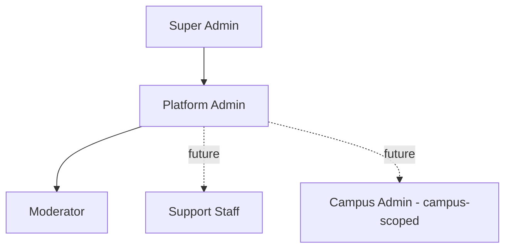
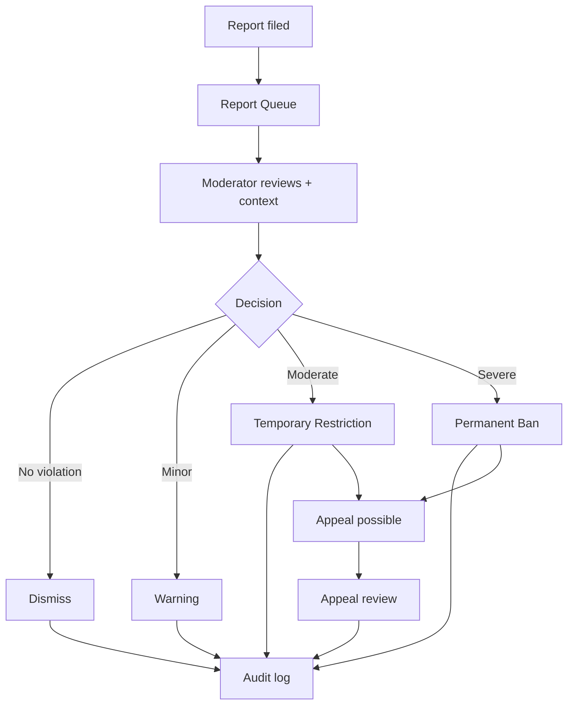
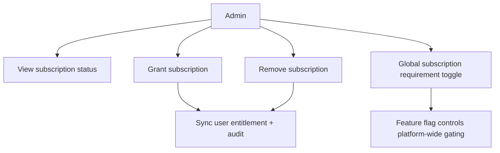

# Campusly V2 — Admin Panel & Platform Administration

> **Document type:** Administration specification — single source of truth
> **Product:** Campusly V2 (formerly PU Chat)
> **Status:** Authoritative v1.0
> **Authority:** This is the definitive specification for platform administration: moderation, user management, analytics, subscriptions, announcements, feature flags, audit, and security. All implementation MUST conform. It covers product behavior, workflows, and permissions only — no code, schemas, APIs, or Socket.IO events.
> **Companion documents:** `AUTH_SYSTEM.md` §4,§7 (RBAC/roles), `DATABASE_SCHEMA.md` §15,§17,§19 (moderation/subscriptions/system), `SECURITY.md`, `PROJECT_VISION.md` §11, `FEATURE_MATRIX.md` §15

---

## Table of Contents
1. [Administration Philosophy](#1-administration-philosophy)
2. [Administrator Roles](#2-administrator-roles)
3. [Dashboard](#3-dashboard)
4. [User Management](#4-user-management)
5. [Moderation](#5-moderation)
6. [Campus Wall Management](#6-campus-wall-management)
7. [Friend & Matching Oversight](#7-friend--matching-oversight)
8. [Subscription Management](#8-subscription-management)
9. [Announcements](#9-announcements)
10. [Feature Flags](#10-feature-flags)
11. [Analytics](#11-analytics)
12. [Audit Logs](#12-audit-logs)
13. [Security](#13-security)
14. [Future Enhancements](#14-future-enhancements)
15. [Design Principles](#15-design-principles)

---

## 1. Administration Philosophy

### 1.1 Why an admin panel exists
A verified student platform is only as trustworthy as its ability to keep itself safe. The admin panel is the operational core that makes **accountable anonymity** real: it is where reports are reviewed, abuse is acted upon, the platform is monitored, and the levers of safe operation live. Without it, the safety guarantees the entire product rests on would be unenforceable.

### 1.2 Trust and safety objectives
The panel's first purpose is **trust and safety**: detect and resolve abuse quickly and fairly, protect students from harm, and maintain a healthy community. Safety tooling exists **before** the surfaces it protects (`PROJECT_VISION.md` §11) — no public surface ships without the moderation tooling to govern it.

### 1.3 Platform integrity
Beyond safety, the panel preserves platform integrity: accurate operation, healthy systems, controlled rollouts, and reliable subscriptions. It gives operators the visibility and control to run Campusly responsibly at scale.

### 1.4 Student-first moderation
Moderation is **student-first**: fair, graduated, transparent, and appealable — never arbitrary. The goal is to protect the community and rehabilitate where possible, not to punish reflexively. Every action is accountable and audited.

### 1.5 Minimal administrative complexity
The panel is deliberately **simple and modular**. It surfaces exactly what operators need — clear queues, clear actions, clear context — without sprawling complexity. A small team must be able to operate it effectively (KISS).

---

## 2. Administrator Roles

Administration uses the platform RBAC (`AUTH_SYSTEM.md` §4,§7). Higher roles inherit lower-role capabilities; access is **least-privilege** and **scoped**.

| Role | Responsibilities | Access limits |
|------|------------------|---------------|
| **Super Admin** | Highest trust; manages roles, irreversible platform actions, global controls | Full access; smallest possible group; the only role that can manage admins |
| **Platform Admin** | Day-to-day operation: user management, subscriptions, announcements, feature flags, analytics | All operational areas; cannot manage admin roles or irreversible super-admin actions |
| **Moderator** | Safety operations: report queues, content review, warnings/restrictions/bans, appeals | Moderation areas only; no subscriptions, flags, or user-role management |
| **Support Staff (future)** | Assist users; view limited account info; escalate issues | Read-mostly; no destructive actions |
| **Campus Admin (future)** | Institutional, **campus-scoped** moderation, announcements, org verification | Only within their own campus |

Every privileged capability is gated by role **and** scope (and, for Campus Admin, campus), enforced server-side. The UI never grants access the backend wouldn't (`AUTH_SYSTEM.md` §4).

---

## 3. Dashboard

The dashboard is the operator's at-a-glance view of platform health, surfacing the metrics that matter for safety and operation.

| Panel | What it shows | Why it helps |
|-------|---------------|--------------|
| **Daily Active Users** | DAU trend | Core engagement health |
| **Online Users** | Live concurrent users | Real-time load awareness |
| **New Registrations** | Verified signups | Growth pulse |
| **Anonymous Matches** | Matches created (period) | Hook effectiveness |
| **Active Chats** | Ongoing conversations | Engagement intensity |
| **Wall Activity** | Posts/replies/reactions | Community vitality |
| **Pending Reports** | Open moderation queue size | **Safety priority** — the most operationally urgent number |
| **Subscription Statistics** | Active subs, conversions | Business health |
| **System Health** | Process/resource/uptime status | Reliability awareness |

**How it helps.** The dashboard lets operators triage at a glance: a rising **pending reports** count signals a safety issue needing attention; **system health** flags reliability risks; engagement and growth panels show whether the product is thriving. It turns raw activity into actionable operational awareness. Metrics derive from the analytics aggregates (`DATABASE_SCHEMA.md` §18), not heavy live queries.

---

## 4. User Management

Workflows for finding and acting on user accounts. All actions are RBAC-gated and audit-logged.

| Workflow | Behavior |
|----------|----------|
| **View Users** | Browse users with key status (role, account state, subscription, campus) |
| **Search Users** | Find by name, email, or ID |
| **Suspend User** | Withhold access pending review (reversible) |
| **Ban User** | Permanent removal for serious violations; sessions invalidated immediately |
| **Restore User** | Reinstate a suspended/restricted account |
| **Delete Account** | Remove an account (PII purge per retention policy) |
| **View User History** | See a user's account history: reports, actions, warnings, login history, subscription changes |

User actions integrate with account states (`AUTH_SYSTEM.md` §11): suspending/banning transitions the account state and immediately forces logout (sessions revoked, sockets disconnected). Account history gives moderators the context for fair, informed decisions.

---

## 5. Moderation

The safety backbone. Moderation is centralized and graduated, integrating with the Moderation module (`DATABASE_SCHEMA.md` §15).

| Capability | Behavior |
|------------|----------|
| **Report Queue** | Prioritized queue of open/reviewing reports across all content types |
| **Review Report** | Inspect reported content with context; for anonymous content, resolve the verified author |
| **Warning** | Issue a warning for minor violations (graduated step 1) |
| **Temporary Restriction** | Time-bound limits (e.g., cannot post/match) for moderate violations |
| **Permanent Ban** | Remove for severe/repeat violations |
| **Appeal Review** | Review user appeals against actions; uphold or overturn |
| **Moderator Notes** | Internal notes on cases for context and continuity |

**Graduated enforcement:** dismiss / warn → restrict → ban, always with an appeal path and a full audit trail. This fairness is core to student-first moderation. Anonymous content is fully actionable because the verified author is always recoverable by moderators (accountable anonymity).

---

## 6. Campus Wall Management

Operators curate and protect the wall (behavior defined in `PUBLIC_WALL.md`; data in `DATABASE_SCHEMA.md` §10).

| Capability | Behavior |
|------------|----------|
| **Review Posts** | Inspect posts (including reported ones) with author/context |
| **Remove Posts** | Hide or permanently remove violating posts |
| **Pin Posts** | Pin important posts to the top of a campus feed |
| **Featured Posts** | Highlight notable content (curation) |
| **Manage Categories** | Maintain the wall category set (incl. per-campus) |
| **Handle Reports** | Resolve wall-specific reports via the moderation workflow (§5) |

Wall moderation respects scope: platform moderators act platform-wide; community moderators act within their community within platform rules; the future Campus Admin acts within their campus.

---

## 7. Friend & Matching Oversight

Operational visibility into the social core, focused on safety and health (behavior in `MATCHING_ENGINE.md` and `FRIEND_SYSTEM.md`).

| Capability | Behavior |
|------------|----------|
| **View Match Statistics** | Match volume, wait times, conversion — overall health |
| **Review Abuse Reports** | Reports arising from anonymous sessions or friend chats |
| **Investigate Sessions** | Review a reported session with context and verified identities (moderators only) |
| **Handle Spam** | Act on spam patterns (mass requests, rapid cycling) |
| **Monitor Queue Health** | Watch queue depth, stale rates, and pairing latency |

This oversight ensures the riskiest surfaces (anonymous matching, private chat) remain safe, using the accountability link that verification provides. Investigations are audit-logged and access-limited to authorized moderators.

---

## 8. Subscription Management

Operators manage monetization and can control subscription behavior platform-wide (data in `DATABASE_SCHEMA.md` §17; behavior aligned with `FEATURE_MATRIX.md` §14).

| Capability | Behavior |
|------------|----------|
| **View Subscription Status** | See a user's plan, status, source, and period |
| **Grant Subscription** | Admin-grant premium (e.g., comp, support) without payment |
| **Remove Subscription** | Revoke premium; entitlement downgrades gracefully |
| **Global Enable/Disable Subscription Requirement** | A platform-wide control to turn premium gating on/off (e.g., keep everything free during validation) |
| **Premium Analytics** | Conversion, trial→paid, churn, revenue health |
| **Trial Management** | Configure/observe free trials |

**Platform-wide control.** The global subscription-requirement toggle (a feature flag, §10) lets operators run the platform fully free during the validation phase and switch on monetization later — without code changes. Grants/revocations sync the user's entitlement cache and are audit-logged. The free tier must always remain genuinely valuable (Student First).

---

## 9. Announcements

Operators communicate with students through structured announcements (data in `DATABASE_SCHEMA.md` §19.4).

| Capability | Behavior |
|------------|----------|
| **Create Announcement** | Compose an announcement with audience and display window |
| **Schedule Announcement** | Set start/end times for timed display |
| **Campus-specific Announcement** | Target a single campus |
| **Global Announcement** | Target all campuses |
| **Emergency Notice** | High-priority, immediate platform-wide notice (e.g., safety/outage) |

Announcements surface in-app and optionally as notifications, respecting audience targeting (all / campus / subscribers / admins). Emergency notices bypass normal batching for immediate delivery.

---

## 10. Feature Flags

Feature flags let operators enable/disable functionality safely and instantly, without redeploying (data in `DATABASE_SCHEMA.md` §19.2; behavior in `ARCHITECTURE.md`).

| Controllable | Purpose |
|--------------|---------|
| **Anonymous Matching** | Enable/disable the matching surface |
| **Campus Wall** | Enable/disable the wall |
| **Friend System** | Enable/disable friend features |
| **Voice Messages** | Toggle voice messaging |
| **Media Uploads** | Toggle media uploads (e.g., during an incident) |
| **New Features** | Gate new features behind a flag for controlled rollout |
| **Maintenance Mode** | Put the platform (or parts) into maintenance |

### 10.1 Safe rollout strategies
- **Gradual rollout.** Enable a new feature for a small percentage or specific campuses/roles first, expanding as confidence grows.
- **Emergency disable.** Instantly switch off a misbehaving feature (a "kill switch") without a deploy — critical for incident response.
- **Maintenance mode.** Gracefully suspend functionality during maintenance with a clear user message.
- **Campus-scoped flags.** Roll features out campus by campus, aligning with multi-campus growth.

Feature flags are the operator's primary tool for **safe, reversible change** — they make rollout a configuration decision, not a code risk.

---

## 11. Analytics

The analytics area turns platform activity into insight, sourced from aggregates (`DATABASE_SCHEMA.md` §18) so reporting never strains hot tables.

| Metric area | What it reveals |
|-------------|-----------------|
| **User Growth** | Signups, verified users, campus penetration |
| **Engagement** | DAU/MAU, session time, activity depth |
| **Match Success Rate** | Quality and effectiveness of matching |
| **Friend Conversion** | Match→friend conversion (the key value-transfer metric) |
| **Wall Activity** | Posts, replies, reactions, reading |
| **Reports** | Volume, time-to-resolution, abuse trends (safety health) |
| **Retention** | Week-1/month-1 retention, cohorts |
| **Feature Usage** | Adoption of each feature, informing the roadmap |

Analytics are **privacy-respecting aggregates** (`DATABASE_SCHEMA.md` §18.5), never exposing individual private content. They guide operation, prioritization, and safety response.

---

## 12. Audit Logs

Accountability is non-negotiable: every privileged action is immutably recorded (`DATABASE_SCHEMA.md` §15.7).

| Log area | Captures |
|----------|----------|
| **Action History** | All privileged actions (actor, target, action, timestamp) |
| **Admin Activity** | Admin operations across the panel |
| **Security Logs** | Auth/security-relevant events |
| **Moderation History** | Every moderation decision and its rationale |
| **Subscription Changes** | Grants, revocations, status changes |
| **Announcement History** | What was announced, by whom, to whom |

Audit logs are **append-only and immutable** within retention; they cannot be edited or quietly deleted. They make administration transparent and reviewable — operators are themselves accountable. This is essential both for internal trust and for investigating incidents.

---

## 13. Security

The admin panel is the highest-privilege surface and is secured accordingly (complements `SECURITY.md` and `AUTH_SYSTEM.md`).

| Measure | Behavior |
|---------|----------|
| **Role-based access** | Every action gated by role + scope, enforced server-side; least privilege throughout |
| **Two-person approval (future)** | High-impact/irreversible actions (e.g., mass deletion) require a second admin's approval |
| **Session timeout** | Admin sessions expire faster than normal sessions; re-auth required |
| **IP logging** | Admin access logged with hashed IP/context for anomaly detection |
| **Audit requirements** | No privileged action occurs without an immutable audit entry |

The panel assumes a hostile world: it minimizes who can do what, logs everything, expires sessions aggressively, and (in future) requires dual control for the most dangerous actions.

---

## 14. Future Enhancements

Reserved, clearly **future** — additive over the existing admin model.

| Enhancement | Description |
|-------------|-------------|
| **AI Moderation** | Automated triage/detection of abusive content to assist (not replace) human moderators |
| **AI Spam Detection** | Pattern-based spam/abuse detection feeding the queue |
| **Campus Admin Portal** | Institutional, campus-scoped administration (B2B2C) |
| **College Verification Dashboard** | Tools to verify/onboard institutions and official accounts |
| **Advanced Analytics** | Deeper cohort/funnel analysis, possibly a data warehouse |
| **Moderator Performance Metrics** | Time-to-resolution, accuracy, and workload metrics for moderation quality |

Each builds on existing RBAC, moderation, and analytics foundations — none requires redesigning administration.

---

## 15. Design Principles

The guiding principles for administration, consistent with `PROJECT_VISION.md` and `SECURITY.md`.

| Principle | Meaning |
|-----------|---------|
| **Least Privilege Access** | Every role and action carries the minimum permission needed; scoped and gated |
| **Transparency** | Every privileged action is visible and reviewable via audit logs |
| **Accountability** | Operators are accountable; nothing privileged happens without a record |
| **Fast Moderation** | Reports are triaged and resolved quickly; safety is time-sensitive |
| **Simplicity** | A clean, modular panel a small team can operate effectively |
| **Security First** | Highest-privilege surface, secured accordingly (RBAC, timeouts, logging, future dual-control) |
| **Student Safety Above All** | When anything tensions with student safety, safety wins |

> When principles tension, resolve in the spirit: **student safety > security > accountability > speed > simplicity.**

---

## Closing Note

This document is the official administration specification for Campusly V2. It defines an admin panel that is **secure, modular, role-based, audit-friendly, and focused on moderation and platform management** — the operational core that makes accountable anonymity enforceable and keeps the platform safe, healthy, and well-run.

It references rather than repeats the RBAC model (`AUTH_SYSTEM.md` §4,§7), moderation/subscription/system data (`DATABASE_SCHEMA.md` §15,§17,§19), feature surfaces (`PUBLIC_WALL.md`, `MATCHING_ENGINE.md`, `FRIEND_SYSTEM.md`), and the broader security model (`SECURITY.md`). Where administration behavior is unclear, this document decides; where it intersects security, `SECURITY.md` governs; where it intersects product intent, `PRODUCT_REQUIREMENTS.md` and `PROJECT_VISION.md` decide. No change to administration ships without approval and an update here.

*— Chief Product Officer, Principal Backend Architect, Senior Platform Engineer & Trust & Safety Lead, Campusly V2*
