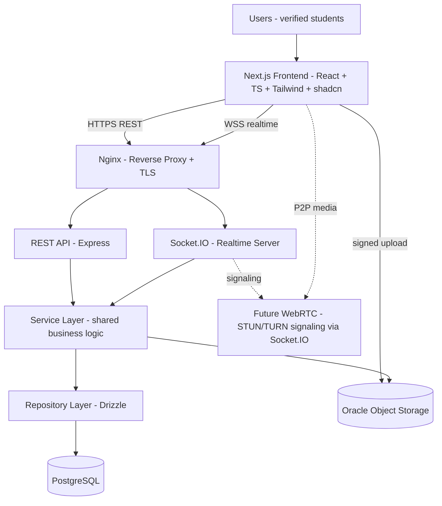
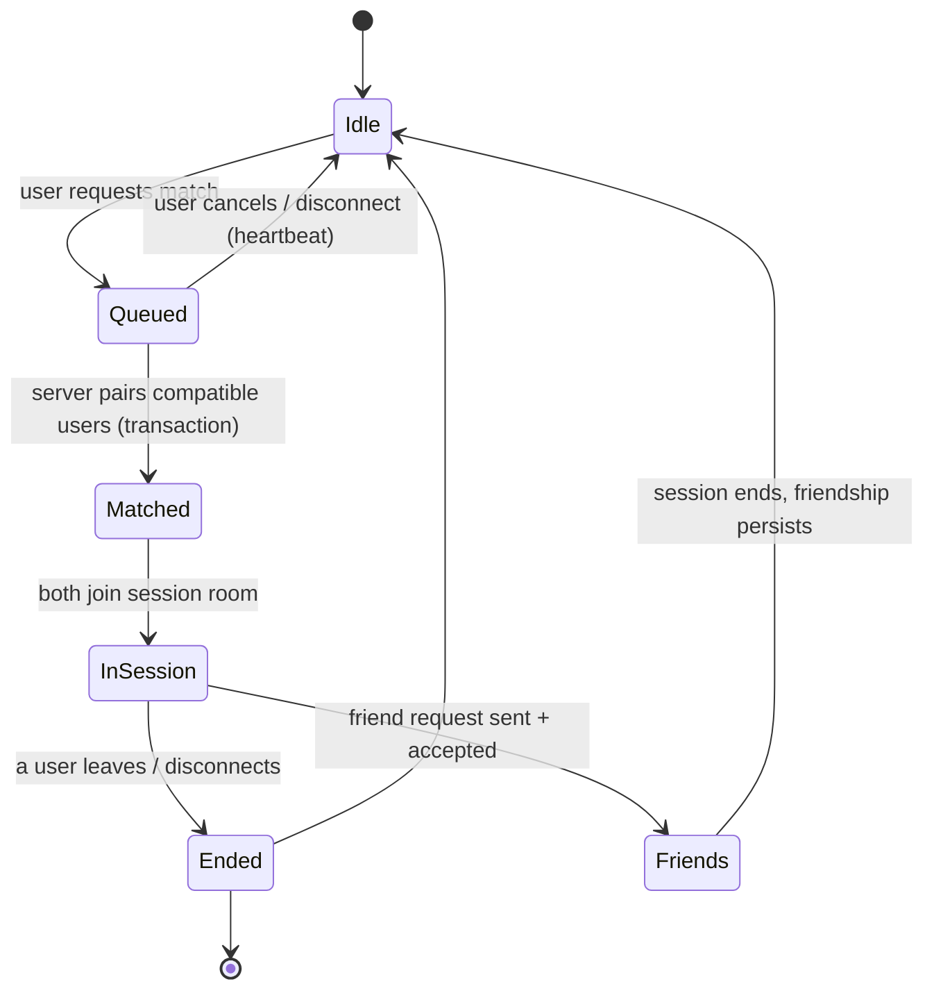
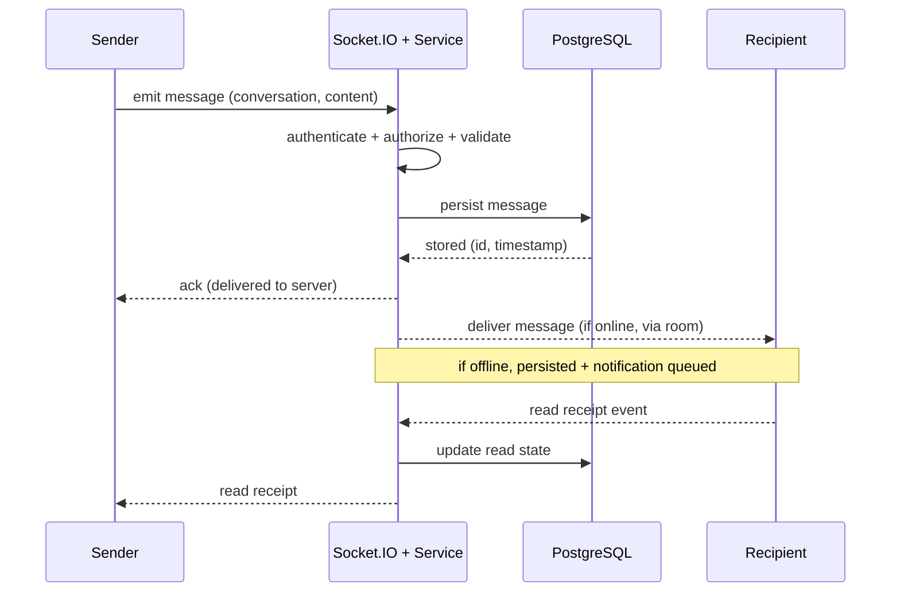
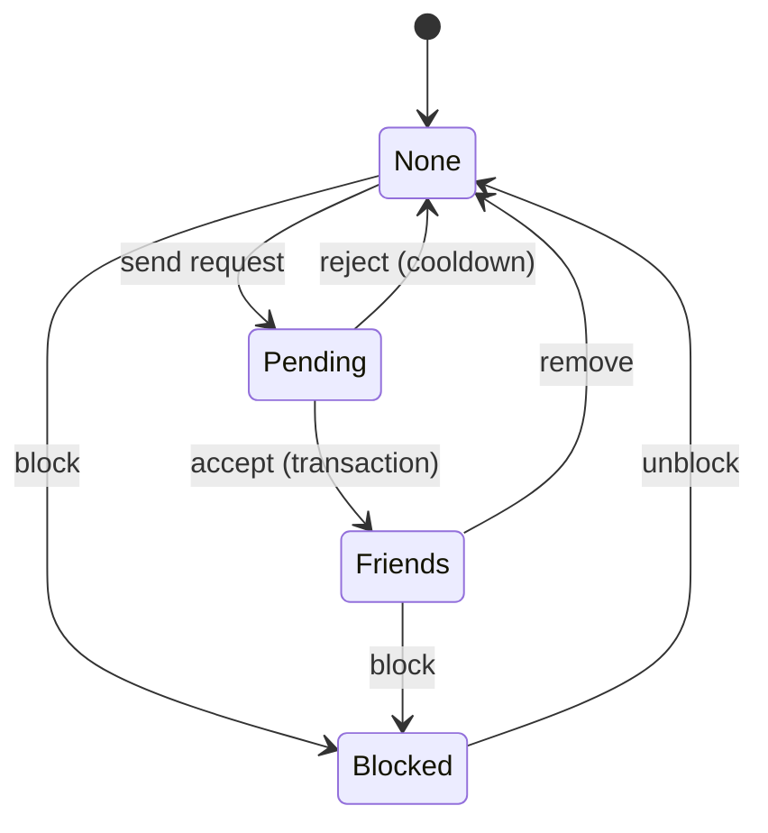
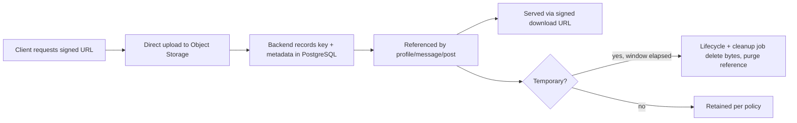
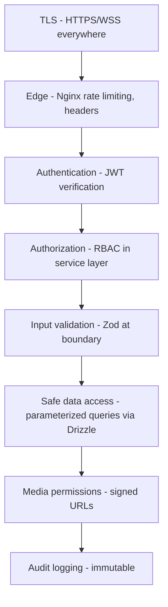
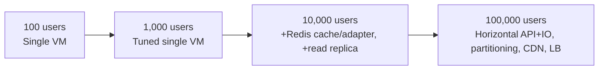
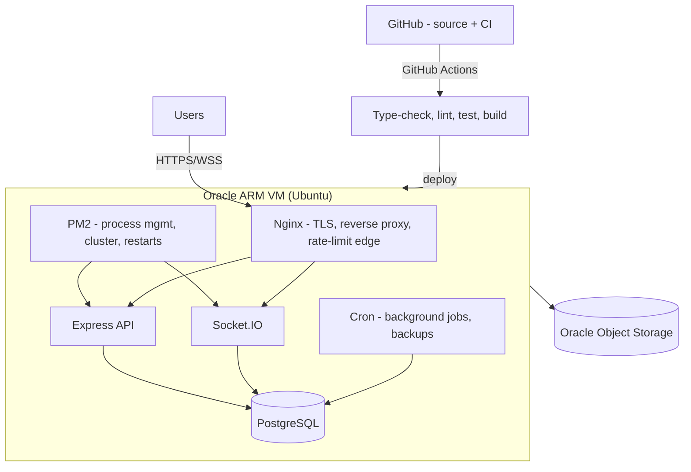
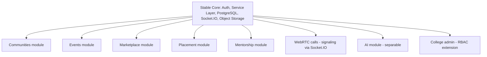

# Campusly V2 — System Architecture

> **Document type:** Master engineering blueprint
> **Product:** Campusly V2 (formerly PU Chat)
> **Status:** Authoritative v1.0
> **Audience:** Senior engineers, architects, DevOps, and AI assistants
> **Authority:** This is the official architecture of Campusly V2. It describes *how the system is designed* before implementation. It must be read alongside `TECH_STACK.md` (technology choices), `PRODUCT_REQUIREMENTS.md` (what to build), and `PROJECT_VISION.md` (why). No architectural change ships without approval and an update here.
> **Scope note:** This document describes architecture only — no code, no API contracts, no database table definitions. Those live in `API_SPEC.md`, `SOCKET_EVENTS.md`, and `DATABASE_SCHEMA.md`.

---

## Table of Contents

1. [High-Level Architecture](#1-high-level-architecture)
2. [System Components](#2-system-components)
3. [Request Lifecycle](#3-request-lifecycle)
4. [Authentication Flow](#4-authentication-flow)
5. [Anonymous Matching Flow](#5-anonymous-matching-flow)
6. [Messaging Architecture](#6-messaging-architecture)
7. [Campus Wall Architecture](#7-campus-wall-architecture)
8. [Friend System Architecture](#8-friend-system-architecture)
9. [Media Architecture](#9-media-architecture)
10. [Background Jobs](#10-background-jobs)
11. [Security Layers](#11-security-layers)
12. [Scalability Strategy](#12-scalability-strategy)
13. [Failure Recovery](#13-failure-recovery)
14. [Deployment Architecture](#14-deployment-architecture)
15. [Future Architecture](#15-future-architecture)
16. [Architecture Principles](#16-architecture-principles)
17. [Architecture Decision Records](#17-architecture-decision-records)

---

## 1. High-Level Architecture

Campusly V2 is a **modular monolith** deployed on a single Oracle Cloud ARM VM, fronted by Nginx, with media offloaded to Oracle Object Storage and a future WebRTC layer for calls. The system is designed around four enduring ideas: **a verified-identity core, a unified business-logic layer shared by REST and realtime, durable relational data, and offloaded media.** Everything below elaborates on that foundation.

### 1.1 The canonical system diagram



The vertical flow the product team envisions — **Users → Next.js → REST + Socket.IO → Node backend → PostgreSQL → Object Storage → Future WebRTC** — is preserved exactly. The key architectural refinement is that REST and Socket.IO are two *transports* into a **single shared service layer**, so business rules exist once and behave identically regardless of how they are invoked.

### 1.2 How components communicate

| From | To | Protocol | Purpose |
|------|----|----------|---------|
| Browser | Nginx | HTTPS | All request/response traffic |
| Browser | Nginx | WSS (WebSocket Secure) | Realtime events |
| Browser | Object Storage | HTTPS (signed URL) | Direct media upload/download |
| Nginx | Express API | HTTP (localhost) | Proxied REST |
| Nginx | Socket.IO | HTTP upgrade (localhost) | Proxied WebSocket |
| API / Realtime | Service layer | In-process calls | Business logic |
| Service layer | Repository | In-process calls | Data access |
| Repository | PostgreSQL | TCP (localhost) | SQL |
| Service layer | Object Storage | HTTPS | Signed URL issuance, metadata ops |
| Browser ↔ Browser | (future) | WebRTC | P2P call media, signaled via Socket.IO |

### 1.3 Architectural tenets

- **Modular monolith.** One deployable, internally divided into clean feature modules and layers. Simple to operate; cheap to run; easy to reason about — with seams left open to extract services later if scale ever demands it.
- **Transport-agnostic core.** REST and Socket.IO are thin edges over one service layer. No business logic in controllers or socket handlers.
- **Server is the authority.** All matching, authorization, and state transitions are decided server-side. The client is a rendering and input surface, never a source of trust — a direct correction of V1's client-driven matching.
- **Media never touches the database.** Object storage holds bytes; PostgreSQL holds references and metadata.
- **Campus-scoped by default.** A `university_id` (campus-scope) dimension runs through the data model, enabling multi-campus scale and a natural future shard/partition key. *(The column is named `university_id`; see `DATABASE_SCHEMA.md` §1.11.)*
- **Cost-aware.** Designed to run comfortably on Oracle ARM Always Free during validation, scaling by addition rather than rewrite.

---

## 2. System Components

This section describes every major component, its responsibility, and its boundaries.

### 2.1 Frontend (Next.js)

The **Next.js web application** is the user-facing surface. Responsibilities:
- Render all UI (server-rendered where beneficial for speed/SEO, client-rendered for interactive surfaces).
- Manage **server state** via React Query (fetching, caching, invalidation) and minimal local UI state via React.
- Maintain a **Socket.IO client** connection for realtime features (chat, presence, matching, notifications).
- Perform **direct signed uploads** to object storage so large files bypass the API.
- Enforce **presentation-level** concerns only; it never holds authoritative business state. All trust decisions are re-validated server-side.

The frontend is organized **feature-first** (matching, wall, chat, communities, events, marketplace), with shared UI primitives (shadcn/ui) and shared types/Zod schemas imported from the monorepo's shared package.

### 2.2 Backend (Node.js + Express)

The **Express API** is the HTTP transport. Responsibilities:
- Receive REST requests, authenticate (JWT) and authorize (RBAC), and **validate input** (Zod) at the edge.
- Delegate to the **service layer** for all business logic.
- Format consistent responses and route errors through centralized handling.

Controllers are deliberately thin. The backend's real intelligence lives in the **service layer** (business rules and orchestration) and the **repository layer** (all data access via Drizzle). Dependencies point inward: transport → services → repositories → database.

### 2.3 Realtime server (Socket.IO)

The **Socket.IO server** is the second transport, sharing the same process and the same service layer as the REST API. Responsibilities:
- Authenticate every socket connection (JWT) on connect.
- Manage **rooms** (per-user, per-conversation, per-campus/community) for scoped delivery.
- Handle realtime domain events: messages, typing, presence, friend status, matching, notifications.
- Maintain ephemeral connection state (presence, queue membership) and reconcile it with persisted state.

Because it calls the same services as REST, a message sent over a socket and a message created via API obey identical rules.

### 2.4 Authentication subsystem

A cross-cutting subsystem responsible for **identity and session**:
- **Google OAuth** for verified identity (institutional email).
- **JWT access tokens** (short-lived) validated on every REST request and socket connection.
- **Refresh tokens** (longer-lived, rotated, revocable) for seamless session continuity.
- **RBAC** claims that downstream authorization checks rely on.

It is invoked at the edges (middleware for REST, handshake for sockets) and trusted nowhere else.

### 2.5 Storage (Oracle Object Storage)

The **object store** holds all binary media: profile pictures, voice messages, temporary photos/videos, and future video assets. The backend issues **short-lived signed URLs** for upload/download; the database stores only keys and metadata. Lifecycle policies and cleanup jobs enforce retention. This component keeps the database lean and serves media efficiently.

### 2.6 Database (PostgreSQL)

The **single source of durable truth**: users, profiles, friendships, sessions, messages, wall content, communities, memberships, events, listings, reports, subscriptions, notifications, and audit logs. It enforces relational integrity and provides ACID transactions for the system's critical invariants (matching, friend acceptance, moderation+audit). Accessed only through the repository layer.

### 2.7 Admin dashboard

The **admin dashboard** is a privileged area of the frontend backed by role-gated API/service operations. It surfaces user management, report queues and moderation actions, subscription grant/revoke, wall/community moderation, analytics, system announcements, and platform-wide feature toggles. Every privileged action is RBAC-checked server-side and written to the immutable audit log.

### 2.8 Background jobs

A **scheduled worker** (in-process/cron initially) runs deferrable and periodic work outside the request path: temporary-media cleanup, expired-session reclamation, expired-notification pruning, database maintenance, analytics aggregation, and log rotation. Keeping this work off the request path protects user-facing latency.

### 2.9 Monitoring

The **monitoring** concern tracks process health (PM2), system resources (CPU/memory/disk), application metrics, and uptime. It starts lightweight and deepens with scale. Monitoring feeds alerting (Section 13) so failures are detected before users report them.

### 2.10 Logging

**Structured, leveled logging** across the backend, with correlation identifiers to trace a request across layers. Logs deliberately exclude secrets and minimize PII. A distinct, **immutable audit log** records security- and moderation-relevant actions for accountability.

### 2.11 Notification service

A logical service (a module within the monolith, not a separate process) that **fans out notifications** across channels: in-app (realtime via Socket.IO to the user room + persisted for offline delivery), email, and future push. It is triggered by domain events (friend request, match, message, moderation update, announcements) and respects per-user preferences.

### 2.12 Future AI service

A **future** component, introduced only when a feature has proven student value (smart matching, moderation assistance, summarization, study help). It is designed as a **separable module/service** with a clean interface so it can run in-process initially or be extracted later, always respecting Privacy First (no training on private conversations without explicit consent).

### 2.13 Component responsibility matrix

| Component | Owns | Does NOT own |
|-----------|------|--------------|
| Frontend | Rendering, UX, client cache | Business truth, authorization |
| REST API | HTTP transport, edge validation | Business logic, data access |
| Realtime | Socket transport, rooms, presence | Business logic, persistence rules |
| Service layer | Business rules, orchestration | Transport, SQL specifics |
| Repository | Data access (SQL via Drizzle) | Business rules |
| PostgreSQL | Durable state, integrity | Media bytes |
| Object Storage | Media bytes | Relationships, queries |
| Auth subsystem | Identity, sessions, claims | Feature logic |
| Background jobs | Periodic/deferred work | Synchronous user flows |

---

## 3. Request Lifecycle

This section traces what happens, end to end, for each major interaction. The recurring pattern is constant: **edge (transport) → authenticate → authorize → validate → service (logic) → repository (data) → response/event.**

### 3.1 Opening the app
1. The browser loads the Next.js app (server-rendered shell for fast first paint).
2. The client checks for a valid session (access token; silent refresh if expired).
3. If authenticated, the app establishes a Socket.IO connection (authenticated handshake) and hydrates initial data via React Query (profile, wall feed, notifications, friend list).
4. If unauthenticated, the user is routed to sign-in.

### 3.2 Authentication
Covered in depth in Section 4. In brief: Google OAuth → backend verifies and resolves a verified user → issues access + refresh tokens → client stores them securely and proceeds.

### 3.3 Fetching data
1. Client issues an HTTPS request via React Query.
2. Nginx proxies to the Express API.
3. Middleware validates the JWT, applies rate limits, and authorizes the action.
4. The controller validates inputs (Zod) and calls the relevant service.
5. The service applies rules and calls repositories; the repository runs paginated, indexed queries.
6. A consistent response returns; React Query caches it for fast subsequent reads.

### 3.4 Creating posts (Campus Wall)
1. Client submits a post (named or anonymous) over REST.
2. Auth + validation at the edge (content limits, poll rules, anonymity flag).
3. The wall service applies rules (rate limits, moderation hooks, campus scoping; if anonymous, it records the post visibly anonymized while internally linking the verified author for accountability).
4. The repository persists the post; the service emits a realtime event to the campus/community room so other clients update.
5. Response returns the created post; the author's React Query cache updates optimistically.

### 3.5 Sending messages
1. The client emits a message event over the authenticated socket.
2. The realtime handler validates and calls the messaging service.
3. The service authorizes (are these users friends / in this session?), persists the message, and emits delivery to the conversation room; delivery/read state updates flow as further events.
4. Offline recipients receive a persisted notification and see the message on next load. (Detail in Section 6.)

### 3.6 Uploading media
1. The client requests a **signed upload URL** from the API (auth + validation of type/size/duration limits).
2. The client uploads the file **directly** to object storage using the signed URL (bypassing the API).
3. The client notifies the API of the completed upload; the service records the object key + metadata in PostgreSQL and associates it (profile, message, post).
4. Consumers receive the media **reference** (and a signed download URL when needed). (Detail in Section 9.)

### 3.7 Receiving notifications
1. A domain event (friend request, match, message, moderation update) triggers the notification service.
2. For online users, it emits to their **user room** in real time; for all users, it persists the notification for durable, cross-device delivery.
3. The client updates its notification UI from the realtime event or on fetch. Email/push channels fire per preferences.

### 3.8 Joining anonymous matching
1. The client emits a "find match" event over the socket.
2. The matching service (sole authority) places the user in the queue and attempts to pair with a compatible waiting user.
3. On a pair, it creates a session **transactionally** and emits a match event to both users, who join the session room. (Full lifecycle in Section 5.)

### 3.9 Leaving sessions
1. A user leaves (explicit action, navigation, or disconnect detected by heartbeat).
2. The matching/session service marks the session ended, notifies the other participant, and cleans up the room and any queue remnants.
3. If a friend request was exchanged, the friendship persists independently of the ended session.

### 3.10 Friend requests
1. A user sends a request (from a session, profile, or community) over REST or socket.
2. The friend service validates (not already friends, not blocked, not rate-limited, no rejection cooldown), persists the pending request, and notifies the recipient in real time.
3. On acceptance, a transaction creates the friendship and closes the request; identities are revealed and a persistent friend chat becomes available. (Detail in Section 8.)

### 3.11 Admin actions
1. An admin/moderator performs an action (hide content, restrict, ban, grant subscription, toggle feature) via the dashboard.
2. The API enforces **RBAC** server-side (the dashboard UI is not the gate).
3. The service applies the action and writes an **immutable audit log entry** in the same transaction, guaranteeing the action and its record are inseparable.
4. Affected users/sessions are updated in real time where relevant (e.g., a banned user's sessions are invalidated).

---

## 4. Authentication Flow

Authentication establishes verified identity; authorization governs every subsequent action. The model is **Google OAuth for identity + JWT for stateless access + refresh tokens for continuity.**

### 4.1 Complete login flow

```mermaid
sequenceDiagram
    participant U as User
    participant FE as Next.js
    participant API as Express API
    participant G as Google OAuth
    participant DB as PostgreSQL

    U->>FE: Click "Sign in with Google"
    FE->>G: OAuth consent
    G-->>FE: Authorization grant / credential
    FE->>API: Submit Google credential
    API->>G: Verify credential
    G-->>API: Verified profile (email, name)
    API->>API: Validate institutional domain
    API->>DB: Find or create verified user
    DB-->>API: User record (roles, status)
    API->>API: Check moderation status (reject if banned)
    API-->>FE: Access token (short-lived) + refresh token (httpOnly, rotated)
    FE-->>U: Authenticated; establish socket + hydrate data
```

### 4.2 Google OAuth
The institutional email domain is the first-pass verification signal that the user is a real student of a recognized campus. The backend verifies the Google credential server-side, extracts the verified profile, and binds the user to exactly one campus identity. Non-institutional or unrecognized domains are rejected with clear messaging.

### 4.3 JWT
A short-lived **access token** encodes identity and RBAC claims. It is validated **server-side on every REST request and every socket connection** without a database round-trip, making auth fast and horizontally scalable. The client is never trusted to assert identity or roles beyond what a verified token carries.

### 4.4 Refresh tokens
A longer-lived **refresh token** (stored securely, e.g., httpOnly) is **rotated on each use** and is **revocable**. It silently issues new access tokens so users are not forced to re-login, while rotation and revocation contain the blast radius of a leaked token.

### 4.5 Session validation
Every protected interaction validates the access token (signature, expiry, claims). Socket connections validate at handshake and are bound to the authenticated user for the connection's lifetime. A revoked/banned user's tokens are rejected, terminating access promptly.

### 4.6 Logout
Logout discards client tokens and invalidates the refresh token server-side, so it cannot mint new access tokens. Active sockets for the session are disconnected.

### 4.7 Token refresh
When an access token expires, the client transparently presents the refresh token to obtain a new access token (and a rotated refresh token). This happens in the background, preserving a seamless experience.

### 4.8 Unauthorized requests
Requests with missing, invalid, or expired tokens (and no valid refresh) receive an unauthorized response and are routed to sign-in. Requests with a valid token but insufficient role receive a forbidden response, and the attempt is logged. The system **fails closed**: absence of proof of authorization means denial.

---

## 5. Anonymous Matching Flow

Anonymous matching is the signature feature and the most architecturally sensitive flow, because V1's client-driven approach caused race conditions, ghost sessions, and stale users. V2's defining rule: **the backend is the sole matching authority, and session creation is transactional.**

### 5.1 Lifecycle overview



### 5.2 User joins the queue
The user emits a match request over the authenticated socket. The matching service registers them as waiting, recording queue membership both in fast in-memory state (for speed) and persisted state (for crash recovery). Subscription tier may govern matching limits/priority.

### 5.3 Queue management
Waiting users are held in memory for low-latency pairing, with queue state persisted so a server restart can reconcile and recover rather than lose users. A **heartbeat** mechanism tracks liveness; users who stop heart-beating (disconnect, network drop, app close) are removed as stale, preventing the ghost-user problem of V1.

### 5.4 Backend matching authority
Only the server decides matches. There is **no client-side queue scanning**. When a compatible pair exists (respecting campus scoping, block lists, no self-match, and tier rules), the server claims both users atomically so the same user cannot be double-matched by a concurrent operation.

### 5.5 Session creation
Pairing and session creation occur inside a **PostgreSQL transaction**: the session is created and both users are removed from the queue as one atomic unit. This guarantees no duplicate or ghost sessions — the precise failure V2 was rebuilt to eliminate.

### 5.6 Socket notification
On commit, the server emits a match event to both participants and joins them to a shared **session room**. From there, messages flow as in any conversation (Section 6), but anonymously — no profile or identity is exposed.

### 5.7 Session termination
A session ends when a user explicitly leaves, navigates away, or disconnects (detected by heartbeat). The service marks the session ended, notifies the remaining participant, and tears down the room. Either user may, before or during the session's life, send a friend request to transition the anonymous connection into a named relationship.

### 5.8 Cleanup
A background job reclaims expired/abandoned sessions and stale queue entries that slipped through real-time cleanup (e.g., after an ungraceful crash), keeping queue and session state consistent.

### 5.9 Recovery
Because queue and session state are persisted, a server restart reconciles in-memory state from the database and heartbeat signals: live users are restored, stale ones are purged, and orphaned sessions are closed. The system converges to a consistent state without manual intervention — the resilience V1 lacked.

---

## 6. Messaging Architecture

Messaging powers both anonymous sessions and friend chats. The same architecture serves both; only the authorization rule (session participants vs. friends) differs. Messages are delivered in real time and persisted durably.

### 6.1 Socket connection
Each client maintains one authenticated Socket.IO connection. On connect, the user joins their **personal user room** (for notifications and friend-status) and the **conversation rooms** for their active chats/sessions. The connection is the channel for all realtime events.

### 6.2 Message delivery



### 6.3 Persistence
Every message (except purely ephemeral signals like typing) is persisted in PostgreSQL before or as it is delivered, so message history is durable, survives disconnects, and is consistent across devices. Anonymous-session messages and friend messages are stored with their respective associations.

### 6.4 Read receipts
Read state is tracked per message/conversation and updated via realtime events, then persisted. Read receipts respect privacy settings (a user who disables them neither sends nor sees them).

### 6.5 Typing indicators
Typing is an **ephemeral, room-scoped event** — never persisted. It is broadcast only to the conversation room and expires quickly, keeping it lightweight.

### 6.6 Presence
Online/last-seen is derived from socket connection state plus heartbeats and fanned out to relevant user rooms, subject to privacy settings. Presence is connection-derived, not stored as authoritative long-term state.

### 6.7 Temporary media
Media in messages follows the media architecture (Section 9): uploaded to object storage, referenced in the message. Temporary media carries a retention window after which it is purged, and the message reflects its expired state.

### 6.8 Voice messages
Recorded on-device, uploaded to object storage, and delivered as a message carrying the audio reference + duration + metadata — never as a blob through the API or database. Playback uses a signed download URL.

### 6.9 Future message encryption considerations
The current model secures messages in transit (WSS/HTTPS) and at rest within our controlled infrastructure, with access governed by authorization. **End-to-end encryption (E2EE)** is a future consideration: it would strengthen privacy but complicates moderation (our accountable-anonymity safety model relies on the ability to review reported content) and features like multi-device sync and search. Any future E2EE work must reconcile with the safety obligations in `SECURITY.md`; it is intentionally deferred, and the architecture does not preclude it for specific surfaces (e.g., friend chats) later.

---

## 7. Campus Wall Architecture

The Campus Wall is the public, campus-scoped square. It is read-heavy (many viewers, fewer posters), which shapes its architecture toward efficient, paginated reads and strong moderation.

### 7.1 Posts
Students create posts (named or anonymous). Anonymous posts are displayed anonymized but **internally linked to the verified author** for accountability. Posts are **campus-scoped** by default via the `university_id` dimension. Creation passes through validation, rate limiting, and moderation hooks.

### 7.2 Replies
Replies are threaded under posts, following the same validation, moderation, and scoping rules. The post/reply relationship is modeled relationally for consistent, efficient retrieval.

### 7.3 Reactions
Reactions are lightweight associations between a user and a post/reply. They are aggregated for display and are idempotent per user (one reaction state per user per item), updated in real time within the campus room.

### 7.4 Reports
Any post, reply, or poll can be reported. A report captures the content reference, reason, reporter, and — for anonymous content — the internal author link for moderator review. Reports flow into the moderation queue (Section 11 / Admin).

### 7.5 Moderation
Content can be **hidden, removed, or restricted** by authorized moderators. Community-level content is moderated by community moderators within platform-wide rules; the platform retains override authority. Every moderation action is audit-logged transactionally.

### 7.6 Categories
Posts can be organized by category/type (e.g., general, confession, announcement, poll), enabling filtered views and appropriate handling (announcements may be privileged and visually distinguished). Categories also inform future recommendation and discovery.

### 7.7 Pagination
The wall uses **cursor-based pagination** for efficient, stable infinite scroll over a constantly growing feed, backed by composite indexes (e.g., `university_id` + `created_at`). This prevents unbounded queries and keeps feed loads fast on mobile.

### 7.8 Trending
A **trending** view ranks content by a time-decayed engagement signal (reactions, replies, recency). Initially computed with straightforward queries/aggregations (and cached briefly); as scale grows, trending computation moves to a **background job** that periodically materializes rankings rather than computing them per request.

### 7.9 Future recommendations
A future, optional recommendation layer (part of the AI roadmap) could personalize discovery of posts, communities, and events — always privacy-respecting and clearly secondary to the chronological, community-driven core. The architecture accommodates it as an additive scoring layer over existing data, not a redesign.

---

## 8. Friend System Architecture

The friend system converts connections into durable relationships and is the primary retention mechanism. It is modeled relationally with explicit states.

### 8.1 Friend requests
A request is a stateful relationship between two users (pending/accepted/rejected). It can originate from an anonymous session, a profile, or a community. Creation is guarded by rules: not already friends, neither blocked, within rate limits, and outside any post-rejection cooldown.

### 8.2 Acceptance
Acceptance runs in a **transaction**: the friendship is created and the request closed atomically, after which identities are mutually revealed and a persistent friend chat is enabled. The new friend is notified in real time.

### 8.3 Removal
Either user may remove a friendship. Removal closes/archives the friend chat per privacy rules and updates both users' friend lists. It is non-punitive and silent by default.

### 8.4 Friend chat
A persistent one-to-one conversation per friendship, independent of anonymous sessions (ending a session never affects a friendship and vice versa). It uses the messaging architecture of Section 6, with full history, presence, typing, and read receipts.

### 8.5 Media sharing
Friend chats support images and voice messages via the media architecture (Section 9) — references in the database, bytes in object storage, signed URLs for access.

### 8.6 Online status
Presence between friends is derived from connection state and shown subject to each user's privacy settings, fanned out via user rooms.

### 8.7 Blocking
Blocking is the strongest control: it removes any friendship, prevents future friend requests and matches between the two users, and disables messaging. It is enforced server-side across all relevant flows (matching, requests, chat), so a blocked user cannot reach the blocker through any surface.



---

## 9. Media Architecture

Media architecture exists to keep the database lean, serve binaries efficiently, and honor privacy through retention. The inviolable rule: **PostgreSQL stores references and metadata; Oracle Object Storage stores bytes.**

### 9.1 Profile pictures
Validated (type/size), uploaded via signed URL to object storage, referenced from the user profile. Served via signed or public-read URLs as appropriate to privacy settings.

### 9.2 Voice messages
Recorded on-device, uploaded directly to object storage, referenced in the message with duration/metadata, delivered over Socket.IO as a reference. Never stored as base64 in the database (a corrected V1 inefficiency).

### 9.3 Temporary photos & 9.4 Temporary videos
Temporary media is uploaded like any media but tagged with a **retention window**. After expiry, the bytes are deleted from object storage and the reference is purged/marked expired. This delivers the privacy promise that fleeting media does not become a permanent record. Video follows the identical model, requiring no architectural change.

### 9.5 Object Storage
Object storage is the durable, scalable home for all binaries. The backend mediates access by **issuing short-lived signed URLs** rather than proxying bytes, so the API stays lean and uploads/downloads scale independently of application servers.

### 9.6 Auto deletion
Retention is enforced two ways: **object-store lifecycle policies** (automatic expiry/deletion) and **scheduled cleanup jobs** that purge expired references and reclaim **orphaned objects** (uploaded but never referenced, e.g., abandoned uploads).

### 9.7 Media lifecycle



### 9.8 CDN considerations
Initially media is served directly from object storage, adequate at early scale. As traffic and geographic spread grow, a **CDN** can cache media at the edge for lower latency and reduced origin load — an additive optimization, introduced only when metrics justify it.

---

## 10. Background Jobs

Background jobs handle periodic and deferrable work off the request path, protecting user-facing latency. Initially they run as scheduled tasks (cron + in-process workers); a durable message queue is a future step (Section 12) adopted only when volume demands it.

| Job | Purpose | Cadence (initial) |
|-----|---------|-------------------|
| **Temporary media cleanup** | Delete expired media bytes and purge/expire references; reclaim orphaned uploads | Frequent (e.g., hourly) |
| **Expired sessions** | Close abandoned/expired anonymous sessions; reclaim stale queue entries missed by realtime cleanup | Frequent |
| **Expired notifications** | Prune old/read notifications per retention policy | Daily |
| **Database maintenance** | Routine hygiene (vacuum/analyze cadence awareness, integrity checks) | Daily/periodic |
| **Analytics aggregation** | Materialize metrics (DAU/MAU, matches, engagement, trending) for dashboards without heavy live queries | Periodic |
| **Log cleanup** | Rotate/prune application logs (audit logs retained per policy) | Daily |
| **Future recommendation engine** | Precompute discovery/recommendation signals | Future, periodic |

Design principles for jobs: **idempotent** (safe to re-run), **observable** (logged, monitored), and **isolated** (a failing job never degrades user-facing flows). As scale grows, long or high-volume jobs migrate to a queue with retries and dead-letter handling.

---

## 11. Security Layers

Security is layered (defense in depth) and enforced **server-side by default**. This is an architectural overview; the authoritative model lives in `SECURITY.md`.



| Layer | What it protects against | How |
|-------|--------------------------|-----|
| **Authentication** | Unverified access | Google OAuth + JWT validated on REST and sockets |
| **Authorization** | Privilege escalation | RBAC enforced server-side; client never trusted |
| **Input validation** | Malformed/malicious input | Zod validation at every boundary; shared schemas |
| **Rate limiting** | Abuse, brute force, spam | Nginx edge + per-endpoint limits on auth/matching/messaging/posting |
| **JWT verification** | Forged/expired identity | Signature + expiry + claims checked every request |
| **Media permissions** | Unauthorized media access | Short-lived signed URLs; non-guessable keys; access checks |
| **SQL injection** | Data exfiltration/tampering | Parameterized queries via Drizzle; no string-built SQL |
| **XSS** | Script injection in content | Output encoding, content sanitization, framework defaults |
| **CSRF** | Forged cross-site requests | Token-based auth (not ambient cookies for API), proper CORS, anti-CSRF measures where cookies are used |
| **Secrets management** | Credential leakage | Secrets from environment/secret storage; never hardcoded, committed, or logged |
| **Logging** | Blind spots | Structured logs excluding secrets/PII; correlation IDs |
| **Audit trails** | Unaccountable actions | Immutable audit log for security/moderation actions, written transactionally with the action |

The governing rule: **the client is never trusted.** Every authorization decision, validation, and state transition is re-checked on the server, regardless of what the UI allows. And consistent with the vision, **growth never compromises safety** — security tooling exists before the surfaces it protects.

---

## 12. Scalability Strategy

The philosophy: **scale the simple architecture as far as it comfortably goes; add components only when metrics prove the need.** No premature complexity.



### 12.1 ~100 users (validation)
Single Oracle ARM VM: Nginx + Node (API + Socket.IO via PM2 cluster) + PostgreSQL + object storage. No Redis, no queues, no replicas. Focus entirely on correctness and product-market fit.

### 12.2 ~1,000 users
Same VM, tuned: PostgreSQL connection pooling, reviewed indexes, React Query caching cutting redundant reads, background jobs for cleanup/aggregation. Monitoring matures. Still no added infrastructure.

### 12.3 ~10,000 users
- **Redis** introduced for two reasons: caching hot reads, and as the **Socket.IO adapter** to allow multiple realtime instances.
- Begin **separating API and Socket.IO** processes; Nginx sticky sessions for sockets.
- Optionally a **read replica** for analytics/heavy reads.
- A **message queue** if background volume (notifications, media processing) needs durable, distributed jobs.

### 12.4 ~100,000 users
- **Load balancer** across multiple API and Socket.IO instances, coordinated via Redis.
- **Read replicas** and a connection pooler (PgBouncer).
- **Table partitioning** for high-growth tables (messages, notifications, audit logs) by time and/or `university_id`.
- **CDN** for media; a **search engine** for discovery at scale.
- Consider **containerization** for operational manageability and, only if a clear boundary demands it, extracting a **microservice** (realtime, media, or notifications) from the monolith.

### 12.5 When to introduce what

| Component | Introduce when | Not before because |
|-----------|----------------|--------------------|
| **Redis** | Read pressure measurable OR multi-instance sockets needed | Adds an operational component |
| **Read replicas** | Read load strains the primary | Single tuned Postgres handles a lot |
| **Load balancers** | More than one app instance exists | Single VM needs none |
| **Message queues** | Background volume needs durable distributed jobs | Cron + workers suffice early |
| **Microservices** | A clear scaling/team boundary justifies independent deploy | Distributed complexity taxes a small team |
| **Search engine** | Discovery outgrows SQL/Postgres FTS | Postgres covers early needs |
| **Caching (Redis/CDN)** | Hot reads or media latency justify it | React Query + direct serving suffice early |

The constant: each step is **additive**, enabled by decisions made now (campus scoping, DB-resident realtime state, offloaded media), never a rewrite.

---

## 13. Failure Recovery

The system is designed to fail gracefully and recover automatically wherever possible. The guiding posture is **fail closed on security, degrade gracefully on availability, and converge to consistency on restart.**

### 13.1 Server restart
PM2 automatically restarts crashed Node processes and can reload with zero downtime. On startup, the backend reconciles ephemeral realtime state (matching queue, presence) from persisted state and heartbeats: live users restored, stale entries purged, orphaned sessions closed. No manual intervention is required to reach a consistent state.

### 13.2 Socket reconnection
Socket.IO clients automatically reconnect with backoff after network drops. On reconnect, the client re-authenticates, rejoins its rooms, and re-hydrates missed state (recent messages, notifications) via React Query. Transient disconnects are therefore invisible to the user beyond a brief indicator.

### 13.3 Database recovery
PostgreSQL's ACID guarantees and write-ahead logging protect against corruption on crash. **Daily backups** with periodic offsite exports enable point-in-time-ish recovery; restores are tested periodically (a backup unverified by restore is not a backup). At scale, replicas provide failover options.

### 13.4 Object storage failures
Media operations are isolated from core flows: an upload failure surfaces a clear retryable error without corrupting the associated record (the reference is only recorded on confirmed upload). Transient read failures degrade gracefully (placeholder/retry) rather than breaking the surrounding feature.

### 13.5 Authentication failures
Auth fails closed: invalid/expired tokens with no valid refresh route the user to sign-in; insufficient roles are denied and logged. Google OAuth outages are surfaced clearly; the system never silently grants access on auth uncertainty.

### 13.6 Graceful degradation
The architecture degrades feature-by-feature rather than collapsing. If realtime is impaired, the app falls back to fetch-on-load (history and notifications still work over REST). If media is impaired, text features continue. If a background job fails, user-facing flows are unaffected. Each subsystem's failure is contained.

### 13.7 Monitoring
Process health (PM2), resource metrics, application metrics, and uptime checks provide visibility. Logs (structured, correlated) enable diagnosis. Monitoring deepens with scale but exists from day one.

### 13.8 Alerting
Monitoring feeds alerts on meaningful conditions (process down, resource exhaustion, error-rate spikes, failed backups) so operators are notified before users are materially affected. Alerting thresholds are tuned to avoid noise while catching real incidents.

---

## 14. Deployment Architecture

Campusly V2 deploys to a single Oracle Cloud ARM Always Free VM during validation — a production-grade, fully owned environment at near-zero cost.



### 14.1 Oracle ARM VM
The compute host: generous Always Free ARM resources running the entire backend (API + Socket.IO), PostgreSQL, Nginx, and scheduled jobs. Sufficient for early scale; the single point of failure here is an accepted, documented trade-off for the validation phase, mitigated by backups and fast restart.

### 14.2 Ubuntu
A stable, well-documented LTS Linux base — the operating system on which all services run.

### 14.3 Nginx
The reverse proxy and TLS terminator. It routes HTTPS REST traffic and WSS upgrades to the appropriate Node processes, applies edge concerns (compression, basic rate limiting, security headers), and can serve static assets. It is the single public entry point.

### 14.4 PM2
The Node process manager: runs the API and Socket.IO (in cluster mode to use all ARM cores), restarts on crash, enables zero-downtime reloads, and manages logs. It is the reason a server crash self-heals (Section 13.1).

### 14.5 SSL
All traffic is encrypted via TLS certificates (e.g., Let's Encrypt with auto-renewal). There is no plaintext path; HTTPS/WSS is mandatory.

### 14.6 Environment variables
Configuration and secrets are supplied via **environment variables / secret storage**, never hardcoded or committed. The repo contains documentation of required variables (not their values). This keeps secrets out of source control and allows environment-specific configuration.

### 14.7 CI/CD
**GitHub Actions** runs the pipeline on push/PR: type-check, lint, test, and build. Merges to the main branch are gated on a green pipeline. Deployment to the VM is automated from the pipeline (and Husky enforces quality locally before code even reaches CI).

### 14.8 GitHub
Source of truth for code and CI host, and a redundancy layer for code backup. Branch protection and PR review enforce the engineering standards of `TECH_STACK.md`.

### 14.9 Future staging environment
A dedicated **staging environment** (mirroring production configuration) is a near-term addition for safely testing migrations and releases before production. The architecture supports it without change — it is simply a second environment fed by the same pipeline.

### 14.10 Production deployment
Production deploys are automated, reversible (previous build retained for rollback), and accompanied by migration discipline (forward-only, reviewed, tested on staging/backup first). PM2 enables zero-downtime reloads; database migrations are applied deliberately as part of the release.

---

## 15. Future Architecture

A core design goal is that **future features fit without redesigning the system.** This is possible because of decisions made now: a transport-agnostic service layer, campus scoping, offloaded media, a modular monolith with clean seams, and Socket.IO as a realtime backbone. Below, how each future capability slots in.

| Future feature | How it fits without redesign |
|----------------|------------------------------|
| **Voice Calls** | WebRTC for media, **Socket.IO for signaling** (already our realtime backbone) + STUN/TURN. A new event set, not a new system. |
| **Video Calls** | Same WebRTC foundation as voice; adds video tracks. No architectural change. |
| **AI Assistant** | A separable module behind a clean interface, in-process first, extractable later. Reads existing data; respects Privacy First. |
| **Campus Marketplace** | Another feature module (listings + media + chat) over existing media, messaging, and campus-scoping infrastructure. |
| **Placement Portal** | A feature module + career communities over the existing community, profile, and content infrastructure. |
| **Events** | A feature module (events + RSVP join model) over existing communities, notifications, and scoping. |
| **Communities** | First-class feature module using the same content, membership, moderation, and realtime patterns as the wall and chat. |
| **Mentorship** | A relationship + discovery layer over the existing profile, friend, and community graph. |
| **College Administration** | An institutional (B2B2C) role and toolset over the existing RBAC, verification, and admin infrastructure. |
| **Multi-region deployment** | Enabled by campus scoping (`university_id`) and stateless JWT auth; regions can be added with replicas/CDN and (eventually) regional sharding by campus. |



The principle: **the core is stable; features are modules; scaling is additive.** New capabilities are new feature modules over an unchanged core, or additive infrastructure (Redis, CDN, replicas) introduced on the scalability timeline — never a teardown.

---

## 16. Architecture Principles

These principles are the engineering philosophy behind every structural decision. They are consistent with `TECH_STACK.md` and `PROJECT_VISION.md` and govern how the architecture evolves.

| Principle | Meaning in this architecture |
|-----------|------------------------------|
| **Single Responsibility** | Each layer and module has one reason to change: controllers transport, services decide, repositories persist. |
| **Separation of Concerns** | Transport, business logic, and data access are distinct layers; UI is separate from truth. |
| **Loose Coupling** | Modules and layers interact through clear interfaces; transports are swappable, the AI/realtime/media concerns are extractable. |
| **High Cohesion** | Feature-first organization keeps each feature's logic together and comprehensible. |
| **Scalability** | Designed to scale by addition (campus scoping, offloaded media, DB-resident realtime state, Redis-ready sockets). |
| **Maintainability** | Clean layering, typed contracts, documented components — optimized for the next engineer. |
| **Security** | Defense in depth, server-side enforcement, fail-closed, audit everything privileged. |
| **Performance** | Caching, pagination, indexing, lean payloads, off-path background work. |
| **Clean Architecture** | Business logic independent of frameworks/transports/DB; dependencies point inward. |
| **Feature-first organization** | The system is organized around product features (matching, wall, chat, communities), not just technical layers, so it maps to how the product grows. |

> When these principles tension, resolve in the spirit: **security and trust > simplicity > performance > convenience.** When architecture intent is unclear, this document decides; when product intent is unclear, `PRODUCT_REQUIREMENTS.md` and `PROJECT_VISION.md` decide.

---

## 17. Architecture Decision Records

Each record: Decision → Reason → Alternatives considered → Advantages → Trade-offs → Future impact. These complement the technology-focused TDRs in `TECH_STACK.md` with their architectural rationale.

### ADR-01 — PostgreSQL as the system of record
- **Decision:** A single relational PostgreSQL database as durable source of truth.
- **Reason:** Campusly's data is deeply relational with strong consistency needs (transactional matching, friendships, moderation+audit); V1's Firestore caused runaway cost, rules complexity, weak analytics, and lock-in.
- **Alternatives considered:** Firestore (V1), MongoDB, MySQL, managed Postgres (Supabase).
- **Advantages:** Integrity, transactions, powerful queries/analytics, JSONB flexibility, predictable cost, ownership.
- **Trade-offs:** We operate it (backups, tuning); single primary early on.
- **Future impact:** Read replicas and time/campus partitioning extend it far; managed Postgres remains a drop-in option.

### ADR-02 — Socket.IO as the realtime backbone
- **Decision:** Socket.IO for all realtime (chat, presence, matching, notifications) and future call signaling.
- **Reason:** Built-in reconnection, rooms, and fallbacks suit flaky mobile networks; one backbone serves every realtime need including future WebRTC signaling.
- **Alternatives considered:** Raw WebSockets, managed realtime (Pusher/Ably).
- **Advantages:** Reliability features, room primitives, Node-native, clear Redis-adapter scaling path.
- **Trade-offs:** Slight overhead vs. raw WS; sticky sessions needed when scaled.
- **Future impact:** Redis adapter enables horizontal realtime; WebRTC signaling reuses it with no new system.

### ADR-03 — Oracle Cloud ARM Always Free as host
- **Decision:** Single Oracle ARM VM (Ubuntu) with Nginx + PM2.
- **Reason:** Production-grade, fully owned environment at near-zero cost during validation — capital preserved for finding PMF.
- **Alternatives considered:** Vercel + managed DB, AWS/GCP, PaaS (Render/Railway).
- **Advantages:** Zero cost, full control, no PaaS lock-in, room to grow into multi-instance.
- **Trade-offs:** We manage ops; single VM is a single point of failure early.
- **Future impact:** Evolves to multi-instance + LB + containers; the deploy model scales by addition.

### ADR-04 — Object Storage for all media
- **Decision:** All binaries in Oracle Object Storage; only references/metadata in PostgreSQL; signed direct uploads.
- **Reason:** Fixes V1's blob-in-DB inefficiency; keeps the DB lean and media scalable and cheap.
- **Alternatives considered:** DB blobs (V1), Cloudflare R2, AWS S3.
- **Advantages:** Lean DB, scalable/cheap media, API stays lean (no byte proxying), free-tier.
- **Trade-offs:** Coupling to Oracle ecosystem (mitigated by S3-compatible patterns).
- **Future impact:** CDN in front for edge caching; provider swap is low-friction.

### ADR-05 — JWT + refresh tokens for sessions
- **Decision:** Stateless JWT access tokens + rotating, revocable refresh tokens, atop Google OAuth.
- **Reason:** Fast, horizontally scalable auth validated identically on REST and sockets; no password handling; institutional-email verification.
- **Alternatives considered:** Server-side sessions, third-party auth (Auth0/Clerk), email/password.
- **Advantages:** Stateless scale, unified REST+socket auth, trusted onboarding, no password risk.
- **Trade-offs:** Token revocation needs care (mitigated by short access TTL + refresh rotation/revocation); Google dependency.
- **Future impact:** MFA and additional providers slot into the issuance flow additively.

### ADR-06 — Next.js for the client
- **Decision:** Next.js (React) as the web client.
- **Reason:** SSR/SSG for fast first paint on mobile and shareable public surfaces; one cohesive framework for a small team.
- **Alternatives considered:** SPA (Vite), Remix.
- **Advantages:** Performance, SEO, code splitting, image optimization, large ecosystem.
- **Trade-offs:** More framework opinion and SSR complexity than a bare SPA.
- **Future impact:** Adopts evolving Next rendering features; client remains decoupled from backend via typed contracts.

### ADR-07 — Node.js + modular monolith backend
- **Decision:** Node.js + Express as one modular monolith with a transport-agnostic service layer.
- **Reason:** Event-driven Node fits connection-heavy realtime; one language unifies the stack and shares types; a monolith is operationally simple for a small team while clean seams allow later extraction.
- **Alternatives considered:** Microservices from day one; Go/Python backend; NestJS.
- **Advantages:** Simple ops, shared types, fast iteration, one place for business rules across REST and realtime.
- **Trade-offs:** Coarse-grained scaling early; requires internal discipline to keep modules clean.
- **Future impact:** Extract a service (realtime/media/notifications) only when a clear boundary justifies it.

### ADR-08 — Temporary media as a first-class concept
- **Decision:** Support retention-limited (temporary) media with lifecycle deletion and cleanup jobs.
- **Reason:** Privacy and safety philosophy — fleeting media should not become a permanent record — plus storage efficiency.
- **Alternatives considered:** Retaining all media indefinitely; client-only ephemerality (untrustworthy).
- **Advantages:** Real privacy guarantee (server-enforced deletion), lean storage, user trust.
- **Trade-offs:** Cleanup complexity; must reconcile orphaned objects and references reliably.
- **Future impact:** Retention windows become policy/configuration; integrates cleanly with future CDN invalidation.

### ADR-09 — Server as sole matching authority
- **Decision:** All matching logic, queue state, and session creation are server-authoritative and transactional.
- **Reason:** V1's client-driven matching caused race conditions, ghost sessions, and stale users; centralizing authority and using transactions eliminates these.
- **Alternatives considered:** Client-side queue scanning (V1), optimistic client matching.
- **Advantages:** Correctness (no duplicate/ghost sessions), recoverability, fairness, security.
- **Trade-offs:** All matching load is on the server (acceptable; matching is lightweight and scales via Redis later).
- **Future impact:** Redis-backed shared queue enables multi-instance matching with the same guarantees.

### ADR-10 — Campus scoping as a core dimension
- **Decision:** A campus-scope dimension — the `university_id` column (FK → `universities`) — runs through the data model and authorization.
- **Reason:** Multi-campus is a product requirement; scoping delivers per-campus intimacy and is a natural future shard/partition key.
- **Alternatives considered:** Single global pool; per-campus separate databases.
- **Advantages:** Local-feeling communities, clean multi-tenancy, future partitioning/regionalization key, security boundary.
- **Trade-offs:** Every relevant query/authorization must respect scope (enforced in the service layer).
- **Future impact:** Enables partitioning, sharding, and multi-region deployment with minimal change.

---

## Closing Note

This document is the official engineering blueprint for Campusly V2. It describes a **modular monolith with a transport-agnostic core, verified-identity security, durable relational data, offloaded media, and a realtime backbone** — deliberately simple enough for a small team to master today, and deliberately seamed so it scales by addition tomorrow.

Every senior engineer should be able to read this document and understand exactly how Campusly is designed before writing a line of code. Implementation specifics — API contracts, socket events, and database tables — live in `API_SPEC.md`, `SOCKET_EVENTS.md`, and `DATABASE_SCHEMA.md`, which must remain consistent with this architecture. No architectural change ships without approval and a corresponding update here.

*— Chief Software Architect, Principal Backend Engineer, Cloud Architect, DevOps Engineer & Technical Lead, Campusly V2*
