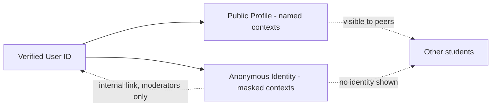
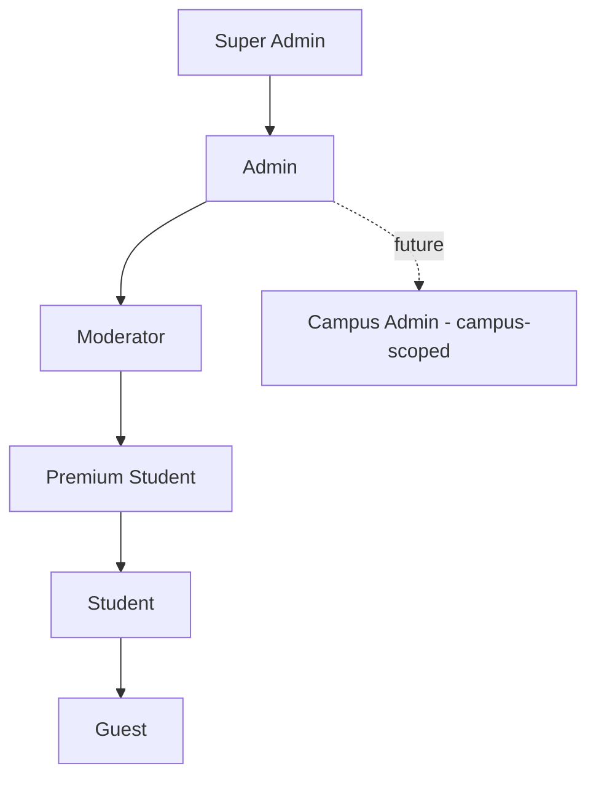
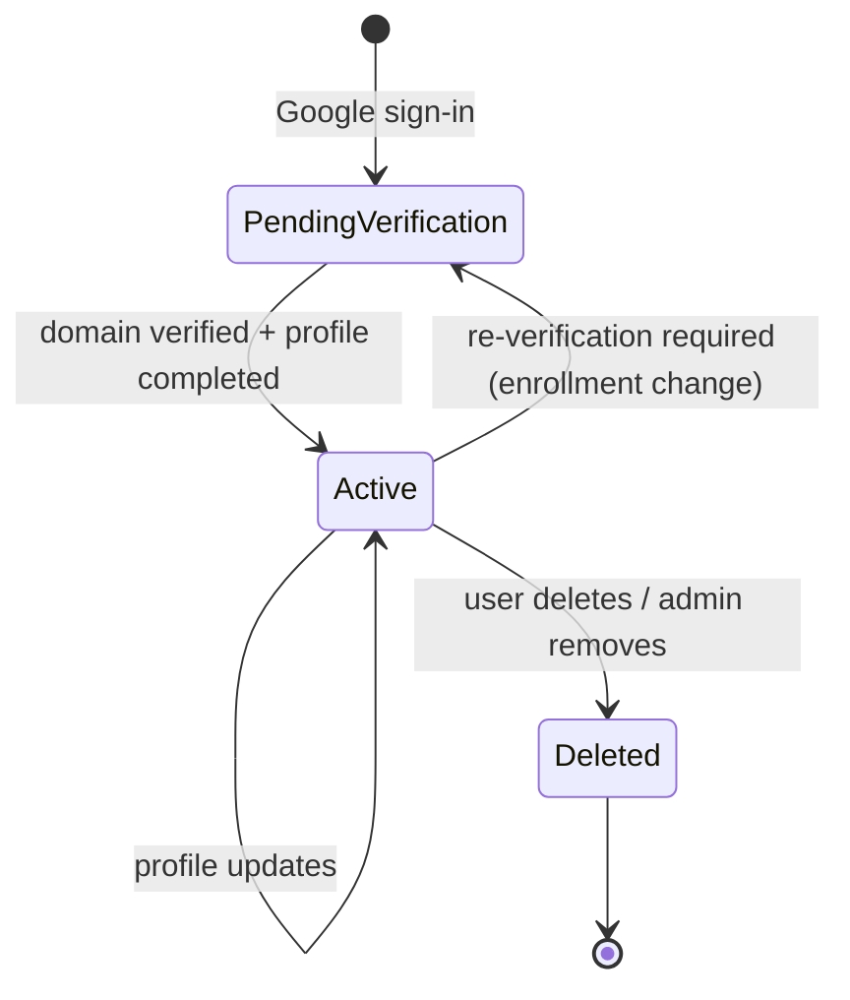
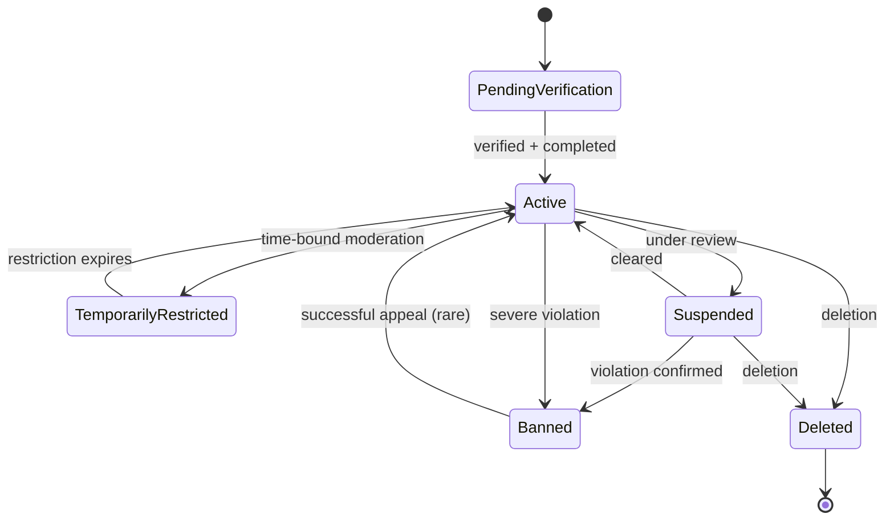

# Campusly V2 — Authentication & Authorization System

> **Document type:** Identity, authentication & authorization standard — single source of truth
> **Product:** Campusly V2 (formerly PU Chat)
> **Status:** Authoritative v1.0
> **Authority:** This is the definitive reference for identity, authentication, authorization, permissions, account lifecycle, and sessions. All implementation MUST conform. It describes architecture and security decisions only — not code, database tables, or API implementations.
> **Companion documents:** `SECURITY.md` (broader security model), `DATABASE_SCHEMA.md` §5–6 (auth tables), `ARCHITECTURE.md` §4 (auth flow), `API_SPEC.md` (endpoints), `SOCKET_EVENTS.md` §14 (realtime auth)

---

## Table of Contents
1. [Authentication Philosophy](#1-authentication-philosophy)
2. [User Identity](#2-user-identity)
3. [Authentication Flow](#3-authentication-flow)
4. [Authorization](#4-authorization)
5. [JWT Strategy](#5-jwt-strategy)
6. [Session Management](#6-session-management)
7. [User Roles](#7-user-roles)
8. [Profile Lifecycle](#8-profile-lifecycle)
9. [Privacy Model](#9-privacy-model)
10. [Security Measures](#10-security-measures)
11. [Account States](#11-account-states)
12. [Future Enhancements](#12-future-enhancements)
13. [Authentication Principles](#13-authentication-principles)

---

## 1. Authentication Philosophy

Authentication is the foundation of Campusly. Because the entire product rests on **verified student identity**, the way we establish that identity determines whether everything built on top — accountable anonymity, trust, safety — is sound.

### 1.1 Why Google Sign-In
Campusly authenticates exclusively via **Google OAuth**, using students' institutional Google accounts. The reasoning:
- **Verification through institutional email.** Indian colleges issue Google Workspace accounts; the institutional email domain is our first-pass proof that a user is a real student of a recognized campus.
- **No password handling.** We never store, transmit, or manage passwords — eliminating an entire class of breach risk (credential stuffing, weak passwords, password-reset attacks) and reducing user friction to a single tap.
- **Trusted, familiar onboarding.** Students already trust and use Google sign-in, lowering the barrier to entry — important for the shy and new users we most want to serve.

### 1.2 Why verified identity matters
Verified identity is what separates Campusly from the toxic open-anonymous platforms it deliberately is not. Verification keeps out bots, outsiders, predators, and impersonators at the door, and — crucially — it makes **accountable anonymity** possible: students can express themselves anonymously while every account behind the anonymity remains a real, accountable student. Without verification, none of the platform's trust guarantees hold.

### 1.3 Student-first identity model
Identity is designed around the student, not the platform's convenience. A student has **one verified account per institutional email**, bound to **one campus**, with control over what is public, what is private, and when they appear anonymously. Identity serves the student's safety and expression first.

### 1.4 Privacy considerations
We collect the **minimum identity data necessary** (verified email, name, campus, branch/year), store it securely, and never sell it. Anonymous interactions never leak identity to other users. The internal link between an anonymous action and its verified account exists **only for moderators**, only for accountability, and is never exposed to peers. Privacy is the default, per `PROJECT_VISION.md`.

---

## 2. User Identity

A single verified identity underpins several identity "faces" the student presents in different contexts.

| Identity facet | What it is | Visibility |
|----------------|-----------|------------|
| **Unique User ID** | A non-enumerable UUID; the internal canonical identity | Internal only |
| **Google Account** | The linked OAuth identity (Google subject + email) used to authenticate | Never shown to peers |
| **Campus Identity** | Verified university + branch + year binding the user to one campus | Public within campus rules |
| **Public Profile** | The displayable identity (name, avatar, bio) others see | Per privacy settings |
| **Anonymous Identity** | A masked presentation used in anonymous matching and anonymous wall posts | Identity hidden from peers; linked internally |

### 2.1 How one verified identity participates anonymously
This is the core synthesis of the product. A student's **Unique User ID is always known to the server**, but in anonymous contexts (anonymous matching sessions, anonymous wall posts) the **Public Profile is suppressed** — peers see no name, avatar, or profile. The server retains the link between the anonymous content and the verified account so that **moderators can hold the author accountable** if abuse is reported.



This is **accountable anonymity**: the freedom of the mask with the safety of verification. It is the single most important identity property of Campusly. (Schema: anonymous content always retains `author_id` — see `DATABASE_SCHEMA.md` §10.)

---

## 3. Authentication Flow

The complete login lifecycle, from opening the app to authorized access.

```mermaid
sequenceDiagram
    participant U as User
    participant FE as Next.js Client
    participant API as Express API
    participant G as Google OAuth
    participant DB as PostgreSQL

    U->>FE: Open app
    FE->>FE: Check for valid session (silent refresh if needed)
    alt no session
        U->>FE: Tap "Sign in with Google"
        FE->>G: OAuth consent
        G-->>FE: Google credential
        FE->>API: Submit credential
        API->>G: Verify credential
        G-->>API: Verified profile (sub, email, name)
        API->>API: Validate institutional email domain
        alt domain not recognized
            API-->>FE: Rejected (not a verified campus)
        else verified
            API->>DB: Find user by Google subject / email
            alt new user
                API->>DB: Create user (pending_verification → active)
                API-->>FE: Needs profile completion
                U->>FE: Complete profile (avatar, bio)
            end
            API->>API: Check account state (reject if banned)
            API-->>FE: Issue access token + refresh token
            FE-->>U: Authenticated; hydrate app + open socket
        end
    end
```

**Step summary:** open app → Google sign-in → server verifies credential with Google → institutional-domain check → find-or-create user → (first run) profile completion → account-state check → issue JWT access + refresh tokens → authorized access (REST + Socket.IO). Detailed transport mechanics are in `ARCHITECTURE.md` §4.

---

## 4. Authorization

Authentication answers *who you are*; authorization answers *what you may do*. Campusly uses **role-based access control (RBAC)**, enforced **server-side in the service layer** — the client and UI are never the gate.

### 4.1 Endpoint/permission tiers

| Tier | Who can access | Examples |
|------|----------------|----------|
| **Public** | Anyone (no/limited auth) | Sign-in, public university metadata, health checks |
| **Authenticated** | Any verified, active student | Profile, matching, chat, wall, communities, marketplace |
| **Moderator** | Platform moderators + admins | Report queues, hide/restrict/ban, moderation actions |
| **Admin** | Admins + super admin | User management, subscriptions, feature flags, announcements, analytics |
| **Future: Campus Admin** | Institutional role scoped to one campus | Campus-scoped moderation, announcements, org verification |

### 4.2 Role hierarchy
Each higher role inherits the capabilities of those below it (with scope constraints noted in §7).



Authorization checks combine **role** with **scope** (e.g., a Community Moderator acts only within their community; a future Campus Admin only within their campus) and **account state** (§11). Every privileged action is audit-logged (`DATABASE_SCHEMA.md` §15).

> **Premium is an entitlement, not a role.** In the data model, the canonical `users.role` values are `student`, `community_moderator`, `club_admin`, `moderator`, `admin`, and `super_admin` (`DATABASE_SCHEMA.md` §5.3). "Premium Student" shown in the hierarchy above is **not** a distinct role value — it is a `student` (or any role) whose `subscription_status='premium'`. The hierarchy diagram and the §7 permission table place it between Student and Moderator only to show its *capability tier*, not a role enum value.

---

## 5. JWT Strategy

Sessions use **stateless JWT access tokens** plus **stateful, revocable refresh tokens** — fast and scalable, while retaining the ability to revoke.

| Token | Lifetime | Storage | Purpose |
|-------|----------|---------|---------|
| **Access token** | Short (e.g., ~15 min) | Client memory (not durable storage) | Carries identity + RBAC claims; validated on every REST request and socket connection |
| **Refresh token** | Longer (e.g., days/weeks) | Secure httpOnly cookie / secure mobile store | Issues new access tokens without re-login; rotated and revocable |

- **Expiration.** Short access-token TTL limits the blast radius of a leaked token; the refresh token bounds total session length.
- **Renewal.** When an access token expires, the client transparently presents the refresh token to obtain a new access token **and a rotated refresh token** (refresh-token rotation).
- **Revocation.** Refresh tokens are persisted as **hashes** and can be revoked individually or in bulk (logout, ban, suspected theft). A revoked token cannot mint new access tokens.
- **Logout.** Discards client tokens and revokes the refresh token server-side; active sockets for the session are disconnected.
- **Session expiration.** When the refresh token expires or is revoked, the session ends and the user must re-authenticate.

> Access tokens are deliberately **not** stored server-side (stateless validation = scale); revocation is achieved via short TTL + refresh-token control. See `DATABASE_SCHEMA.md` §5.5 for the refresh-token record.

---

## 6. Session Management

| Concept | Behavior |
|---------|----------|
| **Active sessions** | A session is a valid refresh-token lineage; a user may hold several (multi-device) |
| **Device sessions** | Each refresh token may bind to a device record for per-device visibility and revocation |
| **Session validation** | Access token validated (signature, expiry, claims) on every REST request and socket handshake; banned/revoked users rejected immediately |
| **Forced logout** | Admin/security action revokes a user's refresh tokens and disconnects sockets (used on ban/suspension or theft) |
| **Future multi-device** | Per-device session list with individual "sign out this device" control |

Sessions span both transports uniformly: the same token model authenticates REST and Socket.IO, so a single identity governs all of a user's interactions (`SOCKET_EVENTS.md` §14).

---

## 7. User Roles

Permissions by role. Higher roles inherit lower-role capabilities unless scope-limited. (As noted in §4.2, "Premium Student" is a capability tier — `student` + `subscription_status='premium'` — not a `role` enum value.)

| Capability | Guest | Student | Premium Student | Moderator | Admin | Super Admin |
|------------|:-----:|:-------:|:---------------:|:---------:|:-----:|:-----------:|
| View public/sign-in surfaces | ✅ | ✅ | ✅ | ✅ | ✅ | ✅ |
| Use core social features (match, chat, wall, friends) | ❌ | ✅ | ✅ | ✅ | ✅ | ✅ |
| Enhanced limits / premium features | ❌ | ❌ | ✅ | ✅ | ✅ | ✅ |
| Report content/users | ❌ | ✅ | ✅ | ✅ | ✅ | ✅ |
| Review reports, hide/restrict/ban | ❌ | ❌ | ❌ | ✅ | ✅ | ✅ |
| User management, subscriptions, analytics | ❌ | ❌ | ❌ | ❌ | ✅ | ✅ |
| Feature flags, announcements, system config | ❌ | ❌ | ❌ | ❌ | ✅ | ✅ |
| Manage admins/roles, irreversible platform actions | ❌ | ❌ | ❌ | ❌ | ❌ | ✅ |

**Responsibilities & access levels.**
- **Guest** — unauthenticated/pre-verification; can only reach public surfaces and sign-in.
- **Student** — the core verified user; full access to social/community/utility features within their campus.
- **Premium Student** — a Student with active subscription unlocking enhanced limits and media/priority features (entitlement, not a privilege escalation).
- **Moderator** — safety operator; acts on reports and content within platform-wide rules; all actions audited.
- **Admin** — platform operator; user management, monetization, configuration, analytics.
- **Super Admin** — highest trust; manages roles and irreversible actions; smallest possible group.

> **Community Moderator** and **Club Admin** are **scoped roles** (within a community/club), distinct from platform Moderator; they govern their space within platform rules. The future **Campus Admin** is an institutional, campus-scoped role.

---

## 8. Profile Lifecycle



- **Account creation.** On first verified sign-in, a user record is created (Google link, campus identity captured).
- **Profile completion.** First-run capture of editable fields (name confirm, avatar, bio); privacy settings default to privacy-friendly values.
- **Profile updates.** Editable fields can change anytime (validated/moderated); verified fields (university/branch/year) are not freely editable.
- **University verification.** Performed via institutional email domain; re-verification may be required if enrollment status changes (handled administratively).
- **Account deletion.** Self-serve deactivation; PII is hard-purged after a grace window, with a tombstone retained for referential integrity (`DATABASE_SCHEMA.md` §23).
- **Account recovery.** Within the grace window after deactivation, signing in again can restore the account; after the window, deletion is irreversible (privacy promise).

---

## 9. Privacy Model

Identity privacy is enforced server-side and governed by per-user settings (`DATABASE_SCHEMA.md` §6.3).

| Aspect | Behavior |
|--------|----------|
| **Anonymous mode** | In anonymous matching and anonymous wall posts, no profile identity is shown to peers; the verified author is linked internally for moderation only |
| **Visible profile information** | The user controls which profile fields are public (`campus` / `friends` / `private` visibility) |
| **Friend visibility** | Certain information and presence are visible only to accepted friends, per settings |
| **Media privacy** | Media is served via short-lived signed URLs with non-guessable keys; private media is access-checked; temporary media auto-expires |
| **Blocked users** | A block removes any relationship and prevents all future contact, matching, and event delivery between the two users; enforced across every surface |
| **Reporting** | Any content/user is reportable; for anonymous content, moderators (only) can resolve the verified author for accountability |

The guiding rule: **anonymity protects students from each other's judgment, never from accountability.** Defaults favor privacy; sharing is opt-in.

---

## 10. Security Measures

Authentication-specific controls; the broader model lives in `SECURITY.md`.

| Measure | How it applies to auth |
|---------|------------------------|
| **JWT validation** | Signature, expiry, and claims verified on every REST request and socket handshake; the client is never trusted to assert identity or roles |
| **Input validation** | All auth inputs (credentials, profile fields) validated server-side (Zod) before processing |
| **Rate limiting** | Sign-in, token refresh, and sensitive auth endpoints are rate-limited to deter abuse |
| **Brute-force protection** | Because there are no passwords, classic brute force is largely eliminated; remaining vectors (token guessing, refresh abuse) are mitigated by non-enumerable tokens, short TTLs, and rate limits |
| **OAuth security** | Google credentials are verified server-side against Google; only recognized institutional domains are accepted; OAuth client secrets are never exposed to the client |
| **HTTPS/WSS requirement** | All authentication traffic is encrypted in transit; there is no plaintext auth path |
| **Secrets management** | JWT signing keys and OAuth secrets are loaded from environment/secret storage, never hardcoded, committed, or logged |
| **Audit logging** | Sign-in events and all privileged/role actions are recorded (login history + immutable audit log) for accountability and anomaly detection |

---

## 11. Account States

An account is always in exactly one state. State governs what the user can do and is checked at authentication and authorization time.

| State | Meaning | Capabilities |
|-------|---------|--------------|
| **Pending Verification** | Created but not yet fully verified/completed | Limited; must complete verification/profile |
| **Active** | Verified, in good standing | Full access per role |
| **Temporarily Restricted** | Active but limited by a time-bound moderation action | Reduced (e.g., cannot post/match) until expiry |
| **Suspended** | Access withheld pending review | Cannot use the platform; can appeal |
| **Banned** | Permanently removed for serious violations | No access; cannot re-authenticate |
| **Deleted** | User-initiated or admin removal | No access; PII purged after grace window |



**Transitions** are driven by verification, moderation actions, appeals, and user choices. Banned/suspended users are rejected at authentication; restricted users authenticate but are blocked from specific actions. All state changes are audit-logged, and temporary restrictions/bans are auto-lifted on expiry (`DATABASE_SCHEMA.md` §15).

---

## 12. Future Enhancements

Reserved, not built — the architecture leaves clean room for each because token issuance and identity are centralized.

| Enhancement | Description | Fits because |
|-------------|-------------|--------------|
| **Multi-factor authentication (MFA)** | Optional second factor, especially for admins/moderators and high-trust actions | An additive step before token issuance; no change to the core model |
| **Additional login providers** | Beyond Google (e.g., other institutional SSO) | `google_accounts` generalizes to a provider-aware `oauth_accounts` (`DATABASE_SCHEMA.md` §5.4) |
| **Passkeys / WebAuthn** | Passwordless device-bound credentials | Slots in as another verification method issuing the same tokens |
| **Campus SSO** | Direct institutional single sign-on partnerships | Strengthens verification; integrates at the credential-verification step |
| **Trusted devices** | Remembered devices with reduced friction / step-up on new devices | Builds on the device-session model (§6) |

All future methods converge on the **same JWT issuance and RBAC model**, so they are additive rather than disruptive.

---

## 13. Authentication Principles

The guiding philosophy, in priority order. When principles tension, higher ones win.

1. **Security before convenience.** When a choice trades safety for ease, safety wins. A slightly longer flow is acceptable; an insecure shortcut is not.
2. **Privacy by design.** Minimal data, private defaults, no identity leakage in anonymous contexts, and the internal anonymity link reserved for moderators only.
3. **Least privilege access.** Every role and token carries the minimum permissions needed; privileged capability is rare, scoped, and audited.
4. **Verified identity with optional anonymity.** Every account is a real, verified student; anonymity is a presentation layer over an always-accountable identity. This synthesis is the heart of the system.
5. **Simplicity for users.** One-tap Google sign-in, no passwords, transparent token refresh — the security is heavy, but the experience is light.
6. **Scalability.** Stateless access tokens and a centralized identity model scale horizontally and span REST + realtime uniformly.

---

## Closing Note

This document is the official authentication and authorization standard for Campusly V2. It defines a system that is **secure** (server-side enforcement, no passwords, short-lived tokens, audit), **scalable** (stateless JWT + revocable refresh), **user-friendly** (one-tap Google sign-in), and ready for both **web and mobile** — all in service of the product's foundational property: **verified identity with accountable, optional anonymity.**

Implementation must conform to this document. It references but does not duplicate the auth tables (`DATABASE_SCHEMA.md` §5–6), transport flow (`ARCHITECTURE.md` §4), realtime auth (`SOCKET_EVENTS.md` §14), and the broader security model (`SECURITY.md`). Where identity or authorization intent is unclear, this document decides; where it intersects broader security, `SECURITY.md` governs. No change to the authentication model ships without approval and an update here.

*— Principal Security Architect, Identity Systems Engineer & Backend Technical Lead, Campusly V2*
