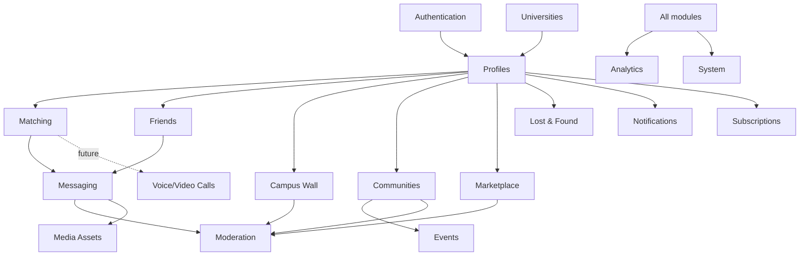
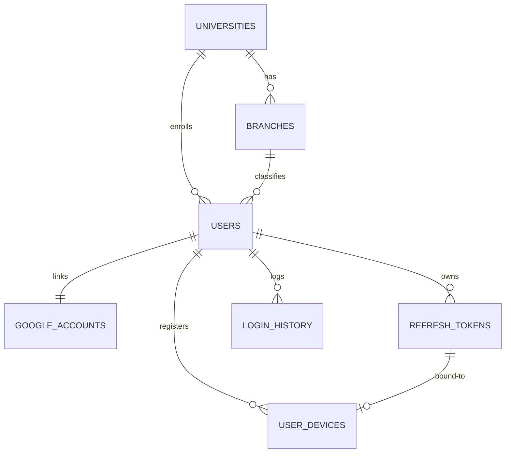
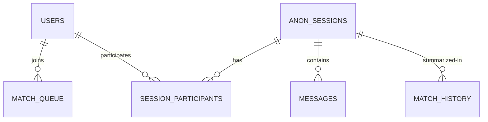
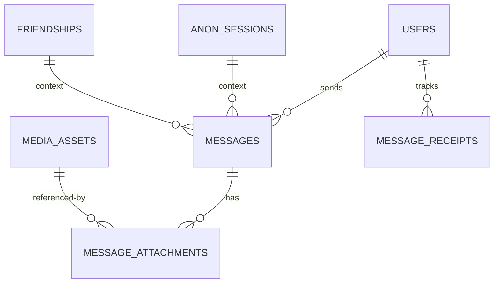
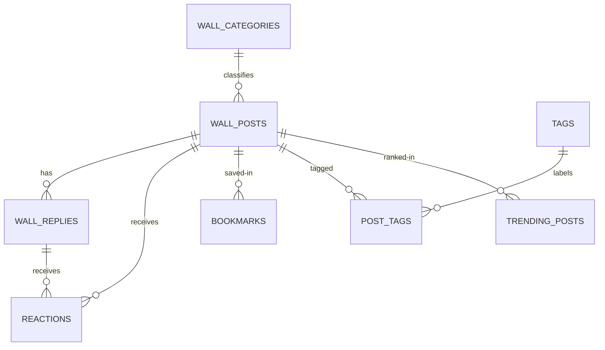
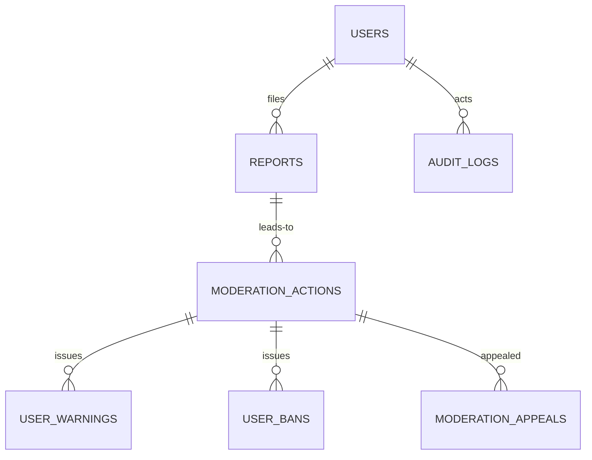
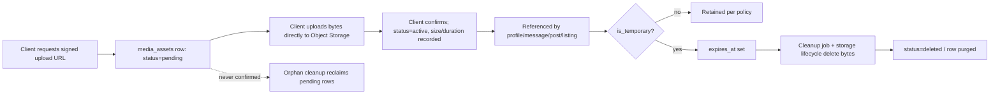

# Campusly V2 — Database Schema & Data Architecture

> **Document type:** Database architecture — single source of truth
> **Product:** Campusly V2 (formerly PU Chat)
> **Status:** Authoritative v1.0
> **Engine:** PostgreSQL (accessed via Drizzle ORM)
> **Audience:** Backend engineers, data architects, DBAs, AI assistants
> **Authority:** This is the definitive reference for Campusly's data model. It describes structure, relationships, constraints, and reasoning — **not** SQL, migrations, or `CREATE TABLE` statements. Implementation (Drizzle schema + migrations) must conform to this document. No schema change ships without approval and an update here.
> **Companion documents:** `ARCHITECTURE.md`, `TECH_STACK.md`, `PRODUCT_REQUIREMENTS.md`, `API_SPEC.md`, `SOCKET_EVENTS.md`, `SECURITY.md`

> **Scale target:** ~100,000 registered students, ~10,000 daily active users, millions of messages, millions of wall posts, millions of reactions. The design is normalized, maintainable, and scalable, while deliberately avoiding premature optimization and unnecessary tables.

---

## Table of Contents

1. [Database Philosophy](#1-database-philosophy)
2. [Complete ER Diagram](#2-complete-er-diagram)
3. [Database Modules](#3-database-modules)
4. [Table Documentation Conventions](#4-table-documentation-conventions)
5. [Authentication Module](#5-authentication-module)
6. [Student Profile Module](#6-student-profile-module)
7. [Anonymous Matching Module](#7-anonymous-matching-module)
8. [Messaging Module](#8-messaging-module)
9. [Friend System Module](#9-friend-system-module)
10. [Campus Wall Module](#10-campus-wall-module)
11. [Communities Module](#11-communities-module)
12. [Marketplace Module](#12-marketplace-module)
13. [Lost & Found Module](#13-lost--found-module)
14. [Events Module](#14-events-module)
15. [Moderation Module](#15-moderation-module)
16. [Notifications Module](#16-notifications-module)
17. [Subscription Module](#17-subscription-module)
18. [Analytics Module](#18-analytics-module)
19. [System Tables Module](#19-system-tables-module)
20. [Media Lifecycle](#20-media-lifecycle)
21. [Indexing Strategy](#21-indexing-strategy)
22. [Query Optimization](#22-query-optimization)
23. [Data Retention Policy](#23-data-retention-policy)
24. [Backup Strategy](#24-backup-strategy)
25. [Future Expansion](#25-future-expansion)
26. [Database Standards](#26-database-standards)

---

## 1. Database Philosophy

The data model is the most permanent part of any system — applications are rewritten, but data outlives them. Campusly's schema is therefore designed with discipline and a long horizon.

### 1.1 Why PostgreSQL
Campusly's data is **deeply relational** (users, friendships, sessions, messages, communities, memberships, events, reports) and demands **strong consistency** (a match session created atomically; a moderation action inseparable from its audit record). PostgreSQL provides ACID transactions, rich relational integrity (foreign keys, constraints), powerful querying (joins, CTEs, window functions, full-text search), and `JSONB` for the occasional semi-structured field — all open-source and self-hostable at zero licensing cost. It directly resolves V1's Firestore pain (runaway costs, rules complexity, weak analytics, lock-in). The full rationale lives in `TECH_STACK.md` §4.

### 1.2 Normalization strategy
The schema is **highly normalized (target: 3NF)**. Each fact lives in exactly one place; relationships are expressed by foreign keys and join tables. This eliminates update anomalies, guarantees consistency, and keeps writes cheap. We **denormalize deliberately and sparingly** — only for proven read-hot paths — using **maintained counter columns** (e.g., reaction counts, member counts) and **materialized aggregates** (e.g., trending, daily metrics) computed by background jobs. Denormalized values are always derivable from normalized truth, so they can be rebuilt. The rule: *normalize by default; denormalize only with evidence.*

### 1.3 Naming conventions
- Tables: **plural `snake_case`** (`users`, `wall_posts`, `friend_requests`).
- Columns: **`snake_case`** (`created_at`, `university_id`).
- Primary key: **`id`**.
- Foreign keys: **`<singular_referenced_table>_id`** (`user_id`, `community_id`).
- Booleans: **`is_`/`has_`** prefix (`is_anonymous`, `has_media`).
- Timestamps: **`_at`** suffix (`created_at`, `deleted_at`).
- Join tables: **both entities** (`community_members`, `event_attendees`).
- Enumerated string columns use defined value sets (see §1 enums and §26).

### 1.4 UUID usage
Primary keys are **UUIDs (v7 preferred where available, else v4)**. Reasoning:
- **Non-enumerable.** UUIDs prevent ID guessing/scraping — a privacy and security benefit for a student platform (you cannot iterate `user/1, user/2`).
- **Distributable.** Globally unique IDs ease future sharding/partitioning and client-side optimistic creation.
- **UUIDv7 ordering.** v7 is time-ordered, giving good index locality (mitigating the classic random-UUID index-bloat concern) while retaining unguessability.

Trade-off: 16 bytes vs. 8 for bigint, slightly larger indexes — accepted for the privacy and distribution benefits at our scale.

### 1.5 Timestamps
Every table carries **`created_at`** and (where mutable) **`updated_at`**, stored as **`timestamptz` (UTC)**. We store UTC always and localize at the edge. Time-ordered tables (messages, notifications, audit logs) rely on these for cursor pagination and future partitioning.

### 1.6 Soft deletes vs. hard deletes
We use a **hybrid policy**, decided per table by privacy and recoverability needs:
- **Soft delete** (`deleted_at` nullable timestamp) for user-recoverable or audit-relevant content (wall posts, messages display state, communities) — preserves referential history and supports moderation review.
- **Hard delete** for privacy-obligated data (account deletion purges PII; expired temporary media bytes) and for ephemeral rows (queue entries, typing — not persisted at all).
- Soft-deleted rows are excluded by default at the query/repository layer and purged by retention jobs after their window (§23).

### 1.7 Foreign keys
Foreign keys are **always enforced** with explicit `ON DELETE` behavior chosen per relationship: `CASCADE` for owned children (a post's reactions die with the post), `SET NULL` for optional references, `RESTRICT` for protected references. Integrity is the database's job, not the application's — orphan rows must be impossible.

### 1.8 Indexes
Indexes are **deliberate, not reflexive** (full strategy in §21): index foreign keys used in joins, high-selectivity filter/sort columns on hot paths, composite indexes matching common query shapes, and partial indexes for filtered subsets (active sessions, pending requests, unresolved reports). We add indexes from real query plans (`EXPLAIN ANALYZE`), never speculation, because every index taxes writes and storage.

### 1.9 Transactions
Multi-row invariants execute in **transactions**: matching (create session + clear queue), friend acceptance (create friendship + close request), moderation (apply action + write audit), subscription changes. Isolation levels are chosen to prevent the race conditions that plagued V1's matching.

### 1.10 Audit fields
Beyond timestamps, sensitive tables carry **provenance fields** (`created_by`, `updated_by` where applicable) and the system maintains a dedicated immutable **`audit_logs`** table (§15) for security/moderation actions. Audit data is append-only and never updated or hard-deleted within its retention window.

### 1.11 Future partitioning
High-growth, time-series-like tables — **`messages`, `notifications`, `audit_logs`, `analytics_*`** — are designed as **partition-ready**: they carry a time column and, where relevant, `university_id` (the campus-scope key), the natural partition/shard keys. We do **not** partition now (premature at our scale); the design simply ensures future range/list partitioning is a migration, not a redesign.

> **Naming note.** The campus-scope **column** is named **`university_id`** everywhere (FK → `universities`, per the `<table>_id` convention). "Campus scoping" / "campus-scoped" is the **concept**; `university_id` is the column that implements it. Other documents that say "campus_id" refer to this same `university_id` column.

---

## 2. Complete ER Diagram

The following diagram shows the core entities and their relationships across all modules. (Some future-only tables are omitted for legibility and described in their sections.)

```mermaid
erDiagram
    UNIVERSITIES ||--o{ USERS : "enrolls"
    USERS ||--|| PROFILES : "has"
    USERS ||--o{ GOOGLE_ACCOUNTS : "links"
    USERS ||--o{ REFRESH_TOKENS : "owns"
    USERS ||--o{ LOGIN_HISTORY : "logs"
    USERS ||--o{ USER_DEVICES : "registers"

    USERS ||--o{ MATCH_QUEUE : "joins"
    USERS ||--o{ SESSION_PARTICIPANTS : "participates"
    ANON_SESSIONS ||--o{ SESSION_PARTICIPANTS : "has"
    ANON_SESSIONS ||--o{ MESSAGES : "contains"
    USERS ||--o{ MATCH_HISTORY : "records"

    USERS ||--o{ FRIEND_REQUESTS : "sends"
    USERS ||--o{ FRIENDSHIPS : "in"
    FRIENDSHIPS ||--o{ MESSAGES : "contains"
    USERS ||--o{ BLOCKED_USERS : "blocks"

    USERS ||--o{ MESSAGES : "authors"
    MESSAGES ||--o{ MESSAGE_ATTACHMENTS : "has"
    MESSAGES ||--o{ MESSAGE_RECEIPTS : "tracked-by"
    MEDIA_ASSETS ||--o{ MESSAGE_ATTACHMENTS : "referenced-by"

    USERS ||--o{ WALL_POSTS : "writes"
    WALL_POSTS ||--o{ WALL_REPLIES : "has"
    WALL_POSTS ||--o{ REACTIONS : "receives"
    WALL_REPLIES ||--o{ REACTIONS : "receives"
    WALL_POSTS ||--o{ BOOKMARKS : "saved-in"
    WALL_CATEGORIES ||--o{ WALL_POSTS : "classifies"
    WALL_POSTS ||--o{ POST_TAGS : "tagged"

    UNIVERSITIES ||--o{ COMMUNITIES : "scopes"
    COMMUNITIES ||--o{ COMMUNITY_MEMBERS : "has"
    USERS ||--o{ COMMUNITY_MEMBERS : "joins"
    COMMUNITIES ||--o{ COMMUNITY_POSTS : "contains"
    COMMUNITIES ||--o{ COMMUNITY_INVITES : "issues"

    UNIVERSITIES ||--o{ EVENTS : "hosts"
    EVENTS ||--o{ EVENT_ATTENDEES : "has"
    USERS ||--o{ EVENT_ATTENDEES : "rsvps"

    UNIVERSITIES ||--o{ MARKETPLACE_ITEMS : "scopes"
    USERS ||--o{ MARKETPLACE_ITEMS : "lists"
    MARKETPLACE_ITEMS ||--o{ MARKETPLACE_FAVORITES : "favorited"

    UNIVERSITIES ||--o{ LOST_FOUND_ITEMS : "scopes"
    LOST_FOUND_ITEMS ||--o{ LOST_FOUND_CLAIMS : "claimed-by"

    USERS ||--o{ REPORTS : "files"
    REPORTS ||--o{ MODERATION_ACTIONS : "results-in"
    USERS ||--o{ USER_WARNINGS : "receives"
    USERS ||--o{ USER_BANS : "subject-to"
    MODERATION_ACTIONS ||--o{ MODERATION_APPEALS : "appealed"
    USERS ||--o{ AUDIT_LOGS : "acts"

    USERS ||--o{ NOTIFICATIONS : "receives"
    USERS ||--|| NOTIFICATION_PREFERENCES : "configures"

    SUBSCRIPTION_PLANS ||--o{ USER_SUBSCRIPTIONS : "instantiated-as"
    USERS ||--o{ USER_SUBSCRIPTIONS : "holds"
    USER_SUBSCRIPTIONS ||--o{ SUBSCRIPTION_TRANSACTIONS : "billed-by"

    MEDIA_ASSETS ||--o{ WALL_POSTS : "attached-to"
    USERS ||--o{ MEDIA_ASSETS : "owns"
```

The diagram's spine is **`universities` → `users` → everything**: a user belongs to one university (campus scope), and nearly every content entity belongs to a user and carries a campus dimension. `media_assets` is a shared reference table linking PostgreSQL to object storage across modules.

---

## 3. Database Modules

The schema is organized into logical modules for comprehension and maintenance. Modules are conceptual groupings — all tables live in one PostgreSQL database (and one logical schema unless noted).

| Module | Responsibility | Key tables |
|--------|----------------|-----------|
| Authentication | Identity, sessions, devices | `users`, `google_accounts`, `refresh_tokens`, `login_history`, `user_devices` |
| Universities | Campus scoping reference | `universities`, `branches` |
| Profiles | Student identity & settings | `profiles`, `user_interests`, `privacy_settings` |
| Matching | Anonymous pairing | `match_queue`, `anon_sessions`, `session_participants`, `match_history` |
| Messaging | Chat & media in messages | `messages`, `message_attachments`, `message_receipts`, `media_assets` |
| Friends | Relationships | `friend_requests`, `friendships`, `blocked_users` |
| Campus Wall | Public feed | `wall_posts`, `wall_replies`, `reactions`, `bookmarks`, `wall_categories`, `tags`, `post_tags` |
| Communities | Groups & clubs | `communities`, `community_members`, `community_posts`, `community_invites` |
| Events | Campus events | `events`, `event_attendees`, `event_categories` |
| Marketplace | Student commerce | `marketplace_items`, `marketplace_categories`, `marketplace_favorites` |
| Lost & Found | Item recovery | `lost_found_items`, `lost_found_claims` |
| Moderation | Safety & accountability | `reports`, `moderation_actions`, `user_warnings`, `user_bans`, `moderation_appeals`, `audit_logs` |
| Notifications | Multi-channel alerts | `notifications`, `notification_preferences`, `notification_queue` |
| Subscriptions | Monetization | `subscription_plans`, `user_subscriptions`, `subscription_transactions` |
| Analytics | Metrics | `daily_metrics`, `engagement_events`, `retention_cohorts`, `feature_usage` |
| System | Platform config | `app_config`, `feature_flags`, `app_versions`, `announcements` |
| Future calls | Voice/video | `call_sessions`, `call_participants` (future) |

---

## 4. Table Documentation Conventions

For every table below, documentation follows a consistent structure: **Purpose**, **column table** (column, type, null, default, notes), **keys & constraints**, **indexes**, **relationships**, and **lifecycle/deletion/future**. Column types are PostgreSQL types described in prose (no SQL). Common conventions, stated once to avoid repetition:

- Every table has `id uuid` primary key (default generated UUIDv7/v4) unless it is a pure join table using a composite key, which is noted.
- Every table has `created_at timestamptz` (default now). Mutable tables add `updated_at timestamptz` (set on update).
- Soft-deletable tables add `deleted_at timestamptz` (nullable; null = active).
- "FK" denotes a foreign key with enforced referential integrity; `ON DELETE` behavior is stated where non-obvious.
- "Enum" denotes a constrained string value set (implemented as a Postgres enum type or a check/lookup; see §26).

---

## 5. Authentication Module

Establishes verified identity and manages sessions. Designed so that JWT auth is stateless while refresh tokens, login history, and devices are persisted for security and revocation.

### 5.1 `universities`
**Purpose.** Reference table of recognized campuses; the root of campus scoping and multi-tenancy.

| Column | Type | Null | Default | Notes |
|--------|------|------|---------|-------|
| id | uuid | no | gen | PK |
| name | text | no | — | Full university name |
| short_name | text | yes | — | Display abbreviation |
| email_domains | text[] | no | — | Verified institutional domains (e.g., `@poornima.edu.in`) used for verification |
| city | text | yes | — | Location |
| state | text | yes | — | Location |
| logo_media_id | uuid | yes | — | FK → `media_assets` (campus logo) |
| is_active | boolean | no | true | Whether onboarding/access is enabled |
| created_at | timestamptz | no | now | — |
| updated_at | timestamptz | no | now | — |

**Keys & constraints.** PK `id`. Unique on `name`. `email_domains` values unique across the table (a domain maps to one campus). **Indexes.** GIN index on `email_domains` (fast domain → campus lookup at login). **Relationships.** One university → many users, communities, events, listings, etc. **Lifecycle.** Long-lived reference. **Deletion.** Hard delete forbidden while referenced; deactivate via `is_active`. **Future.** Add `country`, `timezone`, institutional-SaaS fields (§25).

### 5.2 `branches`
**Purpose.** Normalized list of academic branches/departments per university (avoids free-text inconsistency in profiles).

| Column | Type | Null | Default | Notes |
|--------|------|------|---------|-------|
| id | uuid | no | gen | PK |
| university_id | uuid | no | — | FK → `universities` (CASCADE) |
| name | text | no | — | e.g., "Computer Science" |
| created_at | timestamptz | no | now | — |

**Keys.** PK `id`. Unique `(university_id, name)`. **Indexes.** Index on `university_id`. **Relationships.** Branch → many profiles. **Lifecycle.** Reference. **Deletion.** Restrict while referenced. **Future.** Branch-level communities/analytics.

### 5.3 `users`
**Purpose.** The canonical account record — verified identity, status, and account-level flags. Profile details live in `profiles` (§6) to keep this table lean and hot-path-fast.

| Column | Type | Null | Default | Notes |
|--------|------|------|---------|-------|
| id | uuid | no | gen | PK |
| university_id | uuid | no | — | FK → `universities` (RESTRICT). Campus scope. |
| branch_id | uuid | yes | — | FK → `branches` (SET NULL) |
| email | citext | no | — | Verified institutional email; unique |
| name | text | no | — | Verified display name |
| year | smallint | yes | — | Academic year |
| role | enum | no | 'student' | `student` / `community_moderator` / `club_admin` / `moderator` / `admin` / `super_admin` |
| account_status | enum | no | 'pending_verification' | `pending_verification` / `active` / `restricted` (time-bound) / `suspended` (under review) / `banned` / `deactivated` |
| subscription_status | enum | no | 'free' | `free` / `premium` (denormalized cache of active subscription; see §17) |
| last_seen_at | timestamptz | yes | — | Presence (privacy-controlled) |
| created_at | timestamptz | no | now | — |
| updated_at | timestamptz | no | now | — |
| deleted_at | timestamptz | yes | — | Soft delete (account deactivation); PII purge on hard-delete window |

**Keys & constraints.** PK `id`. Unique on `email`. **Indexes.** Unique index on `email`; index on `university_id`; partial index on `account_status` where not `active` (moderation queries). **Relationships.** The hub: one user → profile, tokens, messages, posts, friendships, etc. **Lifecycle.** Created at first verified sign-in (default `pending_verification` until institutional domain is verified and profile completed, then `active`); lives for account lifetime. **Deletion.** Soft delete on deactivation; hard purge of PII after retention window (§23) per Privacy First, replacing identifying fields with tombstone values while preserving referential integrity for aggregate history. **Future.** `is_mfa_enabled`, `verified_via` (for non-Google verification), alumni status.

> **Canonical role & state sets.** The `role` and `account_status` enums above are the **single source of truth**, aligned with `AUTH_SYSTEM.md` §7 (roles) and §11 (account states). Note: **premium is not a role** — it is represented by `subscription_status='premium'` on a `student` (or any) role, never by a `role` value. `community_moderator` and `club_admin` are **scoped** roles (within a community/club); `moderator`, `admin`, and `super_admin` are platform roles.

### 5.4 `google_accounts`
**Purpose.** Links a user to their Google OAuth identity; isolates provider-specific identifiers from the core user record and enables multiple/changed providers in future.

| Column | Type | Null | Default | Notes |
|--------|------|------|---------|-------|
| id | uuid | no | gen | PK |
| user_id | uuid | no | — | FK → `users` (CASCADE) |
| google_sub | text | no | — | Google's stable subject identifier; unique |
| email | citext | no | — | Google account email |
| picture_url | text | yes | — | Google avatar (may seed profile avatar) |
| linked_at | timestamptz | no | now | — |

**Keys.** PK `id`. Unique on `google_sub`; unique on `user_id` (one Google link per user initially). **Indexes.** Unique `google_sub`. **Relationships.** One user → one Google account (now); table allows many providers later. **Lifecycle.** Created at first sign-in. **Deletion.** CASCADE with user. **Future.** Additional OAuth providers as sibling tables or a generic `oauth_accounts` with a `provider` column.

### 5.5 `refresh_tokens`
**Purpose.** Persists issued refresh tokens to enable rotation and revocation (access tokens stay stateless/unstored).

| Column | Type | Null | Default | Notes |
|--------|------|------|---------|-------|
| id | uuid | no | gen | PK |
| user_id | uuid | no | — | FK → `users` (CASCADE) |
| token_hash | text | no | — | **Hash** of the token, never the raw token |
| device_id | uuid | yes | — | FK → `user_devices` (SET NULL) |
| expires_at | timestamptz | no | — | Expiry |
| revoked_at | timestamptz | yes | — | Set on rotation/logout/ban |
| replaced_by | uuid | yes | — | Self-FK to successor token (rotation chain) |
| created_at | timestamptz | no | now | — |

**Keys.** PK `id`. Unique on `token_hash`. **Indexes.** Index on `user_id`; partial index where `revoked_at is null` and `expires_at > now` (active tokens). **Relationships.** Many tokens per user (multi-device). **Lifecycle.** Created on login/refresh; rotated on use. **Deletion.** Hard-deleted by retention job after expiry; revoked immediately on logout/ban. **Future.** Token family/anomaly detection for theft response.

### 5.6 `login_history`
**Purpose.** Security audit of sign-in events (success/failure) for anomaly detection and user transparency.

| Column | Type | Null | Default | Notes |
|--------|------|------|---------|-------|
| id | uuid | no | gen | PK |
| user_id | uuid | yes | — | FK → `users` (SET NULL); null for failed unknown-user attempts |
| event | enum | no | — | `login_success` / `login_failure` / `refresh` / `logout` |
| ip_hash | text | yes | — | Hashed IP (privacy) |
| user_agent | text | yes | — | Client descriptor |
| created_at | timestamptz | no | now | Append-only |

**Keys.** PK `id`. **Indexes.** Index `(user_id, created_at desc)`. **Relationships.** Many per user. **Lifecycle.** Append-only. **Deletion.** Retention-pruned (§23). **Future.** Geolocation enrichment, suspicious-login alerts. Partition-ready by time.

### 5.7 `user_devices` (future-ready)
**Purpose.** Tracks devices for session management and future push notifications.

| Column | Type | Null | Default | Notes |
|--------|------|------|---------|-------|
| id | uuid | no | gen | PK |
| user_id | uuid | no | — | FK → `users` (CASCADE) |
| device_label | text | yes | — | Human-friendly name |
| platform | enum | yes | — | `web` / `ios` / `android` |
| push_token | text | yes | — | For future push (nullable until then) |
| last_active_at | timestamptz | yes | — | — |
| created_at | timestamptz | no | now | — |

**Keys.** PK `id`. Unique `(user_id, push_token)` where push_token not null. **Indexes.** Index on `user_id`. **Lifecycle.** Created on first device use. **Deletion.** CASCADE with user; pruned when stale. **Future.** Core of the push-notification pipeline (§16).

---

## 6. Student Profile Module

Holds the rich, mutable student identity, separated from `users` so the account hot-path stays lean and profile reads/writes don't contend with auth.

### 6.1 `profiles`
**Purpose.** One-to-one extension of `users` with displayable, editable identity and cached status fields.

| Column | Type | Null | Default | Notes |
|--------|------|------|---------|-------|
| id | uuid | no | gen | PK |
| user_id | uuid | no | — | FK → `users` (CASCADE); unique (1:1) |
| avatar_media_id | uuid | yes | — | FK → `media_assets` (SET NULL) |
| gender | enum | yes | — | `male` / `female` / `other` / `prefer_not` |
| bio | text | yes | — | Length-limited; moderated |
| moderation_status | enum | no | 'clear' | `clear` / `flagged` / `restricted` (cache; truth in moderation module) |
| created_at | timestamptz | no | now | — |
| updated_at | timestamptz | no | now | — |

**Keys.** PK `id`. Unique on `user_id`. **Indexes.** Unique `user_id`. **Relationships.** 1:1 with users; references an avatar media asset. **Lifecycle.** Created with the user. **Deletion.** CASCADE with user; avatar reference nulled and media expired on account deletion. **Future.** `headline`, `social_links jsonb`, `pronouns`, verified-creator badge.

### 6.2 `user_interests`
**Purpose.** Many-to-many of users ↔ interests; powers discovery, communities, and future smart matching.

| Column | Type | Null | Default | Notes |
|--------|------|------|---------|-------|
| user_id | uuid | no | — | FK → `users` (CASCADE) |
| interest_id | uuid | no | — | FK → `interests` (CASCADE) |
| created_at | timestamptz | no | now | — |

**Keys.** Composite PK `(user_id, interest_id)`. **Indexes.** Index on `interest_id` (find users by interest). **Relationships.** Join table; `interests` is a small reference table (`id`, `name`, unique). **Lifecycle.** User-managed. **Deletion.** CASCADE. **Future.** Weighted interests for AI matching/recommendations.

### 6.3 `privacy_settings`
**Purpose.** Per-user privacy controls governing presence, profile visibility, and receipts — enforcing Privacy by Design.

| Column | Type | Null | Default | Notes |
|--------|------|------|---------|-------|
| id | uuid | no | gen | PK |
| user_id | uuid | no | — | FK → `users` (CASCADE); unique |
| show_last_seen | boolean | no | true | Presence visibility |
| show_online_status | boolean | no | true | — |
| send_read_receipts | boolean | no | true | Reciprocal receipts |
| profile_visibility | enum | no | 'campus' | `campus` / `friends` / `private` |
| allow_friend_requests | enum | no | 'everyone' | `everyone` / `campus` / `none` |
| created_at | timestamptz | no | now | — |
| updated_at | timestamptz | no | now | — |

**Keys.** PK `id`. Unique `user_id`. **Indexes.** Unique `user_id`. **Lifecycle.** Created with sensible private-friendly defaults at signup. **Deletion.** CASCADE. **Future.** Granular per-module visibility toggles.

---

## 7. Anonymous Matching Module

Implements server-authoritative matching with persisted queue state for recovery (the V1 fix). Ephemeral speed lives in app memory; durable truth lives here.

### 7.1 `match_queue`
**Purpose.** Persisted record of users currently waiting to be matched, enabling crash recovery and stale-user cleanup.

| Column | Type | Null | Default | Notes |
|--------|------|------|---------|-------|
| id | uuid | no | gen | PK |
| user_id | uuid | no | — | FK → `users` (CASCADE); unique (one queue entry per user) |
| university_id | uuid | no | — | FK → `universities`; campus-scoped matching |
| status | enum | no | 'waiting' | `waiting` / `matched` / `cancelled` |
| preferences | jsonb | yes | — | Optional match prefs (future smart matching) |
| last_heartbeat_at | timestamptz | no | now | Liveness; stale entries reclaimed |
| created_at | timestamptz | no | now | Enqueue time (FIFO fairness) |

**Keys.** PK `id`. Unique on `user_id`. **Indexes.** Partial composite index `(university_id, created_at)` where `status='waiting'` (pairing scan); index on `last_heartbeat_at` (stale cleanup). **Relationships.** One active row per waiting user. **Lifecycle.** Created on join; removed on match/cancel/stale. **Deletion.** Hard delete (ephemeral); cleanup job removes stale rows. **Future.** `preferences` feeds AI compatibility matching.

### 7.2 `anon_sessions`
**Purpose.** An anonymous chat session between two matched users.

| Column | Type | Null | Default | Notes |
|--------|------|------|---------|-------|
| id | uuid | no | gen | PK |
| university_id | uuid | no | — | FK → `universities` |
| status | enum | no | 'active' | `active` / `ended` / `expired` |
| started_at | timestamptz | no | now | — |
| ended_at | timestamptz | yes | — | Set on termination |
| end_reason | enum | yes | — | `left` / `disconnect` / `expired` / `reported` |
| created_at | timestamptz | no | now | — |

**Keys.** PK `id`. **Indexes.** Partial index where `status='active'` (active-session ops, cleanup); index on `started_at` (history, partition key). **Relationships.** One session → two `session_participants` → many `messages`. **Lifecycle.** Created transactionally with queue clearing. **Deletion.** Soft-end (status); messages retained per retention policy then purged. **Future.** Partition by `started_at`; link to `call_sessions` if a session escalates to a call.

### 7.3 `session_participants`
**Purpose.** Join table linking the (two) users to an anonymous session, with per-participant state. Modeled as a join (not two columns on the session) for cleaner queries and future group sessions.

| Column | Type | Null | Default | Notes |
|--------|------|------|---------|-------|
| session_id | uuid | no | — | FK → `anon_sessions` (CASCADE) |
| user_id | uuid | no | — | FK → `users` (CASCADE) |
| left_at | timestamptz | yes | — | Per-user leave time |
| sent_friend_request | boolean | no | false | Whether this user offered friendship |
| created_at | timestamptz | no | now | — |

**Keys.** Composite PK `(session_id, user_id)`. **Indexes.** Index on `user_id` (a user's session history). **Relationships.** Two rows per session. **Lifecycle.** Created with session. **Deletion.** CASCADE with session. **Future.** Supports >2 participants (group matching) without schema change.

### 7.4 `match_history`
**Purpose.** Lightweight historical record of completed matches per user — analytics, abuse detection (repeat pairing avoidance), and "don't rematch recently" rules.

| Column | Type | Null | Default | Notes |
|--------|------|------|---------|-------|
| id | uuid | no | gen | PK |
| session_id | uuid | yes | — | FK → `anon_sessions` (SET NULL) |
| user_a | uuid | no | — | FK → `users` |
| user_b | uuid | no | — | FK → `users` |
| duration_seconds | integer | yes | — | Session length |
| became_friends | boolean | no | false | Conversion signal |
| created_at | timestamptz | no | now | — |

**Keys.** PK `id`. **Indexes.** Index `(user_a, created_at)` and `(user_b, created_at)` (recent-pairing checks); the pair is stored order-normalized to dedupe. **Relationships.** Derived from sessions. **Lifecycle.** Written on session end. **Deletion.** Retention-pruned. **Future.** Feeds AI matching quality and the match→friend conversion metric.

### 7.5 `match_quality` / connection metadata (future)
**Purpose (future).** Captures connection-quality and interaction signals (latency, message count, sentiment) to improve matching and detect abuse. Documented now so the matching module reserves a clean extension point; introduced only when smart matching begins. Columns would include `session_id` (FK), `message_count`, `avg_latency_ms`, and `signals jsonb`.

---

## 8. Messaging Module

A unified messaging model serves **both** anonymous sessions and friend chats. A message belongs to exactly one **conversation context** — either an `anon_session` or a `friendship` — expressed by a nullable FK pair plus a `context_type` discriminator. This avoids duplicate message tables while keeping each message's context explicit.

### 8.1 `messages`
**Purpose.** Every chat message (session or friend), persisted for durability and history.

| Column | Type | Null | Default | Notes |
|--------|------|------|---------|-------|
| id | uuid | no | gen | PK (UUIDv7 for time-ordering) |
| context_type | enum | no | — | `anon_session` / `friendship` |
| session_id | uuid | yes | — | FK → `anon_sessions` (CASCADE); set iff context is session |
| friendship_id | uuid | yes | — | FK → `friendships` (CASCADE); set iff context is friendship |
| sender_id | uuid | no | — | FK → `users` (RESTRICT/SET NULL on purge) |
| type | enum | no | 'text' | `text` / `voice` / `image` / `system` |
| body | text | yes | — | Text content (null for pure media) |
| has_attachment | boolean | no | false | Denormalized flag for fast rendering |
| delivery_status | enum | no | 'sent' | `sent` / `delivered` / `read` (conversation-level receipts in `message_receipts`) |
| created_at | timestamptz | no | now | Message time; cursor + partition key |
| edited_at | timestamptz | yes | — | Future edit support |
| deleted_at | timestamptz | yes | — | Soft delete (sender deletes / moderation) |

**Keys & constraints.** PK `id`. Check: exactly one of `session_id`/`friendship_id` is non-null, matching `context_type`. **Indexes.** Composite `(friendship_id, created_at desc)` and `(session_id, created_at desc)` for cursor-paginated history; index on `sender_id` (moderation). **Relationships.** Belongs to one context; has attachments and receipts. **Lifecycle.** Created on send. **Deletion.** Soft delete for display; hard purge by retention (§23). **Future.** **Partition by `created_at`** (the highest-volume table, "millions of messages"); add `reply_to_id` for threading; encryption metadata (§8.7).

### 8.2 `message_attachments`
**Purpose.** Links a message to one or more media assets (images, voice). Separated from `messages` for normalization and multi-attachment support.

| Column | Type | Null | Default | Notes |
|--------|------|------|---------|-------|
| id | uuid | no | gen | PK |
| message_id | uuid | no | — | FK → `messages` (CASCADE) |
| media_id | uuid | no | — | FK → `media_assets` (RESTRICT) |
| created_at | timestamptz | no | now | — |

**Keys.** PK `id`. **Indexes.** Index on `message_id`; index on `media_id`. **Relationships.** Many attachments per message. **Lifecycle.** Created with media-bearing messages. **Deletion.** CASCADE with message; media expiry handled by media lifecycle (§20). **Future.** Per-attachment captions, ordering.

### 8.3 Voice messages
**Design note.** Voice messages are **not** a separate table. A voice message is a `messages` row with `type='voice'` plus a `message_attachments` row pointing to a `media_assets` entry that carries audio metadata (`duration_ms`, `mime_type`). This reuses the unified model and honors the rule that **media bytes live in object storage, never the database** (a corrected V1 inefficiency). Duration and waveform metadata live on the `media_assets` row (§8.6 / §20).

### 8.4 `message_receipts`
**Purpose.** Tracks delivery/read state per recipient per conversation (supports accurate read receipts and unread counts).

| Column | Type | Null | Default | Notes |
|--------|------|------|---------|-------|
| id | uuid | no | gen | PK |
| user_id | uuid | no | — | FK → `users` (CASCADE) |
| context_type | enum | no | — | `anon_session` / `friendship` |
| session_id | uuid | yes | — | FK → `anon_sessions` (CASCADE) |
| friendship_id | uuid | yes | — | FK → `friendships` (CASCADE) |
| last_read_message_id | uuid | yes | — | FK → `messages` (SET NULL); high-water mark |
| last_read_at | timestamptz | yes | — | — |
| updated_at | timestamptz | no | now | — |

**Keys.** PK `id`. Unique `(user_id, context_type, session_id, friendship_id)` (one receipt row per user per conversation). **Indexes.** The unique constraint serves lookups. **Relationships.** One per participant per conversation. **Lifecycle.** Upserted as users read. **Deletion.** CASCADE with conversation. **Why a high-water mark.** Storing "last read message" rather than a row per message keeps read-tracking O(participants), not O(messages) — critical at millions of messages. **Future.** Per-message receipts only if a feature truly requires it (it likely won't).

### 8.5 Typing status
**Design note.** Typing indicators are **ephemeral and never persisted** — they are transient Socket.IO events scoped to a conversation room (see `ARCHITECTURE.md` §6.5). No table exists by design; persisting typing would create needless write load. Documented here to make the omission explicit and intentional.

### 8.6 `media_assets`
**Purpose.** The central registry linking PostgreSQL to object storage for **all** media across modules (avatars, voice, images, listings, future video). One table, many referrers.

| Column | Type | Null | Default | Notes |
|--------|------|------|---------|-------|
| id | uuid | no | gen | PK |
| owner_id | uuid | yes | — | FK → `users` (SET NULL) |
| storage_key | text | no | — | Object-storage key/path (not a public URL) |
| kind | enum | no | — | `image` / `voice` / `video` / `avatar` / `document` |
| mime_type | text | no | — | — |
| size_bytes | bigint | yes | — | — |
| duration_ms | integer | yes | — | For voice/video |
| metadata | jsonb | yes | — | Dimensions, waveform, etc. |
| is_temporary | boolean | no | false | Subject to auto-expiry |
| expires_at | timestamptz | yes | — | Deletion deadline for temporary media |
| status | enum | no | 'pending' | `pending` / `active` / `expired` / `deleted` |
| created_at | timestamptz | no | now | — |

**Keys.** PK `id`. **Indexes.** Index on `owner_id`; partial index on `expires_at` where `is_temporary` and `status='active'` (cleanup job); index on `status`. **Relationships.** Referenced by profiles, message_attachments, wall posts, listings, etc. **Lifecycle.** `pending` (signed URL issued) → `active` (upload confirmed) → `expired`/`deleted` (retention/cleanup). **Deletion.** Bytes deleted from object storage by lifecycle/cleanup; row marked `deleted` or purged. **Future.** Video transcoding metadata, CDN URL caching, virus-scan status.

### 8.7 Future encryption metadata
**Design note (future).** If end-to-end encryption is introduced for specific surfaces (e.g., friend chats), `messages` gains nullable `encryption_version` and `encrypted_payload` fields, and a `user_encryption_keys` table stores public keys. This is reserved, not built — and must reconcile with moderation obligations (`SECURITY.md`). The current model encrypts in transit (WSS/HTTPS) and at rest at the infrastructure level.

---

## 9. Friend System Module

Models relationships and their controls. A friendship is symmetric and stored once (order-normalized) to avoid duplicate rows.

### 9.1 `friend_requests`
**Purpose.** A pending/decided request from one user to another.

| Column | Type | Null | Default | Notes |
|--------|------|------|---------|-------|
| id | uuid | no | gen | PK |
| sender_id | uuid | no | — | FK → `users` (CASCADE) |
| receiver_id | uuid | no | — | FK → `users` (CASCADE) |
| origin | enum | yes | — | `session` / `profile` / `community` (where it came from) |
| status | enum | no | 'pending' | `pending` / `accepted` / `rejected` / `cancelled` |
| responded_at | timestamptz | yes | — | Decision time (drives rejection cooldown) |
| created_at | timestamptz | no | now | — |

**Keys & constraints.** PK `id`. Partial unique index on `(sender_id, receiver_id)` where `status='pending'` (no duplicate pending requests). Check `sender_id <> receiver_id`. **Indexes.** Index `(receiver_id, status)` (incoming requests); index `(sender_id, status)`. **Relationships.** Becomes a `friendships` row on acceptance (transaction). **Lifecycle.** pending → accepted/rejected/cancelled. **Deletion.** Retained briefly for cooldown then prunable. **Future.** Request messages/notes.

### 9.2 `friendships`
**Purpose.** An established, symmetric friendship; the durable relationship and the context for friend chat.

| Column | Type | Null | Default | Notes |
|--------|------|------|---------|-------|
| id | uuid | no | gen | PK |
| user_low | uuid | no | — | FK → `users`; lexicographically smaller UUID |
| user_high | uuid | no | — | FK → `users`; larger UUID |
| is_close_friend_low | boolean | no | false | Future close-friends (per-direction) |
| is_close_friend_high | boolean | no | false | Future |
| created_at | timestamptz | no | now | Friendship start |
| deleted_at | timestamptz | yes | — | Soft delete on removal |

**Keys & constraints.** PK `id`. Unique `(user_low, user_high)`. Check `user_low < user_high` (order normalization guarantees one row per pair, regardless of who sent the request). **Indexes.** Index on `user_low`; index on `user_high` (a user's friends from either side). **Relationships.** One friendship → one friend chat (messages with `context_type='friendship'`). **Lifecycle.** Created on acceptance. **Deletion.** Soft delete on removal/block (archives chat); hard purge on account deletion. **Future.** Close friends, friendship metadata (since-date displays, nicknames).

### 9.3 `blocked_users`
**Purpose.** Directional block list enforcing the strongest user-control boundary.

| Column | Type | Null | Default | Notes |
|--------|------|------|---------|-------|
| blocker_id | uuid | no | — | FK → `users` (CASCADE) |
| blocked_id | uuid | no | — | FK → `users` (CASCADE) |
| reason | text | yes | — | Optional |
| created_at | timestamptz | no | now | — |

**Keys & constraints.** Composite PK `(blocker_id, blocked_id)`. Check `blocker_id <> blocked_id`. **Indexes.** Index on `blocked_id` (reverse lookups for enforcement). **Relationships.** Checked across matching, friend requests, and messaging — a blocked user cannot reach the blocker on any surface. **Lifecycle.** Created on block; removed on unblock. **Deletion.** Hard delete on unblock. **Future.** Block analytics for abuse detection.

### 9.4 Close friends (future)
**Design note.** Reserved via the `is_close_friend_*` booleans on `friendships` (per-direction, since "close friend" is not necessarily mutual). Enables future close-friends-only content without a new table.

---

## 10. Campus Wall Module

The public, campus-scoped feed. Read-heavy and high-volume ("millions of posts/reactions"), so it is optimized for paginated reads and maintained counters.

### 10.1 `wall_posts`
**Purpose.** A public post on a campus wall (named or anonymous).

| Column | Type | Null | Default | Notes |
|--------|------|------|---------|-------|
| id | uuid | no | gen | PK (UUIDv7) |
| university_id | uuid | no | — | FK → `universities`; campus scope |
| author_id | uuid | no | — | FK → `users` (RESTRICT). **Always stored** even for anonymous posts (accountability). |
| is_anonymous | boolean | no | false | Controls public display only |
| category_id | uuid | yes | — | FK → `wall_categories` (SET NULL) |
| post_type | enum | no | 'text' | `text` / `poll` / `announcement` |
| body | text | yes | — | Content |
| reply_count | integer | no | 0 | Maintained counter |
| reaction_count | integer | no | 0 | Maintained counter |
| is_pinned | boolean | no | false | Pinned-post support |
| status | enum | no | 'visible' | `visible` / `hidden` / `removed` (moderation) |
| created_at | timestamptz | no | now | Feed sort + partition key |
| updated_at | timestamptz | no | now | — |
| deleted_at | timestamptz | yes | — | Soft delete |

**Keys.** PK `id`. **Indexes.** Composite `(university_id, created_at desc)` where `status='visible'` (the primary feed query); index on `author_id` (moderation/user posts); index on `category_id`. **Relationships.** → replies, reactions, bookmarks, tags, media. **Lifecycle.** Created → engaged → archived. **Deletion.** Soft delete; moderation can hide/remove. **Future.** **Partition by `created_at`**; trending materialization; `edited_at`.

### 10.2 `wall_replies`
**Purpose.** A reply to a wall post (threaded one level; deeper threading is future).

| Column | Type | Null | Default | Notes |
|--------|------|------|---------|-------|
| id | uuid | no | gen | PK |
| post_id | uuid | no | — | FK → `wall_posts` (CASCADE) |
| author_id | uuid | no | — | FK → `users` (RESTRICT) |
| is_anonymous | boolean | no | false | — |
| body | text | no | — | — |
| reaction_count | integer | no | 0 | Maintained counter |
| status | enum | no | 'visible' | Moderation |
| created_at | timestamptz | no | now | — |
| deleted_at | timestamptz | yes | — | Soft delete |

**Keys.** PK `id`. **Indexes.** Composite `(post_id, created_at)` (load a post's replies). **Relationships.** Belongs to a post; receives reactions. **Lifecycle/Deletion.** As posts. **Future.** `parent_reply_id` for nested threads.

### 10.3 `reactions`
**Purpose.** A single polymorphic reactions table for posts and replies (and future targets), keeping reactions DRY.

| Column | Type | Null | Default | Notes |
|--------|------|------|---------|-------|
| id | uuid | no | gen | PK |
| user_id | uuid | no | — | FK → `users` (CASCADE) |
| target_type | enum | no | — | `wall_post` / `wall_reply` / `community_post` |
| target_id | uuid | no | — | ID of the target (polymorphic; integrity by app + indexes) |
| type | enum | no | 'like' | `like` / `love` / `laugh` / `insightful` / ... |
| created_at | timestamptz | no | now | — |

**Keys & constraints.** PK `id`. Unique `(user_id, target_type, target_id)` (one reaction per user per item; changing reaction updates `type`). **Indexes.** Composite `(target_type, target_id)` (aggregate a target's reactions). **Polymorphism note.** We accept app-enforced polymorphic integrity (no DB FK on `target_id`) as a deliberate trade-off for a single, simple reactions table; the alternative (per-target reaction tables) was rejected as needless duplication. **Lifecycle.** Toggled by users. **Deletion.** CASCADE with user; orphan-cleaned with target via app/job. **Future.** Reaction analytics; additional target types add only enum values.

### 10.4 `bookmarks`
**Purpose.** Lets a user save posts for later (private to the user).

| Column | Type | Null | Default | Notes |
|--------|------|------|---------|-------|
| user_id | uuid | no | — | FK → `users` (CASCADE) |
| post_id | uuid | no | — | FK → `wall_posts` (CASCADE) |
| created_at | timestamptz | no | now | — |

**Keys.** Composite PK `(user_id, post_id)`. **Indexes.** Index `(user_id, created_at desc)` (a user's saved list). **Lifecycle/Deletion.** User-managed; CASCADE. **Future.** Bookmark folders.

### 10.5 `wall_categories`
**Purpose.** Reference list of post categories (general, confession, academic, announcement), optionally per-university.

| Column | Type | Null | Default | Notes |
|--------|------|------|---------|-------|
| id | uuid | no | gen | PK |
| university_id | uuid | yes | — | FK → `universities` (null = global category) |
| name | text | no | — | — |
| slug | text | no | — | URL-safe |
| created_at | timestamptz | no | now | — |

**Keys.** PK `id`. Unique `(university_id, slug)`. **Lifecycle.** Reference. **Deletion.** Restrict while referenced (posts SET NULL). **Future.** Per-campus custom categories.

### 10.6 `tags` & 10.7 `post_tags`
**Purpose.** Free-form hashtag-style tagging. `tags` is the normalized tag vocabulary; `post_tags` is the many-to-many join.

`tags`: `id` (PK), `name` (unique, normalized lowercase), `created_at`.
`post_tags`: composite PK `(post_id, tag_id)`, FKs to `wall_posts` (CASCADE) and `tags` (CASCADE), index on `tag_id` (find posts by tag).

**Future.** Tag trending, tag following.

### 10.8 Trending
**Design note.** Trending is **not raw storage** but a **maintained aggregate**. A background job (§10/§18) periodically computes a time-decayed score from `reaction_count`, `reply_count`, and recency, writing results to a small `trending_posts` materialized table (`post_id`, `university_id`, `score`, `computed_at`) that the feed reads cheaply. Computing trending per-request would not scale to millions of posts; precomputation is the PostgreSQL-appropriate pattern.

### 10.9 Pinned & anonymous posts
**Design notes.** **Pinned** posts use the `is_pinned` flag on `wall_posts` (admins/club owners pin); pinned items sort first within scope. **Anonymous** posts use `is_anonymous` for display while `author_id` is always retained for accountable anonymity — the single most important safety property of the wall. **Media attachments** on posts reuse `media_assets` via a `post_media` join (`post_id`, `media_id`, ordering), mirroring `message_attachments`.

---

## 11. Communities Module

Communities (and clubs, a specialized community) reuse content/membership patterns from the wall and friend modules.

### 11.1 `communities`
**Purpose.** A topic/interest/club group, optionally campus-scoped.

| Column | Type | Null | Default | Notes |
|--------|------|------|---------|-------|
| id | uuid | no | gen | PK |
| university_id | uuid | yes | — | FK → `universities` (null = cross-campus) |
| name | text | no | — | — |
| slug | text | no | — | URL-safe |
| description | text | yes | — | — |
| type | enum | no | 'community' | `community` / `club` |
| visibility | enum | no | 'public' | `public` / `request` / `invite` |
| is_verified | boolean | no | false | Official/verified org badge |
| icon_media_id | uuid | yes | — | FK → `media_assets` |
| member_count | integer | no | 0 | Maintained counter |
| created_by | uuid | no | — | FK → `users` |
| created_at | timestamptz | no | now | — |
| deleted_at | timestamptz | yes | — | Soft delete |

**Keys.** PK `id`. Unique `(university_id, slug)`. **Indexes.** Index on `university_id`; index on `type`. **Relationships.** → members, posts, invites, events. **Lifecycle.** Created → grows → archived. **Deletion.** Soft delete; content cascades on purge. **Future.** Community settings `jsonb`, categories, paid/premium communities (creator economy).

### 11.2 `community_members`
**Purpose.** Membership join with role (the community RBAC).

| Column | Type | Null | Default | Notes |
|--------|------|------|---------|-------|
| community_id | uuid | no | — | FK → `communities` (CASCADE) |
| user_id | uuid | no | — | FK → `users` (CASCADE) |
| role | enum | no | 'member' | `owner` / `moderator` / `member` |
| status | enum | no | 'active' | `active` / `pending` / `banned` (community-level) |
| joined_at | timestamptz | no | now | — |

**Keys.** Composite PK `(community_id, user_id)`. **Indexes.** Index on `user_id` (a user's communities); partial index where `role in (owner,moderator)` (mod tooling). **Relationships.** Drives community authorization. **Lifecycle.** join/leave/role-change. **Deletion.** CASCADE. **Future.** Custom roles.

### 11.3 `community_posts`
**Purpose.** Posts within a community. Structurally mirrors `wall_posts` but scoped to a community; kept as a separate table because access rules and feed queries differ, and it keeps the high-volume public wall partitionable independently.

Columns mirror `wall_posts` with `community_id` (FK, CASCADE) replacing `university_id` as the scope. Reactions reuse the polymorphic `reactions` table (`target_type='community_post'`). **Indexes.** `(community_id, created_at desc)` where visible. **Future.** Partition by `created_at` if a community grows huge.

### 11.4 `community_invites`
**Purpose.** Pending invitations to join (for `request`/`invite` communities).

| Column | Type | Null | Default | Notes |
|--------|------|------|---------|-------|
| id | uuid | no | gen | PK |
| community_id | uuid | no | — | FK → `communities` (CASCADE) |
| inviter_id | uuid | no | — | FK → `users` |
| invitee_id | uuid | no | — | FK → `users` |
| status | enum | no | 'pending' | `pending` / `accepted` / `declined` / `expired` |
| created_at | timestamptz | no | now | — |

**Keys.** PK `id`. Partial unique `(community_id, invitee_id)` where pending. **Indexes.** Index `(invitee_id, status)`. **Lifecycle/Deletion.** Decided then pruned. **Future.** Invite links/codes.

### 11.5 Community moderation
**Design note.** Community-level reports and actions flow through the central **Moderation module** (§15) using its polymorphic `target_type` (adding `community_post`), rather than duplicating moderation tables per module. Community moderators act within platform rules; platform moderators override.

---

## 12. Marketplace Module

A campus-scoped student marketplace. Contact happens via existing friend chat/DM, so no bespoke messaging is needed here.

### 12.1 `marketplace_items`
**Purpose.** A listing for sale.

| Column | Type | Null | Default | Notes |
|--------|------|------|---------|-------|
| id | uuid | no | gen | PK |
| university_id | uuid | no | — | FK → `universities`; campus scope |
| seller_id | uuid | no | — | FK → `users` (CASCADE) |
| category_id | uuid | yes | — | FK → `marketplace_categories` (SET NULL) |
| title | text | no | — | — |
| description | text | yes | — | — |
| price_cents | integer | yes | — | Integer minor units (never floats for money) |
| currency | text | no | 'INR' | ISO code |
| condition | enum | yes | — | `new` / `like_new` / `used` / ... |
| status | enum | no | 'active' | `active` / `sold` / `expired` / `removed` |
| expires_at | timestamptz | yes | — | Auto-archive deadline |
| created_at | timestamptz | no | now | — |
| deleted_at | timestamptz | yes | — | Soft delete |

**Keys.** PK `id`. **Indexes.** Composite `(university_id, status, created_at desc)` (browse); index on `category_id`; index on `seller_id`. **Relationships.** → media (via `item_media` join), favorites, reports. **Lifecycle.** active → sold/expired/removed. **Deletion.** Soft delete; auto-expire job archives stale listings. **Future.** Location, delivery options, search vector.

### 12.2 `marketplace_categories`
**Purpose.** Reference categories (books, electronics, cycles, ...). `id` (PK), `name`, `slug` (unique), optional `university_id`. Restrict-on-reference. **Future.** Category-specific attributes.

### 12.3 `marketplace_favorites`
**Purpose.** A buyer's saved/favorited items. Composite PK `(user_id, item_id)`, FKs CASCADE, index `(user_id, created_at desc)`. **Future.** Price-drop notifications.

### 12.4 Transactions (design note)
**Purpose.** V1 commerce is **contact-to-transact** (buyers message sellers; exchange happens off-platform), so a payments/transactions table is **intentionally deferred** to avoid premature complexity. When on-platform payments arrive, a `marketplace_transactions` table (`item_id`, `buyer_id`, `seller_id`, `amount_cents`, `status`, `created_at`) integrates with the Subscription/payments infrastructure (§17). Reserved, not built (YAGNI).

### 12.5 Marketplace reports
Handled by the central Moderation module (§15) with `target_type='marketplace_item'`. Prohibited-item rules enforced via moderation.

---

## 13. Lost & Found Module

A simple, high-utility campus board. Lost and found are unified in one table distinguished by `kind`, since they share structure and a claim flow.

### 13.1 `lost_found_items`
**Purpose.** A lost or found item post.

| Column | Type | Null | Default | Notes |
|--------|------|------|---------|-------|
| id | uuid | no | gen | PK |
| university_id | uuid | no | — | FK → `universities`; campus scope |
| reporter_id | uuid | no | — | FK → `users` (CASCADE) |
| kind | enum | no | — | `lost` / `found` |
| title | text | no | — | — |
| description | text | yes | — | — |
| location_text | text | yes | — | Where lost/found |
| status | enum | no | 'open' | `open` / `claimed` / `resolved` / `expired` |
| created_at | timestamptz | no | now | — |
| resolved_at | timestamptz | yes | — | — |
| deleted_at | timestamptz | yes | — | Soft delete |

**Keys.** PK `id`. **Indexes.** Composite `(university_id, kind, status, created_at desc)`. **Relationships.** → media (item photos), claims. **Lifecycle.** open → claimed → resolved/expired. **Deletion.** Auto-expire after resolution/time limit. **Future.** Map coordinates, categories.

### 13.2 `lost_found_claims`
**Purpose.** A claim/response to an item, enabling verification before contact exchange.

| Column | Type | Null | Default | Notes |
|--------|------|------|---------|-------|
| id | uuid | no | gen | PK |
| item_id | uuid | no | — | FK → `lost_found_items` (CASCADE) |
| claimant_id | uuid | no | — | FK → `users` (CASCADE) |
| message | text | yes | — | Verification detail (e.g., identifying marks) |
| status | enum | no | 'pending' | `pending` / `accepted` / `rejected` |
| created_at | timestamptz | no | now | — |

**Keys.** PK `id`. **Indexes.** Index `(item_id, status)`; index on `claimant_id`. **Relationships.** Many claims per item. **Lifecycle.** pending → decided. **Deletion.** CASCADE with item. **Verification note.** The reporter reviews claim detail before accepting, reducing false claims; on acceptance, contact proceeds via DM. **Future.** Photo-proof verification.

---

## 14. Events Module

Campus events with RSVPs, reusing communities/notifications infrastructure.

### 14.1 `events`
**Purpose.** A campus or community event.

| Column | Type | Null | Default | Notes |
|--------|------|------|---------|-------|
| id | uuid | no | gen | PK |
| university_id | uuid | no | — | FK → `universities`; scope |
| community_id | uuid | yes | — | FK → `communities` (SET NULL); null = general campus event |
| organizer_id | uuid | no | — | FK → `users` |
| category_id | uuid | yes | — | FK → `event_categories` (SET NULL) |
| title | text | no | — | — |
| description | text | yes | — | — |
| location_text | text | yes | — | — |
| starts_at | timestamptz | no | — | Event start |
| ends_at | timestamptz | yes | — | Event end |
| capacity | integer | yes | — | Null = unlimited |
| attendee_count | integer | no | 0 | Maintained counter |
| status | enum | no | 'scheduled' | `scheduled` / `cancelled` / `completed` |
| created_at | timestamptz | no | now | — |
| deleted_at | timestamptz | yes | — | Soft delete |

**Keys.** PK `id`. **Indexes.** Composite `(university_id, starts_at)` (upcoming events); index on `community_id`; index on `organizer_id`. **Relationships.** → attendees, categories, media. **Lifecycle.** scheduled → completed/cancelled. **Deletion.** Soft delete. **Future.** Ticketing, recurring events, online/voice-room link.

### 14.2 `event_attendees`
**Purpose.** RSVP join with attendance state (covers "interested", "going", and check-in).

| Column | Type | Null | Default | Notes |
|--------|------|------|---------|-------|
| event_id | uuid | no | — | FK → `events` (CASCADE) |
| user_id | uuid | no | — | FK → `users` (CASCADE) |
| rsvp_status | enum | no | 'interested' | `interested` / `going` / `waitlisted` / `checked_in` / `cancelled` |
| created_at | timestamptz | no | now | — |
| updated_at | timestamptz | no | now | — |

**Keys.** Composite PK `(event_id, user_id)`. **Indexes.** Index on `user_id` (a user's events); partial index `(event_id)` where `rsvp_status='going'` (attendee lists/capacity). **Relationships.** Many per event. **Lifecycle.** RSVP changes. **Deletion.** CASCADE. **Waitlist note.** Capacity enforced in a transaction; overflow goes `waitlisted`. **Future.** Check-in timestamps, QR.

### 14.3 `event_categories`
Reference table (`id`, `name`, `slug` unique, optional `university_id`). **Future.** Category-based discovery.

### 14.4 Organizers, Interested, Reminders (design notes)
**Organizers.** The `organizer_id` covers single organizers; co-organizers reuse `community_members` roles when the event belongs to a community, or a future `event_organizers` join if multi-organizer general events are needed. **Interested vs. going** are `rsvp_status` values, not separate tables. **Reminders** are not a table: they are scheduled **notifications** (§16) generated by a background job before `starts_at`, reusing the notification pipeline rather than duplicating it.

---

## 15. Moderation Module

The safety backbone, enforcing accountable anonymity. **Centralized and polymorphic** — one set of moderation tables serves all content types via `target_type`, avoiding per-module duplication.

### 15.1 `reports`
**Purpose.** A user-filed report against content or a user.

| Column | Type | Null | Default | Notes |
|--------|------|------|---------|-------|
| id | uuid | no | gen | PK |
| reporter_id | uuid | no | — | FK → `users` (SET NULL on purge) |
| target_type | enum | no | — | `user` / `wall_post` / `wall_reply` / `community_post` / `message` / `marketplace_item` / `lost_found_item` |
| target_id | uuid | no | — | Polymorphic target (app-enforced) |
| reason | enum | no | — | `spam` / `harassment` / `hate` / `nsfw` / `safety` / `other` |
| details | text | yes | — | Free text |
| status | enum | no | 'open' | `open` / `reviewing` / `resolved` / `dismissed` |
| resolved_by | uuid | yes | — | FK → `users` (moderator) |
| resolved_at | timestamptz | yes | — | — |
| created_at | timestamptz | no | now | — |

**Keys.** PK `id`. **Indexes.** Partial index where `status in (open,reviewing)` ordered by `created_at` (moderation queue); composite `(target_type, target_id)` (all reports on an item). **Relationships.** → moderation_actions. **Lifecycle.** open → reviewing → resolved/dismissed. **Deletion.** Retention-pruned after resolution (§23). **Accountability.** For anonymous content, the resolver can resolve `target_id` to the verified author via the content table's retained `author_id`. **Future.** Auto-triage signals (AI moderation).

### 15.2 `moderation_actions`
**Purpose.** A concrete action taken (hide/remove/restrict/ban), linked to a report and/or target.

| Column | Type | Null | Default | Notes |
|--------|------|------|---------|-------|
| id | uuid | no | gen | PK |
| moderator_id | uuid | no | — | FK → `users` |
| report_id | uuid | yes | — | FK → `reports` (SET NULL); may be proactive (no report) |
| target_type | enum | no | — | As reports |
| target_id | uuid | no | — | Polymorphic |
| action | enum | no | — | `hide_content` / `remove_content` / `warn` / `restrict` / `ban` / `dismiss` |
| reason | text | yes | — | — |
| created_at | timestamptz | no | now | Append-only |

**Keys.** PK `id`. **Indexes.** Index on `report_id`; composite `(target_type, target_id)`. **Relationships.** May spawn `user_warnings`/`user_bans`. **Lifecycle.** Append-only; written **transactionally with an `audit_logs` entry**. **Deletion.** Retained long-term (accountability). **Future.** Reversal/restore actions referencing prior actions.

### 15.3 `user_warnings`
**Purpose.** Warnings issued to a user (graduated enforcement). `id` (PK), `user_id` (FK), `action_id` (FK → moderation_actions), `message`, `created_at`. Index `(user_id, created_at)`. **Future.** Auto-escalation thresholds.

### 15.4 `user_bans`
**Purpose.** Active/historical bans and temporary restrictions.

| Column | Type | Null | Default | Notes |
|--------|------|------|---------|-------|
| id | uuid | no | gen | PK |
| user_id | uuid | no | — | FK → `users` (CASCADE) |
| action_id | uuid | yes | — | FK → `moderation_actions` |
| type | enum | no | — | `temporary` / `permanent` |
| reason | text | yes | — | — |
| starts_at | timestamptz | no | now | — |
| ends_at | timestamptz | yes | — | Null = permanent |
| is_active | boolean | no | true | — |
| created_at | timestamptz | no | now | — |

**Keys.** PK `id`. **Indexes.** Partial index on `user_id` where `is_active` (enforcement checks); index on `ends_at` (auto-lift expired bans). **Relationships.** Drives `users.account_status`. **Lifecycle.** active → lifted/expired. **Deletion.** Retained for history. **Enforcement.** Auth rejects banned users; a job lifts expired temporary bans. **Future.** Shadow restrictions, device-level bans.

### 15.5 `moderation_appeals`
**Purpose.** A user's appeal against an action/ban. `id` (PK), `user_id` (FK), `action_id` (FK), `message`, `status` (`pending`/`upheld`/`overturned`), `reviewed_by` (FK), `created_at`/`resolved_at`. Index `(status, created_at)`. **Future.** SLA tracking.

### 15.6 Moderators
**Design note.** Moderator/admin identity is a **role on `users`** (`role` enum), not a separate table — RBAC is centralized. A future `moderator_assignments` table could scope moderators to specific campuses/communities; reserved, not built.

### 15.7 `audit_logs`
**Purpose.** The immutable, append-only record of all security- and moderation-relevant actions — the accountability ledger.

| Column | Type | Null | Default | Notes |
|--------|------|------|---------|-------|
| id | uuid | no | gen | PK |
| actor_id | uuid | yes | — | FK → `users` (SET NULL); null for system actions |
| action | text | no | — | Namespaced action key (e.g., `moderation.ban`, `subscription.grant`) |
| target_type | text | yes | — | — |
| target_id | uuid | yes | — | — |
| metadata | jsonb | yes | — | Action-specific context (no secrets/PII beyond necessity) |
| created_at | timestamptz | no | now | Append-only; partition key |

**Keys.** PK `id`. **Indexes.** Index `(actor_id, created_at desc)`; index `(target_type, target_id)`; index on `action`. **Constraints.** **No `UPDATE`/`DELETE`** within retention (enforced by policy/permissions). **Lifecycle.** Append-only. **Deletion.** Only by retention job after the (long) audit window. **Future.** **Partition by `created_at`**; export to cold storage/SIEM.

---

## 16. Notifications Module

Multi-channel (in-app, email, future push) notifications driven by domain events, respecting per-user preferences.

### 16.1 `notifications`
**Purpose.** A user-facing in-app notification (also the record from which email/push are derived).

| Column | Type | Null | Default | Notes |
|--------|------|------|---------|-------|
| id | uuid | no | gen | PK |
| user_id | uuid | no | — | FK → `users` (CASCADE); recipient |
| type | enum | no | — | `friend_request` / `match` / `message` / `community` / `event_reminder` / `moderation` / `announcement` / ... |
| title | text | no | — | — |
| body | text | yes | — | — |
| data | jsonb | yes | — | Deep-link context (entity ids) |
| is_read | boolean | no | false | — |
| read_at | timestamptz | yes | — | — |
| created_at | timestamptz | no | now | Sort + partition key |

**Keys.** PK `id`. **Indexes.** Composite `(user_id, created_at desc)`; partial index `(user_id)` where `is_read=false` (unread counts/badges). **Relationships.** Belongs to a user; spawns queue rows. **Lifecycle.** created → read → pruned. **Deletion.** Retention-pruned (read ones sooner). **Future.** **Partition by `created_at`**; grouping/threading of notifications.

### 16.2 `notification_preferences`
**Purpose.** Per-user, per-type/channel toggles. One row per user with structured preferences.

| Column | Type | Null | Default | Notes |
|--------|------|------|---------|-------|
| id | uuid | no | gen | PK |
| user_id | uuid | no | — | FK → `users` (CASCADE); unique |
| preferences | jsonb | no | '{}' | Map of type → {in_app, email, push} booleans |
| quiet_hours | jsonb | yes | — | Optional do-not-disturb window |
| updated_at | timestamptz | no | now | — |

**Keys.** PK `id`. Unique `user_id`. **Design note.** `jsonb` is chosen over a tall preference table because preferences are read as a whole per user and the type set evolves; this avoids schema churn while staying queryable. **Lifecycle.** Defaults at signup. **Deletion.** CASCADE. **Future.** Granular per-community/per-friend muting.

### 16.3 `notification_queue`
**Purpose.** Outbound delivery queue for email (and future push), decoupling generation from delivery for retries and rate control.

| Column | Type | Null | Default | Notes |
|--------|------|------|---------|-------|
| id | uuid | no | gen | PK |
| notification_id | uuid | yes | — | FK → `notifications` (SET NULL) |
| user_id | uuid | no | — | FK → `users` (CASCADE) |
| channel | enum | no | — | `email` / `push` |
| status | enum | no | 'pending' | `pending` / `sent` / `failed` |
| attempts | smallint | no | 0 | Retry counter |
| last_error | text | yes | — | — |
| scheduled_for | timestamptz | no | now | Enables scheduled sends (e.g., reminders) |
| sent_at | timestamptz | yes | — | — |
| created_at | timestamptz | no | now | — |

**Keys.** PK `id`. **Indexes.** Partial composite `(scheduled_for)` where `status='pending'` (worker pickup). **Relationships.** Derived from notifications/events. **Lifecycle.** pending → sent/failed → pruned. **Deletion.** Pruned after send. **Migration note.** This table-as-queue is sufficient now; it migrates cleanly to a real message queue (Redis/BullMQ) at scale (§25) without changing producers.

---

## 17. Subscription Module

Monetization. Money is always stored as integer minor units; payment-provider specifics are isolated.

### 17.1 `subscription_plans`
**Purpose.** Catalog of available plans (free, premium tiers).

| Column | Type | Null | Default | Notes |
|--------|------|------|---------|-------|
| id | uuid | no | gen | PK |
| code | text | no | — | Stable identifier (e.g., `premium_monthly`); unique |
| name | text | no | — | Display name |
| price_cents | integer | no | 0 | Minor units; 0 = free |
| currency | text | no | 'INR' | — |
| interval | enum | no | — | `none` / `monthly` / `yearly` |
| features | jsonb | no | '{}' | Limits/flags this plan grants (matching limits, media, priority) |
| is_active | boolean | no | true | — |
| created_at | timestamptz | no | now | — |

**Keys.** PK `id`. Unique `code`. **Lifecycle.** Reference; versioned by adding new plan rows (never mutate priced history). **Deletion.** Deactivate, don't delete. **Future.** Regional pricing, more tiers.

### 17.2 `user_subscriptions`
**Purpose.** A user's current/historical subscription instance. The authoritative source for `users.subscription_status` (which is a denormalized cache).

| Column | Type | Null | Default | Notes |
|--------|------|------|---------|-------|
| id | uuid | no | gen | PK |
| user_id | uuid | no | — | FK → `users` (CASCADE) |
| plan_id | uuid | no | — | FK → `subscription_plans` |
| status | enum | no | — | `active` / `cancelled` / `expired` / `granted` |
| source | enum | no | — | `purchase` / `admin_grant` / `trial` |
| started_at | timestamptz | no | now | — |
| current_period_end | timestamptz | yes | — | Renewal/expiry boundary |
| cancelled_at | timestamptz | yes | — | — |
| created_at | timestamptz | no | now | — |

**Keys.** PK `id`. **Indexes.** Partial index on `user_id` where `status='active'` (entitlement checks); index on `current_period_end` (expiry job). **Relationships.** → transactions. **Lifecycle.** active → cancelled/expired; admin grant/revoke supported via `source` + status. **Deletion.** Retained for history. **Consistency.** A job/trigger keeps `users.subscription_status` in sync on change/expiry. **Future.** Provider subscription IDs, proration.

### 17.3 `subscription_transactions`
**Purpose.** Records billing events (payments, refunds), abstracting the payment provider.

| Column | Type | Null | Default | Notes |
|--------|------|------|---------|-------|
| id | uuid | no | gen | PK |
| subscription_id | uuid | no | — | FK → `user_subscriptions` (CASCADE) |
| amount_cents | integer | no | — | Minor units |
| currency | text | no | 'INR' | — |
| type | enum | no | — | `payment` / `refund` |
| status | enum | no | — | `pending` / `succeeded` / `failed` |
| provider | text | yes | — | Payment provider name |
| provider_ref | text | yes | — | Provider transaction id |
| created_at | timestamptz | no | now | Append-only |

**Keys.** PK `id`. Unique `(provider, provider_ref)` (idempotency against webhook duplicates). **Indexes.** Index on `subscription_id`. **Lifecycle.** Append-only financial record. **Deletion.** Retained long-term (financial/audit). **Future.** Invoices table, tax fields.

### 17.4 Invoices, Coupons, Free Trials (design notes)
**Invoices** are deferred until on-platform billing matures (a future `invoices` table referencing transactions). **Coupons** are future (`coupons` + `coupon_redemptions`). **Free trials** are represented now via `user_subscriptions.source='trial'` with a `current_period_end` — no separate table needed. All reserved per YAGNI; the structure accommodates them additively.

---

## 18. Analytics Module

Aggregated metrics computed by background jobs from operational tables. Analytics tables are **derived and rebuildable**, never the source of truth, and are designed so heavy reporting never touches hot operational tables.

### 18.1 `daily_metrics`
**Purpose.** Per-day, per-campus snapshot of key metrics (DAU, signups, matches, messages, posts).

| Column | Type | Null | Default | Notes |
|--------|------|------|---------|-------|
| id | uuid | no | gen | PK |
| university_id | uuid | yes | — | FK → `universities` (null = global) |
| metric_date | date | no | — | Day |
| dau | integer | no | 0 | — |
| signups | integer | no | 0 | — |
| matches_created | integer | no | 0 | — |
| messages_sent | integer | no | 0 | — |
| posts_created | integer | no | 0 | — |
| created_at | timestamptz | no | now | — |

**Keys.** PK `id`. Unique `(university_id, metric_date)`. **Indexes.** Index on `metric_date`. **Lifecycle.** Written daily by aggregation job. **Deletion.** Long retention (small, valuable). **Future.** More metric columns added freely.

### 18.2 `engagement_events`
**Purpose.** Lightweight, **privacy-respecting** event stream for product analytics (feature usage, funnels). Stores **anonymizable** events, not PII.

| Column | Type | Null | Default | Notes |
|--------|------|------|---------|-------|
| id | uuid | no | gen | PK |
| user_id | uuid | yes | — | FK → `users` (SET NULL); nullable/anonymizable |
| university_id | uuid | yes | — | FK → `universities` |
| event_name | text | no | — | e.g., `match_started`, `post_created` |
| properties | jsonb | yes | — | Event context (no sensitive content) |
| created_at | timestamptz | no | now | Partition key |

**Keys.** PK `id`. **Indexes.** Index `(event_name, created_at)`; index `(university_id, created_at)`. **Lifecycle.** Append-only, high-volume. **Deletion.** Aggregated then pruned aggressively (raw events short-lived). **Future.** **Partition by `created_at`**; export to a warehouse if analytics outgrow Postgres.

### 18.3 `retention_cohorts` & 18.4 `feature_usage`
**Purpose.** Materialized cohort-retention and feature-usage rollups for dashboards (computed periodically). Structures: `retention_cohorts` (`cohort_week`, `university_id`, `week_offset`, `retained_count`); `feature_usage` (`feature`, `university_id`, `period`, `usage_count`). Both are derived aggregates with unique keys on their dimension tuples. **Future.** Additional cohort dimensions.

### 18.5 Anonymous statistics
**Design note.** All analytics adhere to Privacy First: user-level rows are nullable/anonymizable, raw event data is short-lived, and dashboards consume **aggregates** that cannot re-identify individuals. Anonymous-session analytics are derived from `match_history` and `engagement_events`, never from message content.

---

## 19. System Tables Module

Platform configuration, feature management, and operational controls.

### 19.1 `app_config`
**Purpose.** Key-value runtime configuration (sane, non-secret settings that ops can tune without deploy). `id` (PK), `key` (unique), `value jsonb`, `description`, `updated_at`. **Note.** Secrets are **never** stored here (they live in environment/secret storage per `SECURITY.md`). **Future.** Per-campus config scoping.

### 19.2 `feature_flags`
**Purpose.** Platform-wide (and future per-campus/per-cohort) feature toggles enabling safe rollout and emergency disable.

| Column | Type | Null | Default | Notes |
|--------|------|------|---------|-------|
| id | uuid | no | gen | PK |
| key | text | no | — | Flag name; unique |
| is_enabled | boolean | no | false | Global switch |
| rollout | jsonb | yes | — | Targeting (campuses, %, roles) |
| description | text | yes | — | — |
| updated_at | timestamptz | no | now | — |

**Keys.** PK `id`. Unique `key`. **Lifecycle.** Long-lived control rows. **Deletion.** Remove when feature is permanent. **Future.** Percentage rollouts, A/B testing.

### 19.3 `app_versions`
**Purpose.** Tracks client/app versions for min-version enforcement and update prompts. `id`, `platform` (enum), `version`, `is_supported`, `min_required`, `created_at`. **Future.** Force-update flows for mobile.

### 19.4 `announcements`
**Purpose.** System/admin announcements (platform-wide or per-campus), surfaced in-app and optionally as notifications.

| Column | Type | Null | Default | Notes |
|--------|------|------|---------|-------|
| id | uuid | no | gen | PK |
| university_id | uuid | yes | — | FK → `universities` (null = global) |
| title | text | no | — | — |
| body | text | no | — | — |
| audience | enum | no | 'all' | `all` / `campus` / `subscribers` / `admins` |
| starts_at | timestamptz | yes | — | Display window |
| ends_at | timestamptz | yes | — | — |
| created_by | uuid | no | — | FK → `users` |
| created_at | timestamptz | no | now | — |

**Keys.** PK `id`. **Indexes.** Index `(university_id, starts_at)`. **Lifecycle.** Scheduled display window. **Deletion.** Pruned after expiry. **Future.** Rich content, targeting.

### 19.5 Maintenance mode
**Design note.** Maintenance mode is a **feature flag** (`feature_flags` key `maintenance_mode`) plus optional `app_config` for the message — not a dedicated table. The API checks the flag and returns a maintenance response; this avoids a table for a boolean.

---

## 20. Media Lifecycle

Media is the clearest expression of the rule **"PostgreSQL stores references; object storage stores bytes."** The `media_assets` table (§8.6) is the single registry; every module references it.

### 20.1 Upload
The client requests a **signed upload URL**; a `media_assets` row is created with `status='pending'`. Validation (type, size, duration) is enforced at request time.

### 20.2 Store
The client uploads **directly to object storage** (bytes never transit the API). This keeps the API lean and uploads scalable.

### 20.3 Reference
On confirmed upload, the row flips to `status='active'`, metadata (`size_bytes`, `duration_ms`, dimensions) is recorded, and the asset is linked from its referrer (avatar, message attachment, post media, listing media).

### 20.4 Temporary retention & 20.5 Expiration
Temporary assets (`is_temporary=true`) carry an `expires_at`. The product's **temporary media** (e.g., a 48-hour window for ephemeral photos/videos) is enforced by setting `expires_at = created_at + window`. The window is policy/config-driven, not hardcoded in the schema, so it can be tuned.

### 20.6 Deletion
Two mechanisms enforce deletion: **object-storage lifecycle policies** (the store auto-deletes expired objects) and a **scheduled cleanup job** (§10/§18) that purges expired `media_assets` references and reclaims **orphans** (`pending` rows whose upload never confirmed). Belt-and-suspenders ensures bytes and references both disappear.

### 20.7 Recovery policy
Within a short grace window after expiry, deletion may be reversible (soft `status='expired'` before hard delete) to recover from accidental loss; after the grace window, bytes are irrecoverably purged to honor the privacy promise. Permanent media follows normal backups (§24).

---

## 21. Indexing Strategy

Indexes are added from observed query plans, targeting the hot paths each module actually runs. Principles: index FKs used in joins, match composite indexes to query shape (filter columns then sort column), use partial indexes for filtered subsets, and avoid redundant/over-indexing (every index taxes writes — critical on the message/reaction firehose).

| Domain | Key indexes | Rationale |
|--------|-------------|-----------|
| **Messages** | `(friendship_id, created_at desc)`, `(session_id, created_at desc)`, `sender_id` | Cursor-paginated conversation history; moderation by sender. Highest-volume table. |
| **Wall posts** | `(university_id, created_at desc) WHERE status='visible'`, `author_id`, `category_id` | Campus feed (the most frequent read); user/moderation lookups. |
| **Reactions** | unique `(user_id, target_type, target_id)`, `(target_type, target_id)` | Idempotent reactions; fast aggregation per target. |
| **Friends** | `friendships(user_low)`, `friendships(user_high)`, `friend_requests(receiver_id, status)` | Friend lists from either side; incoming-request queues. |
| **Notifications** | `(user_id, created_at desc)`, `(user_id) WHERE is_read=false` | Notification list; unread badge counts. |
| **Matching** | `(university_id, created_at) WHERE status='waiting'`, `match_queue(last_heartbeat_at)` | FIFO campus-scoped pairing; stale cleanup. |
| **Search** | GIN (full-text) on names/titles; `pg_trgm` for fuzzy | Discovery across users, communities, listings (§22). |
| **Analytics** | `(event_name, created_at)`, unique dimension keys on rollups | Funnels; idempotent aggregates. |
| **Moderation** | `reports … WHERE status in (open,reviewing)`, `(target_type, target_id)` | Queue; all reports on an item. |

**Counters over COUNT(*).** Hot counts (reactions, replies, members, attendees) are **maintained counter columns** updated transactionally, not computed with `COUNT(*)` per read — essential at millions of rows. The counter is reconcilable from truth by a periodic job.

---

## 22. Query Optimization

### 22.1 Pagination & 22.2 Cursor pagination
Feeds and history (wall, messages, notifications) use **keyset/cursor pagination** on `(created_at, id)` rather than `OFFSET`. Offset pagination degrades linearly as users page deep (the DB must scan and discard skipped rows); cursors are O(log n) via the index and stable under inserts — vital for infinite-scroll feeds that grow constantly. Admin tables with bounded size may use offset pagination for convenience.

### 22.3 Filtering & 22.4 Sorting
Filters and sorts on hot paths are backed by **composite indexes whose column order matches the query** (equality filters first, then the sort/range column). Campus scoping (`university_id`) is the leading column of most feed indexes, both for correctness (multi-tenant isolation) and performance (it slices the working set).

### 22.5 Search & 22.6 Future full-text search
- **Now:** PostgreSQL **full-text search** (`tsvector` + GIN) covers searching users, communities, posts, and listings; `pg_trgm` adds fuzzy/typo-tolerant matching. This is sufficient for our scale and avoids introducing a separate search engine prematurely.
- **Future:** If discovery outgrows Postgres FTS (relevance ranking, faceting, scale), a dedicated **search engine** (OpenSearch/Meilisearch) is introduced (§25), fed asynchronously from the database. The schema stays the source of truth; search becomes a derived index.

**Read/write isolation.** Heavy analytical reads run against aggregates (§18) or, at scale, a **read replica** — never against hot operational tables during peak.

---

## 23. Data Retention Policy

Retention balances utility, privacy (Privacy First), and storage cost. Windows are policy-driven and tunable; defaults below.

| Data | Retention | Mechanism | Reasoning |
|------|-----------|-----------|-----------|
| **Messages** | Long-lived while relationship/session active; purged on account deletion or after a defined inactivity/age window | Soft delete → retention job | Conversation history is valuable, but not forever; respects privacy |
| **Temporary media** | Short window (e.g., 48h), then hard-deleted | `expires_at` + lifecycle + cleanup job | The ephemerality promise |
| **Reports** | Retained through resolution + a review window, then pruned | Retention job | Accountability without indefinite PII |
| **Notifications** | Read: short; unread: medium; then pruned | Retention job | Low long-term value |
| **Audit logs** | Long retention (compliance/accountability), then cold-archive/purge | Append-only; restricted purge | The accountability ledger must outlive incidents |
| **Subscriptions/transactions** | Long retention (financial) | Append-only | Financial/audit obligations |
| **Deleted accounts** | PII hard-purged after a grace window; tombstone retained for referential integrity | Soft delete → PII purge job | Right-to-deletion vs. aggregate integrity |
| **Login/engagement events** | Short (raw); aggregates long | Aggregate-then-prune | Privacy + storage efficiency |
| **Backups** | Per §24 schedule | Backup rotation | Recoverability |

**Deleted-account handling.** On deletion, identifying fields in `users`/`profiles`/`google_accounts` are purged or tombstoned, media is expired, and content authored is either removed or anonymized per policy — while preserving foreign-key integrity so aggregates and others' conversations remain consistent.

---

## 24. Backup Strategy

| Tier | Frequency | Retention | Purpose |
|------|-----------|-----------|---------|
| **Daily** | Nightly full logical/physical backup of PostgreSQL | ~7–14 days | Routine recovery |
| **Weekly** | Weekly consolidated backup, exported **offsite** | ~4–8 weeks | Disaster recovery beyond the VM |
| **Monthly** | Monthly archival snapshot | ~6–12 months | Long-horizon recovery/compliance |
| **WAL archiving (PITR)** | Continuous write-ahead-log archiving | Rolling window | **Point-in-time recovery** to any moment |
| **Code/infra** | On every change | Git history | Reproduce environment + schema (migrations) |

**Recovery.** Backups are validated by **periodic test restores** (a backup unverified by restore is not a backup). **Point-in-time recovery** via continuous WAL archiving allows restoring to just before an incident (e.g., a bad migration or accidental mass delete). At scale, **read replicas** add failover. Object storage provides its own durability; media is backed by the store's redundancy plus references in the DB backups. Backup/restore runbooks live in operational docs; this section sets the standard.

---

## 25. Future Expansion

The schema is designed so future features **add tables or columns** without restructuring existing ones. Key enablers: UUID keys, `university_id` (campus) scoping, the polymorphic `reactions`/`reports` patterns, the shared `media_assets` registry, `jsonb` extension points, and the unified messaging context.

| Future feature | Schema impact (additive) |
|----------------|--------------------------|
| **Voice/Video Calls** | New `call_sessions` (linked optionally to `anon_sessions`/`friendships`) and `call_participants`; signaling is realtime-only (no schema). Reuses users, sessions, media. |
| **AI Assistant** | New `ai_*` tables (e.g., `ai_conversations`, embeddings) and optional `embedding` columns (pgvector) on content; reads existing data. Privacy-gated. |
| **AI matching/recommendations** | `match_queue.preferences`, `match_quality`, weighted `user_interests`, and embedding columns already reserved; add scoring tables. |
| **Campus Marketplace (payments)** | `marketplace_transactions`, `invoices` integrate with subscription/payment infra. |
| **Placement Portal** | New feature tables (interview experiences, companies) reusing communities, profiles, content patterns. |
| **College SaaS / Admin Portal** | New roles in `users.role`, optional `moderator_assignments`, institutional `app_config` scoping; built on existing RBAC + verification. |
| **Multi-region** | `university_id` (campus) is the natural shard key; stateless JWT auth; partition/shard by campus with minimal change. |
| **Search engine** | Derived index fed from existing tables; no source-of-truth change. |
| **Partitioning** | `messages`, `notifications`, `audit_logs`, `engagement_events` are partition-ready (time/campus keys present). |

The governing rule: **new features are new tables/columns over a stable core**, never a redesign — the same additive philosophy as `ARCHITECTURE.md` §15.

---

## 26. Database Standards

The permanent rules for all future database work. Conformance is mandatory; deviations require approval and an update here.

### 26.1 Naming
- Tables: plural `snake_case`. Columns: `snake_case`. PK: `id`. FK: `<singular>_id`.
- Booleans `is_/has_`; timestamps `_at`; join tables name both entities.
- Indexes/constraints named descriptively (`idx_<table>_<cols>`, `uq_<table>_<cols>`, `fk_<table>_<ref>`).

### 26.2 Pluralization
Entity tables are **plural** (`users`, `events`). Join tables are plural-plural or descriptive (`community_members`, `post_tags`).

### 26.3 Keys
**UUID** primary keys everywhere (UUIDv7 preferred). Foreign keys **always enforced** with explicit `ON DELETE`. Composite PKs for pure join tables.

### 26.4 Enums
Constrained value sets use Postgres enum types (or lookup tables where values are user-extensible). **Add enum values, never repurpose them.** Document every enum's values in this file's relevant section.

### 26.5 Timestamps
`timestamptz` in **UTC** always. `created_at` on every table; `updated_at` on mutable tables; `deleted_at` on soft-deletable tables. Localize at the edge, never in storage.

### 26.6 Money
Always **integer minor units** (`*_cents`) plus a `currency` code. **Never floats** for money.

### 26.7 Versioning & migrations
- Schema is defined in Drizzle (TypeScript) as the single source of truth; migrations are **generated, reviewed SQL**, committed to the repo.
- Migrations are **forward-only** in production, **reviewed**, and **tested on staging/backup** before deploy.
- Destructive migrations (drops, type changes) require explicit approval and a backout plan; prefer additive, backward-compatible changes (expand/contract pattern).
- Indexes on large tables are created `CONCURRENTLY` to avoid locking.

### 26.8 Documentation
Every new table/column is documented **here** in the same change that introduces it. Schema and this document must never drift. Each table carries its purpose, keys, indexes, relationships, lifecycle, and deletion strategy.

### 26.9 Integrity & safety
- Enforce invariants in the database (FKs, unique, check constraints) — not only in app code.
- Use transactions for multi-row invariants (matching, friend acceptance, moderation+audit, subscription changes).
- Never store secrets in the database. Never store media bytes in the database.
- Maintained counters must be reconcilable from normalized truth by a periodic job.

### 26.10 Performance discipline
- Add indexes from real query plans; remove unused ones. Review the slow-query log.
- Paginate all lists (cursor for feeds). Use maintained counters over `COUNT(*)` on hot paths.
- Keep the hottest tables (`messages`, `reactions`) lean and partition-ready.

---

## Closing Note

This document is the single source of truth for Campusly V2's database. It defines a **highly normalized, UUID-keyed, campus-scoped, partition-ready** schema that is simple enough for a small team today and structured to scale to 100,000+ students, 10,000+ daily actives, and millions of messages, posts, and reactions — without redesign.

Any senior backend engineer should be able to implement the Drizzle schema and migrations directly from this document. Implementation must conform to it; no schema change ships without approval and a corresponding update here. Where data-model intent is unclear, this document decides; where product intent is unclear, `PRODUCT_REQUIREMENTS.md` decides; where architectural intent is unclear, `ARCHITECTURE.md` decides.

*— Chief Database Architect, Principal Backend Engineer, PostgreSQL Expert & Data Architect, Campusly V2*
