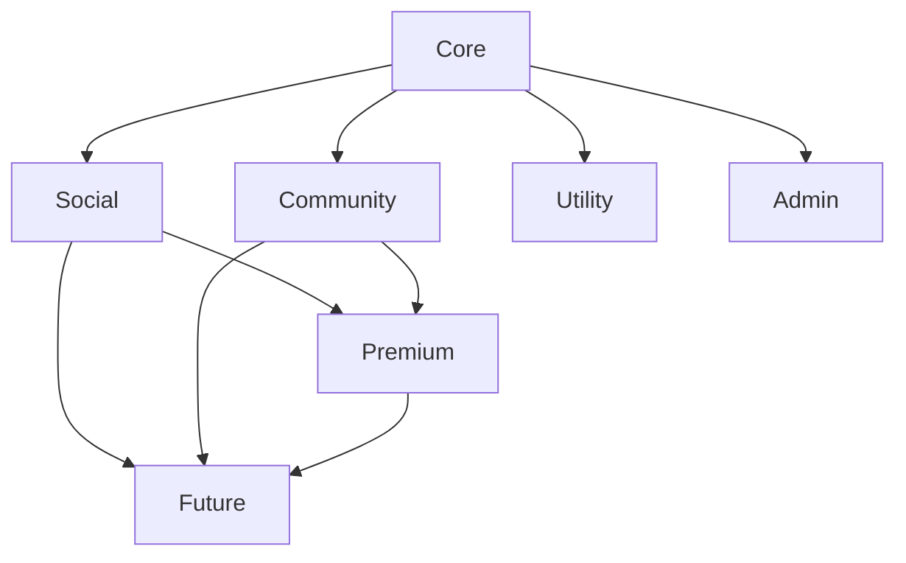
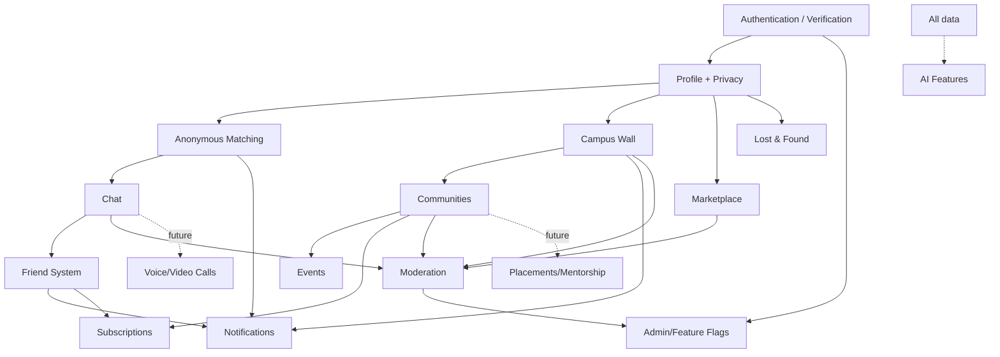

# Campusly V2 — Feature Matrix

> **Document type:** Master feature inventory
> **Product:** Campusly V2 (formerly PU Chat)
> **Status:** Authoritative v1.0
> **Authority:** Every future API, database table, Socket.IO event, UI screen, permission, and engineering task MUST map back to a feature defined here. If it isn't in this document, it isn't built.
> **Companion documents:** `PRODUCT_REQUIREMENTS.md`, `PROJECT_VISION.md`, `ARCHITECTURE.md`, `DATABASE_SCHEMA.md`, `TECH_STACK.md`

**Legend — Priority:** `P0` MVP-required · `P1` launch-ready · `P2` growth · `P3` future vision.
**Legend — Status:** `Planned` · `In Progress` · `Future` (reserved, not yet scheduled).
**Legend — Roles:** Student (S), Community Moderator (CM), Club Admin (CA), Platform Moderator (M), Admin (A).

---

## 1. Feature Classification

Features are grouped by the role they play in the product, not by technical module. Each class answers a different product question.

| Class | Question it answers | Example features |
|-------|--------------------|------------------|
| **Core** | Can a verified student get in and use the basics? | Auth, verification, profile, session management |
| **Social** | Can students connect and converse? | Anonymous matching, chat, friends, voice messages |
| **Community** | Can students belong to groups and campus life? | Campus wall, communities, events |
| **Utility** | Does the platform solve daily campus needs? | Marketplace, lost & found, notifications, search |
| **Premium** | How does the platform sustain itself? | Subscription plans, enhanced limits, priority access |
| **Admin** | Can we keep it safe and operate it? | Moderation, dashboard, feature flags, analytics |
| **Future** | Where does it grow next? | Voice/video calls, AI, placements, mentorship |

---

## 2. Feature Matrix

The master table. Each row is a feature with its purpose, priority, roles, dependencies, status, and future direction. Module-level detail follows in §3–§16.

| Feature | Purpose | Priority | Roles | Dependencies | Status | Future Expansion |
|---------|---------|----------|-------|--------------|--------|------------------|
| Google Login | Verified entry | P0 | S,A | — | Planned | More providers, MFA |
| Student Verification | Confirm real students | P0 | S | Google Login | Planned | Institutional partnerships |
| Profile Creation | Establish identity | P0 | S | Verification | Planned | Headline, social links |
| Session Management | Stay signed in securely | P0 | All | Google Login | Planned | Device management |
| Account Deletion | Privacy/right-to-delete | P0 | S,A | Profile | Planned | Self-serve export |
| Avatar / Bio / Interests | Personalize profile | P1 | S | Profile | Planned | Verified badges |
| Privacy Settings | Control visibility | P0 | S | Profile | Planned | Per-module granularity |
| Online Status | Presence | P1 | S | Session, Privacy | Planned | Activity status |
| Anonymous Matching | Reduce loneliness | P0 | S | Profile | Planned | AI smart matching |
| End / Skip Session | Control matching | P0 | S | Matching | Planned | Re-match prefs |
| Report User (session) | Safety in anon chat | P0 | S,M | Matching, Moderation | Planned | AI abuse detection |
| Text Messages | Core communication | P0 | S | Matching/Friends | Planned | Threads, edits |
| Read Receipts / Typing | Conversation feedback | P1 | S | Chat, Privacy | Planned | Per-chat controls |
| Voice Messages | Richer expression | P1 | S | Chat, Media | Planned | Transcription |
| Temporary Photos/Videos | Ephemeral sharing | P1 | S | Chat, Media | Planned | Configurable windows |
| Media Expiration (48h) | Privacy promise | P1 | S | Media | Planned | Per-type windows |
| Friend Requests | Form relationships | P0 | S | Profile | Planned | Request notes |
| Accept / Reject | Decide relationships | P0 | S | Friend Requests | Planned | — |
| Friend Chat | Persistent relationships | P0 | S | Friends, Chat | Planned | Close friends |
| Block User | Strongest safety control | P0 | S | Friends | Planned | Device-level |
| Remove Friend | Manage relationships | P1 | S | Friends | Planned | — |
| Create Post | Public expression | P0 | S | Profile | Planned | Rich media |
| Anonymous Post | Honest expression | P0 | S | Create Post | Planned | — |
| Replies / Reactions | Engagement | P0 | S | Create Post | Planned | More reaction types |
| Bookmarks | Save content | P2 | S | Create Post | Planned | Folders |
| Categories / Tags | Organize wall | P1 | S | Create Post | Planned | Tag following |
| Wall Search | Discovery | P1 | S | Create Post | Planned | Full search engine |
| Trending | Surface activity | P2 | S | Reactions, Replies | Planned | Personalized |
| Report Content | Safety | P0 | S,M | Moderation | Planned | AI triage |
| Join / Leave Community | Belong to groups | P1 | S | Profile | Planned | Cross-campus |
| Community Feed | Group discussion | P1 | S,CM | Communities | Planned | Rich posts |
| Community Moderators | Self-governance | P1 | CM,A | Communities, Moderation | Planned | Custom roles |
| Community Events | Group events | P2 | S,CA | Communities, Events | Planned | Ticketing |
| Create Event / RSVP | Campus events | P2 | S,CA | Profile | Planned | Check-in, recurring |
| Event Reminders | Drive attendance | P2 | S | Events, Notifications | Planned | Smart timing |
| Create / Browse Listing | Student commerce | P2 | S | Profile | Planned | On-platform payments |
| Favorites / Report Listing | Save & safety | P2 | S,M | Marketplace | Planned | Price alerts |
| Report Lost/Found, Claim | Recover items | P2 | S | Profile | Planned | Map, photo proof |
| Notifications | Re-engagement | P0 | S | relevant features | Planned | Push |
| Notification Preferences | Respect attention | P1 | S | Notifications | Planned | Granular muting |
| Premium Plans | Revenue | P2 | S,A | Subscription | Planned | Tiers, regional pricing |
| Free Trial | Conversion | P2 | S | Premium Plans | Planned | — |
| Payment Verification | Reliable billing | P2 | S,A | Premium Plans | Planned | Invoices, coupons |
| Subscription Status | Gate features | P2 | S,A | Premium Plans | Planned | — |
| Admin Dashboard | Operate platform | P0 | M,A | — | Planned | Richer analytics |
| User Management | Govern users | P0 | A | Auth | Planned | Bulk actions |
| Moderation Tools | Safety backbone | P0 | M,A | Reports | Planned | AI assist |
| Announcements | Communicate | P1 | A | — | Planned | Targeting |
| Feature Flags | Safe rollout | P0 | A | — | Planned | % rollouts, A/B |
| Analytics | Measure success | P1 | A | All | Planned | Cohorts, warehouse |
| Voice / Video Calls | Real-time richer comms | P3 | S | Friends, Chat | Future | Voice rooms |
| AI Assistant / Moderation | Intelligence | P3 | S,M | data density | Future | Discovery, study help |
| Placement Portal | Career value | P3 | S | Communities, Profile | Future | Referrals |
| Study Groups | Collaboration | P3 | S | Communities | Future | Skill matching |
| Mentorship | Senior-junior guidance | P3 | S | Profile graph | Future | Structured programs |
| Club Verification | Trusted orgs | P3 | CA,A | Communities | Future | Advanced tooling |
| Campus Ambassador | Growth program | P3 | S,A | Analytics | Future | Referral economy |

---

## 3. Authentication Module

| Feature | Definition | Priority | Roles |
|---------|-----------|----------|-------|
| Google Login | One-tap sign-in via institutional Google account | P0 | S,A |
| Student Verification | Eligibility confirmed by recognized institutional email domain; binds user to one campus | P0 | S |
| Profile Creation | First-run capture of name, avatar, bio; branch/year seeded | P0 | S |
| Session Management | JWT access + rotating refresh tokens; validated on REST and sockets; logout | P0 | All |
| Account Deletion | Self-serve deactivation; PII purge after grace window; tombstone for integrity | P0 | S,A |

**Why it leads.** Nothing else is reachable without verified identity. This module is the trust gate and the precondition for accountable anonymity.

---

## 4. User Profile Module

| Feature | Definition | Priority | Roles |
|---------|-----------|----------|-------|
| Profile | Verified identity record (university, branch, year + editable fields) | P0 | S |
| Avatar | Profile image stored in object storage | P1 | S |
| Bio | Short, moderated free-text intro | P1 | S |
| Interests | Tag-based interests powering discovery/matching | P1 | S |
| Privacy Settings | Controls for visibility, presence, receipts, request permissions | P0 | S |
| Online Status | Presence/last-seen, privacy-gated | P1 | S |

**Why.** The profile is the basis of friendships, networking, and trust. Privacy settings are P0 because Privacy by Design is non-negotiable from day one.

---

## 5. Anonymous Matching Module

| Feature | Definition | Priority | Roles |
|---------|-----------|----------|-------|
| Join Queue | Enter server-authoritative matching queue | P0 | S |
| Leave Queue | Cancel waiting | P0 | S |
| Match Found | Receive real-time pairing + session | P0 | S |
| Skip | Leave current match, optionally re-queue | P1 | S |
| End Session | Terminate anonymous chat | P0 | S |
| Report User | Flag abuse (verified identity recoverable by mods) | P0 | S,M |

**Why.** Matching is the signature acquisition hook. Server authority and transactional sessions are mandatory (the V1 race-condition fix). Report is P0 — anonymity ships only with accountability.

---

## 6. Chat Module

| Feature | Definition | Priority | Roles |
|---------|-----------|----------|-------|
| Text Messages | Real-time, persisted messages (sessions + friends) | P0 | S |
| Voice Messages | Recorded audio via object storage; metadata over sockets | P1 | S |
| Temporary Photos | Ephemeral image sharing | P1 | S |
| Temporary Videos | Ephemeral video sharing | P1 | S |
| Typing Indicator | Ephemeral typing signal | P1 | S |
| Read Receipts | Read state, privacy-gated | P1 | S |
| Online Status | Presence in chat | P1 | S |
| Media Expiration (48h) | Auto-delete temporary media after window | P1 | S |

**Why.** Text is P0 (core communication for both matching and friends). Media/voice/receipts are P1 — they deepen engagement but aren't required to prove the core loop.

---

## 7. Friend System Module

| Feature | Definition | Priority | Roles |
|---------|-----------|----------|-------|
| Friend Requests | Send a request (from session, profile, community) | P0 | S |
| Accept / Reject | Decide a request; acceptance reveals identity | P0 | S |
| Friend Chat | Persistent 1:1 chat independent of sessions | P0 | S |
| Block User | Remove + prevent all future contact/matching | P0 | S |
| Remove Friend | End a friendship | P1 | S |

**Why.** Friends are the retention engine — the line attached to the matching hook. Block is P0 safety.

---

## 8. Campus Wall Module

| Feature | Definition | Priority | Roles |
|---------|-----------|----------|-------|
| Create Post | Named or anonymous campus-scoped post | P0 | S |
| Anonymous Post | Post with hidden identity (author retained internally) | P0 | S |
| Replies | Threaded responses | P0 | S |
| Reactions | Lightweight engagement | P0 | S |
| Bookmarks | Private saved posts | P2 | S |
| Categories | Organize post types | P1 | S |
| Search | Find wall content | P1 | S |
| Trending | Time-decayed popular content | P2 | S |
| Reports | Flag content | P0 | S,M |

**Why.** The wall is the public square that gives the network daily utility and a shared identity beyond 1:1 chat.

---

## 9. Communities Module

| Feature | Definition | Priority | Roles |
|---------|-----------|----------|-------|
| Join Community | Become a member (open/request/invite) | P1 | S |
| Leave Community | Exit a community | P1 | S |
| Community Feed | Group-scoped posts and discussion | P1 | S,CM |
| Community Events | Events owned by a community | P2 | S,CA |
| Moderators | Role-based community self-governance | P1 | CM,A |

**Why.** Communities mark the shift from a chat app to a campus platform. P1 — they follow the proven core loop.

---

## 10. Events Module

| Feature | Definition | Priority | Roles |
|---------|-----------|----------|-------|
| Create Event | Event with time, location, capacity | P2 | S,CA |
| RSVP | "Going" with capacity/waitlist | P2 | S |
| Interested | Soft signal of interest | P2 | S |
| Reminders | Pre-event notifications | P2 | S |

**Why.** Events are concrete campus utility (P2 growth) built on communities + notifications.

---

## 11. Marketplace Module

| Feature | Definition | Priority | Roles |
|---------|-----------|----------|-------|
| Create Listing | List an item (image, price, description) | P2 | S |
| Browse Listings | Campus-scoped browse/filter | P2 | S |
| Favorites | Save listings | P2 | S |
| Report Listing | Flag prohibited items | P2 | S,M |

**Why.** Daily utility that builds habit (P2). V1 commerce is contact-to-transact; on-platform payments are P3.

---

## 12. Lost & Found Module

| Feature | Definition | Priority | Roles |
|---------|-----------|----------|-------|
| Report Lost Item | Post a lost item | P2 | S |
| Report Found Item | Post a found item | P2 | S |
| Claim Item | Claim with verification before contact | P2 | S |

**Why.** Simple, high-utility board (P2) that reinforces habitual use.

---

## 13. Notifications Module

| Feature | Definition | Priority | Roles |
|---------|-----------|----------|-------|
| Friend Requests | Alert on incoming requests | P0 | S |
| Matches | Alert on match found | P0 | S |
| Replies / Mentions | Alert on wall/community activity | P1 | S |
| Announcements | System/admin messages | P1 | S |
| Subscription Updates | Billing/status alerts | P2 | S |
| Notification Preferences | Per-type/channel controls | P1 | S |

**Why.** Core re-engagement. Request/match alerts are P0 (they close the social loop); others are P1–P2.

---

## 14. Subscription Module

| Feature | Definition | Priority | Roles |
|---------|-----------|----------|-------|
| Premium Plans | Free vs. premium tiers with feature gates | P2 | S,A |
| Free Trial | Time-limited premium access | P2 | S |
| Payment Verification | Reliable, idempotent billing | P2 | S,A |
| Subscription Status | Authoritative entitlement state | P2 | S,A |

**Why.** Monetization (P2) follows engagement and retention. The free core must stay genuinely valuable (Student First).

---

## 15. Admin Features Module

| Feature | Definition | Priority | Roles |
|---------|-----------|----------|-------|
| Dashboard | Operations and health overview | P0 | M,A |
| User Management | Search, restrict, ban, role-assign | P0 | A |
| Reports / Moderation | Queues + hide/restrict/ban + audit | P0 | M,A |
| Announcements | Platform/campus messaging | P1 | A |
| Feature Flags | Safe rollout + emergency disable | P0 | A |
| Analytics | Metric dashboards | P1 | A |

**Why.** Moderation and core admin are P0 — safety tooling ships before the surfaces it protects. Analytics/announcements are P1.

---

## 16. Future Features

Clearly marked **Future** — reserved in architecture/schema, not yet scheduled. Built only when their trigger and the prerequisite trust/density exist.

| Feature | Definition | Priority | Trigger |
|---------|-----------|----------|---------|
| Voice Calls | WebRTC P2P audio, Socket.IO signaling | P3 | Stable realtime + demand |
| Video Calls | WebRTC video on same foundation | P3 | After voice |
| AI Campus Assistant | Discovery, summarization, study help | P3 | Data density + clear value |
| AI Moderation | Automated abuse triage assisting humans | P3 | Moderation load |
| Placement Portal | Interview prep, referrals, career communities | P3 | Engaged senior base |
| Study Groups | Find collaborators by skill/course | P3 | Community maturity |
| Marketplace Payments | On-platform transactions | P3 | Marketplace traction |
| Mentorship | Structured senior-junior guidance | P3 | Profile graph density |
| Club Verification | Official org status + tooling | P3 | Active clubs |
| Campus Ambassador | Referral/growth program | P3 | Multi-campus expansion |

---

## 17. Feature Dependencies

The build order is dictated by dependencies. The spine is **identity → profile → connection → relationships → community → utility → monetization**, with safety and notifications cutting across.

**Reading the map.** Moderation depends on the content surfaces it polices but must be *built alongside or before* them (safety-first). Notifications depend on the events that trigger them. Everything depends on Authentication.

---

## 18. Feature Prioritization

| Priority | Meaning | Features (summary) | Why |
|----------|---------|--------------------|-----|
| **P0 — MVP** | Required to prove the core loop safely | Auth, Verification, Profile, Privacy, Session, Account Deletion, Anonymous Matching, End/Report, Text Chat, Friend Requests/Accept/Friend Chat/Block, Create/Anonymous Post, Replies/Reactions, Report Content, Match/Request Notifications, Admin Dashboard, User Management, Moderation, Feature Flags | These deliver the four-pillar thesis (verified identity + anonymous chat + wall + friends) plus the safety tooling that must exist before any public surface. Without all of these, the product is either incomplete or unsafe. |
| **P1 — Launch Ready** | Makes the MVP polished and retention-worthy | Avatar/Bio/Interests, Online Status, Voice Messages, Temporary Media + Expiration, Typing/Read Receipts, Remove Friend, Categories, Wall Search, Communities (join/feed/mods), Notification Preferences, Announcements, Analytics | These elevate the MVP from functional to delightful and habit-forming — needed for a credible public launch, not for proving the loop. |
| **P2 — Growth** | Expands utility and revenue | Bookmarks, Trending, Events + Reminders, Marketplace, Lost & Found, Subscriptions (plans/trial/payment/status), Subscription notifications | Daily-utility and monetization surfaces that drive habit and sustainability once the core is loved. They assume a working, retained user base. |
| **P3 — Future Vision** | Long-horizon ecosystem | Voice/Video Calls, AI Assistant/Moderation, Placement Portal, Study Groups, Marketplace Payments, Mentorship, Club Verification, Campus Ambassador | High-value but dependent on trust, density, and data that only an established platform has. Built only when their triggers fire. |

**The discipline of priority.** A feature earns a lower number only if the product genuinely cannot prove or launch without it. Anything that can wait, waits — protecting focus and the small team's capacity (KISS/YAGNI applied to the roadmap).

---

## 19. Success Metrics

For each major feature: the primary KPI we optimize, a secondary KPI, the usage metric we watch, its retention impact, and its business value. The platform North Star is **Weekly Connected Students** (students with a meaningful interaction each week); these feature metrics roll up to it.

| Feature | Primary KPI | Secondary KPI | Usage Metric | Retention Impact | Business Value |
|---------|-------------|---------------|--------------|------------------|----------------|
| Authentication | Verified signup conversion | Verification success rate | New verified users/day | Foundational (gate) | Enables the entire trusted network |
| Profile | Profile completion rate | Avatar/bio fill rate | Profiles completed | Medium (identity → belonging) | Basis for networking/trust |
| Anonymous Matching | Matches completed | Median pairing time | Matches/day, queue depth | High (the hook) | Primary acquisition driver |
| Chat | Messages sent | Messages per session | DAU messaging | High (engagement core) | Core engagement surface |
| Voice/Temp Media | Voice/media messages sent | Media adoption rate | Media msgs/user | Medium-High (depth) | Differentiation, premium hook |
| Friend System | Match→friend conversion | Active friendships | Friend requests accepted | Very High (retention engine) | Turns acquisition into retention |
| Campus Wall | Posts + engagements | Replies/reactions per post | DAU on wall | High (daily habit) | Community vitality, stickiness |
| Communities | Communities joined | Active communities | Members per community | High (belonging) | Platform (not just chat) adoption |
| Events | Events created + RSVPs | RSVP→attend rate | Events/week | Medium (recurring reason to return) | Real campus utility |
| Marketplace | Listings created | Listing→contact rate | Active listings | Medium (utility habit) | Future payments revenue |
| Lost & Found | Items posted | Resolution rate | Posts/week | Low-Medium (utility) | Goodwill, habitual use |
| Notifications | Notification CTR | Opt-in rate | Notifications acted on | High (re-engagement) | Brings users back |
| Subscriptions | Subscription conversion | Trial→paid rate | Active subscribers | Medium (loyalty signal) | Primary revenue stream |
| Moderation | Time-to-resolution | Reports per 1k actions | Reports handled/day | Foundational (trust) | Protects the entire platform |
| Admin/Analytics | Operational coverage | Decision latency | Dashboards in use | Indirect | Enables informed operation |

---

## Closing Note

This document is the master feature inventory for Campusly V2. Every downstream artifact — API endpoints, database tables, Socket.IO events, UI screens, permissions, and engineering tasks — must trace to a feature defined here. If a proposed piece of work maps to no feature in this matrix, either the work is out of scope or this document must be updated first (with approval).

Priorities and statuses evolve as we learn; the classification, dependency order, and metric framework should remain stable. Where feature scope is unclear, `PRODUCT_REQUIREMENTS.md` decides; where priority conflicts arise, the prioritization discipline in §18 and the vision in `PROJECT_VISION.md` decide.

*— CPO, Principal Architect, Lead Backend, Lead Frontend & QA Lead, Campusly V2*
