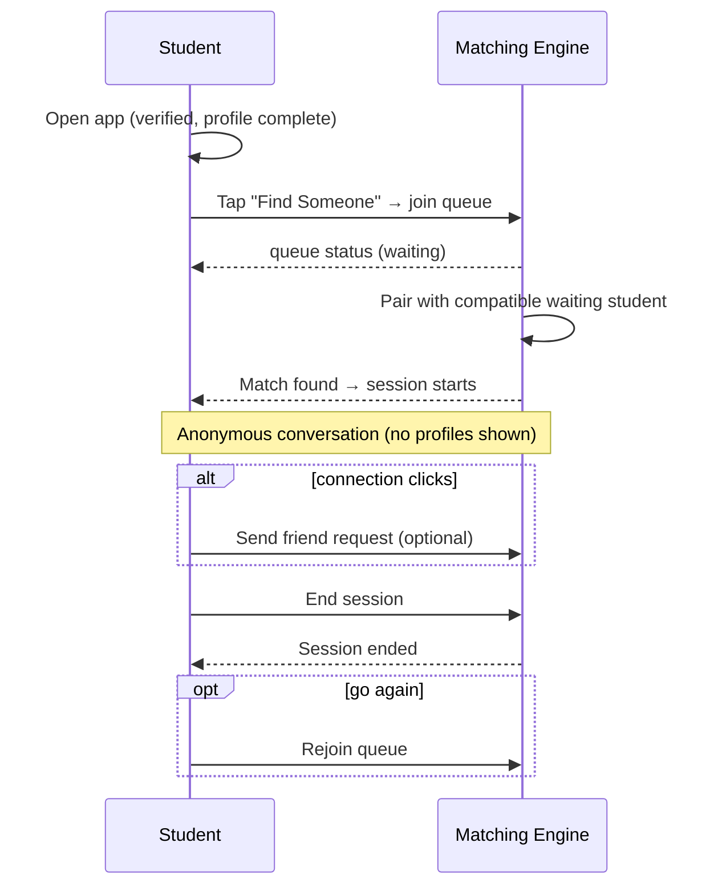
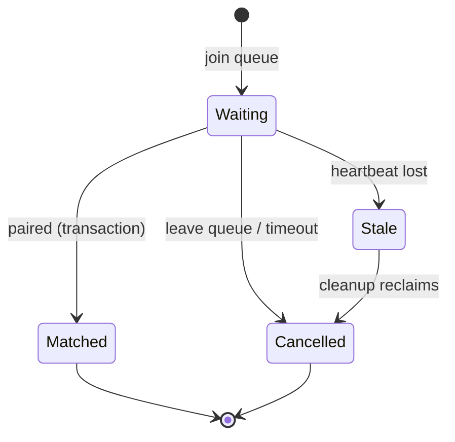
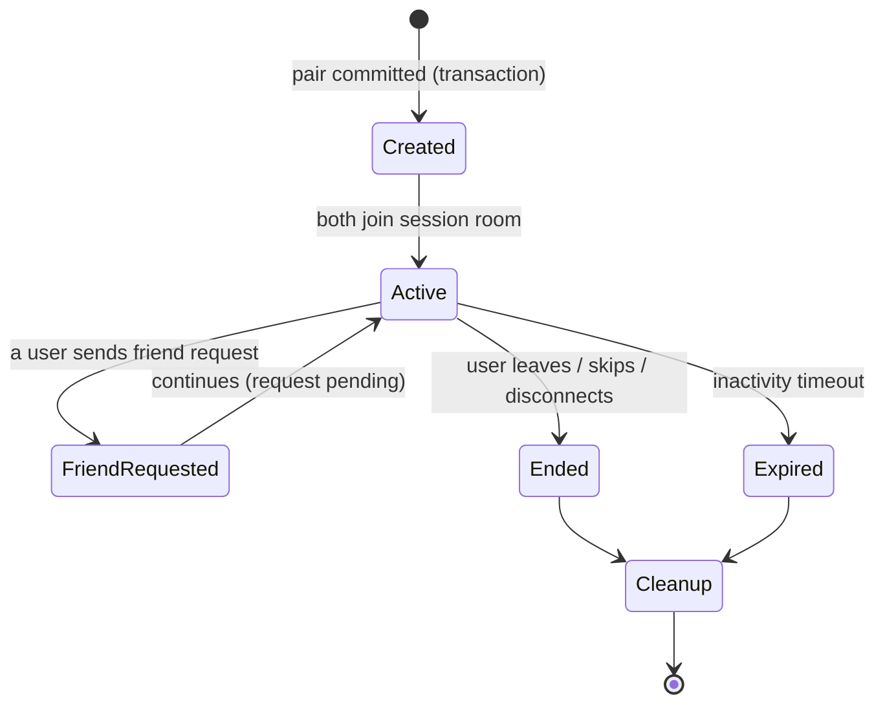

# Campusly V2 — Anonymous Matching Engine

> **Document type:** Matching engine specification — single source of truth
> **Product:** Campusly V2 (formerly PU Chat)
> **Status:** Authoritative v1.0
> **Authority:** This is the definitive specification for how students discover each other through anonymous matching: pairing logic, queue management, session lifecycle, safety, scalability, and future expansion. All implementation MUST conform. It describes architecture and product behavior only — no code, schemas, or Socket.IO events.
> **Companion documents:** `ARCHITECTURE.md` §5 (matching flow), `SOCKET_EVENTS.md` §4 (match events), `DATABASE_SCHEMA.md` §7 (matching tables), `PRODUCT_REQUIREMENTS.md`, `PROJECT_VISION.md`

> **Scale target:** The architecture must carry growth from 100 to 100,000+ users **without redesign** — only additive infrastructure (e.g., Redis) as volume grows.

---

## Table of Contents
1. [Matching Philosophy](#1-matching-philosophy)
2. [User Journey](#2-user-journey)
3. [Matching Rules](#3-matching-rules)
4. [Matching Logic](#4-matching-logic)
5. [Queue Management](#5-queue-management)
6. [Session Lifecycle](#6-session-lifecycle)
7. [Safety & Moderation](#7-safety--moderation)
8. [Friend Transition](#8-friend-transition)
9. [Failure Handling](#9-failure-handling)
10. [Performance Strategy](#10-performance-strategy)
11. [Future Expansion](#11-future-expansion)
12. [Success Metrics](#12-success-metrics)
13. [Design Principles](#13-design-principles)

---

## 1. Matching Philosophy

### 1.1 Why anonymous matching exists
Anonymous matching is Campusly's signature feature and its primary acquisition hook. It exists to solve **isolation** — the loneliness of being surrounded by thousands of students yet feeling unseen (`PROJECT_VISION.md` §1). It manufactures the serendipitous "you just happen to meet someone" moment that crowded campuses promise but rarely deliver, with **zero social risk**: no profile to be judged on, no public rejection, no audience.

### 1.2 How it supports meaningful student connections
Matching is not the destination; it is the **doorway**. A good anonymous conversation can graduate into a friend request and a lasting friendship (§8) — converting a fleeting moment into a durable relationship. The hook brings students in; friendships keep them. This is the lesson that distinguishes Campusly from its origin as PU Chat: anonymous chat alone is not sticky, but anonymous chat **as an on-ramp to friendship and community** is.

### 1.3 How it differs from dating applications
Campusly is emphatically **not a dating app** (`PRODUCT_REQUIREMENTS.md`). Matching optimizes for **conversation and friendship**, not romantic pairing. There is no swiping on appearance, no romantic-intent signaling, no attractiveness ranking. The mechanics may superficially resemble random pairing, but the intent, incentives, and safety model are the inverse — verified students, accountable anonymity, and friendship as the goal.

### 1.4 Why Campusly prioritizes conversation over profiles
By hiding profiles during matching, Campusly removes the comparison and performance that poison profile-first products. Students connect through **what they say**, not how they look or how curated their profile is. This lowers the barrier for shy, new, and introverted students — exactly those who most need connection — and produces more authentic conversations. Profiles matter later (after a friendship forms); in matching, the conversation is everything.

---

## 2. User Journey

The complete journey from opening the app to returning to the queue.



**Prerequisites.** A user must be a **verified, active student with a completed profile** (`AUTH_SYSTEM.md`) before entering the queue. The journey is intentionally a loop: match → converse → end → (optionally befriend) → return — encouraging repeated, low-friction connection.

---

## 3. Matching Rules

The invariants that govern who can match and how, enforced **server-side** (the engine is the sole authority).

| Rule | Behavior | Reason |
|------|----------|--------|
| **Verified students only** | Only verified, active accounts may queue or match | Trust & safety foundation |
| **One active session at a time** | A user in a session cannot be matched again until it ends | Prevents fragmented/abusive parallel chats |
| **One queue entry at a time** | A user may hold only one queue entry | Fairness; prevents queue gaming |
| **Automatic cleanup** | Stale queue entries and abandoned sessions are reclaimed | Eliminates V1's ghost users/sessions |
| **Timeout behavior** | If no match within a wait window, the user is informed (match timeout) and may rejoin | Avoids indefinite, silent waiting |
| **Session duration policy** | Sessions have no hard cap by default but expire after inactivity; very long idle sessions are reclaimed | Frees resources; reflects real disengagement |
| **Skip behavior** | A user may leave the current match; both are released, and the skipper may rejoin the queue | User control without trapping either party |
| **Rejoin behavior** | After ending/skipping, a user may immediately rejoin; recent-pairing rules reduce immediate rematch with the same person | Fresh connections; avoids loops |

These rules directly remedy V1's failure modes (race conditions, ghost sessions, stale users) by centralizing authority and enforcing single-entry/single-session invariants transactionally (`ARCHITECTURE.md` §5).

---

## 4. Matching Logic

The high-level logic for choosing who pairs with whom. (No algorithms or code — behavior only.) The engine selects, from the pool of compatible waiting students, the best available partner, weighing the following factors:

| Factor | Role in matching |
|--------|------------------|
| **Availability** | Only `waiting`, live (heart-beating) users are eligible — the primary filter |
| **College/campus** | Matching is **campus-scoped by default** (`university_id`), preserving the local, trusted feel; cross-campus is a future option (§11) |
| **Preferences (future)** | Interest/branch/year/language preferences will refine selection once introduced; today matching is preference-light for speed and pool size |
| **Previous matches** | Recent pairings are de-prioritized to avoid immediately rematching the same person (uses match history) |
| **Blocking rules** | Blocked pairs are never matched, in either direction — a hard exclusion |
| **Connection quality (future)** | Signals like responsiveness may inform future quality-aware matching |
| **Fairness** | Longer-waiting users are favored (broadly FIFO) so no one is starved; subscription **priority** (future) is layered without violating baseline fairness |

**Guiding behavior.** The default logic prioritizes **fast, fair pairing within a campus** over sophisticated compatibility — at early scale, a larger eligible pool and low latency matter more than fine-grained matching. As the pool grows, preference- and interest-based refinement (§11) becomes valuable and is layered on without changing the core engine. Self-matching is impossible, and all exclusions (block, recent match, active session) are applied before selection.

---

## 5. Queue Management

The queue is the heart of the engine: fast in memory, durable in PostgreSQL for recovery.

### 5.1 Queue lifecycle & states



| State | Meaning |
|-------|---------|
| **Waiting** | Eligible and actively heart-beating; available for pairing |
| **Matched** | Paired into a session; removed from the waiting pool |
| **Cancelled** | Left voluntarily, timed out, or reclaimed |
| **Stale** | Heartbeat lost; pending cleanup |

### 5.2 Heartbeat & inactive removal
Each waiting (and in-session) client sends a periodic **heartbeat**. The engine tracks liveness; entries that stop heart-beating (closed app, network drop, crash) are marked **stale** and reclaimed by a cleanup pass. This is the definitive fix for V1's ghost users — a user who silently disappears no longer lingers in the pool.

### 5.3 Duplicate prevention
The single-queue-entry rule is enforced so a user cannot occupy multiple slots (which would be unfair and could cause double-matching). Attempting to join while already queued returns a conflict, not a second entry.

### 5.4 Reconnection behavior
On a brief disconnect/reconnect, the client re-authenticates and the engine reconciles: if the user's queue entry is still live (within the heartbeat grace window), they resume their place; if it was reclaimed, they rejoin cleanly. Persisted queue state (`DATABASE_SCHEMA.md` §7) makes this reconciliation possible across reconnects and restarts.

---

## 6. Session Lifecycle

A session is the anonymous conversation between a matched pair.



| Stage | What happens |
|-------|--------------|
| **Session Created** | Pairing + session creation occur in a single transaction; both users removed from the queue atomically (no ghost/duplicate sessions) |
| **Session Active** | Both participants join the session and converse anonymously; messages persist (`SOCKET_EVENTS.md` §5) |
| **Friend Request** | Either user may offer friendship during the session; the session continues while the request is pending (§8) |
| **Session Ended** | A user leaves/skips/disconnects; the other is notified; the session is marked ended |
| **Session Expired** | Prolonged inactivity expires the session automatically |
| **Session Cleanup** | A background pass closes abandoned sessions missed by real-time handling and reconciles state |

Crucially, **ending a session never affects a friendship** formed from it — sessions and friendships are independent contexts (`DATABASE_SCHEMA.md` §8).

---

## 7. Safety & Moderation

Matching is the riskiest surface (strangers, anonymity), so safety is built in, not bolted on. This is what makes Campusly's anonymity *accountable* rather than the lawless anonymity that destroyed comparable products.

| Control | Behavior |
|---------|----------|
| **Reporting** | Either participant can report the other during or after a session; the report carries the session context and the **verified identity** behind the anonymous partner (visible to moderators only) |
| **Blocking** | Blocking ends the session and permanently prevents future matching between the two users |
| **Spam prevention** | Message-flood limits and behavioral checks within sessions deter spam and harassment |
| **Rate limits** | Join/skip/rejoin actions are rate-limited to prevent queue abuse and rapid-cycling for harvesting partners |
| **Repeated abuse detection** | Patterns across `match_history` and reports (many reports, rapid skipping, repeated targeting) feed escalation |
| **Moderator review** | Reports enter the central moderation queue; moderators can resolve the verified author and apply graduated actions (warn → restrict → ban), all audit-logged (`DATABASE_SCHEMA.md` §15) |

The governing principle: **anonymity hides a student from their peers, never from accountability.**

---

## 8. Friend Transition

The bridge from a fleeting anonymous match to a durable relationship — the mechanism that converts the hook into retention.

```mermaid
sequenceDiagram
    participant A as User A (anon)
    participant S as Engine
    participant B as User B (anon)
    A->>S: Send friend request (during/after session)
    S-->>B: Friend request received (still anonymous)
    alt B accepts
        S-->>A: Accepted → identities revealed
        S-->>B: Accepted → identities revealed
        note over A,B: Persistent friend chat opens (independent of session)
    else B rejects / ignores
        S-->>A: No reveal; both remain anonymous
    end
```

- **Friend request flow.** Either participant may send a request; while pending, both remain anonymous.
- **Acceptance.** On acceptance, **identities are revealed to each other** and a persistent friend chat is created, independent of the (possibly already-ended) session.
- **Rejection / ignore.** No identity is revealed; the anonymous interaction simply ends. A rejection cooldown prevents repeated pressure.
- **Privacy considerations.** Identity reveal is **mutual and consensual** — it happens only on acceptance, never unilaterally. Declining is private and consequence-free.
- **Return to anonymous mode.** Ending the session or declining a request returns the user to fully anonymous standing; they can rejoin the queue and meet someone new.

Friend-state mechanics are owned by the Friend System; matching only initiates the request (`FEATURE_MATRIX.md` §7).

---

## 9. Failure Handling

The engine is designed to **fail gracefully and converge to a consistent state** — directly addressing V1's instability.

| Failure | Behavior |
|---------|----------|
| **User disconnects** | Heartbeat loss marks the queue entry/session participant stale; the partner is notified (`session_ended`); the slot is reclaimed |
| **Internet loss** | Treated as a disconnect with a short grace window; on quick reconnect the user resumes; otherwise their entry is reclaimed and they rejoin cleanly |
| **Server restart** | On startup, the engine reconciles in-memory queue/session state from persisted state + heartbeats: live users restored, stale ones purged, orphaned sessions closed — no manual intervention |
| **Queue recovery** | Persisted queue state (`DATABASE_SCHEMA.md` §7) is the recovery source of truth after any crash |
| **Duplicate sessions** | Impossible by design: pairing + session creation is transactional and both users are atomically removed from the queue, so no concurrent operation can double-match |
| **Expired sessions** | Inactivity expiry + a cleanup pass close sessions that were abandoned without an explicit end |

The defining contrast with V1: because matching authority is centralized and state is persisted, the system **self-heals** rather than accumulating ghosts and races.

---

## 10. Performance Strategy

The engine must pair students in well under a few seconds at the median while running cheaply on Oracle ARM Always Free.

| Strategy | Behavior |
|----------|----------|
| **Fast pairing** | The eligible waiting pool is held **in memory** for low-latency selection; pairing is an in-memory operation, not a heavy query |
| **Minimal database queries** | The DB is touched for durable transitions (session creation, history), not for every pairing scan; reads are index-backed and narrow |
| **In-memory queue** | The hot waiting pool lives in process memory for speed |
| **Database persistence** | Queue and session state are persisted for recovery and cross-process truth, decoupled from the hot path |
| **Future Redis support** | At scale, a **Redis-backed shared queue + Socket.IO Redis adapter** lets multiple engine instances share the pool and match across processes — introduced only when single-instance capacity is exceeded (`ARCHITECTURE.md` §12) |
| **Scaling considerations** | Campus scoping naturally partitions the pool; matching load is light per pairing; horizontal scale is additive (Redis + multiple instances + sticky sockets), never a redesign |

This is the **100 → 100,000 users without architectural change** guarantee: the same in-memory-hot / DB-durable model scales by adding Redis and instances when metrics justify it (KISS/YAGNI — nothing added early).

---

## 11. Future Expansion

The engine reserves clean extension points so richer matching is **additive**, not a rewrite. Most hook into the existing `preferences` and history structures (`DATABASE_SCHEMA.md` §7).

| Future capability | How it fits |
|-------------------|-------------|
| **Interest-based matching** | Weighted overlap of `user_interests` refines partner selection within the eligible pool |
| **Language preference** | A preference filter/weight added to selection |
| **Branch/year preference** | Optional filters/weights using existing profile data |
| **Voice matching** | An anonymous session escalates to voice via WebRTC signaling; engine reserves session-type metadata |
| **Video matching** | Same WebRTC foundation, adding video; gated and consent-based |
| **AI-assisted matching** | Compatibility scoring (interests, conversational style, history) layered as a selection scorer; privacy-respecting |
| **Cross-campus matching** | Relaxing the campus-scope filter as an explicit, opt-in mode |
| **Premium priority matching** | Subscription tier grants higher queue priority **without** starving free users (fairness floor preserved) |

Each is a refinement of **selection within the eligible pool** or an additive session capability — the core queue/session/safety architecture is unchanged.

---

## 12. Success Metrics

KPIs that tell us whether matching is delivering connection (rolling up to the platform North Star, *Weekly Connected Students*).

| Metric | Definition | Why it matters |
|--------|-----------|----------------|
| **Average wait time** | Median time from joining the queue to a match | Core experience quality; target sub-few-seconds with a healthy pool |
| **Successful matches** | Matches that produce a real conversation (beyond a trivial length) | Hook effectiveness |
| **Conversation completion rate** | Share of matches that reach a meaningful exchange vs. instant skips | Match quality |
| **Friend conversion rate** | Share of matches that become friendships | The key value-transfer metric (hook → retention) |
| **Report rate** | Reports per N matches | Safety health; should stay low |
| **Queue abandonment** | Share of users who leave the queue before matching | Signals wait-time or supply problems |
| **User satisfaction** | Post-session sentiment / re-queue rate | Whether students want to do it again |

**Health balance.** A great engine keeps **wait time low**, **conversation/friend conversion high**, and **report/abandonment low** simultaneously. Optimizing one at the expense of safety (e.g., faster matches by relaxing exclusions) is forbidden — safety is a constraint, not a tunable.

---

## 13. Design Principles

The guiding principles for the matching engine, consistent with `PROJECT_VISION.md` and `TECH_STACK.md`.

| Principle | Meaning |
|-----------|---------|
| **Simple** | The simplest pairing that works; richness added only when justified (KISS/YAGNI) |
| **Reliable** | Transactional, self-healing, no ghosts or duplicate sessions (the V1 fix) |
| **Scalable** | 100 → 100,000+ users by adding Redis/instances, never redesigning |
| **Fair** | Broadly FIFO; no user starved; priority layered without breaking the fairness floor |
| **Privacy-first** | No profiles in matching; identity revealed only by mutual consent; anonymity never leaks |
| **Student-focused** | Optimized for meaningful conversation and friendship, not engagement-for-its-own-sake |
| **No dark patterns** | No manipulative mechanics, no forced waiting, no artificial scarcity, no addictive loops |
| **Low latency** | Fast pairing is a first-class goal; the hot path stays in memory |

> When principles tension, resolve in the spirit: **safety and privacy > fairness > speed > sophistication.**

---

## Closing Note

This document is the official specification for Campusly's anonymous matching engine. It defines a system that is **fast, fair, scalable, safe, low-latency, and abuse-resistant** — server-authoritative, transactional, in-memory-hot and DB-durable, campus-scoped, and built to grow from 100 to 100,000+ students without architectural change.

It references rather than repeats the matching flow (`ARCHITECTURE.md` §5), realtime events (`SOCKET_EVENTS.md` §4), and data model (`DATABASE_SCHEMA.md` §7). Where matching behavior is unclear, this document decides; where it intersects safety, `SECURITY.md` and the Moderation module govern; where it intersects product intent, `PRODUCT_REQUIREMENTS.md` and `PROJECT_VISION.md` decide. No change to the matching engine ships without approval and an update here.

*— Principal Backend Architect, Realtime Systems Engineer, Product Architect & AI Systems Designer, Campusly V2*
