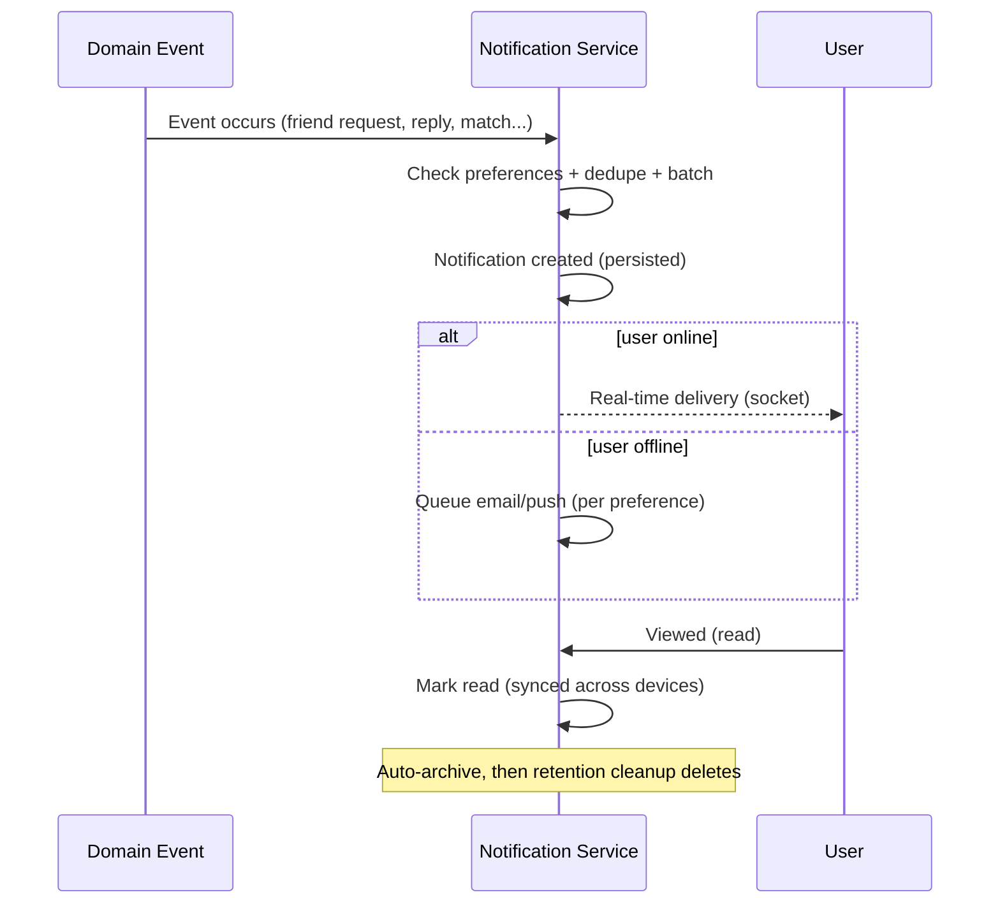

# Campusly V2 — Notification System

> **Document type:** Notification specification — single source of truth
> **Product:** Campusly V2 (formerly PU Chat)
> **Status:** Authoritative v1.0
> **Authority:** This is the definitive specification for all user notifications: categories, channels, lifecycle, preferences, priority, and delivery strategy. All implementation MUST conform. It covers notification behavior, UX, delivery strategy, and architecture only — no code, APIs, or schemas, and it does not repeat auth or messaging mechanics.
> **Companion documents:** `DATABASE_SCHEMA.md` §16 (notification tables), `SOCKET_EVENTS.md` §10 (notification events), `ADMIN_PANEL.md` §9 (announcements), `AUTH_SYSTEM.md` §9 (privacy), `PROJECT_VISION.md` §4–5

---

## Table of Contents
1. [Notification Philosophy](#1-notification-philosophy)
2. [Notification Categories](#2-notification-categories)
3. [Notification Channels](#3-notification-channels)
4. [Notification Lifecycle](#4-notification-lifecycle)
5. [User Preferences](#5-user-preferences)
6. [Real-Time Notifications](#6-real-time-notifications)
7. [Announcement System](#7-announcement-system)
8. [Notification Priority](#8-notification-priority)
9. [Notification History](#9-notification-history)
10. [Performance Strategy](#10-performance-strategy)
11. [Future Enhancements](#11-future-enhancements)
12. [Success Metrics](#12-success-metrics)
13. [Design Principles](#13-design-principles)

---

## 1. Notification Philosophy

### 1.1 Why notifications exist
Notifications connect students to what matters: a friend request, a reply, a match, an event. They are the platform's way of saying *"something relevant to you happened"* — pulling students back to genuine value, not manufactured noise.

### 1.2 Engagement vs. interruption
Campusly rejects the engagement-at-any-cost model that turns notifications into addictive interruptions (`PROJECT_VISION.md` §4.1, §5). A notification must earn its place by being **useful**, not merely attention-grabbing. We measure success by *relevant* engagement, never by how often we can interrupt a student.

### 1.3 Student-first communication
Notifications serve the student, not our metrics. They are timely, relevant, and respectful — the kind of nudge a thoughtful friend would send, never a manipulative ploy to maximize time-on-app.

### 1.4 Respecting user attention
A student's attention is a scarce, sacred resource. We protect it through batching, sensible defaults, granular preferences, and (future) quiet hours. The guiding test for every notification: *would the student be glad we sent this?* If not, we don't.

---

## 2. Notification Categories

Each category serves a distinct purpose; users can control them granularly (§5). Categories map to the notification type set (`DATABASE_SCHEMA.md` §16).

| Category | Purpose | Typical priority |
|----------|---------|------------------|
| **Friend Requests** | Someone wants to connect | High |
| **Friend Accepted** | Your request was accepted | High |
| **Anonymous Match** | A match was found | High |
| **New Message** | A friend/session message arrived | High |
| **Voice Message** | A voice message arrived | High |
| **Campus Wall Replies** | Someone replied to your post | Normal |
| **Reactions** | Your content received reactions | Low (batched) |
| **Community Activity** | Activity in your communities | Normal |
| **Marketplace Activity** | Interest in your listing / listing updates | Normal |
| **Lost & Found Updates** | A claim/response on your item | Normal |
| **Event Reminders** | An event you're attending is upcoming | Normal |
| **Subscription Updates** | Billing/status changes | Normal |
| **Admin Announcements** | Platform/campus communication | Normal–High |
| **Security Alerts** | Account/security-relevant events | Critical |

The highest-value re-engagement signals (requests, matches, messages) are High; passive social signals (reactions) are Low and batched; safety/security is Critical.

---

## 3. Notification Channels

Notifications are delivered across channels chosen by urgency, context, and user preference. (Realtime mechanics live in `SOCKET_EVENTS.md` §10; queueing in `DATABASE_SCHEMA.md` §16.3.)

| Channel | When to use | Notes |
|---------|-------------|-------|
| **In-App Notifications** | Always — the durable record of every notification | Persisted; visible in the notification center; survives offline |
| **Real-Time Socket Notifications** | When the user is online and the event is timely | Instant delivery to the user's personal room; updates UI live |
| **Email Notifications** | For important events when the user is offline, or per preference | Asynchronous via the notification queue; respects preferences |
| **Future Push Notifications** | Reserved — for timely re-engagement on mobile | Built on the device registry; preference-gated |

**Channel logic.** The in-app record is the always-on backbone. If the user is **online**, a real-time socket notification updates the UI instantly. If **offline**, important notifications fall back to email (and, in future, push). Channels are additive views of the same notification, not separate notifications — preventing duplication across devices/channels.

---

## 4. Notification Lifecycle

**Stages:** Event Occurs → Notification Created (after preference/dedupe/batch checks) → Delivery (real-time if online; queued email/push if offline) → Viewed (read state synced) → Archived → Deleted (by retention). A notification is generated only after passing preference and de-duplication checks, so users never receive muted or duplicate alerts.

---

## 5. User Preferences

Students control notifications granularly (stored per `DATABASE_SCHEMA.md` §16.2). Privacy by Design: defaults are sensible and respectful, and users can always dial down.

| Preference | Control |
|------------|---------|
| **Friend notifications** | Toggle requests/accepts |
| **Community notifications** | Toggle community activity |
| **Event reminders** | Toggle event reminders |
| **Marketplace notifications** | Toggle listing activity |
| **Email preferences** | Choose which categories may email |
| **Push preferences (future)** | Choose which categories may push |
| **Silent mode** | Temporarily mute all non-critical notifications |

**Behavior.** Preferences are per-category and per-channel, so a student can (for example) keep in-app reactions but disable reaction emails. **Silent mode** mutes everything except **Critical** (security) notifications, which always reach the user. Critical/security notifications cannot be fully disabled, for the user's protection.

---

## 6. Real-Time Notifications

Some events are time-sensitive and should reach an online user **instantly** via socket delivery to their personal room (`SOCKET_EVENTS.md` §10):

| Event | Why real-time |
|-------|---------------|
| **Friend Request** | Drives the social loop; timely response matters |
| **Match Found** | The match is live *now*; delay breaks the experience |
| **New Message** | Conversations are real-time by nature |
| **Voice Message** | Same immediacy as messages |
| **Admin Broadcast** | Announcements/emergencies need immediate reach |

For offline users, these same notifications persist (and fall back to email/push per preference), so nothing is lost — only the *delivery timing* differs by presence. Lower-priority events (reactions, non-urgent community activity) need not be real-time and may be batched.

---

## 7. Announcement System

Announcements are operator-originated notifications (authored in the Admin Panel — `ADMIN_PANEL.md` §9; data in `DATABASE_SCHEMA.md` §19.4).

| Type | Behavior |
|------|----------|
| **Global Announcements** | Delivered to all campuses |
| **Campus-specific Announcements** | Targeted to a single campus |
| **Scheduled Announcements** | Displayed within a set start/end window |
| **Emergency Notices** | Critical-priority, immediate, bypass batching (e.g., safety/outage) |

Announcements surface in-app and, by audience/priority, as notifications. Emergency notices are treated as Critical (§8) and reach users immediately regardless of normal batching (but still honor the platform's respect for attention by being rare and genuinely important).

---

## 8. Notification Priority

Priority governs how aggressively a notification is delivered and whether it can be muted/batched.

| Priority | Examples | Delivery behavior |
|----------|----------|-------------------|
| **Critical** | Security alerts, emergency notices | Immediate, all channels; cannot be muted; never batched |
| **High** | Friend request, match found, new message | Real-time if online; email/push fallback if offline |
| **Normal** | Wall replies, community/event/marketplace activity | Real-time if online; batched/digestible; email per preference |
| **Low** | Reactions, passive signals | Batched/summarized; minimal interruption; often in-app only |

**How priority affects delivery.** Higher priority means faster, more channels, and less batching. Lower priority means more batching and fewer channels, protecting attention. Critical is the only level that overrides silent mode and preferences — because it concerns the student's safety or account.

---

## 9. Notification History

Every notification is persisted, giving students a durable, cross-device record (`DATABASE_SCHEMA.md` §16).

| Capability | Behavior |
|------------|----------|
| **Recent Notifications** | A notification center listing recent items, newest first (cursor-paginated) |
| **Read Status** | Each notification tracks read/unread; unread drives badge counts |
| **Mark All Read** | One action clears the unread state across the list |
| **Auto Cleanup** | Old/read notifications are pruned by a retention job |
| **Retention Policy** | Read notifications pruned sooner; unread kept longer; all bounded (`DATABASE_SCHEMA.md` §23) |

Read state syncs across a user's devices, so reading on one device clears the badge everywhere. History is bounded by retention so the table stays lean at scale.

---

## 10. Performance Strategy

Notifications are high-volume; the system is engineered to stay fast and respectful without overwhelming users or infrastructure.

| Strategy | Behavior |
|----------|----------|
| **Batching** | Low-priority signals (reactions, similar events) are grouped into a single summarized notification ("5 people reacted") rather than many |
| **Rate limiting** | Per-user notification rate caps prevent floods (e.g., a viral post does not generate hundreds of separate alerts) |
| **Duplicate prevention** | De-duplication ensures one notification per meaningful event, not repeats across channels/devices |
| **Lazy loading** | The notification center loads incrementally as the user scrolls |
| **Pagination** | Cursor-based pagination over the (growing) notification history (`DATABASE_SCHEMA.md` §22) |

The asynchronous channels (email/future push) flow through a **queue** (`DATABASE_SCHEMA.md` §16.3) that supports retries and rate control, decoupling generation from delivery — and migrating cleanly to a real message queue at scale (`ARCHITECTURE.md` §12).

---

## 11. Future Enhancements

Reserved, clearly **future** — additive over the existing model.

| Enhancement | Description |
|-------------|-------------|
| **Push Notifications** | Mobile push via the device registry, preference-gated |
| **AI Notification Summary** | Summarize many notifications into a concise digest |
| **Smart Digest** | A periodic roundup of what a student missed |
| **Quiet Hours** | User-defined do-not-disturb windows (non-critical suppressed) |
| **Rich Notifications** | Media/action-rich notifications (e.g., inline reply) |
| **Notification Scheduling** | Deliver at optimal times per user |
| **Cross-device Sync** | Fully synchronized read/dismiss state across all devices |

Each builds on the existing notification record, preferences, and queue — none requires redesigning the system. (Quiet hours and cross-device sync already have reserved hooks in preferences and read-state.)

---

## 12. Success Metrics

KPIs measuring whether notifications are helpful rather than intrusive.

| Metric | Definition | Why it matters |
|--------|-----------|----------------|
| **Delivery Rate** | Share of notifications successfully delivered | Reliability of the pipeline |
| **Open Rate** | Share of notifications that lead to app opens | Relevance and timeliness |
| **Read Rate** | Share of notifications read | Whether content is worth attention |
| **Click-through Rate** | Share acted upon (tap → destination) | Usefulness of the notification |
| **User Preference Adoption** | Share of users customizing preferences | Healthy control (heavy muting signals over-notification) |
| **Notification Volume** | Notifications per user per period | Attention-respect guardrail (too high = noise) |
| **Engagement Impact** | Lift in meaningful engagement attributable to notifications | The real goal — relevant re-engagement |

**Health balance.** Good notifications show **high read/click-through with controlled volume and low opt-out/mute rates**. Rising mute rates or falling read rates are warning signs of over-notification — we would *reduce* volume, not push harder. Notifications serve the student.

---

## 13. Design Principles

The guiding principles for notifications, consistent with `PROJECT_VISION.md`.

| Principle | Meaning |
|-----------|---------|
| **Useful over frequent** | Every notification earns its place by relevance; we send fewer, better notifications |
| **Timely delivery** | Time-sensitive events reach online users instantly; others can wait/batch |
| **User control** | Granular per-category, per-channel preferences and silent mode |
| **Privacy first** | Notifications never leak private content inappropriately; respect anonymity and visibility settings |
| **Minimal interruption** | Batching, rate limits, and (future) quiet hours protect attention |
| **Consistent experience** | Uniform behavior and appearance across channels and devices |
| **Scalable architecture** | Persist-then-deliver, queued async channels, ready to scale with the platform |

> When principles tension, resolve in the spirit: **privacy and user control > usefulness > timeliness > volume.**

---

## Closing Note

This document is the official notification specification for Campusly V2. It defines a system that is **helpful, non-intrusive, real-time where appropriate, scalable, configurable, and privacy-first** — designed to increase *relevant* engagement without ever overwhelming students or treating their attention as inventory to be exploited.

It references rather than repeats the notification data model (`DATABASE_SCHEMA.md` §16), realtime delivery (`SOCKET_EVENTS.md` §10), announcements (`ADMIN_PANEL.md` §9), and privacy model (`AUTH_SYSTEM.md` §9). Where notification behavior is unclear, this document decides; where it intersects product intent, `PRODUCT_REQUIREMENTS.md` and `PROJECT_VISION.md` decide. No change to the notification system ships without approval and an update here.

*— Principal Platform Architect, Senior Backend Engineer, Product Designer & Notification Systems Expert, Campusly V2*
