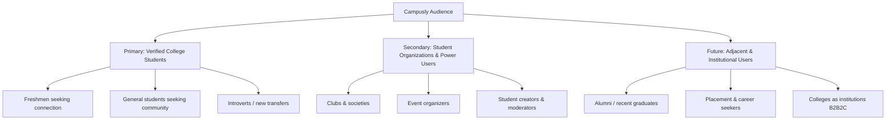
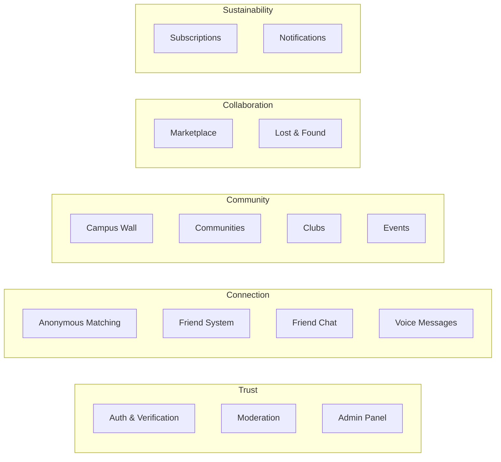
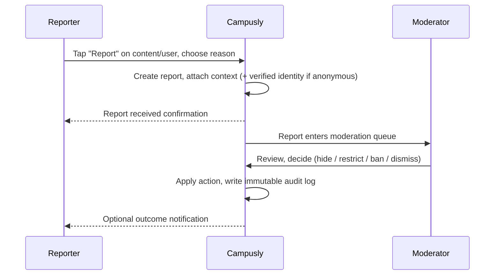
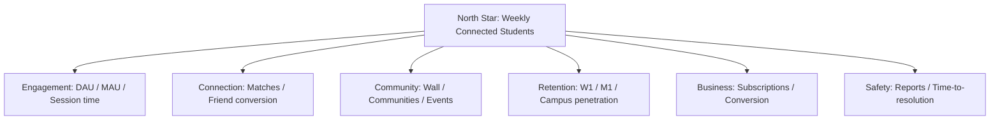
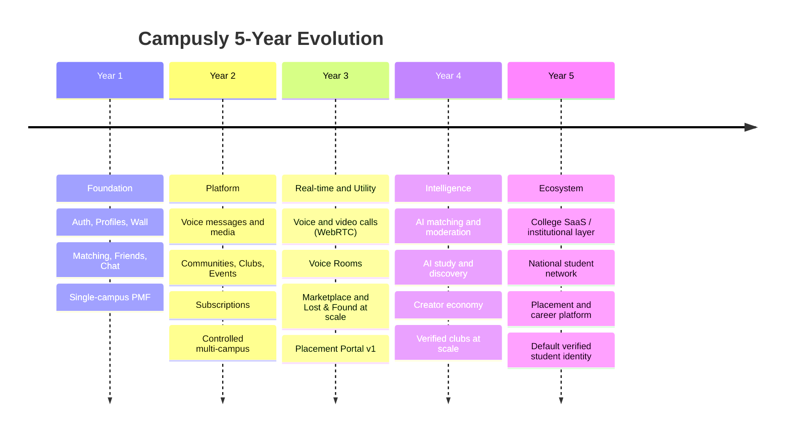
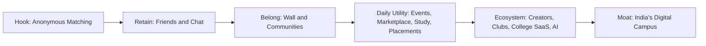

# Campusly — Product Requirements Document (PRD)

> **Document type:** Master Product Requirements Document
> **Product:** Campusly (formerly PU Chat)
> **Status:** Draft v1.0 — foundational reference
> **Audience:** Founders, investors, product, engineering, design, and operations
> **Owner:** Founding team (CEO / PM / Architect / UX / Engineering Manager)
> **Companion documents:** `PROJECT_VISION.md`, `TECH_STACK.md`, `DATABASE_SCHEMA.md`, `API_SPEC.md`, `SOCKET_EVENTS.md`, `SECURITY.md`, `UI_GUIDELINES.md`

---

## Table of Contents

1. [Executive Summary](#1-executive-summary)
2. [Product Vision](#2-product-vision)
3. [Mission](#3-mission)
4. [Problem Statement](#4-problem-statement)
5. [Goals](#5-goals)
6. [Product Principles](#6-product-principles)
7. [Target Audience & Personas](#7-target-audience--personas)
8. [Core Features](#8-core-features)
9. [Functional Requirements](#9-functional-requirements)
10. [Non-Functional Requirements](#10-non-functional-requirements)
11. [User Journeys](#11-user-journeys)
12. [Product Success Metrics](#12-product-success-metrics)
13. [Product Constraints](#13-product-constraints)
14. [Future Vision (5-Year Horizon)](#14-future-vision-5-year-horizon)
15. [Appendix: Glossary & Assumptions](#15-appendix-glossary--assumptions)

---

## 1. Executive Summary

Campusly is a **verified student social platform** built exclusively for college students. It is **not** a generic messaging app, **not** a dating app, and **not** an Omegle-style anonymous chat clone. Those framings undersell the product and attract the wrong users. Campusly is a closed, identity-verified social layer that sits on top of real campuses, where every participant is a confirmed student and every interaction — anonymous or named — happens inside a trusted boundary.

The product began life as **PU Chat**, an anonymous communication tool restricted to a single university. That first version proved a critical lesson: anonymous chat alone is not sticky. Users came for novelty and left within days because there was nothing to return to — no identity, no community, no relationships, no reason to come back tomorrow. The strongest, most defensible value emerges when four things are combined into a single experience: **verified student identity + anonymous conversation + public campus community + persistent friendships.** Each pillar reinforces the others. Verification creates trust. Anonymity lowers the barrier to honest expression. The community wall creates a shared public square. Friendships convert fleeting interactions into lasting relationships and give users a reason to return.

Campusly V2 is a ground-up rebuild on a modern, cost-efficient, self-owned stack — Next.js + TypeScript on the frontend, Node.js + Express + TypeScript on the backend, PostgreSQL for durable data, Socket.IO for realtime, Google OAuth for identity, and Oracle Cloud ARM (Always Free tier) for hosting with Oracle Object Storage for media. This stack was chosen deliberately to escape the runaway read/write costs, rules complexity, and vendor lock-in that constrained V1.

The long-term ambition is large: to become **India's digital campus** — the default verified social and collaboration layer for higher education. Anonymous matching is the hook. The destination is an ecosystem spanning communities, clubs, events, study groups, a student marketplace, lost & found, placements, voice rooms, and eventually AI-assisted campus experiences. This document defines what Campusly is, who it serves, the problems it solves, the principles that govern every decision, and the features and requirements that an engineering team can build against before a single line of product code is written.

This PRD is intentionally comprehensive. It is the foundation document referenced by every downstream artifact — architecture, database schema, API spec, socket event contracts, security model, and UI guidelines. Where this document and a downstream document disagree, the resolution process is: clarify intent here first, then propagate the decision outward.

---

## 2. Product Vision

> **To build India's digital campus — a verified, trusted, student-only social platform where every college student can connect, communicate, collaborate, and build meaningful relationships throughout their academic life and beyond.**

Campusly's vision rests on a simple observation: a college campus is one of the densest, highest-trust social networks a person will ever belong to, yet students experience it through fragmented, hostile, or ill-fitting tools. Group chats sprawl across WhatsApp. Confessions hide on unverified Instagram pages run by anonymous admins. Club announcements get lost in noise. Notes circulate through screenshots. There is no single, trusted, student-owned space that mirrors the real campus.

We envision Campusly as that space — a **persistent digital twin of campus life**. In the near term it is where students go to meet new people safely (anonymous matching), to keep up with what's happening (campus wall), and to maintain relationships (friends and chat). Over time it grows into the operating system of student life: where clubs run their membership and events, where study groups form, where lost items are found, where second-hand textbooks and cycles change hands, where placement prep happens, and where the next generation of campus communities is born.

The vision is **multi-campus by design but single-campus in feeling.** Each student experiences their own campus as an intimate, trusted community, while the platform quietly connects thousands of campuses into a national network. This dual nature — local intimacy, national scale — is the core of the long-term moat.

---

## 3. Mission

> **Give every verified college student a safe, beautiful, and genuinely useful place to be part of campus life — online.**

Our mission breaks down into four commitments:

| Commitment | What it means in practice |
|------------|---------------------------|
| **Verify trust** | Only real, verified students get in. Identity is the foundation that makes everything else safe. |
| **Lower the barrier to connection** | Anonymity and thoughtful UX remove the social risk of reaching out, so shy and new students can participate. |
| **Build belonging** | Communities, the wall, and friendships convert one-off interactions into a sense of belonging that brings users back. |
| **Respect the student** | Privacy-first defaults, transparent moderation, no dark patterns, no selling of personal data. Students are the customer, never the product. |

The mission is the test we apply to every feature request: *Does this make a verified student's campus life safer, more connected, or more useful?* If not, it does not ship.

---

## 4. Problem Statement

College students in India (and globally) face a cluster of related problems that no existing product solves well together. Each subsection below describes a distinct problem, why it matters, and how Campusly addresses it. The reasoning is important: these problems are *why the product exists*, and every core feature traces back to one or more of them.

### 4.1 Fragmented and untrustworthy campus communication

Today, campus communication is scattered across WhatsApp groups, Instagram pages, Telegram channels, college ERP portals, and email. None of these is student-verified, none is campus-scoped, and none is designed for the rhythms of student life. Important announcements compete with spam. There is no single source of truth for "what's happening on my campus right now."

**Why it matters:** Fragmentation creates information asymmetry. Well-connected students hear about opportunities, events, and resources; newcomers and introverts miss out. Communication tools that aren't verified are easily abused by outsiders, bots, and impersonators.

**How Campusly solves it:** A single, verified, campus-scoped **Campus Wall** plus structured **Communities** give every student one trusted place to see and share what matters, with the guarantee that everyone present is a real student of a real campus.

### 4.2 Social isolation and the loneliness of transition

Starting college — or transferring, or simply being introverted — is isolating. Freshmen arrive knowing few or no one. Many students report that the hardest part of college is not academics but *finding their people*. Existing social apps either assume you already have a network (you import contacts) or throw you into anonymous global pools with strangers who have no shared context.

**Why it matters:** Loneliness directly affects mental health, retention, and academic performance. The students who most need connection are precisely those least equipped to initiate it on platforms built around existing networks.

**How Campusly solves it:** **Anonymous Matching** pairs a student with another verified student from a shared campus context with zero social risk — no profile to judge, no public rejection. If the conversation clicks, it can graduate into a **friend request** and a persistent relationship. The platform manufactures the serendipitous "you just happen to meet someone" moment that campuses are famous for.

### 4.3 Networking without a directory

Students want to network — across branches, years, clubs, and eventually campuses — but there is no student-native LinkedIn. LinkedIn is professional and intimidating; it is not where you ask a senior how a course is or find a teammate for a hackathon.

**Why it matters:** Networking drives placements, mentorship, collaboration, and opportunity. Right now it depends almost entirely on luck and pre-existing social capital.

**How Campusly solves it:** Verified profiles (branch, year, university), communities, clubs, and study groups create a discoverable, trusted graph of students. A junior can find a senior in their branch; a hackathon team can form across departments; a club can recruit beyond its existing circle.

### 4.4 No safe space for honest, anonymous discussion

Students have questions and thoughts they will not attach their name to — about mental health, professors, courses, relationships, campus politics, or simply confessions and humor. On named platforms, fear of judgment silences them. On unverified anonymous platforms, the absence of identity invites abuse, outsiders, and toxicity.

**Why it matters:** Honest discussion is where real community forms and where students get help they wouldn't otherwise seek. But anonymity without accountability becomes a cesspool.

**How Campusly solves it:** Campusly offers **accountable anonymity** — users can post and chat anonymously, but every account behind the anonymity is a verified student bound by moderation rules and audit logs. This is the crucial differentiator: the freedom of anonymity with the safety of verification.

### 4.5 Clubs, events, and campus organizations without tooling

Clubs run on chaos: recruitment through Google Forms, announcements through Instagram, events through WhatsApp, and attendance through paper. There is no purpose-built tool for student organizations.

**Why it matters:** Clubs are the beating heart of campus engagement, yet they operate with the worst tools. Better tooling means more active clubs, more events, and more engaged students.

**How Campusly solves it:** **Communities, Clubs, and Events** give organizations a verified membership base, structured announcements, event creation and RSVPs, and a discovery surface so students can find and join organizations relevant to them.

### 4.6 Placements and career preparation in silos

Placement prep — interview experiences, company insights, referrals, resource sharing — happens informally and unevenly. Seniors hold knowledge that juniors can't easily access.

**Why it matters:** Placements are, for many students, the single most consequential outcome of college. Information asymmetry here has direct financial impact on students' lives.

**How Campusly solves it:** In the medium-to-long term, a **Placement Portal** and career-focused communities surface interview experiences, company-specific prep, and verified senior-to-junior mentorship — all inside the trusted student boundary.

### 4.7 Finding teammates and study partners

Forming a team for a hackathon, project, or study group depends on knowing the right people. Students with small networks are locked out of opportunities that require collaboration.

**Why it matters:** Collaboration is central to both learning and opportunity. The inability to find teammates is a silent tax on ambitious students who lack a wide network.

**How Campusly solves it:** **Study Groups** and matching/discovery features let students find collaborators by skill, interest, course, or goal — independent of who they already know.

### 4.8 Low, shallow student engagement on existing platforms

General-purpose social platforms optimize for outrage, comparison, and endless scroll. They do not serve the specific, local, time-bound needs of a student's day.

**Why it matters:** Engagement that doesn't serve the user erodes trust and wellbeing. Campusly's engagement must be *useful* engagement — connection, information, and opportunity — not addictive noise.

**How Campusly solves it:** Every engagement surface (wall, communities, matching, friends) is tied to a real campus need. Engagement is a byproduct of utility and belonging, not manufactured addiction.

### 4.9 Problem summary matrix

| Problem | Primary feature(s) that address it | Pillar |
|---------|-----------------------------------|--------|
| Fragmented communication | Campus Wall, Communities | Community |
| Isolation / loneliness | Anonymous Matching, Friends | Connection |
| Networking | Profiles, Communities, Clubs | Connection |
| Anonymous honest discussion | Anonymous Matching, anonymous wall posts | Trust + Connection |
| Clubs & events tooling | Communities, Clubs, Events | Community |
| Placements | Placement communities (future portal) | Collaboration |
| Finding teammates | Study Groups, discovery | Collaboration |
| Shallow engagement | All surfaces tied to real utility | All |

---

## 5. Goals

Goals are organized by horizon. Each goal is paired with the rationale and, where possible, a measurable target. Targets are directional for the founding phase and will be refined as real data arrives.

### 5.1 Short-term goals (0–6 months)

| Goal | Rationale | Target / Definition of done |
|------|-----------|-----------------------------|
| Launch V2 foundation: auth, profiles, campus wall | These are the irreducible core — identity plus a shared public space. Without them nothing else has context. | Verified Google OAuth login, complete profile model, functioning campus wall with posts/replies/reactions. |
| Re-establish anonymous matching on the new stack | Matching is the acquisition hook and the feature that defined the product's origin. | Server-authoritative matching with no race conditions, sub-3-second median pairing. |
| Friendships + persistent friend chat | Converts matches into retained relationships; the retention mechanism. | Send/accept/reject/remove friends; persistent 1:1 chat independent of anonymous sessions. |
| Prove single-campus product-market fit | Depth on one campus beats breadth across many empty ones. | Sustained DAU/MAU and week-1 retention above internal thresholds on the launch campus. |
| Establish trust & safety baseline | Safety is existential for a student platform. | Reporting workflow, moderation dashboard, bans, and audit logging operational from day one. |

### 5.2 Medium-term goals (6–18 months)

| Goal | Rationale | Target / Definition of done |
|------|-----------|-----------------------------|
| Voice messages + media sharing | Richer expression deepens relationships and engagement. | Voice messages stored in object storage (not the DB), media sharing with moderation. |
| Communities, Clubs, and Events | The shift from a chat app to a campus platform. | Students can create/join communities, clubs can manage membership, events with RSVP. |
| Study Groups, Lost & Found, Marketplace | Concrete daily utility that creates habitual use. | Each module functional and campus-scoped. |
| Subscription system | The first revenue stream and sustainability proof. | Free vs. premium tiers, admin grant/revoke, enhanced limits and features for subscribers. |
| Multi-campus expansion (controlled) | Validate the model generalizes beyond the launch campus. | Onboard a defined set of additional campuses with per-campus scoping intact. |

### 5.3 Long-term goals (18 months – 5 years)

| Goal | Rationale |
|------|-----------|
| Voice and video calls (WebRTC) | Real-time richer communication; voice rooms as a community surface. |
| Placement Portal | High-value, high-retention utility tied to students' most important outcome. |
| AI-powered features | Smart matching, moderation assistance, summarization, discovery, and study help. |
| Creator economy & verified clubs | Let student creators and organizations build audiences and value on-platform. |
| College SaaS / institutional layer | Optional tooling for colleges themselves, opening a B2B2C channel. |
| Become India's default verified student network | The culminating vision — the digital campus standard. |

---

## 6. Product Principles

These principles are the constitution of the product. When two requirements conflict, or when a decision is ambiguous, these principles arbitrate. They are ordered roughly by precedence: when principles conflict, higher ones generally win (e.g., privacy and safety beat engagement).

### 6.1 Privacy First
Personal data is collected only when it serves the student, stored minimally, and never sold. Anonymous interactions must not leak identity. Defaults favor privacy; sharing is opt-in. *Reasoning: trust is the entire foundation of a verified student network; a single privacy breach is existential.*

### 6.2 Student First
Students are the customer, not the product. Decisions optimize for student wellbeing and utility, not for maximizing time-on-app at any cost. *Reasoning: our differentiation from mainstream social media is that we serve students rather than extract from them.*

### 6.3 Trust & Safety as a Feature
Verification, moderation, reporting, and accountability are not afterthoughts; they are first-class product surfaces. Accountable anonymity — freedom to express, with verified accountability underneath — is the core safety invariant. *Reasoning: anonymity without accountability destroyed comparable products.*

### 6.4 Simple UX
The product must be immediately understandable to a first-year student with no onboarding. Complexity is hidden, progressive, and optional. *Reasoning: friction kills adoption, especially among the shy and new users we most want to serve.*

### 6.5 Premium Design
The product looks and feels best-in-class — polished, modern, fast, delightful. shadcn/ui, Tailwind, and Framer Motion deliver a premium aesthetic. *Reasoning: students are design-literate; a cheap-feeling product signals an untrustworthy product.*

### 6.6 Scalability
Every architectural and product decision assumes multi-campus, multi-tenant scale even while we focus on one campus. *Reasoning: retrofitting scale is far costlier than designing for it.*

### 6.7 Security
Security is enforced server-side, by default, everywhere: JWT auth, HTTPS transport, role-based permissions, input validation, rate limiting, and audit logging. The client is never trusted. *Reasoning: a student platform handling identity and private conversations is a high-value target.*

### 6.8 Performance
Realtime interactions feel instant; pages load fast even on mid-range devices and patchy networks. *Reasoning: Indian campus networks and devices vary widely; performance is an accessibility issue.*

### 6.9 Accessibility
The product is usable by students with disabilities and on low-end devices: semantic markup, keyboard navigation, sufficient contrast, screen-reader support, and graceful degradation. *Reasoning: a campus includes everyone; exclusion contradicts the mission.*

### 6.10 Community Driven
The product is shaped by the communities it serves. Moderation, communities, and features empower students to build and govern their own spaces. *Reasoning: top-down social products fail; campus culture is owned by students.*

---

## 7. Target Audience & Personas

### 7.1 Audience tiers



#### Primary users — verified college students
The core user is any currently enrolled, verified college student. They join to meet people, stay connected to campus, and participate in community life. This group must experience the product as effortless, safe, and worth returning to daily.

#### Secondary users — student organizations and power users
Clubs, societies, event organizers, moderators, and student creators. They generate the content and structure that primary users consume. Their needs are heavier: management tools, analytics, broadcast/announcement abilities, and membership control. Serving them well multiplies value for primary users.

#### Future users — adjacent and institutional
Recent alumni maintaining campus ties, career/placement seekers, and eventually colleges themselves as institutional customers (a B2B2C "College SaaS" layer). These expand the addressable market once the student core is solid.

### 7.2 Personas

Each persona below captures a representative user with goals, pain points, and needs. Personas are design and prioritization tools — features are tested against them.

#### Persona 1 — Aarav, the anxious fresher
- **Profile:** 18, first-year CSE, just moved to a new city, knows no one.
- **Goals:** Make friends, feel less alone, understand how campus works.
- **Pain points:** Too shy to approach people; existing apps assume an existing network; fear of judgment.
- **Needs:** Zero-risk way to start conversations (anonymous matching), a gentle path from anonymous chat to friendship, a feed that tells him what's happening.
- **What success looks like:** Within his first week, Aarav has had a few good anonymous chats, made one or two friends, and checks the wall daily.

#### Persona 2 — Diya, the club secretary
- **Profile:** 20, third-year, runs the cultural club, organizes events.
- **Goals:** Recruit members, announce events, drive attendance, build the club's presence.
- **Pain points:** Recruitment via forms and Instagram is fragmented; no verified member list; announcements get lost.
- **Needs:** A community/club space with verified membership, announcements, event creation with RSVP, and basic analytics.
- **What success looks like:** Diya runs her entire club — membership, announcements, events — inside Campusly and sees attendance rise.

#### Persona 3 — Rohan, the placement-focused senior
- **Profile:** 21, final-year, preparing for placements, willing to mentor.
- **Goals:** Access interview experiences, share his own, build a network, help juniors.
- **Pain points:** Placement knowledge is scattered and informal; no trusted place to share or find it.
- **Needs:** Career communities, verified senior status, a future placement portal, networking by branch/company.
- **What success looks like:** Rohan finds prep resources, shares his interview experience, and mentors juniors — all in one trusted space.

#### Persona 4 — Sneha, the everyday socializer
- **Profile:** 19, second-year, well-adjusted, active on social media.
- **Goals:** Keep up with campus gossip and events, post confessions/humor, stay connected to friends.
- **Pain points:** Campus content is spread across unverified meme pages; no single trusted feed.
- **Needs:** An engaging campus wall, reactions and polls, anonymous posting, friend chat, voice messages.
- **What success looks like:** Sneha opens Campusly multiple times a day out of habit and delight.

#### Persona 5 — Mr. Verma, the platform moderator/admin
- **Profile:** Trusted student moderator or staff admin.
- **Goals:** Keep the platform safe, review reports, act on abuse, maintain community health.
- **Pain points:** Without tooling, moderation is slow, inconsistent, and unaccountable.
- **Needs:** A moderation dashboard, report queues, ban/restriction tools, content hiding, and complete audit logs.
- **What success looks like:** Reports are resolved quickly and fairly, with a full audit trail and minimal abuse slipping through.

### 7.3 Persona-to-feature priority matrix

| Persona | Top features | Priority pillar |
|---------|-------------|-----------------|
| Aarav (fresher) | Anonymous matching, friends, wall | Connection |
| Diya (club secretary) | Communities, clubs, events | Community |
| Rohan (senior) | Career communities, placement portal, networking | Collaboration |
| Sneha (socializer) | Wall, reactions, voice messages, friend chat | Community + Connection |
| Mr. Verma (admin) | Moderation dashboard, reports, audit | Trust |

---

## 8. Core Features

This section describes every core feature in detail: what it is, why it exists, what the user experiences, and the key rules and edge cases. Implementation details (code, schema, endpoints) live in the companion documents; here we define product behavior.

### 8.1 Authentication & Student Verification

**Purpose.** Establish that every user is a real, currently enrolled college student. Verification is the foundation that makes accountable anonymity, trust, and safety possible.

**Behavior.**
- Sign-in is via **Google OAuth** using the student's institutional Google account.
- The platform verifies eligibility by the email domain (institutional domain) and captures the verified email, university, and (where derivable) branch and year.
- A verified account stores: verified email, university, branch, year, profile metadata, moderation status, and subscription state.
- The platform is **multi-campus capable**: each verified user is bound to exactly one campus identity, and content is campus-scoped by default.
- Sessions are secured with JWTs; tokens are short-lived with refresh, and all auth state is validated server-side.

**Key rules & edge cases.**
- A non-institutional or unrecognized email domain cannot create a verified account.
- Re-verification may be required if a user's enrollment status changes (handled administratively).
- Account uniqueness: one verified account per verified email.
- Banned users cannot re-authenticate into an active session.

### 8.2 Profile

**Purpose.** Give each student a verified, controllable identity within the campus network — the basis for friendships, networking, and trust.

**Behavior.**
- Profile fields include: id, name, university, branch, year, avatar, gender, bio, created date, last-seen, subscription status, and moderation flags.
- Users control which fields are publicly visible versus private.
- Avatars and media are stored in object storage, never as blobs in the database.
- A profile shows verification status (verified student) and, where relevant, role badges (e.g., club admin, moderator, subscriber).

**Key rules & edge cases.**
- Anonymous interactions must never expose profile identity unless and until the user explicitly transitions to a named relationship (e.g., accepts a friend request).
- Last-seen and presence are privacy-controlled.
- Profile edits are validated (length limits, allowed content) and pass through moderation where appropriate (e.g., bio text, avatar images).

### 8.3 Anonymous Matching

**Purpose.** The signature acquisition feature: pair a student with another verified student for a real-time, anonymous one-to-one conversation, with zero social risk. The mechanism that solves isolation and creates serendipitous connection.

**Behavior.**
- A user taps "Find Match" and enters a matching queue over Socket.IO.
- The **backend is the sole authority** for matching — there is no client-side queue scanning (the V1 mistake that caused race conditions and ghost sessions).
- The backend pairs compatible waiting users, creates a session inside a PostgreSQL transaction, and emits a `match_found` event to both participants in real time.
- During the session, both users chat anonymously — no names, no profiles revealed.
- Either user can leave the session at any time; either can choose to send a friend request to transition the anonymous match into a named, persistent relationship.
- Waiting users are tracked in memory for speed, with queue state persisted in PostgreSQL for crash recovery, and a heartbeat system removes stale/disconnected users.

**Key rules & edge cases.**
- No user is matched with themselves or, where rules dictate, with a blocked/recently-matched user.
- If a user disconnects, the heartbeat system reclaims their queue slot and ends or flags the session.
- Matching respects campus scoping and any compatibility rules (e.g., free vs. subscriber limits).
- Abuse during anonymous sessions is reportable; the verified identity behind the anonymous user is recoverable by moderators (accountable anonymity).

### 8.4 Friend System

**Purpose.** Convert fleeting anonymous matches and discovery into durable relationships — the core retention mechanism.

**Behavior.**
- Users can **send, accept, reject, and remove** friend requests.
- Friend requests can originate from an anonymous match ("add this person as a friend"), from a profile, or from community contexts.
- Accepting a friend request reveals identities to each other and opens a persistent friend chat.
- Friendships are independent of anonymous sessions: ending an anonymous chat does not end a friendship, and vice versa.

**Key rules & edge cases.**
- A user can block another user, which removes any friendship and prevents future requests/matches.
- Friend requests have states (pending, accepted, rejected) and are not spammable (rate limits, no repeated requests after rejection within a cooldown).
- Removing a friend archives or closes the friend chat per privacy rules.

### 8.5 Friend Chat

**Purpose.** Persistent, private, one-to-one messaging between friends — the home for ongoing relationships.

**Behavior.**
- Realtime delivery via Socket.IO; messages durably stored in PostgreSQL.
- Features: typing indicators, delivery state, online presence, and read receipts.
- Friend chats are persistent and survive across sessions and devices.
- Supports text and, progressively, media (images, voice messages).

**Key rules & edge cases.**
- Presence and read receipts respect privacy settings.
- Messages are validated and rate-limited; abusive content is reportable.
- Blocking a friend disables the chat and prevents further messages.

### 8.6 Voice Messages

**Purpose.** Richer, more personal expression than text — strengthens relationships and engagement.

**Behavior.**
- User records audio on-device, the file is uploaded to **object storage**, and only the **URL plus metadata** are stored in PostgreSQL and delivered via Socket.IO.
- Base64 blobs are **never** stored in the database (a V1 inefficiency explicitly corrected).
- Voice messages appear in friend chats with playback controls and duration.

**Key rules & edge cases.**
- Max duration and file-size limits apply (and may differ for free vs. subscriber tiers).
- Uploads are validated (type, size) and scanned/moderated as feasible.
- Temporary/media retention policies govern how long voice files are kept.

### 8.7 Media Sharing

**Purpose.** Let students share images and (future) other media in chats, wall posts, and communities.

**Behavior.**
- Media is uploaded to object storage; references (URLs + metadata) are stored in PostgreSQL.
- Media appears in friend chats, wall posts, replies, and community posts.
- Media passes through validation and moderation hooks.

**Key rules & edge cases.**
- Allowed types and size limits enforced; subscriber tiers may have higher limits.
- Some media may be **temporary** (retention-limited) per privacy/safety constraints.
- Reported media can be hidden pending review.

### 8.8 Campus Wall

**Purpose.** The public square — a verified, campus-scoped feed where students post, react, discuss, and stay informed. Solves communication fragmentation.

**Behavior.**
- Students create **public posts, replies, reactions, polls, and announcements**.
- Posts can be **named or anonymous** (accountable anonymity applies).
- The wall is campus-scoped by default; future cross-campus surfaces are possible.
- Supports moderation and reporting throughout.

**Key rules & edge cases.**
- Anonymous posts are still tied to a verified account internally for moderation.
- Rate limits prevent spam; polls have defined option limits and voting rules.
- Reported or rule-breaking content can be hidden, removed, or restricted.
- Announcements may be privileged (e.g., from clubs or admins) and visually distinguished.

### 8.9 Communities

**Purpose.** Structured, topic- or interest-based groups within and across campuses — the shift from a chat app to a campus platform.

**Behavior.**
- Students can create and join communities (interests, branches, hostels, fandoms, etc.).
- Communities have their own feeds, membership, roles (owner/moderator/member), and moderation.
- Communities are discoverable via search and recommendations.

**Key rules & edge cases.**
- Community moderation is delegated to community owners/moderators within platform-wide safety rules.
- Membership can be open, request-based, or invite-only.
- Campus scoping rules define whether a community is single-campus or cross-campus.

### 8.10 Clubs

**Purpose.** First-class support for official and unofficial student organizations — verified membership and management tooling.

**Behavior.**
- Clubs are a specialized community type with verified membership, announcements, roles, and event management.
- Club admins can broadcast announcements, manage members, and create events.
- Clubs have a public-facing presence for recruitment/discovery.

**Key rules & edge cases.**
- Official club verification (badge) may be granted administratively.
- Role-based permissions govern who can announce, manage members, and create events.

### 8.11 Events

**Purpose.** Let clubs, communities, and students create and discover campus events with RSVPs.

**Behavior.**
- Create events with title, description, time, location, and capacity.
- Students RSVP/register; organizers see attendee lists and basic analytics.
- Events surface in community/club feeds and a campus events view.

**Key rules & edge cases.**
- Capacity limits and waitlists.
- Reminders/notifications before events.
- Event content is moderated and reportable.

### 8.12 Marketplace

**Purpose.** A trusted, campus-scoped student marketplace for buying/selling textbooks, electronics, cycles, and other goods.

**Behavior.**
- Students post listings with images, price, and description.
- Buyers browse, filter, and contact sellers via friend chat/DM.
- Listings are campus-scoped by default.

**Key rules & edge cases.**
- Prohibited-item rules enforced via moderation.
- Listings expire/auto-archive after a period.
- Reporting and safety guidance for in-person exchanges.

### 8.13 Lost & Found

**Purpose.** A campus-scoped board for lost and found items — concrete daily utility that builds habitual use.

**Behavior.**
- Students post lost or found items with description, image, and location.
- Others can respond/claim; resolved posts are marked closed.

**Key rules & edge cases.**
- Posts auto-expire after resolution or a time limit.
- Reporting for misuse; privacy guidance for contact exchange.

### 8.14 Notifications

**Purpose.** Keep students informed and bring them back for relevant activity, without becoming noisy or manipulative.

**Behavior.**
- **In-app notifications** plus **email notifications**, with **future push notifications**.
- Triggers include: friend requests, match alerts, friend messages, community/club activity, event reminders, moderation updates, and announcements.
- Users control notification preferences per category.

**Key rules & edge cases.**
- Respect quiet hours / preferences; never spam.
- Critical safety/moderation notifications are prioritized.

### 8.15 Moderation

**Purpose.** Keep the platform safe and trustworthy — the safety backbone that makes accountable anonymity viable.

**Behavior.**
- **Reporting workflow** across all content types (wall, chats, communities, profiles, listings).
- **Admin/moderator review dashboard** with report queues.
- Tools: **user bans, content hiding, temporary restrictions, moderation logs, and audit history.**
- Anonymous content is traceable to the verified account for accountability.

**Key rules & edge cases.**
- Graduated responses: warning → content hide → temporary restriction → ban.
- All moderation actions are logged immutably for audit.
- Appeals process (administrative) for contested actions.

### 8.16 Admin Panel

**Purpose.** Operate, monitor, and govern the platform.

**Behavior.**
- **User management** (search, view, ban/restrict, role assignment).
- **Reports review** and moderation queue management.
- **Subscriptions** (grant/revoke, view status).
- **Wall and community moderation**.
- **Analytics** dashboards.
- **System announcements** and **platform-wide feature toggles**.

**Key rules & edge cases.**
- Role-based access control: not all admins have all powers.
- Feature toggles enable safe, gradual rollout and emergency disable.
- Every privileged action is audit-logged.

### 8.17 Subscriptions

**Purpose.** The first sustainable revenue stream; rewards power users without compromising the free core.

**Behavior.**
- **Free tier:** core access with limited matching and standard limits.
- **Premium tier:** enhanced matching limits, richer media features, and priority access.
- Admins can **grant or revoke** subscriptions.
- Subscription state is part of the user model and gates relevant features.

**Key rules & edge cases.**
- Free experience must remain genuinely useful (Student First principle); premium adds convenience, not the only path to value.
- Clear, honest presentation of what premium includes; no dark patterns.
- Graceful downgrade when a subscription lapses.

### 8.18 Feature pillar map



---

## 9. Functional Requirements

Functional requirements describe **what users can do** — observable system behavior — without prescribing implementation. They are written so that each can be verified ("can the user actually do this?"). They use the convention **"The system SHALL…"** and are grouped by domain. IDs (FR-x.y) are stable references for downstream specs and test cases.

### 9.1 Authentication & Verification

| ID | Requirement |
|----|-------------|
| FR-1.1 | The system SHALL allow a user to sign in using Google OAuth. |
| FR-1.2 | The system SHALL grant verified access only to users whose email belongs to a recognized institutional domain. |
| FR-1.3 | The system SHALL capture and store the user's verified email, university, branch, and year upon verification. |
| FR-1.4 | The system SHALL bind each verified user to exactly one campus identity. |
| FR-1.5 | The system SHALL maintain an authenticated session using server-validated tokens and allow the user to sign out. |
| FR-1.6 | The system SHALL deny authentication to banned accounts. |
| FR-1.7 | The system SHALL support future onboarding of additional campuses without code changes to the core auth flow. |

### 9.2 Profile

| ID | Requirement |
|----|-------------|
| FR-2.1 | The system SHALL allow a user to view and edit their profile (name, avatar, gender, bio). |
| FR-2.2 | The system SHALL display verified, immutable fields (university, branch, year) distinctly from editable fields. |
| FR-2.3 | The system SHALL allow a user to control the visibility (public/private) of designated profile fields. |
| FR-2.4 | The system SHALL allow a user to upload an avatar, stored in object storage. |
| FR-2.5 | The system SHALL display verification status and applicable role/subscriber badges on a profile. |
| FR-2.6 | The system SHALL never reveal profile identity within an anonymous interaction unless the user explicitly transitions to a named relationship. |

### 9.3 Anonymous Matching

| ID | Requirement |
|----|-------------|
| FR-3.1 | The system SHALL allow a verified user to enter the matching queue. |
| FR-3.2 | The system SHALL pair compatible waiting users using server-side authority only. |
| FR-3.3 | The system SHALL create a chat session and notify both users in real time when a match is found. |
| FR-3.4 | The system SHALL allow either participant to leave an anonymous session at any time. |
| FR-3.5 | The system SHALL allow a participant to send a friend request from within an anonymous session. |
| FR-3.6 | The system SHALL remove stale or disconnected users from the queue via a heartbeat mechanism. |
| FR-3.7 | The system SHALL prevent a user from being matched with themselves or with a blocked user. |
| FR-3.8 | The system SHALL enforce matching limits according to the user's subscription tier. |

### 9.4 Friend System & Chat

| ID | Requirement |
|----|-------------|
| FR-4.1 | The system SHALL allow a user to send, accept, reject, and remove friend requests. |
| FR-4.2 | The system SHALL reveal mutual identities only after a friend request is accepted. |
| FR-4.3 | The system SHALL provide a persistent one-to-one chat for each friendship, independent of anonymous sessions. |
| FR-4.4 | The system SHALL deliver friend messages in real time and store them durably. |
| FR-4.5 | The system SHALL provide typing indicators, delivery state, online presence, and read receipts, subject to privacy settings. |
| FR-4.6 | The system SHALL allow a user to block another user, removing the friendship and preventing future contact/matching. |
| FR-4.7 | The system SHALL rate-limit friend requests and messages to prevent spam. |

### 9.5 Voice Messages & Media

| ID | Requirement |
|----|-------------|
| FR-5.1 | The system SHALL allow a user to record and send a voice message within a chat. |
| FR-5.2 | The system SHALL store voice/media files in object storage and persist only references and metadata in the database. |
| FR-5.3 | The system SHALL allow playback of voice messages with duration display. |
| FR-5.4 | The system SHALL allow a user to share images in chats, wall posts, and communities. |
| FR-5.5 | The system SHALL enforce media type, size, and duration limits, which may vary by subscription tier. |

### 9.6 Campus Wall

| ID | Requirement |
|----|-------------|
| FR-6.1 | The system SHALL allow a user to create a public post (named or anonymous) on their campus wall. |
| FR-6.2 | The system SHALL allow users to reply to posts and react to posts/replies. |
| FR-6.3 | The system SHALL allow users to create and vote in polls. |
| FR-6.4 | The system SHALL support privileged announcements from authorized roles. |
| FR-6.5 | The system SHALL allow any user to report a post, reply, or poll. |
| FR-6.6 | The system SHALL scope wall content to the user's campus by default. |

### 9.7 Communities, Clubs & Events

| ID | Requirement |
|----|-------------|
| FR-7.1 | The system SHALL allow a user to create and join communities. |
| FR-7.2 | The system SHALL support community roles (owner, moderator, member) with role-based permissions. |
| FR-7.3 | The system SHALL allow clubs to manage verified membership and broadcast announcements. |
| FR-7.4 | The system SHALL allow authorized users to create events with time, location, and capacity. |
| FR-7.5 | The system SHALL allow users to RSVP to events and allow organizers to view attendees. |
| FR-7.6 | The system SHALL make communities, clubs, and events discoverable via search/recommendation. |

### 9.8 Marketplace & Lost & Found

| ID | Requirement |
|----|-------------|
| FR-8.1 | The system SHALL allow a user to create a marketplace listing with images, price, and description. |
| FR-8.2 | The system SHALL allow users to browse and filter listings scoped to their campus. |
| FR-8.3 | The system SHALL allow a buyer to contact a seller through chat. |
| FR-8.4 | The system SHALL allow a user to post a lost or found item and mark it resolved. |
| FR-8.5 | The system SHALL auto-expire/archive listings and lost & found posts after defined periods. |

### 9.9 Notifications

| ID | Requirement |
|----|-------------|
| FR-9.1 | The system SHALL deliver in-app notifications for relevant events. |
| FR-9.2 | The system SHALL send email notifications for designated event types. |
| FR-9.3 | The system SHALL allow users to manage notification preferences by category. |
| FR-9.4 | The system SHALL support future push notifications without redesigning the notification model. |

### 9.10 Moderation & Admin

| ID | Requirement |
|----|-------------|
| FR-10.1 | The system SHALL allow any user to report content or users. |
| FR-10.2 | The system SHALL provide moderators a dashboard with report queues. |
| FR-10.3 | The system SHALL allow moderators to hide content, restrict users temporarily, and ban users. |
| FR-10.4 | The system SHALL trace anonymous content to its underlying verified account for moderators only. |
| FR-10.5 | The system SHALL log every moderation and admin action immutably with actor, target, action, and timestamp. |
| FR-10.6 | The system SHALL provide admins user management, analytics, system announcements, and platform-wide feature toggles. |
| FR-10.7 | The system SHALL enforce role-based access control across all admin/moderation capabilities. |

### 9.11 Subscriptions

| ID | Requirement |
|----|-------------|
| FR-11.1 | The system SHALL distinguish free and premium subscription tiers in the user model. |
| FR-11.2 | The system SHALL gate enhanced limits and features by subscription tier. |
| FR-11.3 | The system SHALL allow admins to grant and revoke subscriptions. |
| FR-11.4 | The system SHALL gracefully downgrade access when a subscription lapses. |

---

## 10. Non-Functional Requirements

Non-functional requirements (NFRs) define *how well* the system behaves. They are measurable quality attributes that constrain architecture and are testable. Targets are initial and will be tuned with real data.

### 10.1 Performance

| ID | Requirement | Target |
|----|-------------|--------|
| NFR-P1 | Realtime message delivery latency (server processing) | < 200 ms median, < 500 ms p95 |
| NFR-P2 | Anonymous match pairing time once a compatible user is available | < 3 s median |
| NFR-P3 | Page/route load on mid-range mobile over 4G | < 2.5 s first contentful paint |
| NFR-P4 | API response time for standard read endpoints | < 300 ms p95 |
| NFR-P5 | The system handles spikes (e.g., event announcements) without degradation | Graceful, no message loss |

### 10.2 Security

| ID | Requirement |
|----|-------------|
| NFR-S1 | All transport SHALL be encrypted via HTTPS/WSS. |
| NFR-S2 | Authentication SHALL use JWTs validated server-side; the client is never trusted for authorization. |
| NFR-S3 | The system SHALL enforce role-based permissions for all privileged actions. |
| NFR-S4 | All user inputs SHALL be validated and sanitized server-side. |
| NFR-S5 | The system SHALL apply rate limiting and abuse-prevention on sensitive endpoints (auth, matching, messaging, posting). |
| NFR-S6 | Secrets SHALL never be hardcoded; they are managed via environment configuration. |
| NFR-S7 | The system SHALL maintain audit logs for security-relevant and moderation actions. |
| NFR-S8 | Anonymous identity mapping SHALL be accessible only to authorized moderators/admins. |

### 10.3 Scalability

| ID | Requirement |
|----|-------------|
| NFR-SC1 | The data model and services SHALL be designed multi-campus/multi-tenant from the outset. |
| NFR-SC2 | The matching and realtime layers SHALL scale horizontally as concurrent users grow. |
| NFR-SC3 | Media SHALL be offloaded to object storage to keep the database lean. |
| NFR-SC4 | The system SHALL support onboarding new campuses through configuration/data, not core code changes. |

### 10.4 Availability

| ID | Requirement | Target |
|----|-------------|--------|
| NFR-A1 | Core service uptime | ≥ 99.5% initial, trending to 99.9% |
| NFR-A2 | Daily database backups with tested restore | Mandatory |
| NFR-A3 | Graceful degradation when realtime layer is impaired (e.g., fall back to fetch-on-load) | Required |

### 10.5 Accessibility

| ID | Requirement |
|----|-------------|
| NFR-AC1 | The UI SHALL meet WCAG 2.1 AA targets (contrast, keyboard navigation, focus order, labels). *Full conformance requires manual testing with assistive technologies and expert review.* |
| NFR-AC2 | All interactive elements SHALL be operable by keyboard and screen reader. |
| NFR-AC3 | The product SHALL function on low-end devices and degrade gracefully on poor networks. |

### 10.6 Maintainability

| ID | Requirement |
|----|-------------|
| NFR-M1 | Code SHALL be TypeScript everywhere, following SOLID and clean-architecture principles. |
| NFR-M2 | Logic SHALL be modular and free of duplication; major components SHALL be documented. |
| NFR-M3 | Architecture SHALL follow the companion documents; new technologies require explicit approval. |

### 10.7 Reliability

| ID | Requirement |
|----|-------------|
| NFR-R1 | Matching session creation SHALL be transactional — no ghost or duplicate sessions. |
| NFR-R2 | Message delivery SHALL be durable; no acknowledged message is lost. |
| NFR-R3 | Queue state SHALL be recoverable after a crash via persisted state + heartbeat reconciliation. |

### 10.8 Responsiveness

| ID | Requirement |
|----|-------------|
| NFR-RS1 | The UI SHALL be fully responsive across mobile, tablet, and desktop. |
| NFR-RS2 | Interactions SHALL provide immediate visual feedback (optimistic UI where safe, motion via Framer Motion). |
| NFR-RS3 | Mobile-first is the default design posture, given the student audience. |

---

## 11. User Journeys

Journeys describe complete, end-to-end flows from the user's perspective. They tie features together into lived experiences and surface edge cases. Each journey lists the trigger, the steps, and the success state.

### 11.1 New user onboarding & first connection

**Trigger:** A fresher hears about Campusly and opens it for the first time.

```mermaid
sequenceDiagram
    participant U as New User (Aarav)
    participant C as Campusly
    U->>C: Open app, tap "Sign in with Google"
    C->>C: Verify institutional email domain
    C-->>U: Verified - prompt to complete profile
    U->>C: Add name, avatar, bio (branch/year prefilled)
    C-->>U: Land on Campus Wall (sees campus activity)
    U->>C: Tap "Find Match"
    C->>C: Enter queue, server pairs a compatible student
    C-->>U: match_found - anonymous chat begins
    U->>C: Good conversation, send friend request
    C-->>U: Request sent; if accepted, friend chat opens
```

**Steps:** Sign in with Google → domain verified → complete profile → land on the wall → start an anonymous match → chat → optionally send a friend request.
**Success state:** Aarav is verified, has a profile, has seen campus activity, and has had at least one meaningful interaction — ideally a new friend — within minutes.
**Edge cases:** Non-institutional email (blocked with clear messaging); no compatible match available (queued with feedback); user abandons mid-flow (state preserved for return).

### 11.2 Returning user daily loop

**Trigger:** A returning student opens Campusly during a break.

**Steps:** Auto sign-in → notifications surface friend messages, requests, and campus activity → user catches up on the wall → replies to friends → optionally starts a match or browses communities/events.
**Success state:** The user completes their "campus check-in" quickly and leaves satisfied, with reasons to return (pending replies, upcoming events).
**Edge cases:** Expired session (silent refresh or quick re-auth); offline (cached content + queued actions).

### 11.3 Anonymous match → friendship

**Trigger:** User taps "Find Match."

**Steps:** Enter queue → server pairs compatible verified user → `match_found` → anonymous real-time chat → either user sends a friend request → on acceptance, identities revealed and a persistent friend chat opens.
**Success state:** A zero-risk anonymous conversation converts into a durable, named friendship.
**Edge cases:** Partner disconnects (session ends gracefully, queue slot reclaimed via heartbeat); request rejected (cooldown applies); abuse occurs (report flows to moderation with verified identity attached).

### 11.4 Sending and accepting a friend request

**Trigger:** User wants to connect with someone (from a match, profile, or community).

**Steps:** Tap "Add friend" → request enters pending state → recipient receives notification → recipient accepts/rejects → on accept, mutual identities revealed and chat enabled.
**Success state:** A new friendship and chat exist.
**Edge cases:** Duplicate/spam requests blocked; blocked users cannot send requests; rejection enforces cooldown.

### 11.5 Posting on the Campus Wall

**Trigger:** User has something to share (named or anonymous).

**Steps:** Compose post → choose named or anonymous → optionally attach media or create a poll → submit → post appears in campus wall → others react/reply.
**Success state:** The post is live, campus-scoped, and engaging others.
**Edge cases:** Content violates rules (blocked/flagged); anonymous post still internally linked to verified account; rate limit reached (user informed).

### 11.6 Reporting a user or content

**Trigger:** A user encounters abusive content or behavior.



**Steps:** Tap report → select reason → submit → report queued → moderator reviews → action applied → audit logged → reporter optionally notified.
**Success state:** Abuse is reviewed and acted on quickly, with a full audit trail.
**Edge cases:** False/malicious reports (tracked, may penalize abusers of the report system); repeat offenders (graduated escalation).

### 11.7 Subscription upgrade

**Trigger:** A power user hits free-tier limits or wants premium features.

**Steps:** View premium benefits → choose to upgrade → subscription state updated → enhanced limits/features unlocked.
**Success state:** The user has premium access; the experience clearly reflects the upgrade.
**Edge cases:** Admin-granted subscription (no payment path); lapse (graceful downgrade); honest, non-dark-pattern presentation throughout.

### 11.8 Admin / moderator workflow

**Trigger:** A moderator begins a review shift.

**Steps:** Open admin dashboard → view report queue and analytics → triage reports → take actions (hide/restrict/ban) → manage subscriptions/announcements → toggle features as needed → all actions audit-logged.
**Success state:** Platform health maintained; queues cleared; actions accountable.
**Edge cases:** Conflicting actions (last-write rules + audit); privileged actions gated by RBAC; emergency feature disable via toggle.

### 11.9 Club lifecycle (organizer journey)

**Trigger:** A club secretary sets up their organization.

**Steps:** Create club/community → invite/approve verified members → assign roles → post announcements → create an event with RSVP → monitor membership and attendance analytics.
**Success state:** The club operates end-to-end inside Campusly with a verified, engaged membership.
**Edge cases:** Official verification badge (admin-granted); role permission boundaries enforced; event capacity/waitlist handling.

---

## 12. Product Success Metrics

Metrics are how we know the product is working. They are grouped into engagement, growth, relationship, content, and business metrics. We instrument from day one (privacy-respecting analytics) and review against targets continuously. The **North Star Metric** is **Weekly Connected Students** — verified students who have a meaningful interaction (a match, a friend message, or a community/wall engagement) in a given week — because it captures the core value of *connection within a trusted campus*.

### 12.1 Engagement metrics

| Metric | Definition | Why it matters |
|--------|------------|----------------|
| **Daily Active Users (DAU)** | Unique verified users active per day | Core engagement health |
| **Monthly Active Users (MAU)** | Unique verified users active per month | Reach and stickiness |
| **DAU/MAU ratio** | Stickiness ratio | How habitual the product is (target > 30% early, > 50% mature) |
| **Average session time** | Time per session | Depth of engagement (quality, not just length) |
| **Sessions per user per day** | Frequency of return | Habit formation |

### 12.2 Growth & retention metrics

| Metric | Definition | Why it matters |
|--------|------------|----------------|
| **Week-1 retention** | % of new users active 7 days after signup | The single strongest early PMF signal |
| **Month-1 retention** | % active after 30 days | Durable value |
| **Campus penetration** | % of a campus's students verified & active | Density drives the network effect |
| **Campus expansion rate** | New campuses onboarded over time | Multi-campus scaling |
| **Viral / referral coefficient** | New users driven by existing users | Organic growth efficiency |

### 12.3 Relationship & connection metrics

| Metric | Definition | Why it matters |
|--------|------------|----------------|
| **Matches completed** | Anonymous sessions that reach meaningful length | Hook effectiveness |
| **Match → friend conversion** | % of matches that become friendships | Core value transfer (hook → retention) |
| **Friend connections created** | New friendships per period | Relationship graph growth |
| **Active friendships** | Friendships with recent message activity | Relationship durability |

### 12.4 Content & community metrics

| Metric | Definition | Why it matters |
|--------|------------|----------------|
| **Messages sent** | Total friend + session messages | Communication volume |
| **Wall posts & engagement** | Posts, replies, reactions, poll votes | Community vitality |
| **Communities created/joined** | Community formation and membership | Platform (not just chat) adoption |
| **Events created & RSVPs** | Event activity | Real campus utility |
| **Voice messages sent** | Voice usage | Richer-expression adoption |

### 12.5 Business & safety metrics

| Metric | Definition | Why it matters |
|--------|------------|----------------|
| **Subscriptions (active)** | Paying/premium users | Revenue and willingness to pay |
| **Subscription conversion** | % of active users on premium | Monetization efficiency |
| **Reports per 1k actions** | Moderation load relative to activity | Platform health |
| **Time-to-resolution** | Median time to resolve a report | Safety responsiveness |
| **Abuse recurrence rate** | Repeat offenses after action | Moderation effectiveness |

### 12.6 Metrics framework summary



---

## 13. Product Constraints

Constraints are the non-negotiable boundaries within which the product operates. They are derived from the principles (especially Privacy First, Student First, and Trust & Safety) and from legal, ethical, and technical realities.

### 13.1 Privacy

- Personal data is collected only when it serves the student and is stored minimally.
- Anonymous interactions must never leak identity to other users.
- Users control the visibility of their profile data and presence.
- No selling of personal data; no third-party tracking that compromises student privacy.
- Data export and deletion rights are respected (student data ownership).

### 13.2 Safety

- Every social surface must have reporting and moderation.
- Accountable anonymity is mandatory: anonymous content is always internally traceable to a verified account for moderation.
- Graduated, fair enforcement with an appeals path.
- Special care for vulnerable users; surface help resources for self-harm/crisis signals where appropriate.

### 13.3 Moderation

- Moderation tooling must exist *before* a social surface launches — no unmoderated public space.
- All moderation/admin actions are immutably audit-logged.
- Community moderators operate within platform-wide safety rules; the platform retains override authority.

### 13.4 Data retention

- Clear retention policies per data type (messages, media, logs, reports).
- Audit logs retained for accountability per policy.
- Backups: daily database backups with tested restore; periodic offsite exports.

### 13.5 Temporary media

- Some media is retention-limited (temporary) for privacy and storage efficiency.
- Media lives in object storage, never as DB blobs; only references/metadata are stored relationally.
- Expired media is purged from storage per policy.

### 13.6 Verified identity

- Only verified students gain access; verification is the entry gate.
- One verified account per verified institutional email.
- Verification status governs eligibility for all social features.

### 13.7 Cross-campus scalability

- The system is multi-campus by design; content is campus-scoped by default.
- New campuses onboard via configuration/data, not core code changes.
- Cross-campus surfaces (if any) are explicit, opt-in, and privacy-preserving.

### 13.8 Technical & operational constraints

- Stack is fixed unless explicitly approved: Next.js + TypeScript + Tailwind + shadcn/ui + Framer Motion (frontend); Node.js + Express + TypeScript (backend); PostgreSQL; Socket.IO; Google OAuth; Oracle Cloud ARM (Always Free); Oracle Object Storage; WebRTC for future calls.
- Cost discipline: the validation phase targets near-zero infrastructure cost on the Always Free tier.
- No new technology without approval; no architecture change without sign-off (per project rules).

---

## 14. Future Vision (5-Year Horizon)

This section describes how Campusly evolves from a verified student chat-and-community app into India's digital campus. The path is deliberately staged: each phase builds on a foundation of trust and density established by the previous one. The guiding logic is **earn trust → deepen utility → expand surface → open ecosystem.**

### 14.1 Evolution timeline



### 14.2 AI-powered features

Artificial intelligence becomes a horizontal capability across the platform once data density and trust are established:

- **Smart matching:** Move beyond random pairing to compatibility-aware matching (interests, conversational style, goals) while preserving anonymity and privacy.
- **AI-assisted moderation:** Triage reports, detect abuse, toxicity, and prohibited content at scale, augmenting (never fully replacing) human moderators.
- **Summarization & discovery:** Summarize busy community threads, surface relevant communities/events, and personalize the wall responsibly.
- **Study help:** AI study companions, note summarization, and Q&A within study groups — tied to academic utility, not distraction.
- **Safety-first AI:** All AI features respect Privacy First and Student First; no training on private conversations without explicit, transparent consent.

### 14.3 Communities at scale

Communities mature into the platform's organizing structure: cross-campus interest networks, branch and course communities, fandoms, and cause-based groups — each with robust self-governance, discovery, and analytics. Communities become the unit through which Campusly scales culture, not just users.

### 14.4 Marketplace

The student marketplace grows from a simple listings board into a trusted campus commerce layer: textbooks, electronics, cycles, housing/roommate matching, and student services — all within the verified-student trust boundary, with safety guidance and reputation signals.

### 14.5 Placement Portal

A dedicated placement and career platform: verified interview experiences, company-specific prep, senior-to-junior mentorship, referrals, and resource libraries. Given placements' importance to students, this is a high-retention, high-value surface and a natural premium/monetization anchor.

### 14.6 College SaaS (institutional layer)

An optional institutional layer lets colleges adopt Campusly tooling — official announcements, verified org management, event and attendance tooling, and analytics — opening a **B2B2C channel** where institutions help onboard and verify their own students. This deepens verification, accelerates campus penetration, and creates institutional revenue.

### 14.7 Voice Rooms

Live, drop-in audio spaces (built on the WebRTC foundation laid for calls): club meetings, study sessions, Q&As, casual hangouts, and events. Voice Rooms turn communities from asynchronous feeds into live gathering places — a powerful engagement and belonging driver.

### 14.8 Events

Events evolve from RSVPs into a full campus events platform: ticketing, check-in, recurring events, cross-campus events, and integration with Voice Rooms for hybrid/online participation. Events become a primary reason students open Campusly weekly.

### 14.9 Creator economy

Student creators — meme-makers, writers, organizers, educators — gain tools to build audiences and, eventually, earn: premium communities, tipping, paid events, and verified creator status. The creator economy aligns incentives so that the people producing campus culture are rewarded on-platform.

### 14.10 Verified clubs

Official clubs and organizations gain verified status, advanced management, recruitment, and analytics tooling, becoming anchor institutions on each campus. Verified clubs drive recurring engagement and lend institutional credibility to the network.

### 14.11 The destination

By Year 5, Campusly aims to be the **default verified student social and collaboration layer in India** — the place a student creates their verified identity on day one of college and uses through graduation and into alumni life. The compounding moat is the combination of **verified identity + dense per-campus networks + multi-campus scale + accumulated communities, relationships, and trust** — a position that is extremely hard to replicate.



---

## 15. Appendix: Glossary & Assumptions

### 15.1 Glossary

| Term | Definition |
|------|------------|
| **Accountable anonymity** | Users may interact anonymously, but every account is a verified student traceable by moderators for accountability. |
| **Anonymous match / session** | A real-time, anonymous one-to-one conversation between two verified students paired by the backend. |
| **Campus scoping** | The default rule that content and discovery are limited to a user's own campus unless explicitly cross-campus. |
| **Campus Wall** | The public, campus-scoped feed of posts, replies, reactions, polls, and announcements. |
| **Community / Club** | Topic- or organization-based groups; clubs are a specialized, often officially verified, community type. |
| **Heartbeat** | A periodic signal used to detect and remove stale/disconnected users from the matching queue. |
| **North Star Metric** | Weekly Connected Students — the primary measure of delivered value. |
| **Object storage** | External blob storage (Oracle Object Storage) for media; the database stores only references/metadata. |
| **Server-authoritative matching** | All matching logic and state owned by the backend; clients never scan or decide matches. |
| **Verified student** | A user authenticated via institutional Google OAuth and confirmed as an enrolled student. |

### 15.2 Key assumptions

1. **Institutional email domains** are a sufficient first-pass verification signal; stronger verification (e.g., institutional partnerships) is a future enhancement.
2. **Mobile-first usage** dominates; design and performance prioritize mid-range mobile devices on variable networks.
3. **Single-campus depth precedes multi-campus breadth**; we prove PMF on one campus before scaling.
4. **Free tier must remain genuinely valuable**; premium adds convenience and richness, never gatekeeps core connection.
5. **Oracle Cloud Always Free** is adequate for the validation phase; scaling will require a defined infrastructure budget revisited at growth milestones.
6. **Trust & safety tooling ships before public social surfaces**; no unmoderated space goes live.

### 15.3 Out of scope for this PRD

- Concrete database schemas, API endpoints, and socket event contracts (see `DATABASE_SCHEMA.md`, `API_SPEC.md`, `SOCKET_EVENTS.md`).
- Implementation code, framework configuration, and deployment scripts.
- Detailed pricing, payment-gateway selection, and monetization economics (future financial planning).
- Visual design system specifics (see `UI_GUIDELINES.md`).

### 15.4 Document governance

This PRD is the foundational reference for Campusly V2. Changes follow the project rules: no architecture or technology changes without approval, and downstream documents (`TECH_STACK.md`, `DATABASE_SCHEMA.md`, `API_SPEC.md`, `SOCKET_EVENTS.md`, `SECURITY.md`, `UI_GUIDELINES.md`) must remain consistent with the product behavior defined here. When intent is ambiguous, clarify it in this document first, then propagate the decision to downstream specs.

---

*End of Product Requirements Document — Campusly V2.*
