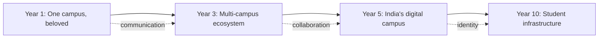
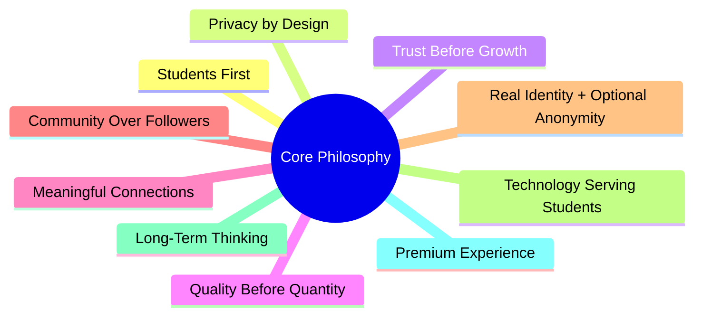
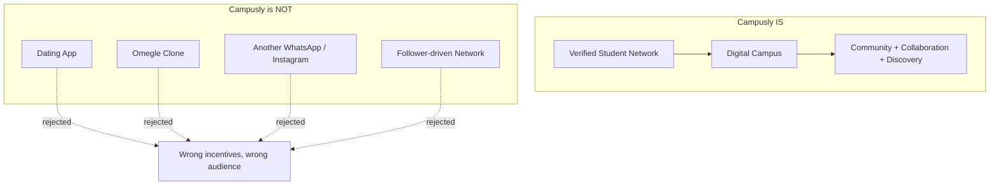
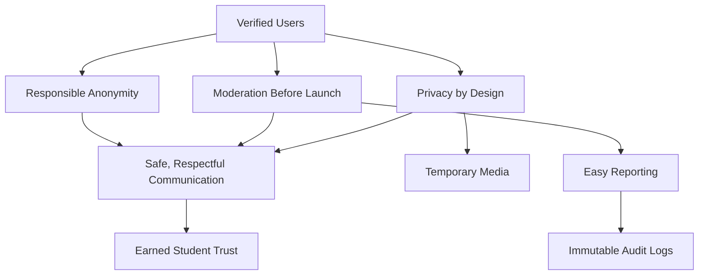
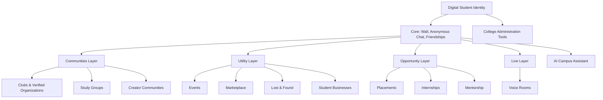

# Campusly — Project Vision

> **The Founding Manifesto**
> *Why Campusly exists, what it believes, and the company it intends to become.*
>
> **Document type:** Vision & Strategy (not a product spec)
> **Product:** Campusly (formerly PU Chat)
> **Status:** Founding document v1.0
> **Reference status:** This document is referenced by every future architecture, engineering, product, and brand decision. When a decision is unclear, this document arbitrates intent.

---

> *"A campus is not a place. It is a feeling — of belonging, of discovery, of becoming. Campusly exists to give that feeling a digital home."*

---

## Table of Contents

1. [Founder's Vision](#1-founders-vision)
2. [Mission Statement](#2-mission-statement)
3. [Long-Term Vision](#3-long-term-vision)
4. [Core Philosophy](#4-core-philosophy)
5. [What Campusly Believes](#5-what-campusly-believes)
6. [Product Positioning](#6-product-positioning)
7. [Competitive Vision](#7-competitive-vision)
8. [Brand Identity](#8-brand-identity)
9. [Design Philosophy](#9-design-philosophy)
10. [Community Philosophy](#10-community-philosophy)
11. [Safety Philosophy](#11-safety-philosophy)
12. [Future Ecosystem](#12-future-ecosystem)
13. [Success Definition](#13-success-definition)
14. [Guiding Principles for Future Development](#14-guiding-principles-for-future-development)
15. [Final Vision Statement](#15-final-vision-statement)

---

## 1. Founder's Vision

### The story behind Campusly

Every meaningful product begins with a moment of friction — a small, persistent ache that refuses to go away. Campusly began with one such ache: the strange loneliness of being surrounded by thousands of people and still feeling unseen.

A college campus is one of the densest social environments a human being will ever inhabit. Thousands of students, hundreds of clubs, dozens of events every week, an endless churn of ideas, ambitions, friendships, and conversations. And yet, paradoxically, so many students move through this richness feeling disconnected from it. The fresher who eats lunch alone for the first month. The introvert who has brilliant things to say but never finds the room to say them. The transfer student who arrives a year late and finds every friend group already sealed. The ambitious builder who can't find a single teammate for the idea burning in their head. The campus is full, and the student is alone.

Campusly was born from the conviction that this loneliness is not inevitable — it is a **design failure of the tools students are forced to use.** Students live their social lives across WhatsApp, Instagram, Telegram, and Discord. None of these was built for college life. WhatsApp assumes you already know the person's number. Instagram rewards performance and comparison. Telegram is a broadcast tool. Discord is built for gamers and communities that already exist. Each is a powerful product in its own right, and each is fundamentally *the wrong shape* for the specific, local, time-bound, trust-dependent reality of being a student.

So students improvise. They cobble campus life together from apps that were never meant to carry it. Confessions hide on anonymous Instagram pages run by unknown admins. Club recruitment happens through Google Forms shared in WhatsApp groups. Event announcements drown in noise. Notes circulate as screenshots of screenshots. There is no single, trusted, student-owned place that mirrors the real campus. The digital layer of college life is fragmented, unverified, and accidental.

Campusly exists to fix this. Not by building yet another chat app, but by building **the digital campus itself** — a verified, student-only space designed from first principles for the way college life actually works.

### From PU Chat to Campusly

Campusly did not arrive fully formed. It evolved, and the evolution is the most important part of the story — because it is where the real lesson lives.

It began as **PU Chat**: a single-campus, anonymous communication app restricted to the students of one university. The premise was simple and seductive — let students talk to each other anonymously. And it worked, at first. Curiosity drew people in. The novelty of anonymous conversation with a fellow student was genuinely fun.

But novelty is not retention. Users came for the thrill and left within days, because there was nothing to come back to. No identity. No community. No relationships. No reason to open the app tomorrow when the curiosity of today had been satisfied. PU Chat had built a hook with no line attached to it.

That failure taught us the single most valuable thing we know about this product:

> **Anonymous chat alone is not sticky. The strongest, most durable value comes from combining four things that no one had combined before — verified student identity, anonymous expression, public campus community, and persistent friendships.**

Each pillar compensates for the weakness of the others. Verification creates the trust that pure anonymity destroys. Anonymity lowers the social barrier that pure identity erects. The campus wall gives the network a shared public square. And friendships convert fleeting moments into lasting relationships — the thing that finally gives a student a reason to return.

PU Chat was a single feature mistaken for a product. Campusly is the product that feature was always trying to become. The name change is not cosmetic. It marks the transformation from *an anonymous chat app for one campus* into *a verified, multi-campus student platform* — from a clever trick into a digital ecosystem.

### The belief at the center of everything

Underneath every decision Campusly makes is a single belief:

> **College life deserves its own digital ecosystem — not a patchwork of apps borrowed from other worlds.**

We do not believe students are poorly served because the right features haven't been invented. We believe they are poorly served because no one has built a *coherent home* for campus life — a place where identity is verified, expression is safe, community is real, and relationships endure. The features already exist, scattered across a dozen products. What's missing is the **integration, the trust, and the intentionality** of a platform built for students and only students.

This is the founder's vision: that one day, opening Campusly will feel the way walking onto campus feels on a good day — alive with people, possibility, and belonging. That a student's digital campus life will no longer be an accident of fragmented apps, but a designed, trusted, beautiful experience. That the loneliness of being surrounded by thousands and feeling unseen will, for the next generation of students, simply not be the default.

That is why Campusly was created. Everything that follows in this document is in service of that single ache, and its resolution.

---

## 2. Mission Statement

> ## **Our mission is to empower every verified college student to communicate freely, collaborate meaningfully, build genuine communities, and discover the opportunities that make campus life worth living — all within one trusted, student-only home.**

A mission statement is a promise and a filter. It is the sentence against which we test every decision: *does this empower a verified student to communicate, collaborate, build community, or discover opportunity?* If it does, it belongs. If it does not, it does not — regardless of how clever, profitable, or fashionable it might be.

The mission rests on four verbs, each chosen deliberately:

| Verb | What it means | Why it matters |
|------|---------------|----------------|
| **Communicate** | Talk freely and safely — anonymously when needed, openly when wanted | Communication is the entry point; without it, nothing else happens |
| **Collaborate** | Find teammates, study partners, mentors, and co-creators | Collaboration turns connection into accomplishment |
| **Build community** | Form and govern real communities, clubs, and groups | Community is what turns users into members and members into belonging |
| **Discover opportunity** | Surface events, placements, people, and possibilities | Discovery is how campus life expands a student's world |

And the mission is bounded by two non-negotiable conditions that appear in the statement itself: **verified** and **trusted**. We do not serve anonymous crowds; we serve verified students. We do not chase growth at the cost of safety; we build a trusted home. These are not caveats. They are the mission.

---

## 3. Long-Term Vision

Campusly's vision unfolds in stages, each building on the trust and density established by the one before it. The logic is deliberate: **earn trust, deepen utility, expand surface, open ecosystem.** A platform that tries to be everything on day one becomes nothing. A platform that earns the right to grow becomes infrastructure.

### Where Campusly is in 1 year

In one year, Campusly is the **beloved communication and community home of a single campus** — proof that the four-pillar thesis works in the real world.

- Verified students sign in, build profiles, and treat the campus wall as their daily check-in.
- Anonymous matching is the acquisition hook that brings curious students in; friendships are the line that keeps them.
- Friend chat, voice messages, and a vibrant wall make the product worth opening every day.
- The platform has proven, on one campus, that students prefer a space built for them over the fragmented alternatives they tolerate today.
- Trust and safety tooling — verification, moderation, reporting, audit — is mature and invisible, working quietly in the background.

The Year 1 goal is not breadth. It is **depth**: a campus where Campusly is simply *where students are.*

### Where Campusly is in 3 years

In three years, Campusly is a **multi-campus student platform** — no longer just chat and wall, but a genuine ecosystem.

- Communities, clubs, and events have transformed Campusly from a communication app into a campus operating layer.
- Marketplace, lost & found, and study groups deliver concrete daily utility that makes the app habitual.
- Voice and video — built on a real-time foundation — bring live interaction: voice rooms, club meetings, study sessions.
- Subscriptions provide a sustainable revenue base without compromising the free core.
- Campusly operates across a growing network of campuses, each experiencing it as their own intimate community while quietly connected to a larger whole.

### Where Campusly is in 5 years

In five years, Campusly is becoming **India's digital campus** — the default verified social and collaboration layer for higher education.

- A student creates their verified Campusly identity in their first week of college and uses it through graduation.
- AI quietly enhances matching, moderation, discovery, and study — always in service of the student, never at the cost of privacy.
- A placement portal and career communities make Campusly indispensable at the highest-stakes moment of college life.
- Verified clubs, creators, and student businesses build real value on-platform.
- Colleges themselves begin to adopt Campusly tooling, accelerating verification and penetration.

### Where Campusly is in 10 years

In ten years, Campusly aspires to be **infrastructure** — as fundamental to Indian student life as the campus itself.

- A national network of verified students spanning thousands of campuses, connected by communities, ideas, and relationships.
- A verified digital student identity that follows a person from admission through alumni life and into the professional world.
- A trusted layer through which placements, mentorship, collaboration, and opportunity flow at national scale.
- A platform that has redefined what the digital layer of education looks like — not borrowed from other worlds, but built natively for the world of the student.

The throughline across all four horizons is a single transformation: **from a communication platform into India's digital campus infrastructure.** We begin by helping students talk. We end by becoming the connective tissue of student life itself.

---

## 4. Core Philosophy

Philosophy is what remains when the features are stripped away. These ten principles are the operating philosophy behind every product decision — the constitution that governs how Campusly is built, not just what is built. When two good ideas conflict, these principles decide.

### 4.1 Students First

The student is the customer, never the product. We optimize for student wellbeing, utility, and trust — not for time-on-app extracted at any cost. Every other technology platform students use treats their attention as inventory to be sold. We refuse that model. If a choice is good for engagement metrics but bad for students, we choose the student. This is not charity; it is strategy. A platform that genuinely serves students earns a loyalty that no attention-harvesting competitor can buy.

### 4.2 Privacy by Design

Privacy is not a setting buried three menus deep. It is the default state of the system. We collect personal data only when it serves the student, store the minimum necessary, and never sell it. Anonymous interactions never leak identity. Sharing is opt-in, not opt-out. We design as if every student's data belonged to them — because it does. Privacy by design means the safe choice is the easy choice, and the student never has to fight the product to protect themselves.

### 4.3 Trust Before Growth

We will not grow at the expense of trust. A single breach of student trust — a privacy leak, an unmoderated abuse, a broken promise — costs more than any growth metric can justify. So we earn trust first and grow second. We launch safety tooling before social surfaces. We verify before we admit. We moderate before we scale. Growth that outruns trust is not growth; it is borrowed time.

### 4.4 Quality Before Quantity

A thousand engaged, connected students on one campus are worth more than a million idle installs across many. We measure ourselves by depth, not vanity. We would rather have one campus that loves Campusly than ten that merely have it installed. Quality of connection, quality of community, quality of experience — these compound. Quantity without quality evaporates.

### 4.5 Meaningful Connections

Not all connection is equal. A follower count is not a friendship. A like is not a conversation. Campusly is built to create *meaningful* connections — the anonymous chat that becomes a friendship, the community that becomes a home, the teammate who becomes a co-founder. We optimize for the depth and authenticity of human connection, not its quantity or its performance.

### 4.6 Community Over Followers

Campusly is not a follower-driven network. We reject the influencer model in which a few broadcast and the many consume. We build for community — bidirectional, participatory, governed by its members. The unit of value is not the audience; it is the community. This is a deliberate philosophical departure from the social media that surrounds students, and it shapes everything from our feed design to our incentive structures.

### 4.7 Real Identity with Optional Anonymity

This is the synthesis at the heart of Campusly: **verified identity underneath, optional anonymity on top.** Every account is a real, verified student. But students can choose to express themselves anonymously when honesty requires the freedom from judgment. This is *accountable anonymity* — the freedom of the mask with the safety of knowing everyone behind every mask is real and accountable. It is the resolution of the false choice between safety and freedom.

### 4.8 Technology Serving Students

Technology is a means, never an end. We do not adopt a feature because it is novel, or an AI capability because it is fashionable. We adopt technology only when it demonstrably improves a student's life. The most advanced system and the simplest one are equally welcome if they serve the student; both are rejected if they do not. Technology that serves itself — that exists to impress rather than to help — has no place here.

### 4.9 Long-Term Thinking

We build for a ten-year horizon, not a quarterly one. We will decline short-term gains that compromise long-term trust. We design our architecture, our community, and our brand for the platform Campusly intends to become, not merely the app it is today. Long-term thinking means we plant trees whose shade we will not sit in for years — and that patience is itself a competitive advantage in a world addicted to the immediate.

### 4.10 Premium User Experience

Students are design-literate. They can feel the difference between a product made with care and one made with indifference. A premium experience — fast, polished, elegant, delightful — is not vanity; it is a signal of respect and trustworthiness. A product that feels cheap feels untrustworthy, and trust is everything here. Every pixel, every animation, every interaction communicates whether we take the student seriously. We always do.

---

## 5. What Campusly Believes

A company's beliefs are revealed not in what it says but in what it builds. Still, it helps to say them plainly — so that every person who builds Campusly knows the convictions they are building from. These are not marketing slogans. They are the axioms from which our decisions are derived.

> ### We believe technology should reduce loneliness, not amplify it.
The great irony of modern social technology is that the most connected generation in history is also among the loneliest. The tools meant to bring people together too often leave them comparing, performing, and scrolling alone. We believe technology can do the opposite — that it can manufacture the serendipitous human connection that crowded campuses promise but rarely deliver. Every feature we build is measured against this: does it bring a student closer to another human being, or further away?

> ### We believe students deserve safe spaces to express themselves.
There are things a student will never say with their name attached — questions about mental health, doubts about a course, confessions, fears, unpopular opinions. On named platforms, the fear of judgment silences them. On unverified anonymous platforms, the absence of accountability poisons the well. We believe students deserve a third option: a space safe enough for honesty, accountable enough to remain humane. Expression without fear, and freedom without harm.

> ### We believe communities create stronger relationships than algorithms.
The dominant model of social technology is the algorithmic feed — a machine optimized to predict what will keep you scrolling. We believe this model is exhausted and corrosive. Real relationships are not formed by recommendation engines; they are formed in communities — shared spaces with shared context, shared norms, and shared belonging. We bet on community over algorithm, on the group over the feed, on belonging over engagement.

> ### We believe campus life should continue digitally.
The energy of campus life — the late-night debates, the club meetings, the spontaneous collaborations, the gossip and the growth — should not stop the moment a student closes their laptop or leaves the canteen. It should have a digital continuation, a persistent home where the campus is always present. We believe the digital and physical campus should be two faces of one continuous experience.

> ### We believe connections should be authentic.
A connection built on performance is fragile. A connection built on authenticity endures. By grounding our platform in verified identity and meaningful interaction rather than curated performance, we make space for students to be real with one another. Authenticity is not a feature we add; it is the soil everything else grows in.

> ### We believe design should reduce stress, not increase it.
So much of modern software is designed to provoke — to alarm, to compel, to manufacture anxiety so you keep checking. We believe design should do the opposite. A Campusly session should leave a student calmer, more connected, and more capable than before — never more anxious, more compared, or more depleted. Calm is a design goal.

> ### We believe products must earn trust, never assume it.
Trust is not granted by a privacy policy or a marketing campaign. It is earned, slowly, through consistent behavior — and lost instantly through a single betrayal. We believe we must earn the trust of every student, every day, through how we handle their data, their safety, and their experience. Trust is the only currency that matters, and it is the hardest to counterfeit.

> ### We believe growth should never compromise safety.
There will be moments when the fastest path to growth runs through a compromise in safety — a relaxed verification, an unmoderated surface, a dark pattern that boosts a metric. We believe these are not trade-offs to be debated but lines never to be crossed. A platform for students cannot be a little bit unsafe any more than it can be a little bit untrustworthy. Safety is the precondition for everything, and it is not for sale.

These eight beliefs are the bedrock. Every feature, every design choice, every line of the roadmap should be traceable back to one of them. When we forget why we are building something, we return here.

---

## 6. Product Positioning

Clarity about what we are — and ruthless clarity about what we are not — is one of the most strategically important things a young company can possess. Confused positioning produces confused products, confused users, and confused growth. So we state our position plainly.

### What Campusly IS

Campusly is many things at once, layered like the rings of a tree, each enabled by the one inside it.

| Campusly is a... | Meaning |
|------------------|---------|
| **Verified Student Network** | A network where every member is a confirmed, real college student — the trust foundation for everything else. |
| **Digital Campus** | A persistent digital home that mirrors and extends the life of a real campus. |
| **Student Community Platform** | A place where students form, join, and govern real communities, clubs, and groups. |
| **Campus Discovery Platform** | A surface for discovering people, events, opportunities, and possibilities within and across campuses. |
| **Communication Platform** | A space for free, safe communication — anonymous when needed, named when wanted. |
| **Collaboration Platform** | A place to find teammates, study partners, mentors, and co-creators. |
| **Knowledge Sharing Platform** | A trusted channel for the senior-to-junior, peer-to-peer knowledge that campuses run on. |

These are not separate products. They are facets of a single thing: **the digital campus.** Communication is how it begins. Community is how it deepens. Collaboration and discovery are how it expands a student's world. Verification is the trust that holds it all together.

### What Campusly is NOT

Equally important is what we refuse to become. Each of these is a product Campusly could be mistaken for — and each is a trap that would betray the mission.

> **Campusly is NOT a dating app.**
We are not built to optimize romantic matching, and we reject the incentives that come with it. Anonymous matching exists to reduce loneliness and spark friendship, not to facilitate dating. The moment a platform becomes a dating app, it attracts a different audience with different intentions, and the trusted student community erodes.

> **Campusly is NOT an Omegle clone.**
Omegle paired strangers from anywhere with no verification, no accountability, and no community — a recipe for the worst of the internet. Our anonymous matching is the opposite: between verified students, bound by moderation, designed to graduate into real relationships. The mechanism may look superficially similar; the philosophy is the precise inverse.

> **Campusly is NOT another WhatsApp.**
WhatsApp is a private messaging utility that assumes you already know the person. We are a discovery and community platform that helps you meet people you don't yet know. We are not trying to replace the group chat; we are building the campus around it.

> **Campusly is NOT another Instagram.**
Instagram rewards performance, curation, and comparison — the highlight reel that leaves viewers feeling worse. We reject the performance economy entirely. There are no follower counts to chase, no curated perfection to compete with. We optimize for authentic connection, not for the anxiety of the feed.

> **Campusly is NOT a follower-driven social network.**
We do not build for influencers and audiences. The unit of value here is the community and the relationship, not the follower count. We are deliberately, philosophically opposed to the broadcast-and-consume model that dominates social media.

> **Campusly is NOT a generic messaging app.**
Messaging is a feature, not the product. The product is the verified campus — its identity, its community, its discovery, its trust. A generic messaging app could be cloned in a weekend. The digital campus cannot.

---

## 7. Competitive Vision

We are often asked how Campusly compares to the giants — WhatsApp, Instagram, Discord, and the rest. But feature-by-feature comparison is the wrong frame. Any feature can be copied. What cannot be copied is **philosophy** — the set of beliefs that determine what a product will and will not do. Our differentiation is not a feature list. It is a fundamentally different answer to the question *what is this product for?*

### WhatsApp
WhatsApp's philosophy is **private utility**: move messages between people who already know each other, with maximum reliability and minimum friction. It is brilliant at this. But it assumes the relationship already exists. Campusly's philosophy is **discovery and belonging**: we help students meet people they don't yet know and build communities that don't yet exist. WhatsApp is the pipe; Campusly is the campus.

### Instagram
Instagram's philosophy is **performance**: present your best self, accumulate an audience, and measure your worth in likes and followers. This philosophy produces comparison, anxiety, and curated unreality. Campusly's philosophy is **authenticity**: there is no audience to perform for, no follower count to chase. We optimize for real connection, not for the highlight reel. Where Instagram rewards the curated self, we make room for the actual one.

### Discord
Discord's philosophy is **communities that already exist**: it gives a pre-formed group (a game, a fandom, a team) a powerful home. It is exceptional for groups that arrive knowing what they are. Campusly's philosophy is **community formation within a verified, local context**: we help students *discover and build* communities they didn't arrive with, all within the trust boundary of a verified campus. Discord is a toolkit for existing tribes; Campusly is a place where new tribes are born.

### Telegram
Telegram's philosophy is **broadcast and scale**: massive channels, large groups, information distribution. It is powerful but impersonal, and unverified. Campusly's philosophy is **verified intimacy**: smaller, trusted, campus-scoped spaces where everyone is real and accountable. Telegram optimizes for reach; we optimize for trust.

### LinkedIn
LinkedIn's philosophy is **professional performance**: a resume that breathes, oriented around career and status. It is intimidating, transactional, and the wrong register for a student asking a senior how a course is. Campusly's philosophy is **student-native connection**: networking, mentorship, and opportunity in a language and context that belongs to students, not to corporations. We are not a junior LinkedIn; we are the place LinkedIn relationships are seeded, in their natural habitat.

### Reddit
Reddit's philosophy is **anonymous interest-based communities at global scale**, where identity is irrelevant and locality is incidental. It produces both brilliance and toxicity in equal measure, precisely because there is no accountability. Campusly's philosophy is **accountable, local community**: anonymous expression is welcome, but every account is a verified student, and every community is rooted in a real campus context. We keep the freedom of Reddit's anonymity while removing the lawlessness that comes with it.

### Fizz, Sidechat, and Monkey
These are the closest analogues — campus or anonymous social apps. Their philosophies vary, but they tend toward **anonymous virality** or **random pairing as an end in itself.** The lesson of PU Chat is precisely that this philosophy does not endure: anonymous novelty without identity, community, and relationships burns bright and fades fast. Campusly's philosophy is **the integrated four-pillar campus** — verified identity, anonymous expression, public community, and persistent friendship woven into one coherent home. We are not betting on the hook alone. We are betting on the whole campus.

### The philosophical summary

| Competitor | Their philosophy | Campusly's philosophy |
|------------|------------------|----------------------|
| WhatsApp | Private utility for known contacts | Discovery and belonging for a campus |
| Instagram | Performance and audience | Authenticity and connection |
| Discord | Homes for existing communities | Formation of new, verified communities |
| Telegram | Broadcast and scale | Verified intimacy |
| LinkedIn | Professional performance | Student-native connection |
| Reddit | Anonymous global communities | Accountable local communities |
| Fizz / Sidechat / Monkey | Anonymous virality / random pairing | Integrated verified campus |

Our competitive moat, then, is not any single feature. It is **a coherent philosophy executed with discipline** — verification, trust, community, and authenticity integrated into one product, defended over a ten-year horizon. Features can be copied in weeks. A philosophy lived consistently over years builds something no competitor can clone: the trust of a generation of students.

---

## 8. Brand Identity

A brand is not a logo or a color palette. A brand is the consistent *feeling* a product produces in the people who use it — the personality students sense before they can articulate it. Campusly's brand is the emotional signature of everything we build, and it must be protected as carefully as our code.

### The personality

Campusly should feel like the smartest, kindest, most trustworthy senior on campus — the one who is effortlessly cool but never cruel, polished but never pretentious, welcoming to everyone. In a single phrase: **premium, but for everyone.**

| Attribute | What it feels like | What it prevents |
|-----------|--------------------|--------------------| 
| **Premium** | Considered, high-quality, made with care | Feeling cheap or disposable |
| **Modern** | Current, fresh, contemporary | Feeling dated or legacy |
| **Minimal** | Clean, uncluttered, focused | Feeling overwhelming or noisy |
| **Safe** | Protected, trustworthy, calm | Feeling exposed or anxious |
| **Student-focused** | Built for *me*, speaks my language | Feeling corporate or generic |
| **Friendly** | Warm, approachable, human | Feeling cold or transactional |
| **Professional** | Reliable, serious, well-run | Feeling amateur or flaky |
| **Innovative** | Forward-thinking, surprising | Feeling stale or imitative |
| **Trustworthy** | Honest, consistent, dependable | Feeling manipulative |
| **Intelligent** | Thoughtful, sharp, well-designed | Feeling dumbed-down |

### What Campusly must never be

A brand is defined as much by its refusals as its affirmations. Campusly is:

- **Never childish.** We respect students as intelligent adults. We do not condescend, infantilize, or decorate with gimmicks. The visual and verbal tone is grown-up.
- **Never overly playful.** A measure of warmth and delight is welcome; clownishness is not. We are friendly, not silly. Delight is earned through craft, not through noise.
- **Never clickbait.** We do not manufacture false urgency, bait engagement, or use manipulative copy. We earn attention through value and honesty, never through tricks.

### The brand promise

The brand exists to deliver one feeling above all: **"This is a place built for me, by people who respect me, where I am safe to be myself."** Every touchpoint — the onboarding, the empty states, the error messages, the notifications, the marketing — must reinforce that feeling. Where a choice would make Campusly feel more premium, more trustworthy, and more student-focused, that is the right choice. Where it would make us feel cheaper, more manipulative, or more generic, it is wrong, no matter what it does for a short-term metric.

---

## 9. Design Philosophy

Design is how the philosophy becomes tangible. A student never reads our principles; they *feel* them, through every screen and interaction. Our design philosophy translates belief into experience.

### The design language

> **Dark-first. Minimal. Apple-inspired. Linear-inspired. Intentional in every interaction.**

- **Dark-first.** We design for dark mode as the primary experience — easier on the eyes during late-night study sessions, premium in feel, and calmer in mood. Light mode is supported and excellent, but dark is home.
- **Minimal.** Every element on every screen must justify its existence. We remove before we add. Whitespace is not emptiness; it is focus. The absence of clutter is itself a feature.
- **Apple-inspired.** We aspire to the Apple standard of craft: obsessive attention to detail, hardware-grade polish, and the sense that someone cared about every pixel. Quality is felt in the details users never consciously notice.
- **Linear-inspired.** From Linear we take speed, keyboard-fluency, and the elegance of a product that respects the user's intelligence and time. Fast is a feature. Sharp is a feeling.
- **Elegant animations.** Motion (via Framer Motion) is used to communicate, orient, and delight — never to decorate or delay. Every animation has a purpose: to show where something came from, where it went, or that an action succeeded.
- **High readability.** Typography, contrast, and hierarchy are tuned for effortless reading on any device. Content is the hero; the interface gets out of its way.
- **Accessibility.** A premium product is a usable product — for everyone. Keyboard navigation, screen-reader support, sufficient contrast, and graceful degradation on low-end devices and poor networks are requirements, not enhancements. (Full accessibility conformance requires ongoing testing with real assistive technologies and users.)
- **Simple navigation.** A first-year student should understand the product in seconds, with no tutorial. Structure is obvious; depth is progressive and optional.
- **Consistent spacing.** A disciplined spacing and layout system creates the subconscious sense of order and quality that defines premium software. Consistency is calm.
- **No visual clutter.** We protect the student's attention as a scarce and sacred resource. We never crowd a screen to chase a metric.

### The governing rule

> **Every interaction should feel intentional.**

Nothing in Campusly is accidental. Every tap, transition, and message is the result of a deliberate decision made in service of the student. When a student uses Campusly, they should sense — even without words — that this product was made *on purpose, for them, by people who cared.* That feeling of intentionality is the highest expression of our design philosophy, and the clearest signal of the respect at the center of our brand.

### Design as stress reduction

Recall the belief that *design should reduce stress, not increase it.* This is the emotional north star of our design work. A student should leave a Campusly session feeling calmer and more connected than when they arrived — never more anxious, more compared, or more depleted. We measure our design not only by its beauty but by the emotional state it leaves behind. Calm, clarity, and connection are the deliverables.

---

## 10. Community Philosophy

Communities are where Campusly's value compounds. A connection is a moment; a community is a place to return. Our philosophy of community determines whether those places become homes or hostile territory — and that difference decides the fate of the platform.

### What a healthy community feels like

A healthy Campusly community is one a student is glad they joined — a place of **healthy discussion, constructive conversation, and genuine respect.** It is inclusive enough that newcomers feel welcome, structured enough that conversation stays meaningful, and proud enough of its campus that belonging is palpable.

We build for the following community values:

- **Healthy discussions.** Spaces designed to encourage thoughtful exchange rather than reflexive reaction. The architecture of a community shapes its conversations; we architect for health.
- **Constructive conversations.** We favor depth over dunking, building over breaking. Communities should leave their members more informed and more connected, not more divided.
- **Respect.** The baseline expectation of every interaction. Disagreement is welcome; disrespect is not. Respect is the price of admission to community life.
- **Moderation.** Every community has the tools and the responsibility to govern itself within platform-wide safety rules. Moderation is not censorship; it is the gardening that keeps a community livable.
- **Inclusiveness.** Communities should widen circles, not seal them. We design against cliquishness and for welcome — especially for the newcomer, the introvert, and the outsider.
- **Campus pride.** A community rooted in a real campus carries the identity and pride of that campus. This local belonging is a source of energy and authenticity that global communities can never replicate.
- **Knowledge sharing.** Communities are channels for the senior-to-junior, peer-to-peer knowledge that campuses run on. We treat knowledge sharing as a core community function, not a side effect.
- **Student growth.** The ultimate measure of a community is whether its members grew — in knowledge, confidence, relationships, or opportunity. Communities exist to make students better.

### Community over algorithm

We restate our core conviction here because it governs community design above all: **communities create stronger relationships than algorithms.** We will not bury communities under an engagement-optimizing feed. We will not let a recommendation engine override the human structure of a community. The community — its members, its norms, its self-governance — is the organizing principle, and the technology serves it.

### Self-governance within guardrails

Communities are governed by their members — owners and moderators who shape their culture — but always within platform-wide safety rules that Campusly enforces. This balance is deliberate: top-down control kills the authenticity that makes communities valuable, while no control invites the toxicity that destroys them. We empower communities to govern themselves, and we retain the authority to protect the whole. Freedom within guardrails is the only model that scales without rotting.

---

## 11. Safety Philosophy

Safety is not a department or a feature. It is the precondition for everything Campusly hopes to be. A student platform that is not safe is not a platform — it is a liability waiting to harm the very people it claims to serve. Our safety philosophy is therefore the most non-negotiable section of this entire document.

### The foundation: verified users

Everything begins with verification. **Only real, verified college students get in.** This single gate transforms the entire dynamic of the platform. The outsiders, the bots, the predators, and the impersonators that poison open platforms are kept out at the door. Verification is what makes a trusted community possible — and it is what makes our anonymity safe.

### Responsible anonymity

This is the philosophical heart of our safety model: **anonymity with accountability.** Students may express themselves anonymously — it is essential for honest discussion and lowering the barrier to connection. But every anonymous account is, underneath, a verified student bound by the platform's rules and traceable by moderators when abuse occurs.

> Anonymity is a mask, not a disappearance. You may hide your face from other students; you cannot hide from accountability. This is the resolution of the oldest problem in anonymous platforms — the freedom of the mask without the lawlessness it usually invites.

### Moderation

Every social surface on Campusly must have moderation *before it launches.* There is no unmoderated public space, ever. Moderation operates at two levels: community moderators who govern their own spaces, and platform moderators who enforce platform-wide safety. Enforcement is graduated and fair — warning, content hiding, temporary restriction, ban — with an appeals path, and every action is immutably logged for accountability. Moderation is not about control; it is about keeping the campus livable.

### Reporting

Safety is a shared responsibility, and reporting is how the community participates in its own protection. Every piece of content and every user can be reported, easily and from anywhere. Reports flow into moderation queues, are reviewed promptly, and are acted on transparently. A platform that makes reporting hard is a platform that does not take safety seriously. We make it effortless.

### Privacy

Safety and privacy are inseparable. Personal data is collected minimally, stored securely, never sold, and controlled by the student. Anonymous interactions never leak identity. Presence and profile visibility are in the student's hands. We design as though every student's safety depended on their privacy — because it does.

### Temporary media

Not everything should live forever. Some media is intentionally **temporary** — retention-limited and then purged — both for privacy and for the psychological safety of knowing that a fleeting moment is not a permanent record. Media lives in dedicated storage, never carelessly persisted, and expired media is removed per policy. The ability to share without creating a permanent liability is itself a form of safety.

### Respect and safe communication

Beyond tooling, safety is a culture. We design the product to encourage respect and discourage harm — through the architecture of our communities, the tone of our interface, the friction we place in front of abusive actions, and the resources we surface to students in distress (including pointing students toward professional help and crisis resources where signals warrant). Safe communication is not only the absence of abuse; it is the active presence of respect.

### The safety promise

> **Growth will never compromise safety.** When the fastest path to a metric runs through a safety compromise, we choose safety, every time, without debate. A platform for students that is unsafe has failed at the one thing that matters most. We would rather grow slowly and safely than quickly and dangerously. This is not a constraint on the business; it *is* the business.

---

## 12. Future Ecosystem

Campusly begins as communication and grows into an ecosystem — a connected set of surfaces that together constitute the full digital life of a campus. This section describes that long-term ecosystem. It is a map of the destination, not a delivery schedule; each surface arrives only when the trust and density to support it exist.

### The ecosystem map

### The ecosystem components

- **Campus Wall** — The public square; the daily heartbeat of campus information and expression.
- **Anonymous Conversations** — The hook; zero-risk connection that reduces loneliness and seeds friendships.
- **Friendships** — The retention engine; fleeting connections made durable.
- **Study Groups** — Find collaborators and study partners by course, skill, or goal — independent of existing networks.
- **Events** — Create, discover, and RSVP to campus events; eventually ticketing, check-in, and live participation.
- **Marketplace** — A trusted, campus-scoped exchange for textbooks, electronics, and student goods.
- **Lost & Found** — A simple, high-utility board that earns daily habitual use.
- **Clubs** — First-class tooling for student organizations: verified membership, announcements, recruitment, and events.
- **Placements** — Verified interview experiences, company prep, and referrals at the highest-stakes moment of college.
- **Internships** — Discovery and sharing of internship opportunities within the trusted student network.
- **Mentorship** — Structured senior-to-junior and alumni-to-student guidance.
- **Creator Communities** — Spaces and tools for student creators to build audiences and value on-platform.
- **Voice Rooms** — Live, drop-in audio for club meetings, study sessions, Q&As, and hangouts.
- **AI Campus Assistant** — A privacy-respecting assistant for discovery, summarization, study help, and navigation — technology in genuine service of the student.
- **College Administration Tools** — An optional institutional layer (B2B2C) that lets colleges adopt verified org management, announcements, and analytics.
- **Verified Organizations** — Official status and advanced tooling for clubs, departments, and student bodies.
- **Student Businesses** — A home for student entrepreneurs to reach a verified campus market.
- **Digital Student Identity** — The connective tissue: a verified identity that follows a student from admission through graduation into alumni and professional life.

### How the ecosystem coheres

The ecosystem is not a feature list; it is a **layered system anchored by verified identity.** Identity is the root. Communication and community are the trunk. Utility, opportunity, live interaction, and intelligence are the branches. Each layer is only possible because the layers beneath it established trust and density. This is why we resist the temptation to build everything at once: a branch grafted onto a trunk that cannot yet support it simply breaks. We grow the tree in order, and in time it becomes the forest that is India's digital campus.

---

## 13. Success Definition

How we define success determines what we become. If we define success as downloads, we will build for downloads — and we will build the wrong thing. So we define success deliberately, by the outcomes that actually matter.

### What success is NOT

> Success is **not** downloads. Success is **not** installs. Success is **not** registered accounts, vanity user counts, or any metric that measures presence without value.

These numbers are easy to inflate and easy to mistake for progress. A million downloads from students who never return is not success; it is expensive failure dressed up as growth. We refuse to be seduced by vanity.

### What success IS

Success is measured by the depth and quality of the value we create in students' lives:

| Success measure | What it really means |
|-----------------|----------------------|
| **Meaningful relationships** | Friendships and connections formed on Campusly that endure and matter |
| **Student engagement** | Genuine, useful participation — not addictive scrolling, but real value |
| **Community quality** | Healthy, respectful, active communities students are glad to belong to |
| **Campus participation** | A meaningful share of a campus actively living its digital life on Campusly |
| **Knowledge sharing** | Senior-to-junior and peer-to-peer knowledge flowing freely and helpfully |
| **Long-term retention** | Students who stay for years, not days — the truest signal of durable value |
| **Student trust** | The trust of students in how we handle their data, safety, and experience |
| **Positive impact** | Real improvement in students' lives: less loneliness, more opportunity, stronger belonging |

### The North Star

Above all these sits a single guiding measure: **the number of students who experience a meaningful connection or moment of belonging on Campusly each week.** This is the heartbeat of the mission. When this number grows, we are succeeding at the only thing that matters — reducing loneliness and building belonging. When it stalls, no amount of downloads can console us.

> We will know we have succeeded not when millions have installed Campusly, but when a generation of students cannot imagine campus life without it — when Campusly is remembered not as an app they used, but as part of how they grew up.

---

## 14. Guiding Principles for Future Development

This platform will be built, over many years, by many hands. Founders will be joined by engineers, designers, and product leaders who were not present at the beginning. This section exists for them. It is the filter that keeps Campusly true to itself as it grows — a test that every future feature, every roadmap decision, every line of work must pass.

### The six questions

Before we build anything, we ask:

> **1. Does this improve student life?**
> If it does not make a verified student's life better — less lonely, more connected, more capable, more informed — it does not belong, no matter how clever or profitable.

> **2. Does this build trust?**
> Trust is our only true currency. A feature that erodes trust, even slightly, costs more than it can ever earn. We build trust or we don't build.

> **3. Does this strengthen community?**
> We favor what brings students together over what isolates them, what deepens belonging over what manufactures engagement. Community is the organizing value.

> **4. Does this maintain privacy?**
> Privacy is the default, not the exception. A feature that compromises a student's privacy must clear an extraordinarily high bar, and usually it should simply not be built.

> **5. Does this simplify the experience?**
> Complexity is the enemy of a product meant to be understood in seconds. We add only what earns its place, and we remove relentlessly. Simplicity is a feature.

> **6. Does this align with the mission?**
> Does it empower a verified student to communicate, collaborate, build community, or discover opportunity? If it serves the mission, it belongs. If it merely serves a metric, it does not.

### The discipline of "no"

> **If the answer to these questions is no, the feature should not be built — however tempting, fashionable, or lucrative it appears.**

The hardest and most important discipline of a great company is the willingness to say no. Most products fail not from too few features but from too many — from a slow accretion of compromises that, one by one, betray the original vision until nothing coherent remains. Campusly's defense against this fate is this section. We will say no, often and deliberately, to protect the yes that matters. The roadmap is not a list of everything we *could* build; it is the short list of what we *should*.

### A living filter

These principles are not a one-time gate but a continuous filter, applied at every stage — ideation, design, build, and review. When a team is uncertain whether to proceed, they return here. When a decision feels wrong but no one can say why, the answer is almost always that it failed one of these six questions. This filter is how a vision survives contact with growth.

---

## 15. Final Vision Statement

> ## The Campusly Manifesto

We began with a single ache: the loneliness of being surrounded by thousands and still feeling unseen. We refused to accept that this loneliness was inevitable. We saw it for what it is — a failure of the tools students are forced to use, tools borrowed from other worlds and never built for the world of the student.

So we set out to build that world. Not another chat app. Not another feed to scroll. Not another place to perform for strangers. A **home** — a verified, trusted, beautiful home for the digital life of every college student.

We believe that technology should reduce loneliness, not amplify it. That students deserve safe spaces to be honest. That communities build stronger bonds than algorithms ever will. That campus life should continue digitally, with all its energy intact. That connection should be authentic, that design should bring calm, that trust must be earned, and that growth must never come at the cost of safety.

We are building the **digital campus** — beginning with the courage to speak anonymously, deepening into the friendships that make college unforgettable, widening into the communities and clubs and events that give a campus its pulse, and ultimately becoming the connective tissue of student life itself: the place a student creates their verified identity on the first day of college and carries with them through graduation and beyond.

Our promise is simple and absolute. Every student who enters Campusly is real. Every interaction is safe. Every community is theirs to build and to govern. Their privacy is protected, their trust is sacred, and their wellbeing comes before any metric we could chase.

> **Campusly will become the trusted digital home for every verified college student in India — connecting campuses, ideas, friendships, opportunities, and communities, while holding fast to privacy, to trust, and to the irreplaceable value of meaningful human connection.**

We will not measure our success in downloads, but in the loneliness we ease, the friendships we spark, the communities we nurture, and the lives we touch. We are not building an app that students use. We are building a place where a generation grows up — together.

This is why Campusly exists. This is what Campusly believes. This is the company we intend to become.

> *The campus is waiting. Let's build its home.*

---

*This is a living document. It will evolve as Campusly evolves — but its spirit, the convictions written here, must not. When the way forward is unclear, return to this document. It will remember, even when we forget, why we began.*

*— The Founding Team, Campusly*
