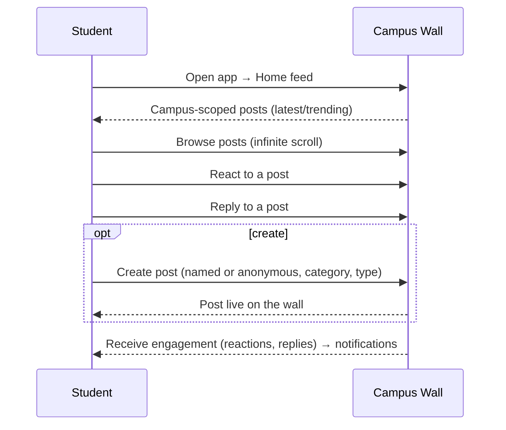

# Campusly V2 — Campus Wall

> **Document type:** Campus Wall specification — single source of truth
> **Product:** Campusly V2 (formerly PU Chat)
> **Status:** Authoritative v1.0
> **Authority:** This is the definitive specification for the Campus Wall: its philosophy, post types, categories, feed, engagement, anonymity, moderation, and growth. All implementation MUST conform. It covers product behavior, UX, and architecture decisions only — no code, schemas, REST APIs, or Socket.IO events.
> **Companion documents:** `DATABASE_SCHEMA.md` §10 (wall tables), `SOCKET_EVENTS.md` §9 (wall events), `AUTH_SYSTEM.md` §9 (privacy/anonymity), `MATCHING_ENGINE.md`, `FRIEND_SYSTEM.md`, `PROJECT_VISION.md`, `FEATURE_MATRIX.md` §8

---

## Table of Contents
1. [Campus Wall Philosophy](#1-campus-wall-philosophy)
2. [User Journey](#2-user-journey)
3. [Post Types](#3-post-types)
4. [Categories](#4-categories)
5. [Feed Behaviour](#5-feed-behaviour)
6. [Engagement](#6-engagement)
7. [Anonymous Posting](#7-anonymous-posting)
8. [Moderation](#8-moderation)
9. [Notifications](#9-notifications)
10. [Future Expansion](#10-future-expansion)
11. [Success Metrics](#11-success-metrics)
12. [Design Principles](#12-design-principles)

---

## 1. Campus Wall Philosophy

### 1.1 Why the Campus Wall exists
The Campus Wall is Campusly's **public square** — the single, verified, campus-scoped place where students see and share what matters on their campus. It solves the **fragmentation** problem: today campus information is scattered across WhatsApp groups, unverified Instagram pages, and Telegram channels, with no trusted source of truth (`PRODUCT_REQUIREMENTS.md` §4.1). The wall consolidates that chaos into one place where everyone present is a real student.

### 1.2 Why it is the heart of Campusly
Matching is the hook and friendships are the retention engine, but the **wall is the daily habit**. It is the surface a student opens first, the reason they return between conversations, and the shared space that makes Campusly feel alive. While matching is 1:1 and ephemeral, the wall is **one-to-many and persistent** — it gives the network a collective identity and a pulse. It is the primary daily engagement feature.

### 1.3 How it differs from Instagram, Reddit, and Facebook
| Platform | Their model | Campus Wall's difference |
|----------|-------------|--------------------------|
| **Instagram** | Performance, curation, follower counts, the highlight reel | No followers, no performance; authentic, low-pressure campus conversation |
| **Reddit** | Anonymous global communities, no accountability, no locality | Verified, local, **accountable** anonymity rooted in a real campus |
| **Facebook** | Broad social graph, algorithmic engagement feed, ads | Campus-scoped, community-first, no engagement-maximizing dark patterns |

The wall keeps the best of each — Reddit's freedom to speak anonymously, the immediacy of a feed — while removing what poisons them: it is **verified, local, and accountable** (`PROJECT_VISION.md` §7).

### 1.4 How it strengthens campus communities
By giving a campus one trusted space, the wall surfaces events, questions, knowledge, and culture that would otherwise stay siloed. It lets newcomers and introverts participate in campus life without needing an existing network, spreads opportunity more evenly, and builds the shared identity and pride that turn a collection of students into a community.

---

## 2. User Journey

**Journey summary:** Open app → Home feed → Browse → React → Reply → Create Post → Receive engagement. The loop is designed to be effortless for **readers** (the majority) and rewarding for **posters**, with engagement notifications (`§9`) pulling users back. Only verified, active students with completed profiles participate (`AUTH_SYSTEM.md`).

---

## 3. Post Types

The wall supports multiple post types so that diverse campus needs share one surface, each rendered and handled appropriately. (Some integrate with dedicated modules; see notes.)

| Post type | Purpose | Notes |
|-----------|---------|-------|
| **General Discussion** | Everyday campus conversation | The default; named or anonymous |
| **Anonymous Post** | Honest expression without identity | A posting *mode* (any type can be anonymous); author retained internally (§7) |
| **Confession** | Candid, often anonymous sharing | High-empathy category; strong moderation |
| **Academic Question** | Ask peers/seniors about courses, exams | Drives knowledge sharing |
| **Placement Discussion** | Interview experiences, prep, company insight | High-value; seeds the future Placement Portal |
| **Event Announcement** | Promote a campus/community event | Links to the Events module |
| **Lost & Found** | Surface a lost/found item on the wall | Integrates with the Lost & Found module |
| **Marketplace Listing** | Surface an item for sale | Integrates with the Marketplace module |
| **Poll** | Ask the campus a question with options | Native voting; option limits enforced |
| **Club Announcement** | Official communication from a club | Privileged; visually distinguished; from club admins |
| **Image Post** | Share an image | Media via object storage (reference, not bytes) |
| **Voice Post (future)** | Short audio post | Reserved; reuses voice-message media model |

**Design note.** Post types are a presentation/behavior layer over a common post model (`DATABASE_SCHEMA.md` §10). Lost & Found, Marketplace, and Events have dedicated modules; their wall appearances are surfaces/links, not duplicated systems — keeping the wall unified while respecting module boundaries.

---

## 4. Categories

Categories organize the wall for discovery and let students tune into what they care about. They are distinct from post *types*: a post has one type and sits in one category.

| Category | What belongs here |
|----------|-------------------|
| **Academics** | Courses, exams, study questions, resources |
| **Placements** | Interviews, prep, company discussions, referrals |
| **Events** | Fests, talks, meetups, club events |
| **Clubs** | Club activity, recruitment, announcements |
| **Confessions** | Candid/anonymous personal sharing |
| **Memes** | Campus humor and culture |
| **Questions** | Open questions to the campus |
| **Marketplace** | Buy/sell surfacing |
| **Lost & Found** | Lost/found items |
| **Technology** | Tech, projects, hackathons, builds |
| **General** | Everything else |

### 4.1 Why categories improve discovery
Categories let students **filter the firehose** to their interests, help posters reach the right audience, and make the wall navigable as volume grows to millions of posts. They also power better **trending** (per-category trends), reduce noise (someone uninterested in memes can mute them), and create natural homes for communities to form. Categories may be partly campus-customizable (`DATABASE_SCHEMA.md` §10.5).

---

## 5. Feed Behaviour

The feed is read-heavy and must stay fast on mobile (a performance-as-accessibility concern). Behavior is backed by cursor pagination and maintained counters (`DATABASE_SCHEMA.md` §10, §21–22).

| Behavior | Description |
|----------|-------------|
| **Infinite scrolling** | Seamless continuous loading as the user scrolls |
| **Pagination** | **Cursor-based** under the hood (stable, efficient on a constantly growing feed) — never offset paging |
| **Sorting** | Users can switch between feed modes (latest / trending) |
| **Trending** | Time-decayed ranking of high-engagement posts, precomputed by a background job (not per-request) |
| **Latest** | Pure reverse-chronological campus feed |
| **Campus-specific feed** | Default: the user's own campus only (the trusted, local square) |
| **Cross-campus feed (future)** | An explicit, opt-in mode to see beyond one's campus |
| **Saved posts** | A private list of bookmarked posts for later |

**Performance principle.** The default feed query is the most frequent read in the system; it is index-optimized (`university_id` + recency) and uses maintained reaction/reply counters rather than live counts, so the wall stays fast even at scale (`DATABASE_SCHEMA.md` §21). Trending is materialized, not computed on read.

---

## 6. Engagement

Engagement is designed to reward **contribution and conversation**, not addiction or performance.

| Mechanism | Behavior |
|-----------|----------|
| **Likes/Reactions** | Lightweight, idempotent (one reaction state per user per item); multiple reaction types |
| **Replies** | Responses to a post |
| **Reply threads** | One level of threading now; deeper nesting reserved for future |
| **Mentions (future)** | Tagging another student to notify them |
| **Bookmarks** | Private saving of posts |
| **Shares (future)** | Re-sharing within the campus |

### 6.1 Healthy engagement principles
Campusly deliberately rejects engagement-for-its-own-sake (`PROJECT_VISION.md` §4.5, §5). Concretely:
- **No follower counts or public clout scores** — the unit of value is the conversation, not the audience.
- **No engagement-maximizing manipulation** — the feed is honest (latest/trending), not an opaque addiction engine.
- **Reactions are supportive, not competitive** — they signal appreciation, not ranking of people.
- **Replies are first-class** — the product favors conversation (replies) over passive consumption.
- **Calm by design** — engagement should leave a student feeling connected, not anxious or compared.

This is engagement as a **byproduct of utility and belonging**, not a manufactured compulsion.

---

## 7. Anonymous Posting

Anonymous posting is what makes the wall a safe place for honesty — and Campusly's verification is what keeps that anonymity from becoming toxic. This is **accountable anonymity** (`AUTH_SYSTEM.md` §2).

| Aspect | Behavior |
|--------|----------|
| **When users can post anonymously** | Anonymity is a per-post mode available across types (confessions, questions, general); the user chooses at creation |
| **Identity protection** | Peers see no name, avatar, or profile on an anonymous post or its anonymous replies |
| **Moderator visibility** | The verified author is **always retained internally** and visible to moderators only, for accountability |
| **Abuse prevention** | Anonymous content is rate-limited, validated, and fully reportable; repeat abuse is traceable to the verified account |
| **Community trust** | Because everyone is a verified student and every anonymous post is accountable, the wall avoids the lawlessness of open-anonymous platforms |

> The governing rule (consistent platform-wide): **anonymity hides a student from their peers, never from accountability.** Anonymous posts always carry an internal `author_id` (`DATABASE_SCHEMA.md` §10.1).

---

## 8. Moderation

The wall is a public surface, so moderation exists **before** it scales — no unmoderated public space (`PROJECT_VISION.md` §11). It integrates with the central Moderation module (`DATABASE_SCHEMA.md` §15).

| Capability | Behavior |
|------------|----------|
| **Report Post** | Any user can report a post with a reason |
| **Report Reply** | Replies are equally reportable |
| **Content Review** | Reports enter the moderation queue for moderator review |
| **Warning System** | Graduated response begins with warnings for minor violations |
| **Temporary Removal** | Content can be hidden pending review or as a time-bound action |
| **Permanent Removal** | Clear violations are removed |
| **Moderator Actions** | Hide/remove content, warn/restrict/ban users — all **audit-logged** immutably |

**Graduated enforcement:** warning → content hide → temporary restriction → ban, with an appeals path. Community-scoped content (community posts) is moderated by community moderators within platform-wide rules, with platform override. For anonymous content, moderators can resolve the verified author to act accountably.

---

## 9. Notifications

Wall engagement drives timely, respectful notifications (in-app realtime + persisted; channels per preference — `SOCKET_EVENTS.md` §9–10, `DATABASE_SCHEMA.md` §16).

| Notification | Trigger | Priority |
|--------------|---------|----------|
| **New Replies** | Someone replies to your post | High (drives return) |
| **Reactions** | Your post/reply receives reactions | Medium (often batched to avoid noise) |
| **Mentions (future)** | You are mentioned in a post/reply | High |
| **Post Approval (if applicable)** | Your post clears review (only where pre-moderation applies) | Medium |
| **Announcement Notifications** | A privileged campus/club announcement is posted | Medium |

Reaction notifications are **batched/summarized** to avoid spamming popular posters. All notifications honor user preferences and quiet hours; we never manufacture noise to drive opens.

---

## 10. Future Expansion

Reserved, clearly **future** — built only when justified and designed to be additive over the existing wall model (`PROJECT_VISION.md` §14).

| Enhancement | Description | Fits because |
|-------------|-------------|--------------|
| **AI-generated summaries** | Summarize long threads or a day's campus activity | A read-layer over existing posts; privacy-respecting |
| **Trending Topics** | Surface rising tags/themes, not just posts | Extends the materialized trending model to tags |
| **Campus Highlights** | A curated digest of notable campus moments | Derived from engagement signals |
| **Pinned Announcements** | Persistent, prioritized announcements | The `is_pinned` flag already exists (`DATABASE_SCHEMA.md` §10) |
| **Verified Club Posts** | Distinguished posts from verified clubs | Builds on club verification + privileged announcements |
| **Verified College Accounts** | Official institutional posting | Builds on the future Campus Admin role |
| **Study Group Posts** | Wall surfacing for study-group formation | Integrates with future Study Groups |
| **Event Recommendations** | Suggest relevant events on the feed | Additive scorer over events + interests |

Each is a refinement of the existing feed/post model or an additive read-layer — none requires redesigning the wall.

---

## 11. Success Metrics

KPIs measuring whether the wall is the thriving daily heart of Campusly (rolling up to *Weekly Connected Students*).

| Metric | Definition | Why it matters |
|--------|-----------|----------------|
| **Daily Posts** | Posts created per day (per campus) | Supply / content vitality |
| **Daily Active Readers** | Unique students who view the wall daily | The wall's role as a daily habit |
| **Average Replies** | Replies per post | Conversation depth (not just broadcast) |
| **Engagement Rate** | Reactions + replies per post / per reader | Overall vitality and resonance |
| **Reports** | Reports per N posts | Safety health (should stay low) |
| **Time Spent** | Time on the wall per session | Depth of engagement (quality, not addiction) |
| **Returning Users** | Share of users who return to the wall daily/weekly | Habit formation and retention |

**Health balance.** A healthy wall shows **high reading and posting, strong reply depth, growing return rate, and low report rate** together. We watch time-spent for *quality* engagement, never optimizing it at the cost of student wellbeing — a thriving wall makes students feel connected and informed, not drained.

---

## 12. Design Principles

The guiding principles for the Campus Wall, consistent with `PROJECT_VISION.md`.

| Principle | Meaning |
|-----------|---------|
| **Community First** | The wall serves the campus community, not engagement metrics; community over algorithm |
| **Healthy Discussion** | Architected to encourage constructive, respectful conversation over reactive noise |
| **High Readability** | Typography, hierarchy, and clarity make the feed effortless to read on any device |
| **Minimal UI** | Clean, uncluttered; content is the hero, the interface gets out of the way |
| **Privacy** | Anonymous posting protected; users control visibility; defaults favor privacy |
| **Safety** | Moderation ships before the surface; everything reportable; accountable anonymity |
| **Fast Performance** | Cursor pagination, maintained counters, materialized trending — fast even at millions of posts |
| **Student-focused experience** | Built for the rhythms of campus life, in students' language, free of dark patterns |

> When principles tension, resolve in the spirit: **safety and privacy > community health > readability/simplicity > raw engagement.**

---

## Closing Note

This document is the official specification for the Campus Wall. It defines the **primary daily engagement surface** of Campusly — a verified, local, accountable public square that consolidates fragmented campus communication into one trusted home, encourages healthy discussion and knowledge sharing, and strengthens campus community while protecting privacy and safety.

It deliberately differentiates the wall from Instagram, Reddit, and Facebook through **verification, locality, accountability, and the absence of dark patterns**, and references rather than repeats the wall data model (`DATABASE_SCHEMA.md` §10), realtime events (`SOCKET_EVENTS.md` §9), anonymity/privacy model (`AUTH_SYSTEM.md` §9), and moderation (`DATABASE_SCHEMA.md` §15). Where wall behavior is unclear, this document decides; where it intersects safety, the Moderation module and `SECURITY.md` govern; where it intersects product intent, `PRODUCT_REQUIREMENTS.md` and `PROJECT_VISION.md` decide. No change to the Campus Wall ships without approval and an update here.

*— Chief Product Officer, Principal UX Designer, Community Platform Architect & Social Systems Expert, Campusly V2*
