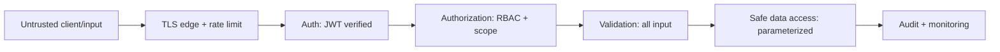
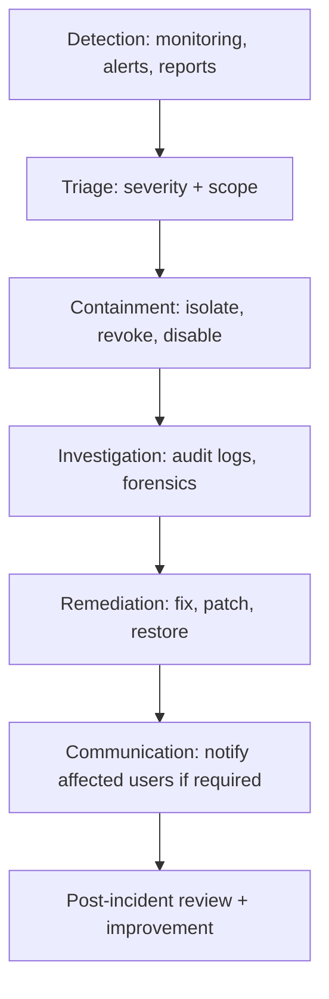

# Campusly V2 — Security & Privacy Handbook

> **Document type:** Security & privacy standard — official handbook
> **Product:** Campusly V2 (formerly PU Chat)
> **Status:** Authoritative v1.0
> **Authority:** This is the definitive security and privacy standard for the entire platform. All implementation MUST conform. It covers security architecture, privacy, abuse prevention, data protection, and operational security only — no code, APIs, or schemas, and it does not repeat authentication mechanics (see `AUTH_SYSTEM.md`).
> **Companion documents:** `AUTH_SYSTEM.md` (identity/auth), `DATABASE_SCHEMA.md` (data model, audit, retention), `MEDIA_SYSTEM.md` (media security), `ARCHITECTURE.md` §11 (security layers), `ADMIN_PANEL.md` (moderation/ops), `PROJECT_VISION.md` §11

---

## Table of Contents
1. [Security Philosophy](#1-security-philosophy)
2. [Threat Model](#2-threat-model)
3. [Authentication & Authorization](#3-authentication--authorization)
4. [Data Protection](#4-data-protection)
5. [Input Validation](#5-input-validation)
6. [Abuse Prevention](#6-abuse-prevention)
7. [Media Security](#7-media-security)
8. [Privacy](#8-privacy)
9. [Logging & Auditing](#9-logging--auditing)
10. [Infrastructure Security](#10-infrastructure-security)
11. [Incident Response](#11-incident-response)
12. [Future Enhancements](#12-future-enhancements)
13. [Security Principles](#13-security-principles)

---

## 1. Security Philosophy

Campusly handles the identities and private conversations of verified students. That makes it a high-value target and a position of profound trust. Security is therefore not a feature bolted on — it is the precondition for the product's existence (`PROJECT_VISION.md` §11).

- **Security by Design.** Security is considered at every design decision, not retrofitted. Surfaces ship with their protections (and moderation) already in place — never an unmoderated, unprotected space.
- **Privacy by Default.** The most private option is the default. We collect the minimum data, store it minimally, and never sell it. Sharing is opt-in.
- **Least Privilege.** Every user, role, token, and process holds the minimum access needed. Privileged capability is rare, scoped, and audited (`AUTH_SYSTEM.md` §4).
- **Defense in Depth.** Multiple independent layers (transport, edge, auth, authorization, validation, data access, monitoring) so no single failure is catastrophic (`ARCHITECTURE.md` §11).
- **Student Trust.** A single breach of trust is existential. We earn trust continuously through how we handle data, safety, and incidents — and **growth never compromises safety**.
- **Responsible Data Collection.** We collect only what serves the student, are transparent about it, and honor deletion. Data we never collect cannot be leaked.

The guiding stance is **zero-trust**: the client is never trusted, every request is authenticated and authorized server-side, and all input is treated as hostile until validated.

---

## 2. Threat Model

The principal threats to a verified student platform and their mitigations. (Mechanisms reference the layered model in `ARCHITECTURE.md` §11.)

| Threat | Description | Mitigation |
|--------|-------------|------------|
| **Fake Accounts** | Bots/outsiders posing as students | Institutional-email verification via Google OAuth; one account per verified email; account-state controls (`AUTH_SYSTEM.md`) |
| **Spam** | Mass unsolicited content/requests | Rate limiting, batching, duplicate prevention, reporting, repeat-offender escalation (§6) |
| **Harassment** | Targeting/abuse of students | Blocking (severs all contact), reporting, graduated moderation, accountable anonymity (the abuser is always identifiable to moderators) |
| **Unauthorized Access** | Accessing data/actions one isn't entitled to | Server-side RBAC + scope checks on every action; zero-trust; signed media URLs |
| **Data Leakage** | Exposure of private data | Data minimization, encryption in transit/at rest, access controls, non-enumerable UUID IDs, no public URLs for private media |
| **SQL Injection** | Injecting malicious SQL | Parameterized queries via Drizzle; never string-built SQL; input validation |
| **XSS** | Injecting scripts into content | Output encoding, content sanitization, framework (React/Next.js) defaults, content-security headers |
| **CSRF** | Forged cross-site requests | Token-based auth (not ambient cookies for API calls), strict CORS, anti-CSRF measures where cookies are used |
| **Brute Force** | Guessing credentials/tokens | No passwords (OAuth-only) removes the main vector; non-enumerable tokens, short TTLs, rate limits on auth endpoints |
| **Session Hijacking** | Stealing a session/token | HTTPS/WSS everywhere; short-lived access tokens; rotating, revocable refresh tokens; socket auth at handshake (`AUTH_SYSTEM.md` §5) |
| **Media Abuse** | Malicious/illegal uploads | Type/size/duration validation, signed uploads, future virus scanning, moderation + illegal-content workflow (§7) |
| **DDoS (high level)** | Overwhelming the service | Edge rate limiting (Nginx), connection limits, and (at scale) CDN/upstream protections; graceful degradation |

The model assumes **everything outside the server core is hostile** and places independent checks at each layer.

---

## 3. Authentication & Authorization

Identity and permissions are the first and most important security layer. Full detail lives in `AUTH_SYSTEM.md`; the security-relevant summary:

- **Verified identity** (Google OAuth + institutional email) keeps out bots and outsiders at the door and underpins **accountable anonymity** — anonymous content is always traceable to a verified account by moderators only.
- **Stateless JWT access tokens** are validated **server-side on every REST request and socket connection**; the client never asserts identity or roles.
- **Refresh tokens** are rotated and revocable, bounding the impact of theft and enabling instant revocation on logout/ban.
- **RBAC + scope** enforce least privilege: every privileged action checks role, scope (community/campus), and account state, and is audit-logged.

Together, authentication answers *who you are* and authorization answers *what you may do* — both enforced on the server, never trusted from the client. This is the backbone of the zero-trust model.

---

## 4. Data Protection

Protection is tailored to each data type's sensitivity. Two universals: **encryption in transit** (HTTPS/WSS everywhere — no plaintext path) and **encryption at rest** (database and object storage encrypted at the storage layer), plus **data minimization** (we store the least necessary).

| Data | Protection |
|------|------------|
| **User Profiles** | Minimal PII; access-controlled by visibility settings; non-enumerable IDs; PII purged on deletion |
| **Messages** | Access limited to conversation participants; encrypted in transit and at rest; soft-delete + retention purge; (future E2EE consideration, `ARCHITECTURE.md` §6.9) |
| **Temporary Media** | Auto-expiring (~48h); signed access; bytes deleted on expiry (`MEDIA_SYSTEM.md` §5) |
| **Voice Messages** | Stored as references in object storage; signed access; temporary by default |
| **Campus Wall Posts** | Campus-scoped access; anonymous posts hide identity from peers while retaining it internally for accountability |
| **Reports** | Access restricted to moderators; contain sensitive context; retention-bounded |
| **Audit Logs** | Append-only, immutable; access tightly restricted; long retention (§9) |
| **Subscription Data** | Financial records; integrity-protected; payment specifics isolated from the provider; long retention |

**Data minimization** is itself a security control: the less we collect and retain, the less can ever be leaked. Retention windows (`DATABASE_SCHEMA.md` §23) ensure data does not outlive its usefulness.

---

## 5. Input Validation

All external input is treated as hostile until validated, at the boundary, before it reaches business logic. Validation is centralized and consistent (shared schemas across client and server).

| Principle | Behavior |
|-----------|----------|
| **Request validation** | Every REST body, query param, and socket payload is validated for shape, type, and constraints before processing |
| **File validation** | Uploads validated for type, size, and (for audio/video) duration at the signed-URL stage, before bytes are accepted |
| **Content length limits** | Posts, messages, bios, etc. enforce maximum lengths to prevent abuse and storage bloat |
| **Allowed file types** | Only explicitly allowed media types are accepted; dangerous/executable types rejected |
| **Malicious payload prevention** | Sanitization and encoding prevent injection (SQL, XSS); structured validation rejects malformed payloads |

Because validation is enforced **server-side** regardless of client checks, a malicious or modified client cannot bypass it. Parameterized data access (Drizzle) ensures validated input cannot become injection.

---

## 6. Abuse Prevention

Keeping the platform healthy at scale requires active abuse resistance, integrated with the Moderation module (`DATABASE_SCHEMA.md` §15; `ADMIN_PANEL.md` §5).

| Vector | Mitigation |
|--------|------------|
| **Spam detection** | Rate limits, duplicate detection, behavioral patterns; reportable; future AI spam detection (§12) |
| **Rate limiting** | Per-user/per-endpoint/per-socket limits on hot actions (auth, matching, messaging, posting, requests) |
| **Fake account prevention** | Institutional-email verification; one account per email; anomaly detection on signups |
| **Report abuse handling** | Easy reporting on every surface; false/malicious reporting is itself tracked and penalized |
| **Repeat offender policies** | Graduated escalation (warn → restrict → ban) using cross-surface history; patterns trigger escalation |
| **Platform integrity** | Blocking, accountable anonymity, audit trails, and moderator oversight keep the ecosystem trustworthy |

The defining advantage: because every account is verified, **abuse always has an accountable owner** — anonymity protects students from peers, never from moderators. This is what keeps Campusly's openness from becoming toxic.

---

## 7. Media Security

Media is a distinct attack surface; its security is detailed in `MEDIA_SYSTEM.md` §9–10. Summary:

- **Secure uploads.** Direct signed uploads to object storage; bytes never transit the API; validated by type/size/duration before acceptance.
- **Signed access.** Media is served only via short-lived signed URLs issued after an authorization check; no permanent public URLs for private media; non-guessable keys.
- **Expiring media.** Temporary media auto-deletes (~48h) via storage lifecycle + cleanup jobs — privacy by deletion.
- **Access control.** Every media access is authorization-checked against the requester's relationship to the content.
- **Illegal content workflow.** Reported/illegal media is hidden immediately, escalated at highest priority, removed (bytes + reference), and audit-logged; handled consistent with content-safety obligations.

---

## 8. Privacy

Privacy is not a separate concern — it is woven through everything above. This section consolidates the privacy model as a coherent whole (complements `AUTH_SYSTEM.md` §9 and `PROJECT_VISION.md` §4.2).

| Aspect | Behavior |
|--------|----------|
| **Anonymous identity** | Anonymous interactions never reveal identity to peers; the verified author link exists only for moderation (`AUTH_SYSTEM.md` §2) |
| **Public vs. private data** | Defaults favor privacy; sharing is opt-in; the user explicitly chooses what to expose |
| **Profile visibility** | Granular per-field/per-tier controls (`campus`/`friends`/`private`) enforced server-side |
| **Friend privacy** | Friends see only what the user's settings permit; unfriending/blocking immediately severs visibility |
| **Data retention** | Each data type has a defined retention window; expired data is purged — data we no longer hold cannot be leaked (`DATABASE_SCHEMA.md` §23) |
| **Account deletion** | Self-serve; PII hard-purged after a grace window; tombstone retained only for referential integrity |

**The privacy promise.** Students own their data; we are custodians. We collect the minimum, store it securely, never sell it, delete it when asked, and never let anonymity leak. This is the promise that makes students trust the platform enough to be honest on it.

---

## 9. Logging & Auditing

Visibility is how we detect, investigate, and prove accountability. Logging is the safety net that catches what prevention missed.

| Log type | What it captures | Retention | Access |
|----------|------------------|-----------|--------|
| **Security logs** | Auth events (success/failure), token anomalies, permission denials | Medium (weeks/months) | Operators/security |
| **Admin actions** | Every admin-panel operation (user, moderation, subscription, flag, announcement) | Long (months/years) | Restricted (super admin / audit) |
| **Login history** | Sign-in events per user (success, failure, device, hashed IP) | Medium | User (their own); operators |
| **Moderation actions** | Every moderation decision (actor, target, action, reason) | Long | Moderation team; appeals |
| **Audit logs** | Combined immutable ledger (`DATABASE_SCHEMA.md` §15.7) of all privileged actions | Long | Tightly restricted; append-only, never edited |

**Why logging is essential.** Logging provides **accountability** (operators are accountable for their actions), **investigation** (security/abuse incidents can be traced), **deterrence** (the knowledge that actions are logged discourages misuse), and **compliance** (records exist to answer "what happened"). Audit logs are **append-only and immutable** within their retention — they cannot be quietly altered or deleted. Logs deliberately exclude secrets and minimize PII; they reference entities by ID, not by sensitive content.

---

## 10. Infrastructure Security

The infrastructure layer protects the platform from outside and from misconfiguration (details in `ARCHITECTURE.md` §14 and `TECH_STACK.md` §9).

| Control | Behavior |
|---------|----------|
| **HTTPS/WSS** | All traffic encrypted in transit; TLS mandatory for REST and WebSocket; no plaintext path |
| **SSL certificates** | TLS certificates auto-renewed (e.g., Let's Encrypt); monitored for expiry |
| **Environment variables** | Configuration and secrets supplied via environment/secret storage; never hardcoded or committed |
| **Secret management** | Signing keys, OAuth secrets, DB credentials loaded from environment; never logged, never in source control |
| **Firewall** | Only required ports exposed (HTTPS/WSS via Nginx); everything else closed |
| **Server updates** | Ubuntu LTS with security patches applied promptly; Node.js/dependencies updated for CVEs |
| **Backup security** | Backups are encrypted and access-controlled; offsite exports follow the same protections as primary data |

The infrastructure is managed as if hostile actors are constantly probing — because they are. Secrets live nowhere a human or a repo can accidentally expose them.

---

## 11. Incident Response

Despite prevention, incidents occur. A clear, rehearsed response process limits damage and restores trust.

| Incident type | Response priorities |
|---------------|---------------------|
| **Security breach** | Contain (revoke, rotate secrets, isolate); investigate scope; remediate; communicate; review |
| **Data leak** | Identify scope of exposure; contain; notify affected users per obligation; remediate; review |
| **Account compromise** | Revoke sessions/tokens; lock account; notify user; investigate; restore |
| **Malware upload** | Remove media immediately; investigate source; restrict uploader; review scanning gaps |
| **Service outage** | Identify root cause; restore service (PM2 restart, failover); communicate status; review |

**Roles.** Super Admin and security lead own incident response. Moderators escalate. Communication is honest, timely, and proportional to the incident. **Recovery** prioritizes student safety over speed of restoration.

**Post-incident review.** Every significant incident produces a retrospective that asks: *What failed? What can prevent recurrence? What should change in this document?* — feeding continuous improvement (§13).

---

## 12. Future Enhancements

Reserved, clearly **future** — additive over the current model.

| Enhancement | Description |
|-------------|-------------|
| **Multi-factor Authentication** | Optional MFA for admins/moderators and high-trust actions (`AUTH_SYSTEM.md` §12) |
| **Passkeys / WebAuthn** | Passwordless device-bound credentials |
| **AI Spam Detection** | Pattern-based automated spam/abuse detection assisting moderation |
| **AI Moderation** | Automated content/behavior triage (assisting, never replacing, human moderators) |
| **Security Dashboard** | Real-time security posture and threat visibility for operators |
| **Threat Intelligence** | External feeds informing proactive defense |
| **Automated Abuse Detection** | Cross-surface behavioral analysis for repeat/sophisticated abuse |

Each layers onto existing auth, moderation, and logging foundations. None is adopted until its benefit is proven and its privacy implications are assessed (consistent with Technology Serving Students — `PROJECT_VISION.md` §4.8).

---

## 13. Security Principles

The governing principles, in priority order. When they tension, higher wins.

| Principle | Meaning |
|-----------|---------|
| **Privacy First** | Minimal collection, private defaults, secure storage, honest deletion; students own their data |
| **Trust Before Growth** | A single breach erodes trust irreversibly; safety constraints are never traded for growth metrics |
| **Secure by Default** | The safe option is the default; the system fails closed; security requires no user action |
| **Least Privilege** | Every token, role, and process holds the minimum access needed and no more |
| **Transparency** | All privileged actions are logged and auditable; operators are themselves accountable |
| **Continuous Improvement** | Security is never "done"; every incident, review, and audit improves the model |

> When any choice tensions with these principles: **privacy and student safety > security > usability > convenience.** Security should never *unnecessarily* reduce usability — but when the choice is between a slightly harder flow and a risk to students, safety wins.

---

## Closing Note

This document is the official security and privacy handbook for Campusly V2. It defines a model that is **privacy-first, zero-trust, scalable, abuse-resistant, and student-safe** — where security is designed in from the start, layered for depth, and continuously improved through logging, auditing, and incident review.

It references rather than repeats the authentication system (`AUTH_SYSTEM.md`), media security (`MEDIA_SYSTEM.md`), data model and retention (`DATABASE_SCHEMA.md`), infrastructure and architecture (`ARCHITECTURE.md`, `TECH_STACK.md`), and administration/moderation (`ADMIN_PANEL.md`). Where security intent is unclear, this document decides; where it intersects product intent, `PRODUCT_REQUIREMENTS.md` and `PROJECT_VISION.md` decide. No change to the security model ships without approval and an update here.

*— Chief Security Officer, Principal Security Architect, Backend Security Engineer, DevSecOps Lead & Privacy Consultant, Campusly V2*
