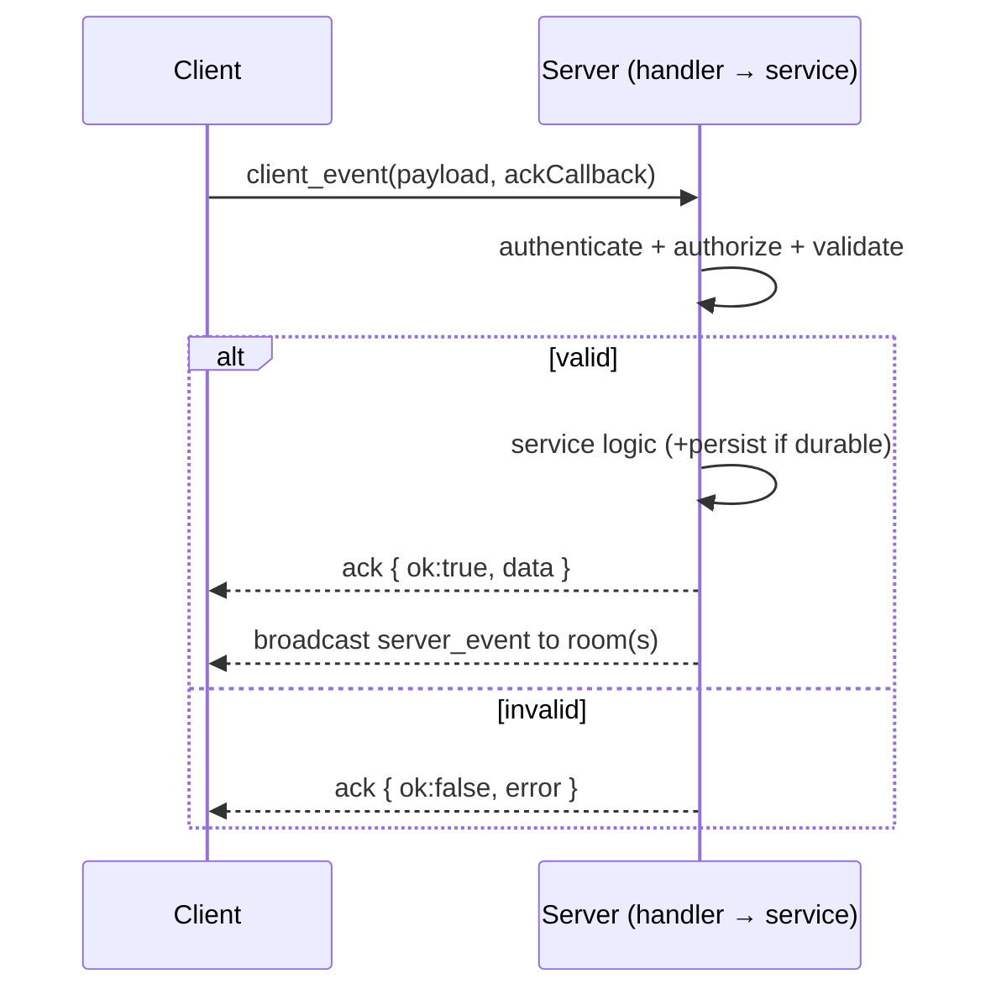
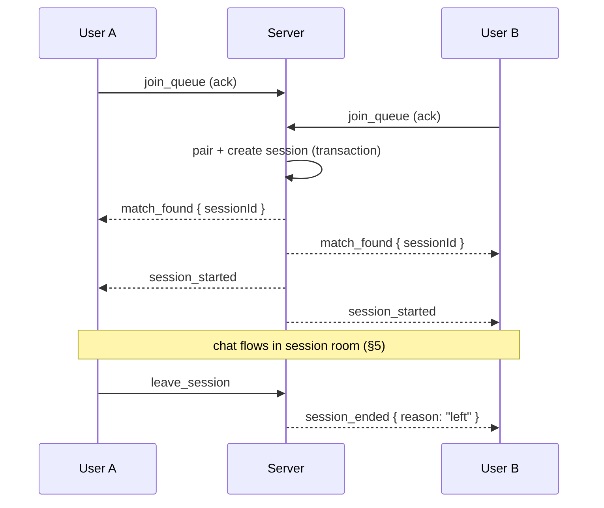

# Campusly V2 — Socket.IO Event Contract

> **Document type:** Real-time communication contract (frontend ↔ backend)
> **Product:** Campusly V2 (formerly PU Chat)
> **Status:** Authoritative v1.0
> **Authority:** This is the definitive contract for every Socket.IO event. Frontend and backend MUST conform. No event is added, renamed, or repurposed without approval and an update here. This document covers realtime only — it does **not** duplicate REST API docs (`API_SPEC.md`) or schema (`DATABASE_SCHEMA.md`).
> **Companion documents:** `ARCHITECTURE.md`, `TECH_STACK.md`, `FEATURE_MATRIX.md`, `SECURITY.md`

---

## 1. Introduction

### 1.1 Purpose of Socket.IO
Socket.IO is Campusly's real-time backbone. It carries every interaction that must feel instant: anonymous matching, chat, presence, typing, friend status, live wall updates, and notifications. REST handles request/response CRUD; Socket.IO handles **push** — server-initiated, low-latency events.

### 1.2 Why Socket.IO was chosen
Built-in **reconnection**, **heartbeats**, **rooms/namespaces**, and **transport fallbacks** make it ideal for the flaky mobile networks of our audience, and its room model maps cleanly onto our domain (per-user, per-conversation, per-campus). Full rationale lives in `TECH_STACK.md` §6 and `ARCHITECTURE.md` ADR-02.

### 1.3 Design principles
- **Server is authoritative.** Clients request; the server decides, persists, and broadcasts. No client-trusted state (the V1 matching fix).
- **Thin transport.** Socket handlers validate and delegate to the shared service layer — identical logic to REST.
- **Room-scoped emits.** Never broadcast globally what belongs to a room.
- **Persist-then-emit.** Durable events (messages, notifications) are persisted before/with delivery; ephemeral events (typing, presence) are never persisted.
- **Every client event gets an acknowledgement.** Success or a structured error (§12).

### 1.4 Event naming conventions
- **`snake_case`**, lowercase.
- **Client → Server** events are **verbs/commands**: `join_queue`, `send_message`.
- **Server → Client** events are **facts/notifications** (often past tense): `match_found`, `message_delivered`, `friend_request_received`.
- **Acknowledgement** is delivered via Socket.IO's callback mechanism, returning a standard envelope: `{ ok: true, data }` or `{ ok: false, error }`.
- **Error events** for server-initiated (non-ack) errors use `error:<type>` (§12).
- **Namespacing by domain** via prefixes where helpful (`chat:`, `match:`, `wall:`); this document groups by module.

### 1.5 Event lifecycle

Every client command flows: **authenticate → authorize → validate → service → ack → broadcast.**

---

## 2. Connection Events

| Event | Direction | Purpose | Payload (summary) |
|-------|-----------|---------|-------------------|
| `connect` | C↔S | Socket.IO built-in; connection established | — |
| `authenticate` | C→S | Client presents JWT at/after handshake | `{ accessToken }` |
| `authenticated` | S→C | Confirms identity; client may join rooms | `{ userId }` |
| `authentication_failed` | S→C | JWT missing/invalid/expired; socket will be disconnected | `{ reason }` |
| `heartbeat` | C→S | Liveness ping (also used for queue/presence) | `{ ts }` |
| `disconnect` | C↔S | Built-in; connection closed | `{ reason }` |
| `reconnect` | C↔S | Built-in; client re-established connection | `{ attempt }` |

**Notes.** Authentication occurs at the handshake (preferred) so unauthenticated sockets never reach domain handlers; `authenticate` exists as an explicit fallback/refresh path. On `authentication_failed`, the server emits then disconnects. On `disconnect`, the server cleans up presence, queue membership, and room state. On `reconnect`, the client re-authenticates and rejoins its rooms (§14).

---

## 3. User Presence Events

| Event | Direction | Purpose | Payload |
|-------|-----------|---------|---------|
| `user_online` | S→C | A relevant user (friend) came online | `{ userId }` |
| `user_offline` | S→C | A relevant user went offline | `{ userId, lastSeenAt? }` |
| `presence_update` | S→C | Batched presence state for a set of users | `{ statuses: [{ userId, status }] }` |
| `last_seen_update` | S→C | A user's last-seen timestamp changed | `{ userId, lastSeenAt }` |

**Behavior.** Presence is derived from connection state + `heartbeat`, fanned out only to a user's relevant rooms (friends, active conversations). All presence emits respect each user's **privacy settings** (`show_online_status`, `show_last_seen`); a user who disables presence neither emits nor receives it. Presence is **never persisted** as authoritative state.

---

## 4. Anonymous Matching Events

| Event | Direction | Purpose | Payload |
|-------|-----------|---------|---------|
| `join_queue` | C→S | Enter the matching queue | `{ preferences? }` |
| `leave_queue` | C→S | Cancel waiting | — |
| `queue_status` | S→C | Queue position/state feedback | `{ status, waitingCount? }` |
| `match_found` | S→C | A compatible pair was created; session opened | `{ sessionId }` |
| `match_cancelled` | S→C | Pending match aborted before start | `{ reason }` |
| `match_timeout` | S→C | No match within the wait window | — |
| `session_started` | S→C | Anonymous session is active; join session room | `{ sessionId, startedAt }` |
| `session_ended` | S→C | Session terminated | `{ sessionId, reason }` |

**Flow.** The **server is the sole matching authority**; there is no client-side queue scanning. Pairing + session creation happen in a single transaction (see `ARCHITECTURE.md` §5), after which `match_found` / `session_started` are emitted to both participants, who join the session room. A `heartbeat` keeps the queue entry alive; stale entries are reclaimed.



---

## 5. Chat Events

Chat events serve **both** anonymous sessions and friend chats; the conversation context is identified in the payload (`contextType` + id).

| Event | Direction | Purpose | Payload |
|-------|-----------|---------|---------|
| `send_message` | C→S | Send a message to a conversation | `{ contextType, contextId, type, body?, attachmentIds? }` |
| `receive_message` | S→C | Deliver a message to room members | `{ message }` |
| `message_delivered` | S→C | Message reached a recipient's device | `{ messageId, userId }` |
| `message_read` | C→S / S→C | Mark/notify read up to a message | `{ contextId, lastReadMessageId }` |
| `typing_start` | C→S / S→C | User started typing | `{ contextId, userId }` |
| `typing_stop` | C→S / S→C | User stopped typing | `{ contextId, userId }` |
| `message_deleted` | C→S / S→C | A message was deleted (soft) | `{ contextId, messageId }` |

**Behavior.** `send_message` is **persisted-then-broadcast**: the service authorizes (participants/friends, not blocked), persists, returns an ack with the stored message, then emits `receive_message` to the conversation room. `typing_*` are **ephemeral**, room-scoped, never persisted. `message_read` updates the high-water-mark receipt and notifies the sender (subject to read-receipt privacy). `message_deleted` reflects a soft delete to all room members.

---

## 6. Voice Message Events

Voice messages exchange **media references, never audio bytes.** Audio is uploaded directly to object storage (signed URL via REST); the socket carries only the resulting reference + metadata.

| Event | Direction | Purpose | Payload |
|-------|-----------|---------|---------|
| `voice_upload_started` | C→S | Signal an in-progress voice upload (optional UX) | `{ contextId }` |
| `voice_upload_completed` | C→S | Upload confirmed; attach to a message | `{ contextId, mediaId, durationMs }` |
| `voice_message_received` | S→C | Deliver a voice message reference to room | `{ message }` (type `voice`, with `mediaId`, `durationMs`) |
| `voice_message_expired` | S→C | A temporary voice message has expired | `{ messageId }` |

**Media-reference principle.** The flow is: client requests a signed upload URL (REST) → uploads bytes to object storage → emits `voice_upload_completed` with the `mediaId` → server creates a `voice` message referencing the asset → emits `voice_message_received`. No base64/audio ever transits the socket. This honors the schema rule "references in DB, bytes in object storage."

---

## 7. Temporary Media Events

| Event | Direction | Purpose | Payload |
|-------|-----------|---------|---------|
| `media_uploaded` | C→S | Confirm a temporary image/video upload | `{ contextId, mediaId, kind }` |
| `media_received` | S→C | Deliver a temporary media reference to room | `{ message }` (with `mediaId`, `expiresAt`) |
| `media_expired` | S→C | Media passed its retention window | `{ messageId, mediaId }` |
| `media_deleted` | S→C | Media removed (by user/moderation) | `{ messageId, mediaId }` |

**48-hour expiration.** Temporary media carries `expiresAt = createdAt + 48h` (policy-configurable). When the cleanup job/storage lifecycle deletes the bytes, the server emits `media_expired` so clients update the UI (e.g., "this photo has expired"). `media_deleted` covers earlier removal. As with voice, only references move over the socket.

---

## 8. Friend Events

| Event | Direction | Purpose | Payload |
|-------|-----------|---------|---------|
| `friend_request_sent` | S→C | Ack/echo to sender that request was created | `{ requestId, receiverId }` |
| `friend_request_received` | S→C | Notify recipient of an incoming request | `{ requestId, fromUser }` |
| `friend_request_accepted` | S→C | Notify sender the request was accepted | `{ friendshipId, user }` |
| `friend_removed` | S→C | Notify a user a friendship ended | `{ friendshipId }` |
| `user_blocked` | S→C | Confirm a block took effect (to blocker) | `{ blockedUserId }` |

**Behavior.** Requests, acceptance, removal, and block are **commands over REST** (state changes), but their **real-time notifications** flow over sockets to the affected user rooms so UIs update instantly. On acceptance, identities are revealed and a friend chat becomes available (a conversation room). On block, the server tears down any shared rooms and suppresses all future events between the two users.

---

## 9. Campus Wall Events

Real-time wall updates keep a campus feed live without polling. Emitted to the **campus room** (and community room for community posts).

| Event | Direction | Purpose | Payload |
|-------|-----------|---------|---------|
| `new_post` | S→C | A new visible post appeared on the wall | `{ post }` |
| `new_reply` | S→C | A new reply on a post | `{ postId, reply }` |
| `new_reaction` | S→C | Reaction count changed on a target | `{ targetType, targetId, counts }` |
| `post_deleted` | S→C | A post was removed/hidden | `{ postId }` |
| `announcement_created` | S→C | A privileged announcement was posted | `{ announcement }` |

**Behavior.** Post/reply/reaction **creation** is REST; the resulting real-time fan-out is socket-based to the relevant campus/community room. Anonymous posts are delivered already anonymized (no author identity in payload). Reaction events send updated **counts** (maintained counters), not full reaction lists.

---

## 10. Notification Events

| Event | Direction | Purpose | Payload |
|-------|-----------|---------|---------|
| `notification_created` | S→C | A new notification for the user | `{ notification }` |
| `notification_read` | C→S / S→C | Mark/sync a notification as read | `{ notificationId }` |
| `notification_removed` | S→C | A notification was dismissed/expired | `{ notificationId }` |

**Behavior.** Notifications are **persisted then pushed** to the user's personal room for online delivery, and remain available for offline users on next load (durable). `notification_read` syncs read state across a user's devices. Email/push channels are handled by the notification queue (out of socket scope).

---

## 11. Admin Events

Privileged server-initiated events. All originate from RBAC-checked admin/moderator actions (enforced server-side; the socket merely delivers the effect) and are audit-logged.

| Event | Direction | Purpose | Payload |
|-------|-----------|---------|---------|
| `announcement_broadcast` | S→C | Push a platform/campus announcement live | `{ announcement, audience }` |
| `user_suspended` | S→C | Notify a user their account was restricted/banned; force session teardown | `{ reason, until? }` |
| `maintenance_mode` | S→C | Inform clients maintenance is active | `{ enabled, message? }` |
| `feature_toggle` | S→C | Push a feature-flag change so clients adapt live | `{ key, isEnabled }` |

**Behavior.** `announcement_broadcast` targets the appropriate scope room (all/campus/subscribers). `user_suspended` is emitted to the affected user's sockets and triggers immediate disconnect + token invalidation (the user cannot continue). `maintenance_mode` and `feature_toggle` let the client respond instantly to platform-level changes without a redeploy or refresh.

---

## 12. Error Events

Two error channels: **acknowledgement errors** (the standard response to a client command) and **server-initiated error events** (for out-of-band failures). Both use a consistent envelope.

**Standard error envelope:** `{ code, message, details? }`.

| Error code | Channel | Meaning |
|------------|---------|---------|
| `unauthorized` | ack / `error:unauthorized` | Missing/invalid/expired auth, or not permitted for this action/room |
| `validation_error` | ack / `error:validation` | Payload failed validation (shape, limits, required fields) |
| `rate_limited` | ack / `error:rate_limited` | Too many events; includes `retryAfter` in `details` |
| `forbidden` | ack | Authenticated but lacks role/permission (e.g., blocked, not a participant) |
| `not_found` | ack | Target conversation/session/entity does not exist |
| `conflict` | ack | State conflict (e.g., already in queue, duplicate request) |
| `server_error` | ack / `error:server` | Unexpected server failure (no internal details leaked) |

**Rules.** Errors never expose stack traces, SQL, or secrets. Every client command resolves with either `{ ok:true }` or `{ ok:false, error }`. Server-initiated errors (e.g., a forced disconnect cause) use the `error:<type>` events. The client is responsible for surfacing user-friendly messaging and honoring `rate_limited.retryAfter`.

---

## 13. Event Lifecycle

The canonical end-to-end journey — anonymous match → chat → friend request → session end — showing how the modules' events compose.

```mermaid
sequenceDiagram
    participant A as User A
    participant S as Server
    participant B as User B

    A->>S: join_queue
    B->>S: join_queue
    S->>S: pair + create session (txn)
    S-->>A: match_found / session_started
    S-->>B: match_found / session_started

    A->>S: send_message
    S-->>B: receive_message
    B->>S: typing_start
    S-->>A: typing_start
    B->>S: send_message
    S-->>A: receive_message
    A->>S: message_read
    S-->>B: message_read

    A->>S: (REST) send friend request
    S-->>B: friend_request_received
    B->>S: (REST) accept request
    S-->>A: friend_request_accepted
    note over A,B: friendship + friend-chat room created

    A->>S: leave_session
    S-->>B: session_ended { reason: "left" }
    note over A,B: anonymous session ends; friendship persists
```

**Key invariants in this flow.** Matching is transactional and server-authoritative; messages are persisted before broadcast; friend state changes are REST commands with socket notifications; and ending the anonymous session never affects the newly formed friendship (independent contexts, per `DATABASE_SCHEMA.md` §8).

---

## 14. Security

Realtime security mirrors the platform's defense-in-depth (see `SECURITY.md`); socket-specific concerns:

- **Authentication before connection.** The JWT is verified at the **handshake**; unauthenticated sockets are rejected and never reach domain handlers. `authentication_failed` → disconnect.
- **JWT verification.** Every connection is bound to a verified user; expired tokens are rejected. On `reconnect`, the client re-authenticates (and may refresh the token via REST first).
- **Room authorization.** A socket may only join rooms it is entitled to: its own user room, conversation rooms it participates in, and campus/community rooms it belongs to. Join requests are authorized server-side; unauthorized joins return `unauthorized`. This prevents eavesdropping on others' conversations.
- **Rate limiting.** Per-socket/per-event rate limits protect hot commands (`send_message`, `join_queue`, `typing_*`); breaches return `rate_limited` with `retryAfter`. Typing events are additionally debounced.
- **Spam prevention.** Message/request flood controls, block enforcement (blocked users exchange no events), and validation of every payload at the boundary. Anonymous-session abuse is reportable, and the verified identity behind the anonymity is recoverable by moderators (accountable anonymity).
- **No client trust.** The client never asserts identity, roles, or room membership; the server derives all of it from the verified connection.

---

## 15. Future Events

Reserved naming conventions for future realtime features, so today's contract stays forward-compatible. **Reserved, not implemented.**

| Domain | Reserved events | Notes |
|--------|-----------------|-------|
| **Voice Calls** | `call:initiate`, `call:ringing`, `call:accept`, `call:reject`, `call:ice_candidate`, `call:offer`, `call:answer`, `call:end` | WebRTC **signaling only** over Socket.IO; media is P2P (STUN/TURN). |
| **Video Calls** | Same `call:*` set with video tracks; `call:video_toggle` | Same signaling foundation as voice. |
| **AI Assistant** | `ai:query`, `ai:response_chunk`, `ai:response_complete` | Streaming assistant responses; privacy-gated. |
| **Live Communities** | `community:live_start`, `community:live_message`, `community:live_end` | Live community sessions over community rooms. |
| **Live Events** | `event:live_start`, `event:live_update`, `event:live_end` | Real-time event participation, links to voice rooms. |

**Convention for future events.** Domain-prefixed (`call:`, `ai:`, `community:`, `event:`), `snake_case` action, commands as verbs and notifications as facts — consistent with §1.4. Any new event must be added to this contract before implementation.

---

## Closing Note

This document is the official Socket.IO contract for Campusly V2. Every realtime interaction between frontend and backend must use the events defined here, with the stated directions, payloads, acknowledgements, and error envelope. It complements — and never duplicates — the REST contract in `API_SPEC.md` and the data model in `DATABASE_SCHEMA.md`.

The governing principles are constant: **server-authoritative, persist-then-emit for durable events, ephemeral-and-room-scoped for transient ones, authenticated and authorized at every step, and media-by-reference never by bytes.** No event is added, renamed, or repurposed without approval and an update here.

*— Principal Real-Time Systems Architect & Lead Backend Engineer, Campusly V2*
