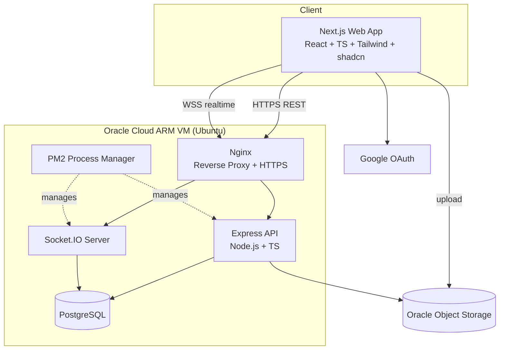
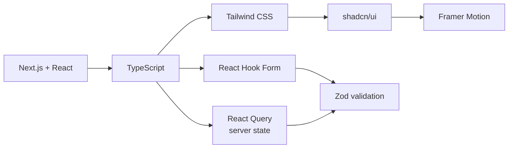
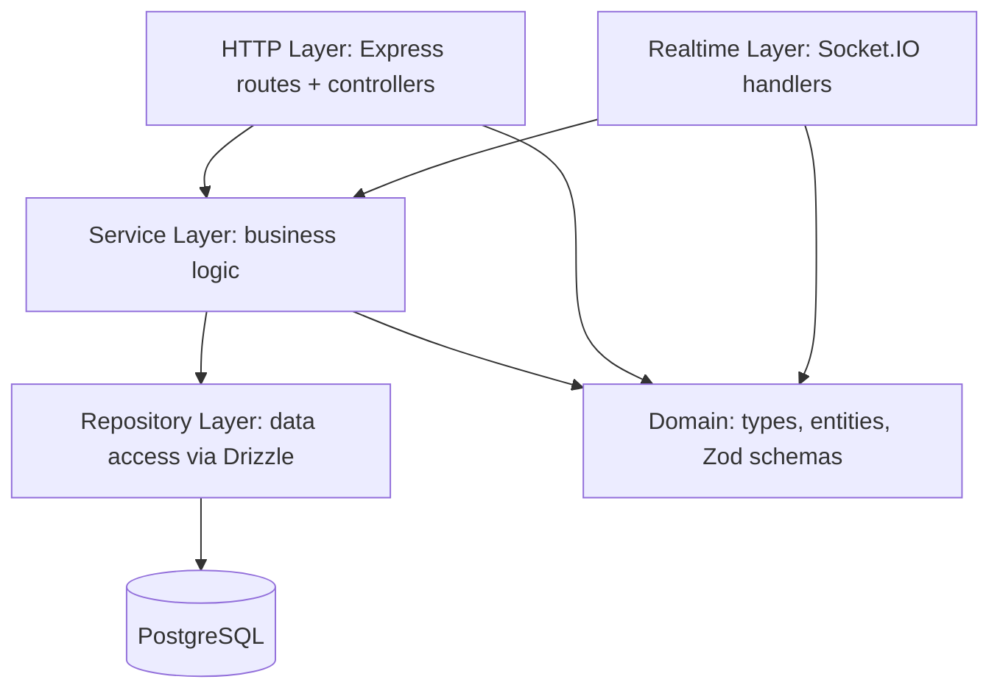
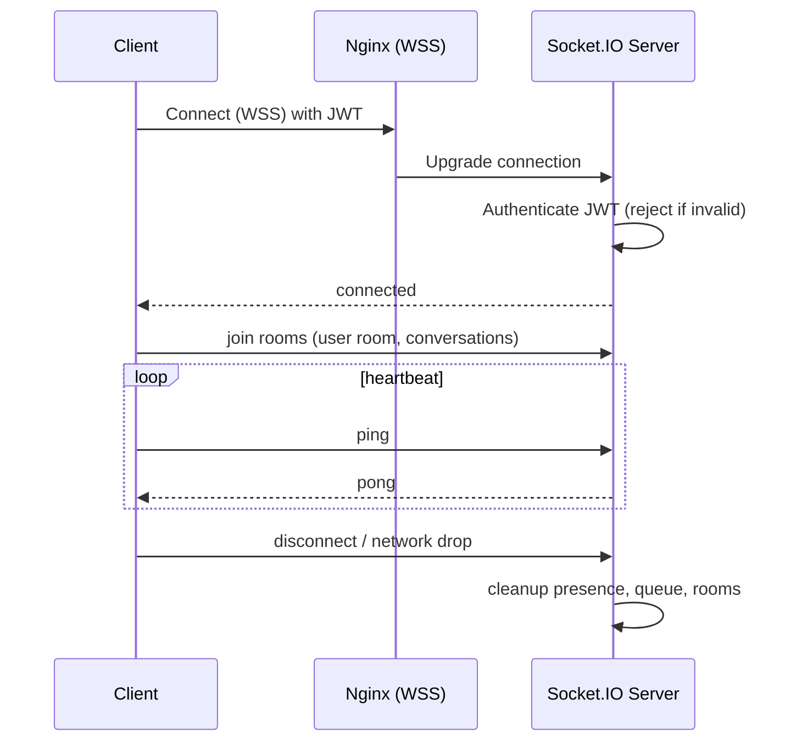
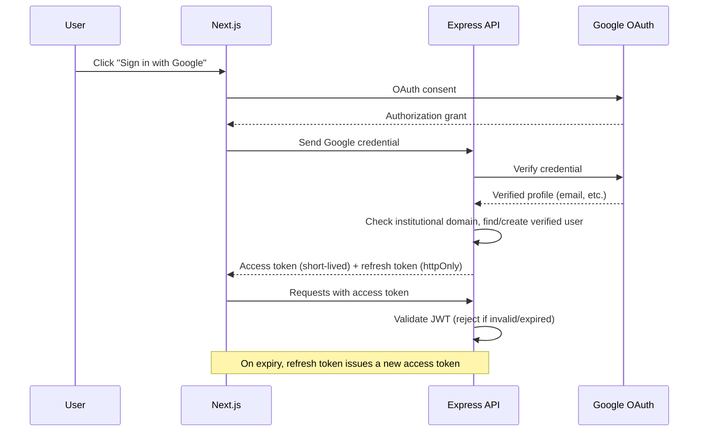
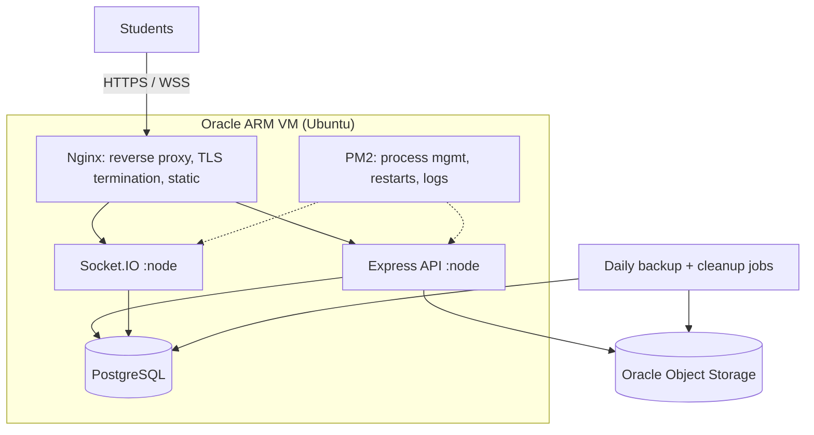
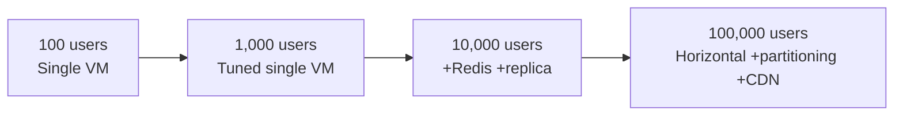

# Campusly V2 — Technology Stack & Engineering Handbook

> **Document type:** Official technical standard (engineering handbook)
> **Product:** Campusly V2 (formerly PU Chat)
> **Status:** Authoritative v1.0
> **Audience:** Every engineer and AI assistant contributing to Campusly
> **Authority:** This document defines the official stack, architecture, and engineering standards. Contributors MUST follow it. No technology may be added or replaced, and no architectural pattern changed, without explicit approval and an update to this document.
> **Companion documents:** `PRODUCT_REQUIREMENTS.md`, `PROJECT_VISION.md`, `DATABASE_SCHEMA.md`, `API_SPEC.md`, `SOCKET_EVENTS.md`, `SECURITY.md`, `UI_GUIDELINES.md`

---

## Table of Contents

1. [Guiding Context & Stack Overview](#1-guiding-context--stack-overview)
2. [Frontend Stack](#2-frontend-stack)
3. [Backend Stack](#3-backend-stack)
4. [Database — PostgreSQL](#4-database--postgresql)
5. [ORM — Drizzle](#5-orm--drizzle)
6. [Real-Time Communication — Socket.IO](#6-real-time-communication--socketio)
7. [Authentication](#7-authentication)
8. [Media Storage](#8-media-storage)
9. [Hosting & Infrastructure](#9-hosting--infrastructure)
10. [Future Communication — WebRTC](#10-future-communication--webrtc)
11. [Development Tools](#11-development-tools)
12. [Project Folder Structure](#12-project-folder-structure)
13. [Coding Standards](#13-coding-standards)
14. [Engineering Principles](#14-engineering-principles)
15. [Technology Decision Records](#15-technology-decision-records)
16. [Performance Strategy](#16-performance-strategy)
17. [Security Strategy](#17-security-strategy)
18. [Scalability Strategy](#18-scalability-strategy)
19. [Future Technology Roadmap](#19-future-technology-roadmap)

---

## 1. Guiding Context & Stack Overview

### 1.1 What we are building

Campusly V2 is a **scalable, real-time, verified student platform** for Indian colleges. It spans Google authentication, student profiles, a campus wall, anonymous matching, a friend system, real-time chat, voice messages, temporary media, communities, events, a marketplace, lost & found, notifications, an admin dashboard, a subscription system, and — in the future — voice and video calls.

The architecture is governed by one overriding tension that every decision in this document resolves:

> **The system must support significant future growth while remaining simple enough for a small engineering team to build, operate, and reason about.**

This is the lens. We do not choose the most powerful technology; we choose the technology with the best **power-to-complexity ratio** for a small team building a real-time social platform on a near-zero infrastructure budget. We reject premature complexity as firmly as we reject naive under-engineering.

### 1.2 The official stack at a glance

| Layer | Technology | Role |
|-------|-----------|------|
| Frontend framework | **Next.js (React)** | SSR/SSG, routing, the web app |
| Language (everywhere) | **TypeScript** | End-to-end type safety |
| Styling | **Tailwind CSS** | Utility-first styling |
| UI components | **shadcn/ui** | Accessible, owned component primitives |
| Animation | **Framer Motion** | Intentional motion |
| Server state | **React Query (TanStack Query)** | Data fetching, caching, sync |
| Forms | **React Hook Form** | Performant form state |
| Validation | **Zod** | Shared runtime + static validation |
| Backend runtime | **Node.js** | JavaScript server runtime |
| Backend framework | **Express.js** | HTTP API layer |
| Database | **PostgreSQL** | Durable relational data |
| ORM | **Drizzle ORM** | Type-safe SQL + migrations |
| Real-time | **Socket.IO** | Chat, presence, matching, notifications |
| Auth | **Google OAuth + JWT + refresh tokens** | Verified identity & sessions |
| Media storage | **Oracle Object Storage** | Media blobs (never in DB) |
| Hosting | **Oracle Cloud ARM Always Free** | VM, Node, PM2, Nginx |
| Future calls | **WebRTC + STUN/TURN** | Peer-to-peer voice/video |

### 1.3 The architecture at a glance



The design is a **modular monolith**: a single deployable backend with clean internal boundaries (API layer, service layer, repository layer, realtime layer). This gives us the operational simplicity a small team needs today while preserving clean seams to extract services later, if and only if scale ever demands it. The reasoning behind this choice — and every other — follows.

---

## 2. Frontend Stack

The frontend must deliver the premium, calm, fast experience promised in `PROJECT_VISION.md` while remaining productive for a small team. Each library below is chosen for a specific job, and each displaces specific alternatives.

### 2.1 Next.js

**Purpose.** Next.js is our React framework: it provides file-based routing, server-side rendering (SSR) and static generation (SSG), API routes, image optimization, code splitting, and a mature production build pipeline out of the box.

**Why selected.**
- **Performance by default.** SSR/SSG and automatic code splitting deliver the fast first paint our Indian mid-range-mobile audience needs (a performance-as-accessibility concern from the vision).
- **SEO and shareability.** Public surfaces (campus wall posts, events, communities, marketplace listings) benefit from server rendering for discoverability and link previews.
- **Single mental model.** One framework spans routing, rendering, and data loading, reducing cognitive load for a small team.
- **Ecosystem maturity.** The largest React meta-framework with the deepest community, hosting, and tooling support.

**Alternatives not chosen.**

| Alternative | Why not |
|-------------|---------|
| **Create React App / Vite SPA** | No SSR/SSG; worse first-paint and SEO; we'd rebuild routing and optimization ourselves. |
| **Remix** | Excellent, but smaller ecosystem and less familiar; Next.js's SSG and image pipeline fit our content surfaces better. |
| **Plain React** | Too low-level; we'd reinvent routing, splitting, and rendering. |

### 2.2 React

**Purpose.** React is the underlying UI library — the component model on which Next.js and our entire frontend are built.

**Why selected.** It is the industry standard with the largest talent pool, ecosystem, and longevity. shadcn/ui, Framer Motion, React Query, and React Hook Form are all React-native. Choosing React maximizes hireability and library availability.

**Alternatives not chosen.** Vue and Svelte are excellent but have smaller ecosystems for our specific needs (shadcn/ui in particular is React-only), and React's talent pool in India is the deepest — a real hiring advantage for a small startup.

### 2.3 TypeScript

**Purpose.** TypeScript adds static typing to JavaScript across the frontend (and, as Section 3 explains, the entire stack).

**Why selected.**
- **Correctness.** Types catch a large class of bugs at compile time — invaluable for a small team that cannot afford large QA cycles.
- **Refactorability.** Confident, IDE-assisted refactoring as the codebase grows.
- **Self-documenting.** Types are living documentation of data shapes and contracts.
- **End-to-end type safety.** Combined with Zod and Drizzle, types flow from the database through the API to the UI.

**Alternatives not chosen.** Plain JavaScript is rejected for any non-trivial codebase; the absence of types is a false economy that compounds into instability. This is mandated by project rules: **TypeScript everywhere.**

### 2.4 Tailwind CSS

**Purpose.** A utility-first CSS framework for styling directly in markup with a constrained design-token system.

**Why selected.**
- **Consistency.** A shared scale (spacing, color, typography) enforces the "consistent spacing, no clutter" design philosophy automatically.
- **Speed.** No context-switching to separate stylesheets; rapid iteration.
- **Small output.** Unused styles are purged, keeping bundles lean.
- **shadcn/ui pairing.** shadcn/ui is built on Tailwind, so they reinforce each other.

**Alternatives not chosen.**

| Alternative | Why not |
|-------------|---------|
| **CSS Modules / plain CSS** | More boilerplate; harder to keep a consistent token system. |
| **Styled-components / Emotion (CSS-in-JS)** | Runtime cost and SSR friction; Tailwind is zero-runtime. |
| **Bootstrap / MUI** | Opinionated visual identity that fights our custom premium aesthetic. |

### 2.5 shadcn/ui

**Purpose.** A collection of accessible, unstyled-by-default component primitives (built on Radix UI + Tailwind) that we **copy into our codebase and own**, rather than install as a black-box dependency.

**Why selected.**
- **Ownership and control.** Components live in our repo; we can customize them fully to our premium design language without fighting a library's opinions.
- **Accessibility.** Built on Radix primitives, which handle focus management, ARIA, and keyboard interaction correctly — directly serving our accessibility principle.
- **No version lock-in.** Because we own the code, we are never blocked by an upstream library's release cycle.

**Alternatives not chosen.** Material UI and Ant Design impose strong visual identities and are heavier; Chakra is good but a runtime dependency we don't own. shadcn/ui's "own the code" model is the best fit for a product whose brand depends on bespoke polish.

### 2.6 Framer Motion

**Purpose.** A declarative animation library for React.

**Why selected.** Our design philosophy demands "elegant animations" where "every interaction feels intentional." Framer Motion makes purposeful motion (transitions, layout animations, gestures) simple and performant, without hand-rolling animation logic. It is the React-native standard for this.

**Alternatives not chosen.** CSS transitions alone are too limited for orchestrated, interruptible motion; GSAP is powerful but imperative and less React-idiomatic. Motion must always serve communication, never decoration or delay (see `UI_GUIDELINES.md`).

### 2.7 React Query (TanStack Query)

**Purpose.** Management of **server state** — fetching, caching, background refetching, and synchronizing data from our API.

**Why selected.**
- **The right tool for server state.** Most "state management" pain is actually server-state caching. React Query solves caching, deduplication, stale-while-revalidate, retries, and invalidation declaratively.
- **Less boilerplate.** Eliminates hand-written loading/error/caching logic.
- **Realtime synergy.** Pairs cleanly with Socket.IO: socket events invalidate or update query caches, keeping UI fresh.

**Alternatives not chosen.**

| Alternative | Why not |
|-------------|---------|
| **Redux / Redux Toolkit** | Heavy for our needs; conflates server and client state; far more boilerplate. |
| **Raw useEffect + fetch** | Reinvents caching, retries, and invalidation badly. |
| **SWR** | Comparable, but React Query has richer mutation and cache-control APIs for our needs. |

For the small amount of genuine **client state** (UI toggles, local preferences), React's built-in state and context suffice — we deliberately avoid a global state library until proven necessary (YAGNI).

### 2.8 React Hook Form

**Purpose.** Performant, ergonomic form state management.

**Why selected.** Forms are everywhere (auth, profile, posts, listings, events). React Hook Form minimizes re-renders (uncontrolled inputs), has a tiny footprint, and integrates natively with Zod for validation. It keeps complex forms fast and maintainable.

**Alternatives not chosen.** Formik is heavier and re-renders more; hand-rolled form state is error-prone and verbose.

### 2.9 Zod

**Purpose.** A TypeScript-first schema validation library used for **runtime validation** that also **infers static types**.

**Why selected.**
- **One schema, two guarantees.** A Zod schema validates data at runtime *and* produces a TypeScript type — no drift between validation and types.
- **Shared across the stack.** The same Zod schemas validate form input on the client and request bodies on the server (placed in shared types), giving a single source of truth.
- **Security.** Server-side input validation (a hard requirement) is expressed cleanly and composably.

**Alternatives not chosen.** Yup has weaker TypeScript inference; Joi is server-only and not type-first; class-validator ties us to decorators and classes. Zod's type inference and isomorphism are decisive.

### 2.10 Frontend stack summary



---

## 3. Backend Stack

### 3.1 Node.js

**Purpose.** Node.js is our server runtime — an event-driven, non-blocking JavaScript runtime.

**Why selected.**
- **Real-time fit.** Node's event loop is ideal for I/O-bound, connection-heavy workloads — exactly our profile (Socket.IO connections, chat, presence, notifications).
- **One language, one team.** JavaScript/TypeScript on both client and server lets a small team share types, validation (Zod), and mental models across the whole stack.
- **Ecosystem.** The npm ecosystem provides mature libraries for everything we need.
- **Socket.IO native.** Socket.IO is a Node library; our realtime layer is first-class here.

**Alternatives not chosen.** Go and Rust offer higher raw throughput but force a second language, splitting a small team and breaking end-to-end type sharing. Python (Django/FastAPI) is excellent but again a separate language with weaker real-time ergonomics for our case. Node's unification of the stack wins for our team size and workload.

### 3.2 Express.js

**Purpose.** Express is our HTTP framework — a minimal, unopinionated layer for routing, middleware, and request handling.

**Why selected.**
- **Simplicity and control.** Express is small and transparent; we compose exactly the architecture we want (Section 3.4–3.6) rather than conforming to a framework's prescribed structure.
- **Maturity and ubiquity.** The most battle-tested Node HTTP framework, with the widest middleware ecosystem and talent pool.
- **Low cognitive overhead.** A small team can fully understand Express; there is little hidden magic.

#### Why Express instead of NestJS

This is a deliberate, important decision.

| Dimension | Express | NestJS |
|-----------|---------|--------|
| Learning curve | Minimal | Steep (decorators, modules, DI, Angular-like concepts) |
| Structure | We impose our own (clean, explicit) | Prescribed and opinionated |
| Magic / abstraction | Very little | Significant (decorators, metadata, DI container) |
| Team fit (small) | Excellent — easy onboarding | Heavier — more to learn before productivity |
| Flexibility | Total | Within framework conventions |

NestJS is a fine framework, and its built-in dependency injection and structure are genuinely valuable at large team scale. But for a **small team optimizing for simplicity and transparency**, Express's minimalism is the better fit. We get clean architecture not from a framework's mandate but from our own disciplined layering (services, repositories) — which keeps the door open to introduce DI later (Section 3.6) without inheriting NestJS's full conceptual weight now. This is KISS and YAGNI applied to framework choice.

### 3.3 Why TypeScript (backend)

TypeScript is mandatory on the backend for the same reasons as the frontend, amplified by server-side stakes:
- **Contract safety.** Request/response shapes, service interfaces, and repository signatures are typed, catching integration bugs at compile time.
- **End-to-end types.** Drizzle infers types from the schema; Zod validates and types inputs; those types flow to the client via shared packages. A column rename surfaces as a compile error across the stack.
- **Maintainability.** Per project rules, TypeScript everywhere, SOLID, and clean architecture are required. Types are the foundation that makes safe refactoring possible.

### 3.4 Project structure philosophy

The backend follows a **feature-oriented, layered (clean) architecture**. The guiding rule: **dependencies point inward** — outer layers (HTTP, sockets) depend on inner layers (services, domain), never the reverse.



- **HTTP layer (controllers/routes).** Thin. Parses and validates requests (Zod), calls a service, formats the response. No business logic.
- **Realtime layer (socket handlers).** Thin. Validates socket events, calls services, emits results. Shares the same services as HTTP — business logic lives in one place regardless of transport.
- **Service layer.** The heart of the application. Contains all business logic and orchestrates repositories. Transport-agnostic and unit-testable.
- **Repository layer.** The only layer that touches the database (via Drizzle). Encapsulates all queries behind intention-revealing methods.
- **Domain.** Shared types, entities, and Zod schemas — the vocabulary of the system.

### 3.5 Service layer architecture

The **service layer** is where business rules live. A service:
- Receives already-validated input (validation happens at the edge).
- Enforces business rules and invariants (e.g., "a user cannot be matched with themselves," "a banned user cannot post").
- Coordinates one or more repositories within a transaction where needed (e.g., creating a match session atomically).
- Is independent of Express and Socket.IO, so the same logic serves both REST and realtime, and can be tested in isolation.

This single-source-of-truth-for-logic approach is why anonymous matching, posting, and messaging behave identically whether triggered over HTTP or sockets — directly addressing V1's bugs that arose from logic scattered across the client.

### 3.6 Repository pattern

The **repository pattern** isolates data access behind an interface of meaningful methods (`findUserById`, `createMatchSession`, `listCampusWallPosts`). Benefits:
- **Separation of concerns.** Services express *what* they need; repositories handle *how* it's fetched.
- **Testability.** Services can be tested against in-memory or mocked repositories.
- **Query discipline.** All SQL lives in one layer, making indexing and performance review tractable.
- **Swappability.** The underlying access (Drizzle today) can evolve without rippling through business logic.

### 3.7 Dependency injection (future)

Today, dependencies are wired explicitly and simply (constructor parameters / factory functions) — sufficient and transparent for our size. As the codebase grows, we may introduce a lightweight **dependency injection** approach (a simple container or a library like `tsyringe`) to manage wiring and improve testability. We deliberately defer this (YAGNI): we adopt DI only when manual wiring becomes a genuine pain point, and we will document the decision here when we do. The clean layering we maintain now makes that future transition low-cost.

### 3.8 Clean architecture principles

The backend honors clean architecture: **business logic is independent of frameworks, transports, and the database.** Express, Socket.IO, and PostgreSQL are details at the edges; the service/domain core does not depend on them. This protects our most valuable code (the rules of the product) from churn in infrastructure choices and keeps the system testable and comprehensible — the maintainability mandate from project rules.

---

## 4. Database — PostgreSQL

### 4.1 Why PostgreSQL

PostgreSQL is our single source of durable truth. Campusly's data is **deeply relational** — users, friendships, sessions, messages, communities, memberships, events, listings, reports, subscriptions — with rich relationships and strong consistency requirements (a match session must be created atomically; a friendship has exactly two consistent sides). PostgreSQL is the ideal fit:

- **Relational integrity.** Foreign keys, constraints, and ACID transactions enforce correctness at the data layer — not in fragile application code.
- **Powerful querying.** Complex joins, aggregations, window functions, and CTEs make analytics and moderation queries (a V1 pain point) straightforward.
- **JSONB when needed.** For semi-structured fields (metadata, settings), JSONB gives document-style flexibility *within* a relational database — best of both worlds.
- **Maturity and reliability.** Decades of production hardening; predictable, well-understood behavior.
- **Cost.** Open-source, self-hostable on our Oracle ARM VM at zero licensing cost.

### 4.2 Advantages over alternatives

| Alternative | What it is | Why PostgreSQL instead |
|-------------|-----------|------------------------|
| **Firebase / Firestore** | Hosted NoSQL document DB | V1 used it and hit the wall: runaway read/write costs, complex security rules, hard analytics, and vendor lock-in. PostgreSQL gives predictable cost, real joins, and ownership. This migration is the central lesson of V2. |
| **MongoDB** | NoSQL document DB | Our data is relational with strong consistency needs; modeling friendships, sessions, and memberships in documents invites duplication and consistency bugs. Postgres's relations + transactions fit far better, and JSONB covers the rare document-shaped field. |
| **MySQL** | Relational DB | Comparable, but PostgreSQL has richer types (JSONB, arrays), stronger standards compliance, better complex-query and concurrency behavior, and superior extensibility. A close call, decided on capability headroom. |
| **Supabase** | Hosted Postgres + BaaS | It *is* Postgres, which validates our choice. We self-host on Oracle ARM for zero cost and full control during validation; we could adopt Supabase later if managed convenience outweighs cost. No lock-in either way since it's standard Postgres. |
| **Oracle Database** | Enterprise RDBMS | Powerful but heavy, costly, and operationally complex — massive overkill for a small team. (Note: we use Oracle *Cloud* for the free VM and object storage, not Oracle *Database*.) |

### 4.3 Indexing strategy

Indexing is deliberate, not reflexive. The strategy:
- **Index foreign keys** used in joins (e.g., `user_id` on messages, memberships).
- **Index high-selectivity query columns** that appear in `WHERE`/`ORDER BY` on hot paths (e.g., campus-scoped wall queries by `university_id` + `created_at`).
- **Composite indexes** for common multi-column filters (e.g., `(university_id, created_at DESC)` for wall feeds), ordered by selectivity and sort needs.
- **Partial indexes** for filtered subsets (e.g., active sessions, pending friend requests, unresolved reports) to keep indexes small and fast.
- **Avoid over-indexing.** Every index costs write performance and storage; we add indexes driven by real query plans (`EXPLAIN ANALYZE`), not speculation.

Detailed index definitions live in `DATABASE_SCHEMA.md`; this document sets the philosophy.

### 4.4 Transactions

Transactions guarantee our hardest invariants. The canonical example is **anonymous matching**: pairing two users, creating a session, and clearing their queue entries must be a single atomic unit — the V1 failure of non-atomic matching produced race conditions and ghost sessions. In V2, such operations execute inside PostgreSQL transactions with appropriate isolation, ensuring all-or-nothing correctness. Other transactional flows include accepting a friend request (creating friendship + closing request), subscription changes, and moderation actions (apply action + write audit log together).

### 4.5 Relationships

We model relationships explicitly with foreign keys and join tables:
- **One-to-many:** user → messages, community → posts.
- **Many-to-many:** users ↔ communities (membership join table with role), users ↔ events (RSVP join table).
- **Self-referential:** friendships (user ↔ user), with careful handling of the symmetric pair and status.

Referential integrity is enforced by the database via foreign-key constraints and sensible `ON DELETE` behavior, so orphaned rows cannot occur.

### 4.6 Scalability & future partitioning

PostgreSQL scales comfortably well beyond our foreseeable needs on a single well-tuned instance. Our scaling path (detailed in Section 18):
1. **Vertical scaling** + query/index tuning (covers us to large user counts).
2. **Read replicas** for read-heavy analytics and feeds when reads dominate.
3. **Connection pooling** (e.g., PgBouncer) to handle many concurrent connections efficiently.
4. **Partitioning** (future): high-growth, time-series-like tables — `messages`, `notifications`, `audit_logs` — are natural candidates for **range partitioning by time** (and potentially by `university_id`) once they reach tens of millions of rows. Multi-campus scoping (the `university_id` column) also gives us a natural partition/shard key if we ever need horizontal distribution.

We design schemas now (`university_id` present everywhere, time columns indexed) so that future partitioning is a configuration change, not a rewrite — but we do **not** partition prematurely.

---

## 5. ORM — Drizzle

### 5.1 Why Drizzle ORM

Drizzle is our official ORM/query builder — a TypeScript-first, lightweight layer over SQL.

**Why selected.**
- **SQL-first, not SQL-hiding.** Drizzle's API mirrors SQL closely, so engineers stay in control of the queries that run. There is no opaque query-generation layer producing surprising SQL — crucial for a team that cares about Postgres performance.
- **Best-in-class type safety.** Schema is defined in TypeScript; queries are fully typed and inferred end-to-end, with errors surfaced at compile time. No code-generation step is required to get types.
- **Lightweight & fast.** Minimal runtime overhead and no heavy engine; a thin, predictable layer that suits our performance goals and small footprint.
- **Transparent migrations.** Drizzle Kit generates SQL migrations from schema changes that we can read, review, and version — no black-box migration magic.

### 5.2 Why Drizzle instead of Prisma or Sequelize

| Dimension | Drizzle | Prisma | Sequelize |
|-----------|---------|--------|-----------|
| Type safety | Excellent (inferred, no codegen needed) | Excellent (via generated client) | Weak/partial |
| Closeness to SQL | Very high (SQL-like) | Abstracted (own query API) | Abstracted |
| Runtime weight | Light | Heavier (engine binary historically) | Moderate |
| Migrations | Readable generated SQL | Good, but more abstracted | Manual/clunky |
| Control over queries | High | Lower (generated SQL can surprise) | Moderate |
| Performance predictability | High | Generally good, occasional overhead | Variable |

- **vs. Prisma:** Prisma is excellent and a close contender, with a polished DX. We choose Drizzle because it stays closer to SQL (we want explicit control over the queries hitting Postgres), is lighter at runtime, and needs no separate generated client/engine. For a team that values SQL transparency and performance predictability, Drizzle is the better philosophical fit. Prisma's abstraction is a strength for teams that want to avoid SQL — but we *want* to know our SQL.
- **vs. Sequelize:** Sequelize is older, with weaker TypeScript support and a clunkier migration story. Drizzle's modern type-first design wins decisively.

### 5.3 Migrations

Schema is the single source of truth, defined in TypeScript. Drizzle Kit diffs the schema and generates **versioned SQL migration files** that are committed to the repo, code-reviewed like any other change, and applied deterministically across environments. Because migrations are plain, readable SQL, we always know exactly what runs against production — and we can hand-tune a migration when needed (e.g., adding an index `CONCURRENTLY`). Migration discipline: forward-only in production, reviewed, and tested against a staging copy before deploy.

### 5.4 Type safety & performance

Drizzle gives us a typed pipeline from database to UI: a column's type in the schema flows into query results, into service signatures, and (via shared types) into the frontend. A schema change that breaks a query is a compile error, not a runtime surprise. On performance, Drizzle's thin, SQL-faithful design means the queries we write are essentially the queries that run — no hidden N+1 surprises from an over-eager abstraction — and we tune them with the indexing strategy of Section 4.3.

---

## 6. Real-Time Communication — Socket.IO

### 6.1 Why Socket.IO

Real-time is core to Campusly (chat, presence, typing, matching, notifications). Socket.IO is our official real-time technology — a battle-tested library over WebSockets with automatic fallbacks, reconnection, rooms, and an event-based API.

**Why selected.**
- **Reliability features built in.** Automatic reconnection, heartbeats, and fallback transports handle the flaky mobile networks of our audience gracefully.
- **Rooms and namespaces.** First-class primitives for the grouping we need (per-session, per-conversation, per-campus, per-community).
- **Event model.** A clean, named-event API maps naturally onto our domain events.
- **Node-native and mature.** Deep ecosystem and a clear horizontal-scaling path (adapter pattern).

**Alternatives not chosen.** Raw WebSockets (`ws`) require us to rebuild reconnection, heartbeats, rooms, and fallbacks ourselves. Managed services (Pusher, Ably) add cost and external dependency that conflict with our zero-cost validation phase and self-ownership philosophy. Socket.IO is the pragmatic sweet spot.

### 6.2 Connection lifecycle



Every socket connection is **authenticated** on connect (JWT validated server-side); unauthenticated sockets are rejected. On connect, a user joins their personal room and relevant conversation rooms. On disconnect (explicit or detected via heartbeat), the server cleans up presence and reclaims any matching-queue slot.

### 6.3 Events, rooms, and core flows

- **Events.** Named domain events (e.g., message send/receive, typing start/stop, match found, friend status change, notification). The authoritative catalog lives in `SOCKET_EVENTS.md`; this document defines the architecture, that one defines the contract.
- **Rooms.**
  - *User room* (one per user) — for notifications and friend-status fan-out.
  - *Conversation rooms* — for friend chats and anonymous sessions.
  - *Campus / community rooms* — for scoped broadcasts (announcements, wall activity).
- **Presence.** Online/last-seen derived from connection state + heartbeats, respecting privacy settings.
- **Typing indicators.** Lightweight, ephemeral events scoped to a conversation room; never persisted.
- **Friend status.** Status changes fan out to the relevant user rooms.
- **Matching.** Users join a matching flow; the **server is the sole authority** (no client queue scanning). On a pair, the server creates the session transactionally and emits a match event to both — the corrected V2 architecture.
- **Notifications.** Delivered in real time to the user room, with persistence so they survive disconnection.

### 6.4 Scalability strategy

Today, a single Socket.IO server on our VM handles our load comfortably. The horizontal path, when needed (Section 18):
- Introduce the **Socket.IO Redis adapter** so multiple Socket.IO instances share rooms and broadcast across processes/servers via Redis pub/sub.
- Use **sticky sessions** at Nginx so a client stays bound to one instance.
- Scale Socket.IO instances independently of the REST API if realtime load grows faster than request load.

We do **not** introduce Redis or multi-instance scaling now (YAGNI); the design simply keeps that path open by keeping realtime state in the database and connection-local memory, not in server-global memory that couldn't be shared.

---

## 7. Authentication

### 7.1 The official approach

Authentication uses **Google OAuth** for identity, with **JWT access tokens** and **refresh tokens** for session management. This combination delivers verified student identity (the foundation of the entire platform) with a stateless, scalable session model.

**Why Google OAuth.**
- **Verification by institutional email.** Indian colleges issue Google Workspace accounts; the institutional email domain is our first-pass verification signal that a user is a real student of a real campus.
- **No password management.** We never store or handle passwords — eliminating a whole class of security risk and user friction.
- **Trusted, fast onboarding.** One-tap sign-in students already know and trust, lowering the barrier to entry (a vision priority).

**Why JWT + refresh tokens.**
- **Stateless access.** A short-lived JWT access token carries identity and roles, validated server-side on every request and socket connection without a database lookup — fast and horizontally scalable.
- **Safe longevity.** A longer-lived refresh token (stored securely, rotated on use) issues new access tokens without forcing re-login, balancing security and convenience.

### 7.2 Authentication flow



### 7.3 Authorization

Authentication answers *who you are*; **authorization** answers *what you may do*. We use **role-based access control (RBAC)**: every user carries roles/claims (e.g., student, community moderator, club admin, platform moderator, admin). Authorization is enforced **server-side, by default** — the client is never trusted to gate privileged actions. Sensitive operations (moderation, admin, subscription changes) check roles in the service layer and are audit-logged. The high-level security model lives in `SECURITY.md`.

### 7.4 Session management

- Access tokens are short-lived; refresh tokens are longer-lived, **rotated** on each use, and **revocable** (a revoked or banned user's refresh token is rejected, ending their access).
- Tokens are validated on both REST requests and Socket.IO connections, so realtime and HTTP share one identity model.
- Logout and ban invalidate sessions promptly.

### 7.5 Future MFA support

The architecture leaves room for **multi-factor authentication** as an optional future enhancement (e.g., for admins/moderators or high-trust actions). Because we control the token issuance flow, adding an MFA step before issuing tokens is an additive change that does not disrupt the existing model. We do not build MFA now (YAGNI) but explicitly keep the door open.

---

## 8. Media Storage

### 8.1 The official approach

All media — profile pictures, voice messages, temporary media, future videos, and chat/wall attachments — is stored in **Oracle Object Storage**, never in PostgreSQL. The database stores only **URLs/keys and metadata**. This is a direct, non-negotiable correction of V1's inefficiency of storing media (base64 blobs) in the database.

> **Rule:** The database stores references and metadata. The object store stores bytes. Never store media blobs in PostgreSQL.

### 8.2 Why Oracle Object Storage

- **Cost.** Included in the Oracle Cloud Always Free allowance, keeping our validation-phase cost near zero.
- **Right tool for the job.** Object storage is purpose-built for large, immutable blobs served over HTTP — durable, scalable, and cheap, with no impact on database performance.
- **Co-location.** It sits alongside our Oracle ARM VM, minimizing latency and egress friction.

### 8.3 Upload flow and media types

- **Direct, signed uploads.** Clients upload to object storage using short-lived signed URLs issued by the backend, so large files never transit our API server (keeping the API lean and fast). The backend records the resulting key + metadata in Postgres.
- **Profile pictures.** Validated (type, size), stored, referenced from the user profile.
- **Voice messages.** Recorded on-device, uploaded to object storage; only URL + duration + metadata are persisted and sent over Socket.IO.
- **Temporary media.** Retention-limited objects (see below).
- **Future videos.** The same model scales to video assets without architectural change.

### 8.4 Retention & auto-cleanup

Per the privacy and safety philosophy, some media is **temporary**. Retention is enforced by:
- **Lifecycle policies** on the object store (auto-expire/delete objects after their retention window).
- **Scheduled cleanup jobs** that reconcile orphaned objects (uploaded but never referenced) and purge expired media keys from the database.

This keeps storage lean and honors the promise that fleeting media does not become a permanent record.

### 8.5 CDN possibilities

For now, media is served directly from object storage, which is adequate at our scale. As traffic and geographic spread grow, we can place a **CDN** in front of the bucket (e.g., Cloudflare) to cache media at the edge for lower latency and reduced origin load — an additive optimization introduced only when metrics justify it (Section 18/19).

---

## 9. Hosting & Infrastructure

### 9.1 The official approach

Campusly V2 is hosted on a single **Oracle Cloud ARM Always Free** compute instance running **Ubuntu**, which hosts Node.js (Express API + Socket.IO), PostgreSQL, and Nginx, with PM2 as the process manager. Oracle Object Storage handles media. This gives us a production-grade, fully owned environment at **near-zero cost** during validation — a deliberate strategic advantage that lets us prove product-market fit without burning capital.



### 9.2 Component roles

| Component | Role | Why |
|-----------|------|-----|
| **Oracle ARM VM** | The compute host | Generous Always Free ARM resources at zero cost |
| **Ubuntu** | OS | Ubiquitous, well-documented, stable LTS |
| **Node.js** | Runs API + Socket.IO | Our backend runtime |
| **PM2** | Process manager | Auto-restart on crash, clustering, log management, zero-downtime reloads |
| **Nginx** | Reverse proxy | TLS termination, routing REST and WSS to Node, static serving, rate-limit edge, gzip |
| **HTTPS** | Encrypted transport | TLS certificates (e.g., Let's Encrypt) for all traffic — mandatory |

### 9.3 Reverse proxy & HTTPS

Nginx sits in front of Node as a reverse proxy: it terminates TLS (HTTPS/WSS), routes REST traffic and WebSocket upgrades to the appropriate Node processes, applies edge concerns (compression, basic rate limiting, headers), and can serve static assets. All transport is encrypted; there is no plaintext path.

### 9.4 Scaling strategy (infra)

- **Phase 1 (now):** Single VM, PM2 in cluster mode to use all ARM cores. More than sufficient for early scale.
- **Phase 2:** Vertical scaling (larger instance), Nginx tuning, PostgreSQL connection pooling.
- **Phase 3:** Separate processes/instances for API vs. Socket.IO; introduce Redis + Socket.IO adapter for multi-instance realtime; read replicas for Postgres.
- **Phase 4:** Containerization (Docker) and orchestration only if/when operational complexity genuinely demands it.

Detailed thresholds are in Section 18. The principle: **scale the simple architecture as far as it comfortably goes before adding moving parts.**

### 9.5 Monitoring & daily backups

- **Monitoring.** Process health (PM2), resource metrics (CPU/memory/disk), application logs, and uptime checks. We start with lightweight tooling and add depth as we grow.
- **Daily backups.** Automated **daily PostgreSQL backups** with periodic **offsite exports**, plus GitHub for code and this `/docs` set as infrastructure documentation. Backups are only as good as their restores, so restore is tested periodically. (Backup/DR detail belongs in operational runbooks; this sets the standard.)

---

## 10. Future Communication — WebRTC

### 10.1 The official future approach

Voice calls and video calls are a **future** capability, built on **WebRTC** with **STUN** and **TURN** servers. Socket.IO is used **only for signaling** (exchanging connection metadata); the actual audio/video media flows **peer-to-peer** where possible.

> This is explicitly future work. We document the intended architecture so today's decisions (e.g., keeping Socket.IO as our realtime backbone) remain compatible, but we build none of it until the roadmap reaches it.

### 10.2 How it works

```mermaid
sequenceDiagram
    participant A as Caller
    participant SIG as Socket.IO (signaling only)
    participant B as Callee
    participant STUN as STUN/TURN
    A->>STUN: Discover public address (ICE)
    B->>STUN: Discover public address (ICE)
    A->>SIG: Offer (SDP) + ICE candidates
    SIG->>B: Relay offer
    B->>SIG: Answer (SDP) + ICE candidates
    SIG->>A: Relay answer
    A<-->B: Peer-to-peer media (audio/video)
    Note over A,B: If P2P fails, media relays via TURN
```

- **STUN** helps peers discover their public-facing network addresses for direct connection.
- **TURN** relays media when direct peer-to-peer fails (restrictive NATs/firewalls) — essential for reliable calls on the varied Indian campus networks. TURN has bandwidth cost, so it is a fallback, not the default path.
- **Voice vs. video** share the same WebRTC foundation; video simply adds video tracks.
- **Fallback strategy.** Attempt direct P2P → fall back to TURN relay → degrade gracefully (e.g., voice-only if video fails, clear error if the connection cannot be established).

### 10.3 Why this design

WebRTC's peer-to-peer media keeps server bandwidth costs low (critical on a free-tier budget) and latency low (better call quality). Reusing Socket.IO for signaling means **no new realtime technology** is introduced — signaling is just another set of events on infrastructure we already operate. This is the cheapest, simplest path to high-quality calls, deferred until the product earns the need.

---

## 11. Development Tools

| Tool | Purpose | Why |
|------|---------|-----|
| **GitHub** | Source control, code review, CI host, backups | Industry standard; PRs enforce review; Actions for CI; repo redundancy |
| **VS Code / Kiro** | Editors / AI-assisted IDE | Best-in-class TypeScript tooling; Kiro accelerates spec-driven, AI-assisted development |
| **Claude Opus** | AI engineering assistant | Accelerates implementation, review, and documentation — guided by this handbook |
| **ESLint** | Static analysis / linting | Catches bugs and enforces consistency automatically |
| **Prettier** | Code formatting | Ends formatting debates; uniform style across the team |
| **Husky** | Git hooks | Runs lint/format/type-check/tests pre-commit/pre-push to keep `main` clean |
| **GitHub Actions** | CI/CD | Automated type-check, lint, test, and (later) build/deploy on every push/PR |
| **Docker (future)** | Containerization | Reproducible environments and easier scaling — adopted only when justified |

**Workflow discipline.** Code is reviewed via PRs; CI must pass (type-check, lint, tests) before merge; Husky enforces quality locally so failures are caught early. AI assistants (Claude Opus via Kiro) operate **within the standards of this document and the project rules** — never introducing new technologies or architectural changes without approval.

---

## 12. Project Folder Structure

The repository is a **monorepo** with clear separation between frontend, backend, shared code, docs, infra, scripts, assets, and tests. A monorepo lets a small team share types (especially Zod schemas and domain types) between client and server with zero friction — a major productivity and correctness win.

```text
campusly/
├── apps/
│   ├── web/                     # Next.js frontend
│   │   ├── app/                 # App router (routes, layouts)
│   │   ├── components/          # UI components (shadcn-based)
│   │   ├── features/            # Feature-based modules (wall, chat, matching, ...)
│   │   ├── hooks/               # React hooks (incl. React Query hooks)
│   │   ├── lib/                 # Client utilities, API client, socket client
│   │   └── styles/              # Tailwind config, globals
│   └── api/                     # Express + Socket.IO backend
│       ├── src/
│       │   ├── http/            # Routes + controllers (thin)
│       │   ├── realtime/        # Socket.IO handlers (thin)
│       │   ├── services/        # Business logic (transport-agnostic)
│       │   ├── repositories/    # Data access (Drizzle)
│       │   ├── domain/          # Entities, types
│       │   ├── db/              # Drizzle schema + migrations
│       │   ├── middleware/      # Auth, validation, rate limiting, errors
│       │   └── config/          # Env loading, constants
│       └── tests/
├── packages/
│   ├── shared-types/            # Shared TS types + Zod schemas (client + server)
│   └── config/                  # Shared ESLint, TS, Prettier configs
├── docs/                        # PRODUCT_REQUIREMENTS, PROJECT_VISION, TECH_STACK, ...
├── infra/                       # Nginx config, deploy notes, infra docs (no secrets)
├── scripts/                     # Maintenance, backup, cleanup, seed scripts
├── assets/                      # Static design assets, brand
└── .github/workflows/           # GitHub Actions CI
```

**Principles behind the structure.**
- **Feature-based modules.** Within both web and api, code is organized by feature (matching, chat, wall, communities) rather than by technical type alone, so a feature's code is cohesive and discoverable.
- **Shared types package.** The single source of truth for cross-boundary types and validation (Zod), eliminating client/server drift.
- **Strict layering in the API.** `http`/`realtime` (edges) → `services` (logic) → `repositories` (data) → `db`. Dependencies point inward.
- **Docs and infra are first-class.** Documentation (this set) and infrastructure config live in the repo and are versioned and reviewed like code.

---

## 13. Coding Standards

These standards are enforced by ESLint, Prettier, TypeScript, and code review. They exist to make a codebase written by many hands feel as if it were written by one.

### 13.1 Naming conventions

| Element | Convention | Example |
|---------|-----------|---------|
| Files (components) | `PascalCase.tsx` | `CampusWall.tsx` |
| Files (modules/utils) | `camelCase.ts` | `matchService.ts` |
| Variables / functions | `camelCase` | `createMatchSession` |
| Types / interfaces / classes | `PascalCase` | `MatchSession`, `UserRepository` |
| Constants | `UPPER_SNAKE_CASE` | `MAX_VOICE_DURATION_MS` |
| Database tables / columns | `snake_case` | `wall_posts`, `created_at` |
| Booleans | `is/has/can` prefix | `isVerified`, `canModerate` |
| React hooks | `use` prefix | `useFriendStatus` |

Names must reveal intent. Avoid abbreviations except well-known ones. The cost of a longer name is paid once; the cost of an unclear name is paid forever.

### 13.2 TypeScript rules

- **Strict mode on.** `strict: true`; no implicit `any`.
- **No `any`.** Use `unknown` + narrowing, or proper types. `any` requires justification in review.
- **Prefer `type`/inference.** Let Drizzle and Zod infer types; do not hand-duplicate shapes.
- **Explicit public signatures.** Exported functions and service methods declare parameter and return types explicitly.
- **No non-null assertions (`!`)** except where provably safe and commented.

### 13.3 Error handling

- **Typed, centralized errors.** Use a small set of well-defined error types (e.g., validation, not-found, forbidden, conflict) rather than throwing strings.
- **Fail at the edge, handle centrally.** Validation rejects bad input early; a central Express error-handling middleware maps errors to consistent HTTP responses.
- **Never swallow errors.** Catch only to add context or recover meaningfully; otherwise let it propagate to the central handler.
- **No leaking internals.** Error responses never expose stack traces, SQL, or secrets to clients.

### 13.4 Logging

- **Structured logging.** Log as structured data (JSON) with levels (error/warn/info/debug), not freeform strings.
- **Context, not noise.** Include correlation/request identifiers; log meaningful events, not every line.
- **Never log secrets or PII** beyond what is necessary; reference sensitive values by key name, never value.
- **Audit logging** for security/moderation actions is mandatory and immutable (see `SECURITY.md`).

### 13.5 Validation

- **Validate all external input** (HTTP bodies, query params, socket payloads) with **Zod** at the boundary, before it reaches services.
- **Shared schemas.** Validation schemas live in `shared-types` so client and server validate identically.
- **Trust nothing from the client** — including IDs, roles, and flags; authorization is always re-checked server-side.

### 13.6 API responses

- **Consistent envelope.** A uniform response shape for success and error (e.g., `{ data }` / `{ error: { code, message } }`), so the client handles responses predictably.
- **Correct status codes.** Use accurate HTTP semantics (200/201/400/401/403/404/409/429/500).
- **Pagination by default** on list endpoints (Section 16.2).
- The authoritative contract is `API_SPEC.md`; this sets the conventions it follows.

### 13.7 Comments & documentation

- **Comment the why, not the what.** Code shows what; comments explain intent, trade-offs, and non-obvious decisions.
- **Document every major component** (per project rules): services, complex modules, and public functions get a short doc comment.
- **Keep docs in sync.** Changing behavior means updating the relevant `/docs` file in the same PR.

### 13.8 Reusable components & feature-based architecture

- **DRY components.** Shared UI primitives live in `components/`; feature-specific UI lives within its `features/` module. Extract a shared component when it is genuinely reused, not speculatively (avoid premature abstraction).
- **Feature cohesion.** Each feature (matching, chat, wall, communities, events, marketplace) is a self-contained module on both client and server, communicating through well-defined interfaces. This keeps the codebase navigable and lets features evolve independently.

---

## 14. Engineering Principles

Every engineer (human or AI) follows these principles. They are the values behind the standards.

| Principle | Meaning at Campusly |
|-----------|---------------------|
| **SOLID** | Single-responsibility services/modules; depend on abstractions (repositories) not concretions; small focused interfaces. The backbone of our layered architecture. |
| **DRY** | One source of truth for logic (services), types (shared-types), and validation (Zod). No duplicated business rules across transports. |
| **KISS** | Choose the simplest design that works. Express over NestJS, monolith over microservices, manual wiring over DI — until complexity is justified. |
| **YAGNI** | Don't build for imagined futures. Redis, queues, microservices, MFA, CDN — all deferred until a real need appears. Keep seams open, build nothing speculative. |
| **Clean Architecture** | Business logic independent of frameworks, transports, and DB. Dependencies point inward. |
| **Modular Design** | Feature-based, cohesive modules with clear boundaries; low coupling, high cohesion. |
| **Security First** | Validate all input, trust no client, enforce authz server-side, encrypt transport, never hardcode secrets. |
| **Scalability** | Design schemas, realtime, and storage so the simple architecture scales far and the next step is always open. |
| **Maintainability** | Optimize for the next engineer. Readable code, documented components, consistent style — maintainability over clever quick fixes. |
| **Performance** | Fast by default: efficient queries, caching, pagination, lean payloads, optimized media. |
| **Accessibility** | Accessible components (shadcn/Radix), keyboard and screen-reader support, graceful degradation. A premium product is usable by everyone. |

> When principles tension with each other, resolve in this priority spirit: **Security and trust > simplicity > performance > convenience.** And when in doubt, consult `PROJECT_VISION.md` — the technology serves the mission, never the reverse.

---

## 15. Technology Decision Records

A concise record of every major decision, in the format: Decision → Reason → Alternative considered → Advantages → Trade-offs → Future considerations.

### TDR-01 — Next.js for the frontend
- **Decision:** Use Next.js (React).
- **Reason:** SSR/SSG, routing, image optimization, and code splitting out of the box; best fit for our content + app surfaces.
- **Alternative considered:** Vite SPA, Remix.
- **Advantages:** Performance, SEO/shareability, single mental model, huge ecosystem.
- **Trade-offs:** More framework opinion than a bare SPA; SSR adds some complexity.
- **Future:** Adopt newer Next rendering features as they stabilize.

### TDR-02 — Express over NestJS
- **Decision:** Express.js for the API.
- **Reason:** Simplicity and transparency for a small team; we impose clean architecture ourselves.
- **Alternative considered:** NestJS.
- **Advantages:** Low learning curve, total control, minimal magic, easy onboarding.
- **Trade-offs:** We build structure/DI conventions ourselves rather than getting them prescribed.
- **Future:** Introduce lightweight DI if wiring complexity grows; NestJS reconsidered only if team and complexity scale dramatically.

### TDR-03 — PostgreSQL over Firebase/Mongo/MySQL
- **Decision:** PostgreSQL as the primary database.
- **Reason:** Relational data, ACID transactions, powerful queries, predictable cost; fixes V1's Firebase cost/complexity/lock-in.
- **Alternative considered:** Firebase/Firestore (V1), MongoDB, MySQL, Supabase, Oracle DB.
- **Advantages:** Integrity, joins, JSONB flexibility, analytics, ownership, zero licensing cost.
- **Trade-offs:** We operate the database ourselves (backups, tuning) rather than fully managed.
- **Future:** Read replicas, partitioning, or managed Postgres (Supabase) at scale.

### TDR-04 — Drizzle ORM over Prisma/Sequelize
- **Decision:** Drizzle ORM.
- **Reason:** SQL-faithful, type-first, lightweight, transparent migrations.
- **Alternative considered:** Prisma, Sequelize.
- **Advantages:** End-to-end type safety with control over actual SQL; low runtime weight.
- **Trade-offs:** Younger ecosystem than Prisma; less abstraction (intentional).
- **Future:** Revisit if Drizzle's ecosystem maturity ever blocks us; Prisma remains the fallback.

### TDR-05 — Socket.IO for realtime
- **Decision:** Socket.IO.
- **Reason:** Built-in reconnection, rooms, fallbacks; ideal for flaky mobile networks; clear scaling path.
- **Alternative considered:** Raw WebSockets (`ws`), Pusher/Ably.
- **Advantages:** Reliability features, rooms/namespaces, Node-native, Redis-adapter scaling.
- **Trade-offs:** Slightly heavier than raw WS; some protocol overhead.
- **Future:** Redis adapter + sticky sessions for horizontal scale.

### TDR-06 — Google OAuth + JWT + refresh tokens
- **Decision:** Google OAuth identity with JWT access + refresh tokens.
- **Reason:** Institutional-email verification, no password handling, stateless scalable sessions.
- **Alternative considered:** Email/password, magic links, third-party auth (Auth0/Clerk).
- **Advantages:** Trusted onboarding, verification signal, no password risk, scalable.
- **Trade-offs:** Dependence on Google; users without institutional Google accounts need a future path.
- **Future:** Additional verification methods, optional MFA, more OAuth providers.

### TDR-07 — Oracle Object Storage for media
- **Decision:** Store all media in Oracle Object Storage; only references in Postgres.
- **Reason:** Fixes V1's blob-in-DB inefficiency; cheap, durable, co-located, free-tier.
- **Alternative considered:** DB blobs (V1), Cloudflare R2, AWS S3.
- **Advantages:** Lean DB, scalable media, near-zero cost, signed direct uploads.
- **Trade-offs:** Tied to Oracle ecosystem (mitigated: S3-compatible patterns ease migration).
- **Future:** CDN in front; R2/S3 if economics change.

### TDR-08 — Oracle Cloud ARM Always Free hosting
- **Decision:** Single Oracle ARM VM (Ubuntu) with Nginx + PM2.
- **Reason:** Production-grade environment at near-zero cost during validation; full ownership.
- **Alternative considered:** Vercel + managed DB, AWS/GCP, Render/Railway.
- **Advantages:** Zero cost, control, no vendor PaaS lock-in, room to grow.
- **Trade-offs:** We manage ops ourselves; single-VM is a single point of failure early on.
- **Future:** Multi-instance, containerization, managed services as scale/funding allow.

### TDR-09 — Monorepo with shared types
- **Decision:** Monorepo (web + api + shared packages).
- **Reason:** Share types and Zod schemas across client/server with zero drift.
- **Alternative considered:** Separate repos.
- **Advantages:** Type safety across the boundary, atomic cross-cutting changes, simpler for a small team.
- **Trade-offs:** Slightly more tooling setup; must manage workspace boundaries.
- **Future:** Build orchestration (Turborepo) if build times grow.

### TDR-10 — Modular monolith over microservices
- **Decision:** A single modular backend deployable.
- **Reason:** Operational simplicity for a small team; microservices' overhead is unjustified at our scale.
- **Alternative considered:** Microservices.
- **Advantages:** One deploy, easy local dev, no distributed-systems complexity, fast iteration.
- **Trade-offs:** All scaling is coarse-grained early; must maintain internal discipline to keep modules clean.
- **Future:** Extract a service (e.g., realtime, media, notifications) only if a clear scaling or team boundary demands it.

---

## 16. Performance Strategy

Performance is an accessibility concern for our audience (mid-range devices, variable networks). We pursue it deliberately but without premature optimization.

### 16.1 Caching
- **Client server-state caching** via React Query (stale-while-revalidate, deduplication) eliminates redundant requests and makes the UI feel instant.
- **HTTP caching headers** for static and cacheable responses.
- **In-memory caching** on the server for hot, rarely-changing data (e.g., reference lookups) where it measurably helps.
- **Redis caching** is a *future* option (Section 19), introduced only when database read pressure justifies it — not now.

### 16.2 Pagination
- **All list endpoints paginate by default** (cursor-based for feeds like the wall and chat history, since cursors are stable and efficient for infinite scroll; offset where appropriate for admin tables).
- Prevents unbounded queries and large payloads; protects both database and client.

### 16.3 Lazy loading & 16.4 Code splitting
- **Lazy loading** of below-the-fold content, images, and heavy components.
- **Code splitting** via Next.js route- and component-level splitting so students download only what they need — critical for fast first paint on mobile.

### 16.5 Image & media optimization
- **Next.js image optimization** (responsive sizes, modern formats, lazy loading) for images.
- Media served from object storage (future CDN), sized appropriately; voice/video never bloat the API.

### 16.6 Database indexing
- Indexes driven by real query plans (Section 4.3); composite and partial indexes for hot paths; periodic `EXPLAIN ANALYZE` review. The single highest-leverage backend performance lever.

### 16.7 Socket optimization
- **Room-scoped emits** (never broadcast globally what belongs to a room).
- **Ephemeral events** (typing, presence) are lightweight and never persisted.
- Payloads kept minimal; batch where sensible.

### 16.8 Background jobs
- Long-running or deferrable work (media cleanup, notification fan-out, analytics aggregation, retention purges) runs as **scheduled/background jobs**, not in the request path — keeping user-facing latency low.
- Implemented simply (cron + worker) now; a real **message queue** is a future step (Section 19) only when volume demands durable, distributed job processing.

---

## 17. Security Strategy

A high-level overview; the authoritative model lives in `SECURITY.md`. Security is enforced server-side, by default, everywhere.

| Area | Standard |
|------|----------|
| **Authentication** | Google OAuth + JWT (short-lived) + rotating refresh tokens; validated on REST and sockets. |
| **Authorization** | Role-based access control; enforced in the service layer; client never trusted. |
| **Input validation** | Zod validation of all external input at the boundary; shared schemas. |
| **Rate limiting** | Applied at Nginx edge and on sensitive endpoints (auth, matching, messaging, posting) to prevent abuse. |
| **Encryption** | HTTPS/WSS everywhere; sensitive data encrypted in transit; secrets encrypted at rest. |
| **Audit logs** | Immutable logging of security- and moderation-relevant actions (actor, target, action, timestamp). |
| **Secrets management** | Never hardcoded; loaded from environment/secret storage; never committed or logged. |
| **Media privacy** | Signed, time-limited URLs; access controls on private media; references not guessable. |
| **Temporary content** | Retention policies + lifecycle deletion; fleeting media is not permanently retained. |
| **Accountable anonymity** | Anonymous content is internally traceable to a verified account, accessible only to authorized moderators. |

Security is the highest-priority engineering principle: when security tensions with convenience or speed, security wins.

---

## 18. Scalability Strategy

Our philosophy: **scale the simple architecture as far as it comfortably goes, adding moving parts only when metrics prove the need.** Below, how the same architecture serves growing scale without unnecessary complexity.

### At ~100 users (validation)
- **Single VM**: Nginx + Node (API + Socket.IO) + PostgreSQL + object storage.
- PM2 in cluster mode across ARM cores. No Redis, no queues, no replicas.
- Focus: correctness, product-market fit, clean code. Infrastructure is a non-issue.

### At ~1,000 users
- Same single VM, now tuned: PostgreSQL connection pooling, reviewed indexes, React Query caching reducing read load.
- Background jobs (cron) for cleanup and fan-out.
- Monitoring matures. Still no Redis/queues — not yet needed.

### At ~10,000 users
- **Vertical scale** the VM as needed.
- Introduce **Redis**: as a cache for hot reads and as the **Socket.IO adapter** to enable multiple Socket.IO instances.
- Consider **separating API and Socket.IO** processes/instances; Nginx sticky sessions for sockets.
- Possibly a **read replica** for analytics/heavy reads.
- Introduce a **message queue** if background volume (notifications, media processing) warrants durable distributed jobs.

### At ~100,000 users
- **Horizontal scale**: multiple API and Socket.IO instances behind Nginx/load balancer, coordinated via Redis.
- **Read replicas** for read-heavy workloads; **connection pooler** (PgBouncer).
- **Table partitioning** for `messages`, `notifications`, `audit_logs` (by time and/or `university_id`).
- **CDN** for media; possibly a **search engine** (Section 19) for discovery at scale.
- **Containerization** (Docker) and orchestration considered for operational manageability.
- Extract a **service** (realtime, media, or notifications) from the monolith only if a clear scaling boundary justifies it.



The throughline: the **modular monolith + PostgreSQL + Socket.IO** design carries us a very long way. Each scaling step is additive and triggered by data, never by speculation.

---

## 19. Future Technology Roadmap

These technologies are **deliberately not in the initial stack.** Introducing them early would violate KISS and YAGNI and burden a small team. Each entry states *when* the trigger to adopt it arrives.

| Technology | Introduce when... | Why wait |
|-----------|-------------------|----------|
| **Redis** | Database read pressure is measurable, OR we need multi-instance Socket.IO (caching + adapter). | Adds an operational component; unnecessary at low scale. |
| **Message queues** (e.g., BullMQ/RabbitMQ) | Background job volume needs durable, distributed, retryable processing. | Cron + workers suffice early; queues add infrastructure. |
| **Microservices** | A clear scaling or team boundary makes a module's independent deployment worthwhile. | Distributed-systems complexity is a heavy tax on a small team; the modular monolith is simpler and faster. |
| **Kubernetes** | We run many containers/services that genuinely need orchestration. | Enormous operational overhead; PM2 + a VM (then Docker) is far simpler until then. |
| **CDN** | Media traffic and geographic spread make edge caching worthwhile. | Direct object-storage serving is fine at first; CDN is a clean additive win later. |
| **Read replicas** | Read load (feeds, analytics) strains the primary. | A single tuned Postgres handles a lot; replicas add complexity. |
| **Search engine** (e.g., OpenSearch/Meilisearch) | Discovery/search across users, communities, posts outgrows SQL queries. | Postgres full-text search covers early needs; a dedicated engine is heavier. |
| **AI services** | A specific feature (smart matching, moderation assistance, summarization, study help) has clear value and the data density to support it. | AI for its own sake violates "technology serving students"; adopt only for proven student value, respecting privacy. |

> **The roadmap rule:** Do not adopt any of these early. Each is introduced only when a real, measured need justifies its complexity — and when it does, the decision is recorded as a new TDR (Section 15) and this document is updated. We keep the architecture's seams open so each step is additive, never a rewrite.

---

## Closing Note

This handbook is the official technical standard for Campusly V2. It deliberately favors **simplicity, type safety, ownership, and a small-team-friendly architecture that scales by addition, not by rewrite.** Every choice traces back to two ideas: *support real growth* and *stay simple enough for a small team to master.*

Contributors — human and AI — must follow this document together with `PRODUCT_REQUIREMENTS.md`, `PROJECT_VISION.md`, and the remaining `/docs` specs. No new technology and no architectural change ships without explicit approval and a corresponding update here. When a technical decision is unclear, this document decides; when intent is unclear, the vision decides.

*— CTO, Principal Architect, and DevOps Lead, Campusly V2*
